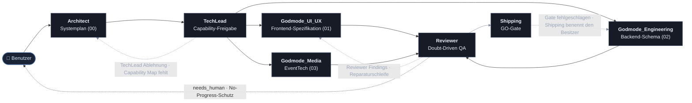
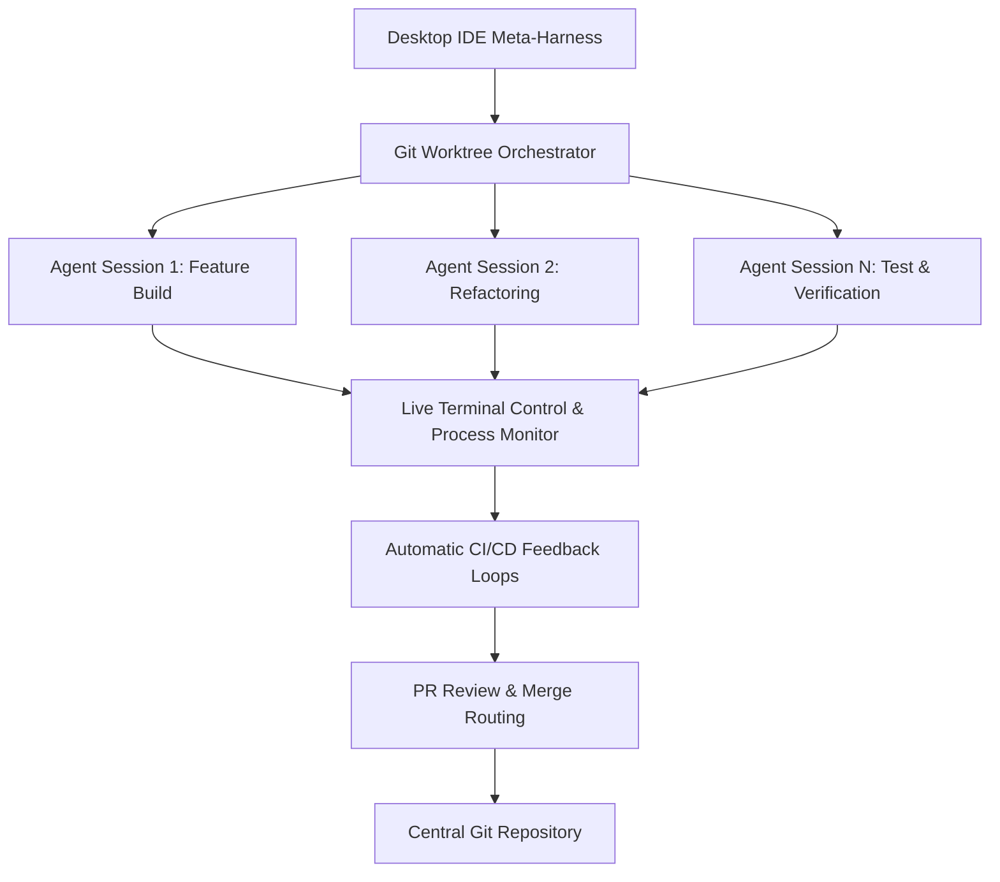
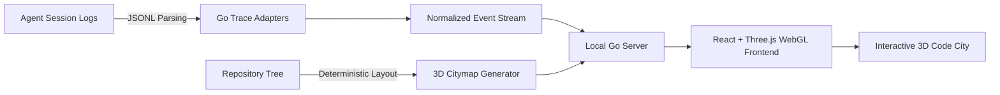
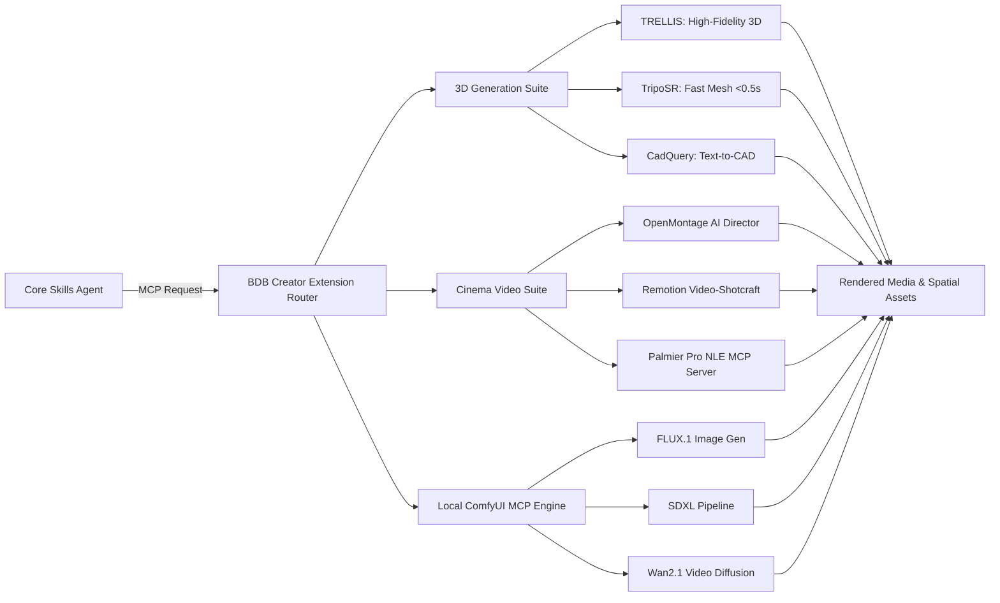

🌐 **Sprache / Language / Idioma**: [ 🇬🇧 English ](README.md) | **Deutsch** | [ 🇵🇹 Português ](README.pt.md)

---

```text
█████▄ ████▄  █████▄   ▄████▄  ▄████  ██████ ███  ██ ██████   ▄████▄ ▄█████
██▄▄██ ██  ██ ██▄▄██   ██▄▄██ ██  ▄▄▄ ██▄▄   ██ ▀▄██   ██     ██  ██ ▀▀▀▄▄▄
██▄▄█▀ ████▀  ██▄▄█▀   ██  ██  ▀███▀  ██▄▄▄▄ ██   ██   ██     ▀████▀ █████▀

──────────────────────────── N O D E F O R G E ─────────────────────────────

                 BDB AGENT OS · CORE KERNEL · AOS -  v4.0.0
```

# 🚀 AOS — BDB Agent OS · Optimiertes Creative & Full-Stack Skills Pack

[](https://github.com/hybridlabor-api/aos/actions)
[](https://www.npmjs.com/package/@hybridlabor-api/aos)
[](https://github.com/hybridlabor-api/aos)
[](LICENSE)
[](https://github.com/hybridlabor-api/aos)
[](https://github.com/NVIDIA/SkillSpector)

> **Supercharging von KI-Coding-Agenten mit 154 hochkuratierten Skills, 21 lokalen MCP Wrappern und tiefgreifenden Integrationen für die Creative-Technology-Branche.**

Willkommen im **BDB DEV Skills & MCP Configuration** Repository. Dieses Projekt dient als Rückgrat unseres Entwicklungs-Ecosystems für Creative & Full-Stack Development. Es erweitert KI-Agenten um hochspezialisierte Fähigkeiten, die speziell auf die Event- und Medientechnologie-Branche sowie auf allgemeine Software-Entwicklung zugeschnitten sind.

Obwohl für **Google Antigravity** optimiert, ist dieses Skill-Paket und die MCP-Konfiguration **100% universell** und funktioniert nahtlos mit allen modernen KI-Agenten und Entwickler-Schnittstellen, einschließlich **ChatGPT Codex / Codex CLI, Claude Desktop, Claude Code, Cursor, Aider, Roo Code, Cline und Windsurf**.

> 🎙 **Audio Deep Dive: "Give AI Agents Control of Creative Software"**  
> <video src="assets/Give_AI_Agents_Control_of_Creative_Software.mp4" controls></video>

---


### 🔨 Was sich in v4.0.0 "AOS" ändert

Dieses Release wandelt die Multi-Agenten-Pipeline von einer Textbeschreibung in eine ausführbare State Machine um und härtet den Installer darum herum.

- **Ein Dispatcher-Graph, der tatsächlich läuft.** Sieben Knoten, explizite Kanten-Prädikate, eine Reviewer-Reparaturschleife mit "No-Progress"-Schutz und eine automatische Eskalation an einen Menschen, wenn die Schleife keine Fortschritte mehr macht. [Details unten](#-aos-der-dispatcher-graph).
- **Drei Pipeline-Varianten** (`/startcycle`, `/startcycle-graph`, `/startcycle-graph-user`), damit die Maschinerie zur Aufgabe passt, anstatt vollen Aufwand für eine Zwei-Dateien-Änderung zu erzwingen.
- **Ein mechanisch erzwungenes GO-Gate.** `git push`, `npm publish`, `npm version` und rekursives `rm` werden durch einen `PreToolUse` Hook blockiert, es sei denn, Ihre unmittelbar vorhergehende Nachricht ist buchstäblich das Wort **GO** — eine Durchsetzung, die auch Änderungen im Berechtigungsmodus übersteht, da es sich um einen Hook handelt und nicht um eine Regel, die ein Agent befolgen soll.
- **Verifizierter Daemon-Start.** Der Installer meldet "service started" nicht mehr auf gut Glück; er verbindet sich mit dem Port und warnt Sie, falls der Daemon nie gestartet wurde. Gleiches gilt für die Ecosystem-Status-Tabelle, die nun Versionen mit echter Semver-Präzedenz über jeden Dist-Tag hinweg vergleicht, anstatt nur auf String-Ungleichheit gegen `latest` zu prüfen.
- **Getrennte MCP-Speicher pro Harness.** Claude Desktop und Claude Code lesen unterschiedliche Dateien; die Installation für das eine überspringt das andere nicht mehr stillschweigend. Vorhandene Server in beiden Dateien werden zusammengeführt, nicht überschrieben.
- **Skriptbare, nicht-interaktive Installationen.** `--platforms=<n[,n]>` wählt Ziele ohne das Menü aus, sodass eine Maschine, auf der nur Claude Code läuft, über CI provisioniert werden kann, ohne eine Antigravity-First-Vorgabe zu erben.

### 🪐 Universal Agent Harness (v4.0.0)
Der Installer verfügt jetzt über eine vollautomatische Universal Sync Engine. Er scannt Ihr System nach **Claude Desktop, Cursor, Windsurf, Aider, Roo/Cline** und injiziert die kuratierte MCP-Konfiguration sowie die Godmode-Regeln gleichzeitig in alle Umgebungen.
- **Tier 9 - Local Project Harness:** Anstatt global in `$HOME` zu installieren, können Entwickler den `.agents` Contract und die Hooks nun direkt in isolierte Projektordner injizieren.

### 🧩 Ecosystem-Integrationen (v4.0.0)
Dieses Paket dient als Brücke zu zwei gewaltigen vorgelagerten Funktionen (verfügbar als direkte Installationsziele über den Installer):
- **BDB OS Agent Workspace:** Die Orchestrierungsschicht für parallele KI-Agenten. Starten Sie mehrere isolierte Agenten-Sitzungen über Git-Worktrees mit Live-Terminalsteuerung, automatischen CI/CD-Feedbackschleifen und PR-Review-Routing.
- **BDB Creator Extension:** Die leistungsstarke Agentic Media Pipeline. Verleiht Agenten lokale ComfyUI MCP-Fähigkeiten (FLUX, SDXL), Image-to-3D-Generierung (TripoSR, TRELLIS) und automatisierte Videoproduktion über OpenMontage und Remotion.


### 🔗 Empfohlene Companion-Plugins (Claude Code)
Keines dieser Plugins ist in diesem Paket enthalten — es handelt sich um unabhängige, von der Community gepflegte Claude Code-Plugins, die sich natürlich in das `agy`-Delegationsmuster einfügen, das [`/startcycle-graph-user`](#-aos-der-dispatcher-graph) bereits verwendet. Installieren Sie diese separat, wenn Sie dasselbe Routing außerhalb eines `/startcycle`-Laufs nutzen möchten.

- **[antigravity-for-claude-code](https://github.com/yuting0624/antigravity-for-claude-code)**
  — führt die Antigravity CLI (`agy`, Gemini) als kooperierenden Subagenten aus, mit intelligentem Modell-Routing über den gesamten SDLC hinweg.
  ```bash
  claude plugin marketplace add yuting0624/antigravity-for-claude-code
  claude plugin install antigravity@antigravity-for-claude-code
  ```
- **[opencode-plugin-cc](https://github.com/tasict/opencode-plugin-cc)** — fügt
  `/opencode:review` / `/opencode:adversarial-review` Slash-Befehle hinzu, womit Claude Code einen asynchronen Job an OpenCode delegieren kann und ein Review-Gate einrichtet, das den Fortschritt blockiert, bis OpenCode einen sauberen Review zurückmeldet.
  ```bash
  claude plugin marketplace add https://github.com/tasict/opencode-plugin-cc.git
  claude plugin install opencode@tasict-opencode-plugin-cc
  ```

> [!CAUTION]
> Wenn Sie auch ein älteres `antigravity-plugin-cc` Marketplace-Plugin installiert haben, deaktivieren Sie dieses und leeren Sie zuerst den Plugin-Cache — zwei gleichzeitig aktive `agy`-Routing-Plugins verursachen einen Doppel-Aktivierungs-Konflikt, bei dem keines sauber initialisiert wird.

## Übersicht

Dieses Repo liefert drei Dinge: eine kuratierte Skill-Bibliothek für Coding-Agenten, einen Installer, der diese (plus 21 lokale MCP Wrapper) in das von Ihnen genutzte Harness einbindet, und einen Dispatcher-Graphen, der sie als Multi-Agenten Build-Pipeline orchestriert. Siehe [AOS: Der Dispatcher-Graph](#-aos-der-dispatcher-graph) weiter unten für Details zur Funktionsweise der Pipeline selbst.

## 🌟 ~154+ Optimierte Skills (Aktualisiert für v4.0.0)

Wir haben mit einem gewaltigen Pool von über 1.400 rohen KI-Skills begonnen. Nach intensiven Tests, Filterungen und Verfeinerungen haben wir sie zu einem hochkuratierten Set von **154+ Optimierten Skills** destilliert (mit nativer OpenWiki-Dokumentationsengine, dem **lokalen semantischen Gedächtnis memB** und jetzt der **Universal Agent Harness Synchronisation in v4.0.0**).

Diese Skills sind präzise optimiert, damit Agenten keine Zeit mit redundanten Aufgaben verschwenden, sondern mit maximaler Autonomie, strengen Architekturvorgaben und robustem Kontextbewusstsein agieren.

### 🛡️ Die 6 Godmodes (Apex Layer)
Anstatt Agenten durch generische Anweisungen irren zu lassen, setzt die oberste Ebene dieses Repositories sechs **Hochkuratierte Godmodes** durch. Diese fungieren als ultimative Wächter für Ihre Codebasis:
- **`godmode-engineering`**: Erzwingt Domain-Driven Design, strenge TypeScript-Prüfungen, Clean Architecture und systematisches Debugging.
- **`godmode-ui-ux`**: Der Frontend-Goldstandard. Erzwingt BDB "Anti-Slop"-Prinzipien, Barrierefreiheit (Accessibility) und fluide Bewegungsdynamiken.
- **`godmode-shipping`**: Der finale Wächter für Production Releases. Erzwingt Spec-Driven Development, Pre-Launch-Prüfungen und sichere Rollbacks.
- **`godmode-eventtech`**: Das oberste Regelwerk für die BDB Creator Engine, das 3D, Medien und 21 Creative-Tech MCP Wrappern steuert.
- **`godmode-eventtech`**: Das oberste Regelwerk für die BDB Creator Engine, das 3D, Medien und 21 Creative-Tech MCP Wrappern steuert.
- **`godmode-3d-creation`**: Steuert die Agentic-3D-Pipeline (TripoSR, TRELLIS) für generative Modelle und CAD-Strukturen.
- **`godmode-media-creation`**: Orchestriert automatisierte Videoproduktion, Storytelling und ComfyUI-Generierungsschleifen.

### 💻 Jenseits von Events: Full-Stack Software & Web Agenten
Obwohl stark für die Kreativtechnologie-Branche optimiert, sind diese Skills tief in der Kern-Softwareentwicklung verwurzelt:
- **Autonome Web-Operationen**: Vollständige Suite von Firecrawl-basierten spezialisierten Agenten für strukturierte Datenextraktion, automatisierte Web-Interaktion und komplexe Scraping-Operationen.
- **Full-Stack Entwicklung**: Erstellen von Next.js App Router Boilerplates, Aufbau skalierbarer Node.js Microservices und Gestaltung interaktiver Frontends.
- **App-Entwicklung**: Datenbankarchitektur mit Prisma/Drizzle, Design von REST/GraphQL-APIs und Erstellung von Standard-Web- und Mobilanwendungen von Grund auf.
- **Design & Qualitätssicherung**: Auditierung von UI/UX-Mustern (unter Verwendung von `ui-ux-pro-max`), Durchsetzung von Clean-Code-Prinzipien und Einrichten strenger CI/CD-Pipelines.

---

## 🗂️ Die Umfassende Skill-Bibliothek

Nachfolgend finden Sie die vollständige Übersicht aller in diesem Paket enthaltenen kuratierten Agent-Skills. Diese werden durch den interaktiven Installer automatisch in den Workspace Ihres Agenten einsortiert.

<details>
<summary><strong>👑 Core Godmodes</strong></summary>

| Skill-Name | Beschreibung |
|------------|-------------|
| `godmode-3d-creation` | Orchestrierungs-Master-Skill für alle 3D-Generierungs-, Modellierungs- und Rekonstruktionsaufgaben. Agiert als 3D-Gehirn für die BDB Creator Extension. |
| `godmode-engineering` | BDB Engineering Godmode. Erzwingt strenges Domain-Driven Design, TypeScript-Striktheit, Clean Architecture und systematisches 5-Stufen-Debugging. |
| `godmode-eventtech` | BDB EventTech Godmode. Das oberste Regelwerk für die BDB Creator Engine, das Godmode-3D, Godmode-Media und die 21 Creative-Tech MCP Wrappern steuert. |
| `godmode-media-creation` | Orchestrierungs-Master-Skill für alle Medienerstellungsaufgaben (Video, Audio, Bild, Motion Design). Agiert als Gehirn für die BDB Creator Extension. |
| `godmode-shipping` | BDB Shipping Godmode. Der finale Wächter für Production Releases. Erzwingt Spec-Driven Development, strenge Pre-Launch-Prüfungen, Feature Flags und Rollback-Strategien. |
| `godmode-ui-ux` | BDB UI/UX Godmode. Der absolute Goldstandard für Frontend-Design. Erzwingt Anti-Slop-Prinzipien, Enterprise-Barrierefreiheit, fluide Bewegungsdynamiken und datengestützte Design-Generierung über alle Agent-Harnesses hinweg. |

</details>

<details>
<summary><strong>⚙️ System & Konfiguration</strong></summary>

#### 🤖 Agenten & Automatisierung
| Skill-Name | Beschreibung |
|------------|-------------|
| `agent-manager-skill` | Manage multiple local CLI agents via tmux sessions (start/stop/monitor/assign) with cron-friendly scheduling. |
| `agent-memory-mcp` | A hybrid memory system that provides persistent, searchable knowledge management for AI agents (Architecture, Patterns, Decisions). |
| `agent-orchestrator` | Meta-skill que orquestra todos os agentes do ecossistema. Scan automatico de skills, match por capacidades, coordenacao de workflows multi-skill e registry management. |
| `agent-pipeline` | Referenz für den BDB-Lebenszyklus (define → plan → build → verify/review → ship), den der Dispatcher-Graph von `/startcycle-graph` tatsächlich ausführt. |
| `agent-tool-builder` | Tools are how AI agents interact with the world. A well-designed tool is the difference between an agent that works and one that hallucinates, fails silently, or costs 10x more tokens than necessary. This skill covers tool design from schema to error handling. |
| `ai-agent-development` | AI agent development workflow for building autonomous agents, multi-agent systems, and agent orchestration with CrewAI, LangGraph, and custom agents. |
| `apify-lead-generation` | Scrape leads from multiple platforms using Apify Actors. |
| `apify-ultimate-scraper` | AI-driven data extraction from 55+ Actors across all major platforms. This skill automatically selects the best Actor for your task. |
| `bdbrainstorm` | Combines multi-agent brainstorming, the /grill-me slash command, subagent-driven-development, and ui-ux-pro-max to force a comprehensive, multi-agent ideation and UI/UX design workflow. |
| `browser-automation` | Browser automation powers web testing, scraping, and AI agent interactions. The difference between a flaky script and a reliable system comes down to understanding selectors, waiting strategies, and anti-detection patterns. |
| `crewai` | Expert in CrewAI - the leading role-based multi-agent framework used by 60% of Fortune 500 companies. |
| `documentation` | Documentation generation workflow covering API docs, architecture docs, README files, code comments, and technical writing. |
| `git-advanced-workflows` | Master advanced Git techniques to maintain clean history, collaborate effectively, and recover from any situation with confidence. |
| `github-actions-templates` | Production-ready GitHub Actions workflow patterns for testing, building, and deploying applications. |
| `github-repo` | Standards and workflows for writing, formatting, sanitizing, and publishing high-quality GitHub repositories, complementing openwiki-skill. |
| `github-workflow-automation` | Patterns for automating GitHub workflows with AI assistance, inspired by [Gemini CLI](https://github.com/google-gemini/gemini-cli) and modern DevOps practices. |
| `go-playwright` | Expert capability for robust, stealthy, and efficient browser automation using Playwright Go. |
| `google-sheets-automation` | Lightweight Google Sheets integration with standalone OAuth authentication. No MCP server required. Full read/write access. |
| `n8n-code-javascript` | Write JavaScript code in n8n Code nodes. Use when writing JavaScript in n8n, using $input/$json/$node syntax, making HTTP requests with $helpers, working with dates using DateTime, troubleshooting Code node errors, or choosing between Code node modes. |
| `n8n-code-python` | Write Python code in n8n Code nodes. Use when writing Python in n8n, using _input/_json/_node syntax, working with standard library, or need to understand Python limitations in n8n Code nodes. |
| `n8n-expression-syntax` | Validate n8n expression syntax and fix common errors. Use when writing n8n expressions, using {{}} syntax, accessing $json/$node variables, troubleshooting expression errors, or working with webhook data in workflows. |
| `n8n-mcp-tools-expert` | Expert guide for using n8n-mcp MCP tools effectively. Use when searching for nodes, validating configurations, accessing templates, managing workflows, or using any n8n-mcp tool. Provides tool selection guidance, parameter formats, and common patterns. |
| `n8n-workflow-patterns` | Proven architectural patterns for building n8n workflows. |
| `notion-automation` | Automate Notion tasks via Rube MCP (Composio): pages, databases, blocks, comments, users. Always search tools first for current schemas. |
| `os-scripting` | Operating system and shell scripting troubleshooting workflow for Linux, macOS, and Windows. Covers bash scripting, system administration, debugging, and automation. |
| `rag-implementation` | RAG (Retrieval-Augmented Generation) implementation workflow covering embedding selection, vector database setup, chunking strategies, and retrieval optimization. |
| `slack-automation` | Automate Slack workspace operations including messaging, search, channel management, and reaction workflows through Composio's Slack toolkit. |
| `subagent-driven-development` | Use when executing implementation plans with independent tasks in the current session |
| `tdd-workflow` | Test-Driven Development workflow principles. RED-GREEN-REFACTOR cycle. |
| `tmux` | Expert tmux session, window, and pane management for terminal multiplexing, persistent remote workflows, and shell scripting automation. |

#### 🎨 Frontend & UI/UX
| Skill-Name | Beschreibung |
|------------|-------------|
| `MCP_Manage` | Manages the BDB specialized MCP servers including Unreal Engine, Rhino 7/8, DaVinci Resolve, grandMA3, Resolume, GitHub, Chrome DevTools, and TouchDesigner. |
| `api-design-principles` | Master REST and GraphQL API design principles to build intuitive, scalable, and maintainable APIs that delight developers and stand the test of time. |
| `api-patterns` | API design principles and decision-making. REST vs GraphQL vs tRPC selection, response formats, versioning, pagination. |
| `database-design` | Database design principles and decision-making. Schema design, indexing strategy, ORM selection, serverless databases. |
| `design-taste-frontend` | Use when building high-agency frontend interfaces with strict design taste, calibrated color, responsive layout, and motion rules. |
| `drizzle-orm-expert` | Expert in Drizzle ORM for TypeScript — schema design, relational queries, migrations, and serverless database integration. Use when building type-safe database layers with Drizzle. |
| `frontend-design` | You are a frontend designer-engineer, not a layout generator. |
| `frontend-dev-guidelines` | You are a senior frontend engineer operating under strict architectural and performance standards. Use when creating components or pages, adding new features, or fetching or mutating data. |
| `landing-page-generator` | Generates high-converting Next.js/React landing pages with Tailwind CSS. Uses PAS, AIDA, and BAB frameworks for optimized copy/components (Heroes, Features, Pricing). Focuses on Core Web Vitals/SEO. |
| `llm-application-dev-ai-assistant` | You are an AI assistant development expert specializing in creating intelligent conversational interfaces, chatbots, and AI-powered applications. Design comprehensive AI assistant solutions with natur |
| `nextjs-app-router-patterns` | Comprehensive patterns for Next.js 14+ App Router architecture, Server Components, and modern full-stack React development. |
| `nextjs-best-practices` | Next.js App Router principles. Server Components, data fetching, routing patterns. |
| `openapi-spec-generation` | Generate and maintain OpenAPI 3.1 specifications from code, design-first specs, and validation patterns. Use when creating API documentation, generating SDKs, or ensuring API contract compliance. |
| `postgres-best-practices` | Postgres performance optimization and best practices from Supabase. Use this skill when writing, reviewing, or optimizing Postgres queries, schema designs, or database configurations. |
| `postgresql` | Design a PostgreSQL-specific schema. Covers best-practices, data types, indexing, constraints, performance patterns, and advanced features |
| `prisma-expert` | You are an expert in Prisma ORM with deep knowledge of schema design, migrations, query optimization, relations modeling, and database operations across PostgreSQL, MySQL, and SQLite. |
| `programmatic-seo` | Design and evaluate programmatic SEO strategies for creating SEO-driven pages at scale using templates and structured data. |
| `react-best-practices` | Comprehensive performance optimization guide for React and Next.js applications, maintained by Vercel. Use when writing new React components or Next.js pages, implementing data fetching (client or server-side), or reviewing code for performance issues. |
| `react-component-performance` | Diagnose slow React components and suggest targeted performance fixes. |
| `react-patterns` | Modern React patterns and principles. Hooks, composition, performance, TypeScript best practices. |
| `schema-markup` | Design, validate, and optimize schema.org structured data for eligibility, correctness, and measurable SEO impact. |
| `senior-frontend` | Frontend development skill for React, Next.js, TypeScript, and Tailwind CSS applications. Use when building React components, optimizing Next.js performance, analyzing bundle sizes, scaffolding frontend projects, implementing accessibility, or reviewing frontend code quality. |
| `shadcn` | Manages shadcn/ui components and projects, providing context, documentation, and usage patterns for building modern design systems. |
| `software-architecture` | Guide for quality focused software architecture. This skill should be used when users want to write code, design architecture, analyze code, in any case that relates to software development. |
| `spline-3d-integration` | Use when adding interactive 3D scenes from Spline.design to web projects, including React embedding and runtime control API. |
| `tailwind-patterns` | Tailwind CSS v4 principles. CSS-first configuration, container queries, modern patterns, design token architecture. |
| `tanstack-query-expert` | Expert in TanStack Query (React Query) — asynchronous state management. Covers data fetching, stale time configuration, mutations, optimistic updates, and Next.js App Router (SSR) integration. |
| `ui-component` | Generate a new UI component that follows StyleSeed Toss conventions for structure, tokens, accessibility, and component ergonomics. |
| `ui-page` | Scaffold a new mobile-first page using StyleSeed Toss layout patterns, section rhythm, and existing shell components. |
| `ui-pattern` | Generate reusable UI patterns such as card sections, grids, lists, forms, and chart wrappers using StyleSeed Toss primitives. |
| `ui-review` | Review UI code for StyleSeed design-system compliance, accessibility, mobile ergonomics, spacing discipline, and implementation quality. |
| `ui-tokens` | List, add, and update StyleSeed design tokens while keeping JSON sources, CSS variables, and dark-mode values in sync. |
| `ui-ux-pro-max` | Comprehensive design guide for web and mobile applications. Use when designing new UI components or pages, choosing color palettes and typography, or reviewing code for UX issues. |
| `ux-audit` | Audit screens against Nielsen's heuristics and mobile UX best practices using the StyleSeed Toss design language as the implementation context. |
| `ux-feedback` | Add loading, empty, error, and success feedback states to StyleSeed components and pages with practical mobile-first rules. |
| `ux-flow` | Design user flows and screen structure using StyleSeed UX patterns such as progressive disclosure, hub-and-spoke navigation, and information pyramids. |
| `ux-persuasion-engineer` | One sentence - what this skill does and when to invoke it |
| `vercel-ai-sdk-expert` | Expert in the Vercel AI SDK. Covers Core API (generateText, streamText), UI hooks (useChat, useCompletion), tool calling, and streaming UI components with React and Next.js. |
| `wcag-audit-patterns` | Comprehensive guide to auditing web content against WCAG 2.2 guidelines with actionable remediation strategies. |
| `web-artifacts-builder` | To build powerful frontend claude.ai artifacts, follow these steps: |
| `zustand-store-ts` | Create Zustand stores following established patterns with proper TypeScript types and middleware. |

#### 🗄️ Backend & Datenbanken
| Skill-Name | Beschreibung |
|------------|-------------|
| `gemini-api-dev` | The Gemini API provides access to Google's most advanced AI models. Key capabilities include: |
| `gemini-api-integration` | Use when integrating Google Gemini API into projects. Covers model selection, multimodal inputs, streaming, function calling, and production best practices. |
| `github` | Use the `gh` CLI for issues, pull requests, Actions runs, and GitHub API queries. |
| `go-concurrency-patterns` | Master Go concurrency with goroutines, channels, sync primitives, and context. Use when building concurrent Go applications, implementing worker pools, or debugging race conditions. |
| `golang-pro` | Master Go 1.22+ with modern patterns, advanced concurrency, performance optimization, and production-ready microservices. |
| `llm-structured-output` | Get reliable JSON, enums, and typed objects from LLMs using response_format, tool_use, and schema-constrained decoding across OpenAI, Anthropic, and Google APIs. |
| `microservices-patterns` | Master microservices architecture patterns including service boundaries, inter-service communication, data management, and resilience patterns for building distributed systems. |
| `neon-postgres` | Expert patterns for Neon serverless Postgres, branching, connection pooling, and Prisma/Drizzle integration |
| `python-patterns` | Python development principles and decision-making. Framework selection, async patterns, type hints, project structure. Teaches thinking, not copying. |
| `python-performance-optimization` | Profile and optimize Python code using cProfile, memory profilers, and performance best practices. Use when debugging slow Python code, optimizing bottlenecks, or improving application performance. |
| `python-pro` | Master Python 3.12+ with modern features, async programming, performance optimization, and production-ready practices. Expert in the latest Python ecosystem including uv, ruff, pydantic, and FastAPI. |
| `rag-engineer` | Expert in building Retrieval-Augmented Generation systems. Masters embedding models, vector databases, chunking strategies, and retrieval optimization for LLM applications. |
| `using-neon` | Neon is a serverless Postgres platform that separates compute and storage to offer autoscaling, branching, instant restore, and scale-to-zero. It's fully compatible with Postgres and works with any language, framework, or ORM that supports Postgres. |
| `vector-database-engineer` | Expert in vector databases, embedding strategies, and semantic search implementation. Masters Pinecone, Weaviate, Qdrant, Milvus, and pgvector for RAG applications, recommendation systems, and similar |
| `web-scraper` | Web scraping inteligente multi-estrategia. Extrai dados estruturados de paginas web (tabelas, listas, precos). Paginacao, monitoramento e export CSV/JSON. |
| `webapp-testing` | To test local web applications, write native Python Playwright scripts. |

#### 🚀 DevOps & Infrastruktur
| Skill-Name | Beschreibung |
|------------|-------------|
| `bash-linux` | Bash/Linux terminal patterns. Critical commands, piping, error handling, scripting. Use when working on macOS or Linux systems. |
| `cloudflare-workers-expert` | Expert in Cloudflare Workers and the Edge Computing ecosystem. Covers Wrangler, KV, D1, Durable Objects, and R2 storage. |
| `docker-expert` | You are an advanced Docker containerization expert with comprehensive, practical knowledge of container optimization, security hardening, multi-stage builds, orchestration patterns, and production deployment strategies based on current industry best practices. |
| `git-pr-review` | Generate a concise and structured PR description from commit history with minimal token usage |
| `llm-app-patterns` | Production-ready patterns for building LLM applications, inspired by [Dify](https://github.com/langgenius/dify) and industry best practices. |
| `local-llm-expert` | Master local LLM inference, model selection, VRAM optimization, and local deployment using Ollama, llama.cpp, vLLM, and LM Studio. Expert in quantization formats (GGUF, EXL2) and local AI privacy. |
| `posix-shell-pro` | Expert in strict POSIX sh scripting for maximum portability across Unix-like systems. Specializes in shell scripts that run on any POSIX-compliant shell (dash, ash, sh, bash --posix). |
| `turborepo-caching` | Configure Turborepo for efficient monorepo builds with local and remote caching. Use when setting up Turborepo, optimizing build pipelines, or implementing distributed caching. |
| `vercel-deployment` | Expert knowledge for deploying to Vercel with Next.js |

#### 🧠 KI & LLM
| Skill-Name | Beschreibung |
|------------|-------------|
| `ai-product` | Every product will be AI-powered. The question is whether you'll build it right or ship a demo that falls apart in production. |
| `llm-prompt-optimizer` | Use when improving prompts for any LLM. Applies proven prompt engineering techniques to boost output quality, reduce hallucinations, and cut token usage. |
| `openwiki-skill` | Direkte, Gemini-native Integration von OpenWiki für autonomes, hochgradig eigenverantwortliches Dokumentationsmanagement und Release Notes-Pflege. |
| `prompt-engineer` | Transforms user prompts into optimized prompts using frameworks (RTF, RISEN, Chain of Thought, RODES, Chain of Density, RACE, RISE, STAR, SOAP, CLEAR, GROW) |
| `prompt-engineering-patterns` | Master advanced prompt engineering techniques to maximize LLM performance, reliability, and controllability. |

#### 📝 Dokumentation & Planung
| Skill-Name | Beschreibung |
|------------|-------------|
| `architect-review` | Master software architect specializing in modern architecture |
| `concise-planning` | Use when a user asks for a plan for a coding task, to generate a clear, actionable, and atomic checklist. |
| `copywriting` | Write rigorous, conversion-focused marketing copy for landing pages and emails. Enforces brief confirmation and strict no-fabrication rules. |
| `deep-research` | Run autonomous research tasks that plan, search, read, and synthesize information into comprehensive reports. |
| `executing-plans` | Use when you have a written implementation plan to execute in a separate session with review checkpoints |
| `linear-claude-skill` | Manage Linear issues, projects, and teams |
| `memb-skill` | BDB Local-First-Langzeitgedächtnis-Engine (memB). Erfragen, merken und anpassen von Präferenzen, Code-Architekturen und Entwicklermustern über alle Aufgaben hinweg. |
| `modern-javascript-patterns` | Comprehensive guide for mastering modern JavaScript (ES6+) features, functional programming patterns, and best practices for writing clean, maintainable, and performant code. |
| `planning-with-files` | Work like Manus: Use persistent markdown files as your "working memory on disk." |
| `product-manager-toolkit` | Essential tools and frameworks for modern product management, from discovery to delivery. |
| `readme` | You are an expert technical writer creating comprehensive project documentation. Your goal is to write a README.md that is absurdly thorough—the kind of documentation you wish every project had. |
| `test-driven-development` | Use when implementing any feature or bugfix, before writing implementation code |
| `writing-plans` | Use when you have a spec or requirements for a multi-step task, before touching code |

#### 🧊 3D & Motion
| Skill-Name | Beschreibung |
|------------|-------------|
| `remotion` | Generate walkthrough videos from Stitch projects using Remotion with smooth transitions, zooming, and text overlays |
| `threejs-skills` | Create 3D scenes, interactive experiences, and visual effects using Three.js. Use when user requests 3D graphics, WebGL experiences, 3D visualizations, animations, or interactive 3D elements. |

#### 📈 SEO & Marketing
| Skill-Name | Beschreibung |
|------------|-------------|
| `geo-fundamentals` | Generative Engine Optimization for AI search engines (ChatGPT, Claude, Perplexity). |
| `seo` | Run a broad SEO audit across technical SEO, on-page SEO, schema, sitemaps, content quality, AI search readiness, and GEO. Use as the umbrella skill when the user asks for a full SEO analysis or strategy. |
| `seo-audit` | Diagnose and audit SEO issues affecting crawlability, indexation, rankings, and organic performance. |
| `seo-technical` | Audit technical SEO across crawlability, indexability, security, URLs, mobile, Core Web Vitals, structured data, JavaScript rendering, and related platform signals like robots.txt and AI crawler access. |

#### 🔧 Core Programmierung & Debugging
| Skill-Name | Beschreibung |
|------------|-------------|
| `clean-code` | This skill embodies the principles of "Clean Code" by Robert C. Martin (Uncle Bob). Use it to transform "code that works" into "code that is clean." |
| `debugger` | Debugging specialist for errors, test failures, and unexpected behavior. Use proactively when encountering any issues. |
| `playwright-skill` | IMPORTANT - Path Resolution: This skill can be installed in different locations (plugin system, manual installation, global, or project-specific). Before executing any commands, determine the skill directory based on where you loaded this SKILL.md file, and use that path in all commands below. |
| `simplify-code` | Review a diff for clarity and safe simplifications, then optionally apply low-risk fixes. |
| `systematic-debugging` | Use when encountering any bug, test failure, or unexpected behavior, before proposing fixes |
| `typescript-pro` | Master TypeScript with advanced types, generics, and strict type safety. Handles complex type systems, decorators, and enterprise-grade patterns. |

#### 📦 Weitere Utilities
| Skill-Name | Beschreibung |
|------------|-------------|
| `bdb-updater` | Proactively check for and install updates to the BDB Antigravity Skills package via NPM. |
| `monorepo-management` | Build efficient, scalable monorepos that enable code sharing, consistent tooling, and atomic changes across multiple packages and applications. |
| `obsidian-markdown` | Create and edit Obsidian Flavored Markdown with wikilinks, embeds, callouts, properties, and other Obsidian-specific syntax. Use when working with .md files in Obsidian, or when the user mentions wikilinks, callouts, frontmatter, tags, embeds, or Obsidian notes. |
| `senior-fullstack` | Complete toolkit for senior fullstack with modern tools and best practices. |
| `token-saver-config` | Context window output compression engine for CLI commands (60-99% token reduction). |
| `web-performance-optimization` | Optimize website and web application performance including loading speed, Core Web Vitals, bundle size, caching strategies, and runtime performance |

</details>

<details>
<summary><strong>🌀 BDB Ökosystem & Methodiken</strong></summary>

| Skill-Name | Beschreibung |
|------------|-------------|
| `bdbmediastorm` | The ultimate creative-tech and show-control brainstorming engine. Orchestrates multi-agent ideation focused on signal flow, hardware constraints, protocols, and BDB MCP integrations. Now strictly governed by the 3 Core Godmodes (engineering, ui-ux, shipping). |
| `bdbrainstorm` | Combines multi-agent brainstorming, the /grill-me slash command, and the 3 Core Godmodes (godmode-engineering, godmode-ui-ux, godmode-shipping) to force a comprehensive, multi-agent ideation and technical design workflow. |
| `github-repo` | Standards and workflows for writing, formatting, sanitizing, and publishing high-quality GitHub repositories, complementing openwiki-skill. |
| `memb-ingest` | Deep scan and ingest project files (.md, .json, AGENTS.md, .openwiki) and past conversation logs into the local memB vector memory engine. |

</details>

<details>
<summary><strong>🔥 Spezialisierte Workspace-Agenten</strong></summary>

#### 🤖 Agenten & Automatisierung
| Skill-Name | Beschreibung |
|------------|-------------|
| `firecrawl-agent` | AI-powered autonomous data extraction that navigates complex sites and returns structured JSON. Use this skill when the user wants structured data from websites, needs to extract pricing tiers, product listings, directory entries, or any data as JSON with a schema. Triggers on "extract structured data", "get all the products", "pull pricing info", "extract as JSON", or when the user provides a JSON schema for website data. More powerful than simple scraping for multi-page structured extraction. |
| `firecrawl-build-onboarding` | Get Firecrawl credentials and SDK setup into a project. Use when an application needs `FIRECRAWL_API_KEY`, when an agent should add Firecrawl to `.env`, when the user wants to authenticate Firecrawl for app code, or when choosing the first SDK and docs for a new Firecrawl integration. This skill includes its own browser auth flow, so it does not depend on the website onboarding skill. |
| `firecrawl-build-search` | Integrate Firecrawl `/search` into product code and agent workflows. Use when an app needs discovery before extraction, when the feature starts with a query instead of a URL, or when the system should search the web and optionally hydrate result content. |

#### 🗄️ Backend & Datenbanken
| Skill-Name | Beschreibung |
|------------|-------------|
| `firecrawl-build` | Integrate Firecrawl into product code for web scraping, crawling, searching, and interaction. Use this skill when an application needs to access web data, extract content, or automate web interactions. |
| `firecrawl-build-interact` | Integrate Firecrawl `/interact` into product code for dynamic pages and browser actions after scraping. Use when a feature needs clicks, form fills, pagination, authentication-aware flows, or other multi-step interactions that plain `/scrape` cannot complete. |
| `firecrawl-download` | Download an entire website as local files — markdown, screenshots, or multiple formats per page. Use this skill when the user wants to save a site locally, download documentation for offline use, bulk-save pages as files, or says "download the site", "save as local files", "offline copy", "download all the docs", or "save for reference". Combines site mapping and scraping into organized local directories. |
| `firecrawl-interact` | Control and interact with a live browser session on any scraped page — click buttons, fill forms, navigate flows, and extract data using natural language prompts or code. Use when the user needs to interact with a webpage beyond simple scraping: logging into a site, submitting forms, clicking through pagination, handling infinite scroll, navigating multi-step checkout or wizard flows, or when a regular scrape failed because content is behind JavaScript interaction. Also useful for authenticated scraping via profiles. Triggers on "interact", "click", "fill out the form", "log in to", "sign in", "submit", "paginated", "next page", "infinite scroll", "interact with the page", "navigate to", "open a session", or "scrape failed". |

#### 🚀 DevOps & Infrastruktur
| Skill-Name | Beschreibung |
|------------|-------------|
| `firecrawl` | Search, scrape, and interact with the web via the Firecrawl CLI. Use this skill whenever the user wants to search the web, find articles, research a topic, look something up online, scrape a webpage, grab content from a URL, get data from a website, crawl documentation, download a site, or interact with pages that need clicks or logins. Also use when they say "fetch this page", "pull the content from", "get the page at https://", or reference external websites. This provides real-time web search with full page content and interact capabilities — beyond what Claude can do natively with built-in tools. Do NOT trigger for local file operations, git commands, deployments, or code editing tasks. |

#### 🧠 KI & LLM
| Skill-Name | Beschreibung |
|------------|-------------|
| `firecrawl-scrape` | Extract clean markdown from any URL, including JavaScript-rendered SPAs. Use this skill whenever the user provides a URL and wants its content, says "scrape", "grab", "fetch", "pull", "get the page", "extract from this URL", or "read this webpage". Handles JS-rendered pages, multiple concurrent URLs, and returns LLM-optimized markdown. Use this instead of WebFetch for any webpage content extraction. |

#### 📝 Dokumentation & Planung
| Skill-Name | Beschreibung |
|------------|-------------|
| `firecrawl-crawl` | Bulk extract content from an entire website or site section. Use this skill when the user wants to crawl a site, extract all pages from a docs section, bulk-scrape multiple pages following links, or says "crawl", "get all the pages", "extract everything under /docs", "bulk extract", or needs content from many pages on the same site. Handles depth limits, path filtering, and concurrent extraction. |

#### 📦 Weitere Utilities
| Skill-Name | Beschreibung |
|------------|-------------|
| `firecrawl-build-scrape` | Integrate Firecrawl `/scrape` into product code for single-page extraction. Use when an app already has a URL and needs markdown, HTML, links, screenshots, metadata, or structured page output. Prefer this skill over broader crawl patterns when the feature is page-level. |
| `firecrawl-map` | Discover and list all URLs on a website, with optional search filtering. Use this skill when the user wants to find a specific page on a large site, list all URLs, see the site structure, find where something is on a domain, or says "map the site", "find the URL for", "what pages are on", or "list all pages". Essential when the user knows which site but not which exact page. |
| `firecrawl-search` | Web search with full page content extraction. Use this skill whenever the user asks to search the web, find articles, research a topic, look something up, find recent news, discover sources, or says "search for", "find me", "look up", "what are people saying about", or "find articles about". Returns real search results with optional full-page markdown — not just snippets. Provides capabilities beyond Claude's built-in WebSearch. |

</details>


---

## 🔄 AOS: Der Dispatcher-Graph

v4.0.0 ersetzt die alte lineare "5-Agenten-Pipeline"-Textbeschreibung durch eine echte, ausführbare
State Machine. Der Contract liegt in [`.agents/graph.md`](.agents/graph.md),
das Knoten-Verzeichnis in [`.agents/nodes.json`](.agents/nodes.json), und der
ausführbare Dispatcher in
[`.claude/workflows/startcycle-dispatch.mjs`](.claude/workflows/startcycle-dispatch.mjs).

**Die eine Regel, der alles andere folgt: Knoten rufen sich niemals gegenseitig auf.** Ein
einzelner Dispatcher liest `production_artifacts/state.json` nachdem jeder Knoten
zurückkehrt und entscheidet, was als Nächstes läuft. Es gibt keine Übergabekette, keinen Agenten,
der einem anderen Agenten den Startbefehl gibt — genau das verhindert den Prompt-Drift, der lange Agenten-Pipelines vom Kurs abkommen lässt.



### Was das Ganze zusammenhält

| Mechanismus | Was er verhindert |
|---|---|
| **Reviewer-Isolation** | Der Reviewer liest Build-Artefakte und den Contract des Plans — niemals das ursprüngliche `goal`, niemals die Argumentation eines Build-Knotens oder dessen Behauptung, die Arbeit sei erledigt. Die Behauptung des Implementierers weiterzugeben, verleitet einen Reviewer zur Zustimmung; sie zurückzuhalten, macht das Review erst adversariell statt zu einem reinen Abnicken. |
| **No-Progress-Schutz** | Wenn ein Reparaturzyklus dieselbe blockierende Finding-ID wie der vorherige meldet, wird de facto nichts repariert. Der Durchlauf eskaliert an einen Menschen, anstatt Iterationen durch das erneute Ausführen einer identischen Schleife zu verschwenden. |
| **Knotenspezifische State-Fragmente** | Build-Knoten laufen parallel und jeder schreibt sein eigenes `state.d/<node>.json`-Fragment, die danach zusammengeführt werden — sie schreiben niemals direkt in `state.json`. Parallele Schreibvorgänge in eine JSON-Datei führen zu Lost-Update-Race-Conditions; Fragmente verhindern dieses Race by Design. |
| **Iterations-Obergrenze** | `max_iterations` (Standard 3) stoppt die Schleife bedingungslos, absichtlich niedriger angesetzt als Claude Codes eigener 8-maliger Stop-Hook-Override, damit die eigene Eskalationsnachricht des Laufs Sie zuerst erreicht. |
| **Eingebetteter menschlicher Eingriff** | Jeder Knoten kann `needs_human: true` setzen und den Lauf stoppen. Volle Autonomie klingt gut, bis ein Knoten auf etwas stößt, das nur ein Mensch entscheiden kann — dies ist eine explizite Kante im Graphen, keine Unterbrechung. |
| **GO-geschütztes Shipping** | Das Erreichen von `ready_to_ship` bedeutet noch kein Shipping. `git push`, `npm publish`, `npm version` und rekursives `rm` werden durch einen `PreToolUse`-Hook blockiert ([`.claude/hooks/go-gate.mjs`](.claude/hooks/go-gate.mjs)), es sei denn, Ihre unmittelbar vorhergehende Nachricht ist buchstäblich das Wort **GO**. Es ist ein Hook, keine Regel, die ein Agent liest und zu befolgen versucht — er feuert vor jeglicher Berechtigungsmodus-Prüfung und lässt sich nicht wegdiskutieren. |

### Drei Varianten — wählen Sie danach, wie viel Maschinerie die Aufgabe erfordert

| Befehl | Maschinerie | Wann nutzen |
|---|---|---|
| **`/startcycle`** | Lineare Kette, Dateiübergaben in `production_artifacts/`. Keine State Machine, keine Reparaturschleife. | Ein unkomplizierter Build, bei dem Sie das Agenten-Team, aber nicht die Zeremonie benötigen. |
| **`/startcycle-graph`** | Der vollständige obige Graph: persistentes `state.json`, Reviewer-Reparaturschleife, Quality-Gate, automatisierte Eskalation. | Echte Feature-Arbeit, bei der Korrektheit wichtiger ist als Geschwindigkeit und Sie ein Audit-Protokoll des Geschehens wünschen. |
| **`/startcycle-graph-user`** | Wegwerfbares 2–4-Knoten Fan-out. Nichts Dauerhaftes — kein `.agents/` Bootstrap, kein `state.json`. Modell-abgestuft nach Rolle (Opus plant, Sonnet reviewt, Haiku oder eine externe CLI übernimmt die mechanische Arbeit). | Ein einmaliges "starte ein paar Worker für diese Aufgabe" in *jedem* Projekt, einschließlich solchen, die noch nie von diesem Repo gehört haben. |

Die dritte Variante setzt bewusst nichts über Ihre Maschine voraus: Sie erkennt,
ob Antigravity, OpenCode oder Codex vorhanden sind, und fällt auf Claude
Codes eigene Subagenten zurück, wenn keines davon existiert. Modell-Stufen werden pro Rolle erzwungen, anstatt
aus Ihrer Sitzung vererbt zu werden, sodass ein mechanischer Worker-Schritt nicht stillschweigend auf
Opus läuft, nur weil Sie dieses zufällig ausgewählt hatten.

---

## 🧠 BDBrainstorm: Die Ultimative Ideations-Engine

Teil dieses optimierten Arsenals ist unsere proprietäre **BDBrainstorm**-Skill.

BDBrainstorm kombiniert Multi-Agenten-Brainstorming, den Slash-Befehl `/grill-me`, Subagenten-Entwicklung und extrem hochstehende UI/UX-Design-Workflows, um einen umfassenden Multi-Agenten-Ideationsprozess zu erzwingen. Es unterzieht Designs einem Stresstest, architekturiert die dahinterstehenden Systeme und liefert umsetzbare, hochpräzise Entwicklungspläne.

---

## 🔌 21 Lokale MCP Wrapper


Anstatt sich auf rudimentäre Python-Mocks oder fehlerhafte Remote-APIs zu verlassen, bündelt dieses Repository **21 eigene, lokale MCP-Wrapper** (im Ordner `mcps/`). Diese werden automatisch erstellt/aufgewärmt und ermöglichen Ihrem KI-Assistenten das Lesen, Schreiben und Ausführen von Befehlen in der führenden Kreativsoftware der Branche.

<details>
<summary><strong>🎨 Adobe Creative Cloud (Illustrator, Photoshop, After Effects, Premiere Pro)</strong></summary>

Wir bieten eine Dual-Engine-Architektur, die für macOS- und Windows-Umgebungen optimiert ist:
- **Direct OS-Native Bridge (`bdb_adobe_mcp`)**: Führt Skripte ohne Installation aus.
  - **macOS:** Spricht Anwendungs-Bundle-IDs direkt über AppleScript `do javascript` / `DoScript`-Befehlsstreams an.
  - **Windows:** Fragt lokale COM-Objekte über PowerShell-Wrapper-Skripte automatisch ab, instanziiert sie und führt temporären `.jsx` ExtendScript-Code aus.
- **Cross-Platform UXP WebSocket Bridge (`bdb_adobe_uxp_mcp`)**: Ein Drei-Stufen-WebSocket-Proxy (Node.js-Server auf Port 8080 + native UXP-Entwickler-Plugins) für tiefe DOM-Manipulation und persistente WebSocket-Sitzungen in Photoshop und Premiere Pro, der auf Windows und macOS identisch läuft.
</details>

<details>
<summary><strong>🎬 DaVinci Resolve (Dreifachabdeckung)</strong></summary>

- **Hauptserver: `bdb_davinci_mcp`**: Funktioniert sowohl in der **Free- als auch Studio-Version** über eine Skript-Menüschleife im Workspace. Stellt 162 Tools bereit (Timeline, Clips, Marker, Color Grades, Fusion) und enthält lokale CPU-basierte KI-Modelle (Meta Demucs v4 für Stimmisolierung, faster-whisper für Auto-Untertitel und rembg für Hintergrundentfernung).
- **Studio: `bdb_davinci_mcp_studio`**: Der offizielle Node.js-Server (basiert auf samuelgursky) für fortgeschrittenes, direktes Timeline- und Projektmanagement in Resolve Studio.
- **Fallback: `bdb_davinci_mcp_fallback`**: Professioneller Hoyt-Harness-Python-Server für Studio-Scripting.
</details>

<details>
<summary><strong>📐 Rhino 3D & Grasshopper (Twin-Engine)</strong></summary>

- **Hauptserver: `bdb_rhino_mcp`**: Offizieller McNeel-Konnektor (verwaltet über Yak-Router) zum nativen Lesen/Schreiben von Rhino-Geometrielayouts.
- **Fallback: `bdb_rhino_mcp_fallback`**: Der GOLEM 3D-Server mit 105 Tools zur dynamischen Manipulation von Rhino 8 Assets, Skriptausführung und Lösung von Grasshopper-Definitionen.
</details>

<details>
<summary><strong>🏗️ Weitere Spezialisierte Integrationen (Unreal, TouchDesigner, Vectorworks etc.)</strong></summary>

### 🏗️ Vectorworks
- **Hauptserver: `bdb_vectorworks_mcp`**: Semantischer RAG-basierter Suchindex über VectorScript- und Vectorworks-API-Dokumentation (Port 8765) für automatisiertes CAD-Drafting.

### 🎮 Unreal Engine
- **Hauptserver: `bdb_unreal_mcp`**: Verbindet sich über die Unreal Engine 5 Web Remote Control API (Port 30010) und das `gimmeDG`-Toolset. Ermöglicht dem Agenten das Abfragen, Spawnen von Actoren, Bearbeiten von Materialien, Schreiben von Blueprints und Automatisieren von Level/Sequencer-Steuerungen.

### 🧊 Blender (Twin-Engine)
- **Hauptserver: `bdb_blender_mcp`**: BlenderMCP Socket-Integration für Szenenlayout, Mesh-Generierung und Viewport-Steuerung.
- **Fallback: `bdb_blender_mcp_fallback`**: djeadas Python-Server zur Verwaltung von Blender TCP-Verbindungen und rohem Python-Scripting.

### 🎛️ TouchDesigner (Twin-Engine)
- **Hauptserver: `bdb_touchdesigner_mcp`**: MindDesigner-Bridge (`tdmcp`) auf Port 9980 zum Lesen und Schreiben von Netzwerken über eigene `.tox`-Strukturen.
- **Fallback: `bdb_touchdesigner_mcp_fallback`**: Fallback-TCP-basierte Knotenabfrage und Inspector.

### 💡 grandMA3 & Resolume
- **grandMA3**: `bdb_ma3_mcp` sendet OSC/UDP-Befehlsstreams direkt an Ihre grandMA3-Konsole (Port 8000), um Cues, Makros und Fixture-Patching zu automatisieren.
- **Resolume**: `bdb_resolume_mcp` bindet Arenas REST-API ein (Port 8080), um Ebenen zu steuern, Status abzufragen und Clips auszulösen.

### 🖥️ OS Control (Dual-Engine)
- **macOS/Linux: `zavora_computer_use`**: Ausgeliefert mit vorkompilierten nativen Rust NAPI-Binärobjekten (macOS arm64/x64, Linux) zur Steuerung von Maus, Tastatur, Fenstern und Apps ohne Laufzeit-Kompilierungsfehler.
- **Windows: `bdb_windows_computer_use`**: Nativer Python-basierter Win32 / COM / UIAutomation-Controller mit lokaler OCR-Unterstützung (Tesseract) für fortgeschrittene Windows GUI-Automatisierung.

### 🧠 Local Semantic Brain (memB)
- **`memb_mcp`**: Stellt Standard-Langzeitgedächtnis-Tools (`add_memory`, `search_memory`, `delete_memory`, `list_memories`) über eine vollständig lokale, Offline-First Vektor-Engine bereit (angetrieben von einem mitgelieferten 30MB ONNX-Modell und SQLite).
</details>

---

## 📖 14 Spezialisierte System-Skills

Dieses Repository enthält außerdem 14 Tiefensystem-Konfigurationen und Dokumentationsrichtlinien, die automatisch zugewiesen werden. Wenn ein KI-Agent dieses Paket importiert, liest er sofort diese Markdown-Dateien, um Tool-Signaturen, erwartete Argumente, ExtendScript-Hooks und häufige Fehlerbehebungsschritte für jede Anwendung zu lernen.

<details>
<summary><strong>System-Skill-Liste anzeigen</strong></summary>

- [`bdb-unreal-mcp`](skills/global_config/bdb-unreal-mcp/SKILL.md)
- [`bdb-rhino-mcp`](skills/global_config/bdb-rhino-mcp/SKILL.md)
- [`bdb-davinci-mcp`](skills/global_config/bdb-davinci-mcp/SKILL.md)
- [`bdb-blender-mcp`](skills/global_config/bdb-blender-mcp/SKILL.md)
- [`bdb-after-effects-mcp`](skills/global_config/bdb-after-effects-mcp/SKILL.md)
- [`bdb-vectorworks-mcp`](skills/global_config/bdb-vectorworks-mcp/SKILL.md)
- [`bdb-touchdesigner-mcp`](skills/global_config/bdb-touchdesigner-mcp/SKILL.md)
- [`bdb-computer-use-mcp`](skills/global_config/bdb-computer-use-mcp/SKILL.md)
- [`bdb-grandma3-mcp.md`](skills/global_config/bdb-grandma3-mcp/SKILL.md)
- [`bdb-resolume-mcp`](skills/global_config/bdb-resolume-mcp/SKILL.md)
- [`bdb-adobe-suite-mcp`](skills/global_config/bdb-adobe-suite-mcp/SKILL.md)
- [`bdb-memb-mcp`](skills/global_config/bdb-memb-mcp/SKILL.md)
- [`openwiki-skill`](skills/global_config/openwiki-skill/SKILL.md): Direkte, Gemini-native Integration von OpenWiki für autonomes, hochgradig eigenverantwortliches Dokumentationsmanagement und Release Notes-Pflege.
- [`memb-skill`](skills/global_config/memb-skill/SKILL.md): BDB Local-First-Langzeitgedächtnis-Engine (memB). Erfragen, merken und anpassen von Präferenzen, Code-Architekturen und Entwicklermustern über alle Aufgaben hinweg.
</details>

---

## 🌐 OpenWiki & RepoGraph Code Health Engine (v4.0.0)

Die **OpenWiki Engine** verwaltet autonom lebendige Codebasis-Dokumentation, Architektur-Spezifikationen, ADRs, Release Notes und Echtzeit-Code-Health-Analysen über alle Ihre aktiven Projekte hinweg.

### 📚 Dokumentation & Dashboard
- **Entrypoint & Setup:** [.openwiki/quickstart.md](.openwiki/quickstart.md)
- **Architecture & Ecosystem:** [.openwiki/architecture.md](.openwiki/architecture.md)
- **Design Decisions (ADRs):** [.openwiki/decisions.md](.openwiki/decisions.md)
- **Changelog & History:** [.openwiki/release_notes.md](.openwiki/release_notes.md)
- **Code Health Report:** [.openwiki/code_health.md](.openwiki/code_health.md)
- **Interactive Live Dashboard:** [.openwiki/code_health_dashboard.html](.openwiki/code_health_dashboard.html)

<details>
<summary><strong>🧠 Multi-Provider LLM & Zero-Token RepoGraph Architektur</strong></summary>

1. **Multi-Provider LLM Agility:** Entkoppelt von Herstellerabhängigkeiten (Vendor Lock-in). Konfigurieren Sie jedes beliebige LLM-Backend über Umgebungsvariablen:
   - **Google GenAI:** `gemma-4-26b-a4b-it` (Standard via `google-genai` SDK, mit automatischem Modell-Discovery-Fallback)
   - **Groq:** `llama-3.3-70b-versatile` (ultra-low latency)
   - **Grok / xAI:** `grok-2-latest`
   - **Nvidia NIM:** `meta/llama-3.3-70b-instruct`
   - **OpenRouter:** `anthropic/claude-3.5-sonnet` (200+ models)
   - **OpenAI:** `gpt-4o-mini` / `gpt-4o`
   - **Offline / Lokal:** Ollama (`llama3`), LM Studio, oder jeder OpenAI-kompatible Endpunkt.
2. **RepoGraph Zero-Token Git Analytics:** Analysiert 90-Tage-Hotspot-Geschwindigkeit, Bus-Faktor-Risiko von Einzelautoren und Wartbarkeitsindex rein durch deterministische lokale Git-Analyse — was genau **0 LLM tokens**.
3. **Repowise-Grade Live HTML Dashboard:** `.openwiki/code_health_dashboard.html` bietet 6 visuelle SVG-Panels (Galaxy Cluster Map, Risk Donut, Bus Factor Matrix, Commit Velocity Churn, Hotspot Leaderboard, Architecture Health Radar) mit **60-second live auto-refresh** und integrierter memB ADR-Telemetrie.
</details>

<details>
<summary><strong>⚙️ Einrichten des Hintergrund-Daemons</strong></summary>

Um sicherzustellen, dass Ihre Projektdokumentation und Code-Health-Dashboards niemals veralten, konfigurieren Sie den Hintergrund-Daemon:

#### On macOS (LaunchAgent)
```bash
bash ~/.gemini/config/skills/openwiki-skill/scripts/install_daemon.sh
```

#### On Windows (Task Scheduler)
```powershell
powershell -ExecutionPolicy Bypass -File "$env:USERPROFILE\.gemini\config\skills\openwiki-skill\scripts\install_daemon.ps1"
```

#### Für alle Plattformen: Projekte registrieren & überwachen
**Projekte registrieren:** Fügen Sie Workspace-Pfade zu Ihrer Konfigurationsdatei unter `~/.openwiki/projects.json` hinzu:
```json
{
  "projects": [
    "~/dev/bdb-dev/aos",
    "~/Projects/your-active-project"
  ],
  "interval_seconds": 3600
}
```

**Ausführung überwachen:** Verfolgen Sie die aktiven Logs, um den Rebuild-Status der Hintergrund-Dokumentation zu prüfen:
```bash
tail -f ~/.openwiki/daemon.log
```
</details>

---

## 🖥️ BDB OS Agent Workspace: Parallele Multi-Agenten-Orchestrierung

[](https://github.com/hybridlabor-api/bdb-os-agent-workspace)
[](https://github.com/hybridlabor-api/bdb-os-agent-workspace)
[](https://github.com/hybridlabor-api/bdb-os-agent-workspace)
[](LICENSE)

**BDB OS Agent Workspace** ist der Desktop Meta-Harness und die Orchestrierungsschicht, entwickelt für parallele KI-Agenten. Es ermöglicht Entwicklern, mehrere isolierte Agenten-Sitzungen gleichzeitig über unabhängige Git-Worktrees hinweg zu starten, zu verwalten und zu koordinieren, inklusive Echtzeit-Terminal-Feedback-Schleifen und automatisiertem PR-Review-Routing.



<details>
<summary><strong>⚙️ Architektur & Worktree-Orchestrierung</strong></summary>

- **Git-Worktree-Isolation:** Instanziiert dedizierte, saubere Arbeitsbäume für jede Subagenten-Sitzung, was die Beschädigung von Dateizuständen und Lockfile-Kollisionen bei gleichzeitigen Bearbeitungen verhindert.
- **Desktop Meta-Harness:** Koordiniert Multi-Workspace-Konfigurationen, Umgebungsvariablen und lokale Serverports über gleichzeitig laufende Entwicklungsumgebungen hinweg.
- **Parallele Agenten-Ausführung:** Startet autonome Agenten, die gleichzeitig an getrennten Modulen, Features oder Bugfixes arbeiten, ohne den primären Workspace-Branch zu stören.
</details>

<details>
<summary><strong>🔬 Technische Spezifikationen & Automatisiertes Routing</strong></summary>

- **Live-Terminal-Kontrolle:** Erfasst stdout/stderr-Streams von Subagenten mit aktiver Prozessüberwachung, Sitzungslebenszyklus-Steuerung und Echtzeit-Statusberichten.
- **Automatische CI/CD-Feedback-Schleifen:** Überwacht Testausgaben und Build-Aufgaben und leitet Fehler-Traces direkt in den Kontext des ausführenden Subagenten zur sofortigen Reparatur zurück.
- **PR-Review-Routing:** Verpackt abgeschlossene Features, führt automatisierte Sicherheits- und Code-Health-Checks durch und leitet generierte Pull Requests zur menschlichen Überprüfung oder zum automatisierten Mergen weiter.
</details>

<details>
<summary><strong>🔌 Unterstützte Harnesses & Direkter Repository-Link</strong></summary>

- **Unterstützte Agenten-Harnesses:**
  - **Google Antigravity / AGY CLI**
  - **Claude Desktop & Claude Code**
  - **Cursor & Windsurf**
  - **Roo Code & Cline**
  - **ChatGPT Codex / Codex CLI**
  - **Aider & VS Code**
- **Direktes Repository:** Greifen Sie auf den Workspace-Orchestrator unter [github.com/hybridlabor-api/bdb-os-agent-workspace](https://github.com/hybridlabor-api/bdb-os-agent-workspace) zu.

```bash
git clone https://github.com/hybridlabor-api/bdb-os-agent-workspace.git
```
</details>

---

## 🧿 BDB Synapse: 3D Codebase-Visualisierung & Agenten-Sitzungs-Replay

[](https://github.com/hybridlabor-api/bdb-synapse)
[](https://github.com/hybridlabor-api/bdb-synapse)
[](https://github.com/hybridlabor-api/bdb-synapse)
[](https://github.com/hybridlabor-api/bdb-synapse/blob/main/LICENSE)

**BDB Synapse** rendert Ihr Repository als eine interaktive **3D-Code-Stadt** und spielt Sitzungen von Coding-Agenten als Lichtspuren ab, die sich hindurchbewegen — und zeigt so, welche Dateien gelesen oder bearbeitet wurden und wo Reibung auftrat. Ein einziges Go-Binary, komplett lokal, null Telemetrie.

Inspiriert von und geforkt aus [cosmtrek/mindwalk](https://github.com/cosmtrek/mindwalk) (MIT-Lizenz).



### Unterstützte Agenten

| Agent | Log-Quelle | Status |
|-------|-----------|--------|
| **Claude Code** | `~/.claude/projects/` | ✅ Nativ |
| **Codex CLI** | `~/.codex/sessions/` | ✅ Nativ |
| **Pi Agent** | `~/.pi/agent/sessions/` | ✅ Nativ |
| **Antigravity (agy)** | `~/.gemini/antigravity-cli/brain/` | ✅ BDB Extension |

### Hauptmerkmale
- **Tree- & Terrain-Ansichten:** Repository als radialer Baum oder Treemap — das Leuchten ist proportional dazu, wie tiefgreifend eine Datei bearbeitet wurde.
- **Berührungszustände:** Gesehen (moosgrün), Gelesen (mondlichtblau), Bearbeitet (warmes Bernstein), Unbesucht (dunkel).
- **Playback-Deck:** Spulen oder spielen Sie die Sitzung über ein geclustertes Histogramm ab. Beobachtungen bleiben kühl, Mutationen leuchten warm.
- **Agenten-Linsen:** Wenn eine Sitzung Subagenten gestartet hat, wählen Sie eine Linse, um die Spur eines beliebigen Subagenten auf derselben Karte abzuspielen.
- **Sitzungs-Evaluierung:** Bitten Sie eine lokale Agenten-CLI, den Verlauf der Sitzung anhand von Kriterien zu beurteilen, die aus Ihrer eigenen Anfrage abgeleitet wurden.

```bash
synapse                              # alle Agenten-Verzeichnisse scannen, Browser öffnen
synapse open <session.jsonl>         # eine spezifische Sitzung abspielen
synapse map <repo>                   # eine Repository-Karte rendern, keine Sitzung nötig
```

---

## 🎨 BDB Creator Extension: Heavy-Lifting Media & 3D Compute Pipeline

[](https://github.com/hybridlabor-api/bdb-dev-creator-extension)
[](https://github.com/hybridlabor-api/bdb-dev-creator-extension)
[](https://github.com/hybridlabor-api/bdb-dev-creator-extension)
[](https://github.com/hybridlabor-api/bdb-dev-creator-extension)
[](LICENSE)

**BDB Creator Extension** (`bdb-dev-creator-extension`) ist die leistungsstarke Media-Compute-Pipeline, die entwickelt wurde, um das Kern-Agent-Skills-Paket schnell, leichtgewichtig und responsiv (<25MB) zu halten. Sie kapselt neuronale CUDA/ML-Netzwerke, 3D-Mesh-Synthese, parametrische CAD-Generierung, automatisierte Videobearbeitung und lokale ComfyUI-Rendering-Engines.



<details>
<summary><strong>🔷 3D Generation Suite (`engines/3d/`)</strong></summary>

- **Microsoft TRELLIS:** Hochpräzise Bild-zu-3D-Asset-Generierung, die texturierte 3D-Meshes und NeRF/Gaussian-Splat-Darstellungen erzeugt.
- **Stability AI TripoSR:** Ultraschnelle Einzelbild-zu-3D-Mesh-Generierung (unter 0,5s) für schnelles räumliches Prototyping.
- **CadQuery Parametric Text-to-CAD:** Generiert präzise Ingenieursmodelle und architektonische Geometrie in den Formaten STEP, STL und URDF.
</details>

<details>
<summary><strong>🎬 Cinema Video Suite (`engines/video/`)</strong></summary>

- **OpenMontage AI Orchestrator:** Automatisches Video-Storytelling, Script-to-Timeline-Montage und Shot-Sequenzierung.
- **Remotion Video-Shotcraft:** Über 100 programmierbare Video-Komponenten und Motion-Graphics-Vorlagen auf Kino-Niveau, erstellt mit React.
- **Palmier Pro NLE MCP Server:** Echtzeit-HTTP-MCP-Brücke (`http://127.0.0.1:19789/mcp`), die native, nicht-lineare macOS-Videobearbeitungsfunktionen verfügbar macht.
</details>

<details>
<summary><strong>🎨 Local ComfyUI MCP Engine & Direct Repository Link (`mcps/comfyui-mcp/`)</strong></summary>

- **Model Context Protocol Integration:** Macht lokale ComfyUI-Workflows direkt als ausführbare Tools für KI-Agenten über MCP verfügbar.
- **Unterstützte Generative Modelle:**
  - **FLUX.1:** Hochauflösende Bildsynthese und Prompt-Treue.
  - **SDXL:** Latente Diffusions-Workflow-Kontrolle mit benutzerdefinierten LoRAs und ControlNets.
  - **Wan2.1:** Generative Video-Diffusionsmodelle zur Erstellung von Clips mit hoher Bildrate.
- **Direktes Repository:** Greifen Sie auf die Extension-Suite unter [github.com/hybridlabor-api/bdb-dev-creator-extension](https://github.com/hybridlabor-api/bdb-dev-creator-extension) zu.

```bash
git clone https://github.com/hybridlabor-api/bdb-dev-creator-extension.git
```
</details>

<details>
<summary><strong>🌍 BDB OS Remote Gateway & Thin-Client (`mcps/bdb-os-remote/`)</strong></summary>

- **Zero-Trust SSE Transport:** Führen Sie Claude Desktop auf Ihrem Laptop aus, während Tools nativ auf Ihrer stationären Workstation über einen sicheren Tailscale-Tunnel ausgeführt werden.
- **Asymmetrische Topologie:** Installiert `heimdall-token-saver` lokal auf Ihrem Laptop, um Tokens *vor* dem LLM-Aufruf zu komprimieren, während `memB`, `synapse` und Dateioperationen zur Workstation geroutet werden.
- **Offline Clone-Tool:** Ein-Klick-Projektarchive, nahtlos über Tailscale gestreamt, ohne schweres `node_modules`.
- **Direktes Repository:** Zugriff auf das Gateway unter [github.com/hybridlabor-api/bdb-os-remote](https://github.com/hybridlabor-api/bdb-os-remote) oder Installation via NPX:

```bash
npx @hybridlabor-api/bdb-os-remote installer
```
</details>


## 🧠 memB: Eigenes Semantisches Gedächtnis (v4.0.0)

BDB OS führt ein vollständig integriertes, lokales Offline-First Semantisches Gedächtnis auf Basis von **memB** ein. Es bietet Zero-Compute-Kontext für SLMs und eine AI-First Flat-File-Vault-Architektur.

<details>
<summary><strong>⚙️ Wie das Ökosystem funktioniert (Skills, Vaults & Obsidian)</strong></summary>

### 1. Ingestion via the `/memb-ingest` Skill
Das Ökosystem enthält einen tief integrierten Skill (`/memb-ingest`). Wenn ein Agent diesen ausführt, scannt das Skript `memb_ingest.py` rekursiv Ihr Projekt (und liest `.openwiki`, `AGENTS.md`, Transkripte und Architekturdateien). 
* **Offline Vector Embeddings:** Es bündelt ein vorquantisiertes 30MB `all-MiniLM-L6-v2` ONNX Modell, um diese Erkenntnisse zu chunking und nativ in einem schnellen SQLite-Vektorspeicher (`~/.MemBDB/memb.db`)zu speichern, ganz ohne externe APIs aufzurufen.

### 2. Autonomous AI-First Vault Generation
Sobald die Ingestion abgeschlossen ist, generiert memB nativ einen **physical Markdown Vault** (`~/.MemBDB/memB_Vault`) der um eine strenge radiale "God Mode"-Topologie strukturiert ist:
* **Zero-Compute Context:** Ein universelles `AGENTS.md` und ein übergeordnetes `God_Mode.md` werden im Hauptverzeichnis abgelegt. Kleine 30MB lokale Inferenzmodelle können sich sofort makroskopisch orientieren, indem sie diese physischen Dateien lesen, ohne Kontext-Token für komplexe Datenbankaufrufe aufzuwenden.
* **Micro-Targeted RAG:** Für die präzise Ausführung fragen die kleinen LLMs die Vektor-DB ab, um genau die 3-5 benötigten Unterdateien abzurufen.

### 3. The Obsidian Visualization Plugin
memB beinhaltet ein natives **Obsidian Plugin** (`obsidian-memb-plugin`) das als visuelles UI über Ihrem physischen Vault fungiert.
* **Top-Down Radial Tree:** Es liest das generierte `memB_Vault` und bildet es visuell über die Graph-Ansicht von Obsidian ab. 
* Durch die konsequente Verwendung von gerichteten Parent-to-Child-Links (z.B. God Mode -> Projekte -> Kategorie -> Neuron) entfaltet sich der Obsidian-Graph nach außen wie eine Blume, was das "Schwarzes Loch"-Kontext-Clustering unstrukturierter Graph-Datenbanken vollständig verhindert.

### 4. Data Sovereignty & Security
* **Zero Telemetry:** Absolute Datensouveränität ohne Remote-Tracking.
* **Secret Filtration:** Blockiert Passwörter, rohe API-Schlüssel und Verbindungszeichenfolgen vor der Injektion.
</details>

---

## ⚡ Heimdall Token Saver: CLI Kontext-Komprimierung (v4.0.0)


**Heimdall Token Saver** ist eine ultraschnelle Kontext-Komprimierungsengine, die entwickelt wurde, um die Kontextfenster-Nutzung bei CLI-Tool-Ausgaben in KI-Agenten-Workflows drastisch zu reduzieren.

<details>
<summary><strong>⚙️ Zweck & Leistung</strong></summary>

- **Automatische CLI-Ausgaben-Kontext-Komprimierung:** Reduziert den Token-Overhead um **60–99%** bei umfangreichen CLI-Tool-Ausgaben, ohne das Verständnis des Agenten zu beeinträchtigen.
- **Garantie für null Informationsverlust:** Bewahrt alle Fehlermeldungen, fehlgeschlagenen Assertions, Stack-Traces, Exit-Codes und handlungsorientierten Debugging-Kontext, während redundante Leerzeichen, Fortschrittsanzeigen und wiederholende Logs entfernt werden.
- **Automatische Geheimnis-Schwärzung:** Erkennt und schwärzt automatisch Passwörter, Token, API-Schlüssel und sensible Umgebungsvariablen, bevor die Befehlsausgabe in die Kontextfenster des Agenten eingefügt wird.
</details>

<details>
<summary><strong>🔬 Technische Spezifikationen & Prozessoren</strong></summary>

- **36 Specialized Processors:** Beinhaltet maßgeschneiderte Komprimierungsregeln für:
  - **Versionskontrolle & Entwicklertools:** `git` (status, diff, log, branch)
  - **Testing-Frameworks:** `pytest`, `jest`, `cargo test`, `vitest`, `go test`
  - **Container & Infrastruktur:** `docker`, `kubectl`, `terraform`
  - **Paketmanager & Build-Systeme:** `npm`, `yarn`, `pnpm`, `pip`, `cargo`, `go` Paketlisten und Build-Ausgaben
- **Preservation Rules:** Garantiert, dass Zeilennummern, Fehlerspuren und genaue Fehlerorte zu 100% intakt bleiben für eine sofortige Fehlerursachendiagnose.
</details>

<details>
<summary><strong>🔌 Agenten-Integration & Hooks</strong></summary>

- **Automatisierte Hook-Installation:** Nahtlos konfiguriert und installiert über `installer.js`.
- **Unterstützte Harnesses:**
  - **Claude Code:** Integriert über `PreToolUse` hook.
  - **Google Antigravity CLI:** Integriert über `AfterTool` hook.

### 📊 CLI-Diagnose & Tooling
Sie können Diagnose- und Benchmarking-Befehle direkt in Ihrem Terminal ausführen:
- **Version prüfen:** `token-saver version`
- **Einsparungen & Nutzungsstatistiken anzeigen:** `token-saver stats`
- **Befehlseinsparungen benchmarken:** `token-saver benchmark '<command>'`
</details>

---

## 🛠️ Installation

### 🆚 Welche Version sollte ich verwenden?

- **`@latest`** — der Stable-Kanal. Interaktive MCP-Auswahl-UI, aktive Hintergrund-Daemons (`memB`, `OpenWiki`), vollständige Skill-Bibliothek.
- **`@next`** — ein gelegentlich genutzter Staging-Kanal für größere Änderungen (wie die v4.0.0 AOS-Umbenennung), bevor sie zu `@latest` befördert werden (welches CI bei jedem release-please-Release automatisch veröffentlicht). Kein dauerhaft paralleler Kanal.
- **`bdb-antigravity-skills@legacy`** — das ursprüngliche Antigravity-only-Paket vor Einführung des Dispatchers, erhalten für Nutzer, die noch davon abhängen.

Jeder Durchlauf bietet Ihnen dieselbe Wahl: **Backup & Overwrite** (bestehende Konfigurationen sicher ersetzen) oder **Merge** (neue Skills/Configs/MCP-Pfade in Ihre bestehenden integrieren).

### Fragen Sie Ihren KI-Agenten (Am einfachsten)
Sagen Sie Ihrem Assistenten: *"Führe `npx -y @hybridlabor-api/aos@latest` aus, um das Skills-Paket zu installieren und die lokalen MCP-Server zu konfigurieren."*

### Kommandozeile

```bash
# Stable
npx -y @hybridlabor-api/aos@latest

# Migration Staging-Kanal (v4.0.0 AOS)
# Hinweis: @next wird nur gelegentlich für aktive Migrationen verwendet, nicht als ständiger Kanal.
npx -y @hybridlabor-api/aos@next
```
*(Funktioniert auf Mac/Linux-Terminals sowie in der Windows PowerShell.)*

### Nicht-interaktiv / CI

Wählen Sie Ziele ohne das Menü über `--platforms=<n[,n]>` — `0` Universal, `1` Antigravity, `2` Claude Desktop/Code, `3` Cursor, `5` Codex, `6` Windsurf, `7` Roo/Cline, `8` Aider:

```bash
npx -y @hybridlabor-api/aos -y --platforms=2
```

### Local Project Harness

Fügen Sie nur den Dispatcher-Contract (`.agents/`, die Gate-Hooks, den `/startcycle-graph` Workflow) in ein einzelnes Projekt ein, anstatt global in `$HOME` zu installieren:

```bash
npx -y @hybridlabor-api/aos --project-harness
```

### SaaS Workstation Bootstrapper

Für die BDB Multi-Cloud Fleet: 2FA-Browser-Handshake, Step-CA-Zertifikat-Bootstrap, SSH-Konfig und FastMCP-Gateway-Injektion in jeden erkannten Editor:

```bash
npx -y @hybridlabor-api/aos setup-saas
```

### Aus dem Quellcode (Contributing)

```bash
git clone https://github.com/hybridlabor-api/aos.git
cd aos
npm install
node installer.js
```

---
*Elevate your agency. Dominate the workflow.*
