<div align="center">


**Language / Sprache / Idioma**: [English](README.md) · **Deutsch** · [Português](README.pt.md)

# AOS — BDB Agent OS

[](https://www.npmjs.com/package/@hybridlabor-api/aos)
[](https://www.npmjs.com/package/@hybridlabor-api/aos)
[](https://github.com/hybridlabor-api/aos/stargazers)
[](https://github.com/hybridlabor-api/aos/commits/main)
[](https://github.com/hybridlabor-api/aos/actions)
[](LICENSE)
[](package.json)
[](#skills)
[](#mcp-server)
[](#unterst%C3%BCtzte-harnesses)
[](https://github.com/NVIDIA/SkillSpector)
[](https://skills.sh/hybridlabor-api/aos)

[](#die-subagents-21)
[](#playbooks)
[](#a2a-sessions-die-miteinander-reden)
[](#mcp-gateway-und-ein-mcp-pro-app)
[](#das-go-gate)

<p align="center">
  <b>Das Betriebssystem für AI-Agent-Harnesses.</b><br/>
  Eine Installation: dieselben Skills in neun Harnesses. Subagents und das hook-erzwungene GO-Gate auf Claude Code, Antigravity, Codex und OpenCode.
</p>

<p align="center">
  Gebaut für <b>Event- und Medietechniker</b>, <b>Designer</b> und <b>Manager</b>, für <b>Builder individueller Installationen</b> (Show Control, 3D, PCB und Gehäuse) — und genauso für den <b>Alltag im Code</b>: Apps, Tools und Plugins. Die Skill-Bibliothek und die MCP-Server decken beide Welten ab.
</p>

AOS installiert eine kuratierte Skill-Bibliothek, ein Subagent-Roster, Gate-Hooks und eine lauffähige Multi-Agent-Build-Pipeline in jeden Coding-Agent-Harness auf deiner Maschine.

```bash
npx -y @hybridlabor-api/aos@latest
```

<p align="center">
  
  
  
  
  
  
  
  
  
</p>

<sub>Empfohlen: der volle Installer oben. Alternativ der Skills-CLI:</sub>

<table>
<tr>
<td width="100%" valign="top" align="left"><b>Nur Skills installieren</b><br/><br/><code>npx skills add hybridlabor-api/aos</code><br/><br/><sub>Gate-Hooks und MCP-Server brauchen den vollen Installer. Der Plugin-Marketplace-Weg ist in Arbeit; siehe <a href="#plugins-und-marketplace">Plugins und Marketplace</a>.</sub></td>
</tr>
</table>

<sub>Skills nutzen das offene <a href="https://agentskills.io">Agent-Skills</a>-Format (<code>SKILL.md</code>). AOS installiert sie für <b>Claude Code, Google Antigravity, Codex CLI, OpenCode, Cursor, Windsurf, Roo Code / Cline, Aider und die AOS CLI</b> — alle verhalten sich dadurch gleich.</sub>

<p align="center">
  
</p>

</div>

---

## Warum AOS

| | Harness-Standard | Mit AOS |
|---|---|---|
| **Skills** | Jeder Harness hat seinen eigenen Skill-Ordner und seine eigenen Kopien. | <!-- count:skills -->264<!-- /count --> Skills in sieben Kategorien, geschrieben als `<name>/SKILL.md` in jeden Harness, den du hast. Ein Quellbaum. |
| **Subagents** | Agentendateien von Hand, pro Harness, im Format dieses Harness. | <!-- count:agents -->21<!-- /count --> Subagents, kompiliert ins native Agentenformat jedes Harness (Claude Code, Antigravity, Codex, OpenCode; die anderen nutzen Regeln in AGENTS.md). |
| **Release-Sicherheit** | Eine Regel im Prompt, die der Agent respektieren soll. | Ein `PreToolUse`-Hook (Claude Code, Antigravity, Codex, OpenCode) oder Regeln in AGENTS.md (die anderen), der `git push`, `npm publish`, `npm version` und rekursives `rm` blockiert, bis deine eigene Nachricht das wörtliche Wort **GO** ist. |
| **Multi-Agent-Builds** | Agenten, die Agenten aufrufen, mit der Routenlogik in ihren Prompts. | Ein Dispatcher-Graph: Nodes rufen einander nie auf, State ist persistent, ein Repair-Loop hat einen No-Progress-Guard, Eskalation geht an dich. |
| **Pläne** | Im Chat zurückscrollen, um zu finden, was vereinbart wurde. | Plan Canvas: den Plan im Browser annotieren und freigeben, bevor ein Agent baut. |
| **Sichtbarkeit** | Logs in mehreren Terminals lesen. | agenttrail-Live-Karte pro Repo, und in Claude Code ein Fleet Band mit Gate-Modus, Token-Wetter und den Sessions, die auf dein GO warten. |
| **Sessions** | Jede Session ist allein in ihrem Terminal. | A2A zwischen laufenden Claude-Code-, OpenCode-, agy- und Codex-Sessions auf localhost. Eine eingehende Nachricht ist nie ein GO. |
| **Jenseits von Code** | Coding-Assistenten kennen Code. | 19 Media-Eventtech-Skills und MCP-Server für grandMA3, Resolume, TouchDesigner, Unreal, DaVinci, After Effects, Blender und Rhino; `godmode-hardware-pcb` für KiCad und OpenSCAD; Playbooks für Angebote, Rechnungen, Crew-Call-Sheets und Event-Tracker. |

## Was du bekommst

<table>
<tr>
<td width="33%" valign="top">🎯 <b>Skills</b><br/>264 kuratierte Skills in sieben Kategorien, von jedem Harness als <code>&lt;name&gt;/SKILL.md</code> auffindbar.<br/>→ <a href="#skills-auf-einen-blick">Skills auf einen Blick</a></td>
<td width="33%" valign="top">👥 <b>Subagents</b><br/>21 Subagents: Architect, TechLead, Reviewer, Godmodes und Spezial-Reviewer.<br/>→ <a href="#der-dispatcher-graph">Der Dispatcher-Graph</a></td>
<td width="33%" valign="top">🔌 <b>MCP-Server</b><br/>21 Server für Creative Software, OS-Steuerung, Memory und Harness-übergreifende Delegation.<br/>→ <a href="#mcp-server">MCP-Server</a></td>
</tr>
<tr>
<td width="33%" valign="top">🚀 <b>Pipelines &amp; GO-Gate</b><br/><code>/startcycle</code>, <code>/startcycle-graph</code>, <code>/startcycle-graph-user</code> und die hook-erzwungene Release-Schleuse.<br/>→ <a href="#die-pipelines">Die Pipelines</a></td>
<td width="33%" valign="top">💬 <b>Sessions, die reden</b><br/>A2A zwischen Claude-Code-, OpenCode-, agy- und Codex-Sessions auf localhost.<br/>→ <a href="#a2a-sessions-die-miteinander-reden">A2A</a></td>
<td width="33%" valign="top">🛠️ <b>Tools</b><br/>Plan Canvas, agenttrail, archify, AOS Store, Launchpad, Fleet Band, aos doctor.<br/>→ <a href="#skills-auf-einen-blick">Tools</a></td>
</tr>
</table>

<table>
<tr>
<td width="20%" valign="top"><b>Event &amp; Mediatech</b><br/>• Live-Show-Control: grandMA3, Resolume, TouchDesigner<br/>• Medienproduktion: Unreal, DaVinci, After Effects</td>
<td width="20%" valign="top"><b>Design</b><br/>• UI/UX-Designsystem und Brand Discovery<br/>• Landingpages, App-Redesigns, Plan Canvas</td>
<td width="20%" valign="top"><b>Management</b><br/>• Angebote, Rechnungen, Budget-Tracking<br/>• Crew-Sheets, Eventplanung, Meeting-Actions</td>
<td width="20%" valign="top"><b>Individuelle Builds</b><br/>• PCB-Design und OpenSCAD-Gehäuse<br/>• 3D-Assets, Rhino, Blender-Modeling</td>
<td width="20%" valign="top"><b>Allgemeine Entwicklung</b><br/>• Backend, Frontend, Testing und Shipping<br/>• 21 Subagents, drei Pipelines, Library-Skills</td>
</tr>
</table>

Für geführte Workflows über diese Domänen hinweg siehe [Playbooks](#playbooks).

---

## Schnellstart

| Ich will ... | Befehl |
|---|---|
| In jeden meiner Harnesses installieren | `npx -y @hybridlabor-api/aos@latest` |
| Mit wenig Context-Overhead installieren | `npx -y @hybridlabor-api/aos@latest --profile=minimal` |
| Nur Gates und Hooks auffrischen | `npx -y @hybridlabor-api/aos@latest --hooks-only` |
| Erst sehen, was sich ändern würde | `npx -y @hybridlabor-api/aos@latest --dry-run` |
| Ein kaputtes Setup prüfen | `aos doctor` |
| Skills und Agents stöbern und hinzufügen | `aos store ui` |
| Ein Feature planen, dann bauen | `/plan`, dann `/startcycle-graph` |

---

## In Aktion

<p align="center">
<br/>
<sub><b>agenttrail.</b> Die Live-Karte eines Multi-Agent-Builds, während er läuft. <a href="docs/assets/readme/agenttrail-live.mp4">▶ Video in voller Qualität</a></sub>
</p>

<table>
<tr>
<td width="50%" valign="top" align="center">
<br/>
<sub><b>Plan Canvas.</b> Den Plan im Browser annotieren und freigeben, bevor ein Agent baut.</sub>
</td>
<td width="50%" valign="top" align="center">
<br/>
<sub><b>AO-Workspace.</b> Der Pipeline-Monitor von Plan bis Ship, mit Rollen- und Modell-Routing pro Node.</sub>
</td>
</tr>
<tr>
<td width="50%" valign="top" align="center">
<br/>
<sub><b>AOS Store.</b> Skills, Agents und Playbooks auf 127.0.0.1:4322.</sub>
</td>
<td width="50%" valign="top" align="center">
<br/>
<sub><b>Codenotch.</b> Laufende und beschäftigte Agents pro Harness.</sub>
</td>
</tr>
</table>

<p align="center">
<br/>
<sub><b>Fleet Band.</b> In Claude Code: Gate-Modus, Token-Wetter und die Sessions, die auf dein GO warten.</sub>
</p>

<p align="center">
<br/>
<sub><b>Installer.</b> <code>npx -y @hybridlabor-api/aos@latest</code>: Boot, Pre-Flight-Telemetrie, dann das Setup-Menü. <a href="docs/assets/readme/aos-installer.mp4">▶ Video in voller Qualität</a></sub>
</p>

---

## Skills auf einen Blick

- [**`/startcycle`**](skills/basic/startcycle/SKILL.md) - lineare Build-Pipeline (Architect, TechLead, paralleler Build, Reviewer) mit Datei-Hand-offs in `production_artifacts/`
- [**`/startcycle-graph`**](skills/basic/startcycle-graph/SKILL.md) - Dispatcher-Graph mit persistentem `state.json`, Reviewer-Repair-Loop, Quality Gate und Eskalation
  - Der Dispatcher ruft die Subagents [`architect`](agents/architect.md), [`techlead`](agents/techlead.md), [`godmode-ui-ux`](agents/godmode-ui-ux.md), [`godmode-engineering`](agents/godmode-engineering.md), [`godmode-media-eventtech`](agents/godmode-media-eventtech.md), [`reviewer`](agents/reviewer.md) und [`godmode-shipping`](agents/godmode-shipping.md) auf; sie rufen einander nie an
- [**`/startcycle-graph-user`**](skills/basic/startcycle-graph-user/SKILL.md) - Wegwerf-Fan-out mit 2-4 Nodes für jedes Projekt, nichts bleibt persistent zurück
- [**`/plan`**](commands/plan.md) - entwerfen, in einer Browser-Canvas rendern, annotieren, auf Freigabe warten, dann übergeben
  - [**`plan-canvas`**](skills/global_config/plan-canvas/SKILL.md) - lokale Canvas, in der du Elemente annotierst, chattest und freigibst oder Änderungen anforderst
  - [**`plan-arbiter`**](skills/global_config/plan-arbiter/SKILL.md) - konkurrierende Pläne mehrerer Agenten vergleichen und einen empfohlenen Plan erzeugen
- [**`/bdbrainstorm`**](skills/bdbrainstorm/SKILL.md) - Multi-Agent-Brainstorming, das in einer Übergabe an `/startcycle-graph` endet
  - [**`/grill-me`**](skills/global_config/grill-me/SKILL.md) - schonungsloses Interview, um einen Plan oder ein Design zu schärfen
  - [**`bdbmediastorm`**](skills/basic/bdbmediastorm/SKILL.md) - Brainstorming für Live-Eventtech, Show Control und Real-Time-Media
- [**`/playbooks`**](commands/playbooks.md) - alle `pb-*`-Playbooks mit Dauer, Schwierigkeit und Anforderungen listen und eines starten
  - [`pb-bug-fix`](skills/playbooks/pb-bug-fix/SKILL.md) - GitHub-Issue zum getesteten Fix und PR; Push und PR erst nach GO
  - [`pb-ship`](skills/playbooks/pb-ship/SKILL.md) - die PRs des Tages triagen, reviewen und schließen; Merge erst nach GO
  - [`pb-release-aos`](skills/playbooks/pb-release-aos/SKILL.md) - AOS über die release-please-PR auf npm releasen
  - [`pb-show-build`](skills/playbooks/pb-show-build/SKILL.md) - eine Show über grandMA3, Resolume und TouchDesigner bauen, offline first
  - [`pb-offer`](skills/playbooks/pb-offer/SKILL.md) - ein Kundenangebot aus deiner Preisliste bepreisen; versenden erst nach GO
- [**`factory-collect`**](skills/global_config/factory-collect/SKILL.md) - Factory: Feedback, Telemetrie, Fehler und Issue-Reports sammeln und triagen
  - [`factory-lookback`](skills/global_config/factory-lookback/SKILL.md) - wiederkehrende Probleme über Quellen hinweg auf systemische Fixes prüfen
  - [`factory-review-prs`](skills/global_config/factory-review-prs/SKILL.md) - eine konfigurierte PR-Queue reviewen; Approve und Merge bleiben bei dir
  - [`factory-human-digest`](skills/global_config/factory-human-digest/SKILL.md) - Read-only-Digest dessen, was noch eine menschliche Entscheidung braucht
- [**`gogate`**](skills/global_config/gogate/SKILL.md) - den Go-Gate-Modus (hard, soft, off) und die zeitlich befristeten Grants zeigen oder erklären; CLI: `aos-gogate`
- [**`aos-a2a`**](skills/global_config/aos-a2a/SKILL.md) - laufende Harness-Peers über A2A auf localhost listen, anschreiben und beantworten
  - [`master-session`](skills/basic/master-session/SKILL.md) - mehrere Sessions beaufsichtigen: Roster, Status-Requests, GO-Board; Worker lassen sich über `aos-acp` spawnen
  - [`mcsc`](skills/global_config/mcsc/SKILL.md) - eine Aufgabe an einen anderen installierten CLI-Harness delegieren (agy, OpenCode, Codex)
- [**`agenttrail`**](skills/global_config/agenttrail/SKILL.md) - Live-Browser-Karte eines Multi-Agent-Builds; CLI: `aos-trail`
- [**`aos-store`**](skills/global_config/aos-store/SKILL.md) - Skills und Agents in einer lokalen Web-UI stöbern, in Vorschau ansehen und installieren (`aos store`)
- [**`memb-skill`**](skills/global_config/memb-skill/SKILL.md) - Local-first Langzeit-Gedächtnis-Engine (memB)
  - [`memb-ingest`](skills/memb-ingest/SKILL.md) - Projektdateien und Konversationslogs in memB einspeisen
- [**`openwiki-skill`**](skills/global_config/openwiki-skill/SKILL.md) - Codebase-Wikis mit OpenWiki initialisieren, aktualisieren und visualisieren
- [**`synapse-integration-skill`**](skills/synapse-integration-skill/SKILL.md) - BDB-Synapse-Integration (3D-Codebase-Visualizer)
- [**`/doctor`**](commands/doctor.md) - Maschine und aktuelles Projekt prüfen, vorgeschlagene `permissions.allow`-Einträge ausgeben, nichts schreiben
- [**`aos-setup`**](skills/global_config/aos-setup/SKILL.md) - eine Maschine zu einer vollständigen, verifizierten AOS-Installation bringen
  - [`aos-project-init`](skills/global_config/aos-project-init/SKILL.md) - einen Projektordner einrichten: Slug, Wiki, Memory, Synapse-Karte, `AGENTS.md`
- **Godmodes** - Domänen-Regelwerke
  - [`godmode-engineering`](skills/basic/godmode-engineering/SKILL.md) - striktes DDD, TypeScript-Strictness, Clean Architecture, 5-Schritte-Debug-Triage
  - [`godmode-ui-ux`](skills/basic/godmode-ui-ux/SKILL.md) - Brand Discovery, Anti-Slop-Regeln, DTCG-Design-Tokens, fluide Motion
  - [`godmode-eventtech`](skills/basic/godmode-eventtech/SKILL.md) - Show-Control-Ausführung für grandMA3, Resolume, Unreal, Rhino, Vectorworks und Adobe MCP
  - [`godmode-hardware-pcb`](skills/basic/godmode-hardware-pcb/SKILL.md) - Schaltpläne, PCB-Layout, KiCad- und OpenSCAD-Gehäuse mit DFM/DRC/ERC-Sign-off
  - [`godmode-shipping`](skills/basic/godmode-shipping/SKILL.md) - letzter Gatekeeper: Pre-Launch-Checks, Feature-Flag-Rollouts, Rollback-Planung
- **Vendored Helfer** aus [BuilderIO/skills](https://github.com/BuilderIO/skills)
  - [`read-the-damn-docs`](skills/global_config/read-the-damn-docs/SKILL.md) - erzwingt einen Docs-Durchgang, bevor third-party APIs aus dem Gedächtnis gecodet werden
  - [`stay-within-limits`](skills/global_config/stay-within-limits/SKILL.md) - 5-Stunden- und Wochen-Limits in langen oder parallelen Läufen respektieren
  - [`quick-recap`](skills/global_config/quick-recap/SKILL.md) - jede Antwort mit einer Rot/Gelb/Grün-Statuszeile abschließen

Die vollständigen Kataloge (jeder Skill, Subagent, Playbook und MCP-Server) stehen in den einklappbaren Listen unter „Was enthalten ist".

---

## Neu in v5

v5 verändert, wie AOS auf eine Maschine kommt und wie seine Teile miteinander reden.

| Bereich | Was sich geändert hat |
|---|---|
| **Installer** | Neuer Aufbau: Kernel, Harnesses, Packages, Optional, Verify. Profile `minimal`, `standard`, `full`; `--no-hooks`, `--hooks-only`, `--without=<ids>`; Reparatur und Deinstallation über das Manifest; ein Versionscheck am Anfang, Update als Default. Siehe [Installieren](#installieren) und [docs/install-options.md](docs/install-options.md). |
| **MCP-Gateway** | `aos-gateway`: ein lokaler Endpunkt (1mcp hinter einem Token-prüfenden Forwarder) vor einer Allow-List der mitgelieferten Server, `aos-gateway adopt` für deine eigenen stdio-Server, und **ein MCP pro App** (Blender, Resolume, After Effects). Opt-in. [docs/mcp-gateway.md](docs/mcp-gateway.md). |
| **A2A** | Laufende Claude-Code-, OpenCode-, agy- und Codex-Sessions schreiben sich mit `aos-a2a` Nachrichten. Eine eingehende Nachricht ist nie ein GO. [docs/a2a.md](docs/a2a.md). Intercom und a2abook darauf sind **in Arbeit**. |
| **Native Agents** | Subagents werden in die Formate und Pfade kompiliert, die jeder Harness wirklich liest, inklusive OpenCode und agy. Kein Modell ist gepinnt, außer du setzt eines: [docs/agent-models.md](docs/agent-models.md). |
| **Fleet Mod** | Ein Band in Claude Code: Gate-Modus, Token-Wetter (Context-Prozent als Wetterwort plus Sparkline) und welche Sessions arbeiten oder mit ihren GO-Zählern auf dich warten. `aos-gogate` zeigt den Gate-State read-only. |
| **agenttrail** | Eine Live-Karte pro Repo, automatisch gestartet, mit Link in deiner Session. Ein v2-Control-Room ist **in Arbeit**. |
| **Plan Canvas** | Pläne öffnen sich in einer lokalen Canvas; Annotationen werden an den Agent zurückgeleitet. |
| **go-gate** | Read-, Test- und Build-Befehle ohne Schreib- oder Netzwerkeffekt laufen ohne GO durch; Deny-Logs maskieren Credentials; Hooks in vier Harnesses. |
| **Playbooks und Factory** | 34 `pb-*`-Playbooks, die `factory-*`-Skills und `plan-arbiter`. |
| **Orchestrator-Kette** | Master Session, Project Orchestrator, Package Orchestrator, abgebildet auf echte Mechanismen. |

**In Arbeit, nicht als ausgeliefert deklariert.** agenttrail-v2-Control-Room, der AOS Hub (Services, Katalog und Store auf einer Seite; heute gibt es das Launchpad und den Store), A2A-Intercom und a2abook, A2A-`spawn`-Modus, `skill-create` und `instinct-*`.

---

## Der Dispatcher-Graph

Der Graph ist Harness-neutral und läuft auf Claude Codes Dynamic Workflows, Antigravitys paralleler Ausführung und jedem kompatiblen Agent Harness.

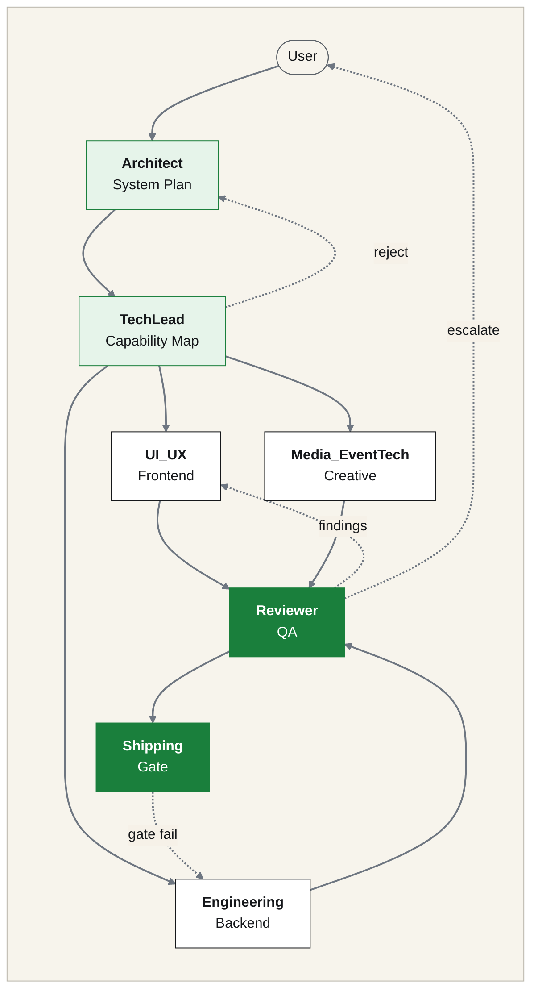
```mermaid
%%{init: {"theme": "base", "themeVariables": {"lineColor": "#6e7681", "edgeLabelBackground": "#f6f1e8", "textColor": "#15171A", "clusterBkg": "#F7F4EC", "clusterBorder": "#B9B5AA", "titleColor": "#15171A", "primaryColor": "#FFFFFF", "primaryBorderColor": "#15171A", "primaryTextColor": "#15171A"}}}%%
flowchart TB
    subgraph SG[" "]
    direction TB
    U(["User"])
    A["<b>Architect</b><br/>System Plan"]
    T["<b>TechLead</b><br/>Capability Map"]
    UX["<b>UI_UX</b><br/>Frontend"]
    EN["<b>Engineering</b><br/>Backend"]
    ME["<b>Media_EventTech</b><br/>Creative"]
    R["<b>Reviewer</b><br/>QA"]
    S["<b>Shipping</b><br/>Gate"]

    U --> A --> T
    T --> UX & EN & ME
    UX & EN & ME --> R
    R --> S

    T -.->|reject| A
    R -.->|findings| UX
    S -.->|gate fail| EN
    R -.->|escalate| U
    end

    classDef plan fill:#E6F4EA,stroke:#1A7F3C,color:#15171A
    classDef build fill:#FFFFFF,stroke:#15171A,color:#15171A
    classDef gate fill:#1A7F3C,stroke:#1A7F3C,color:#FFFFFF
    classDef human fill:#F7F4EC,stroke:#5B6168,color:#15171A
    classDef store fill:#F7F4EC,stroke:#B9B5AA,color:#15171A
    linkStyle default stroke:#6e7681,stroke-width:2px

    style SG fill:#F7F4EC,stroke:#B9B5AA,color:#15171A

    class A,T plan
    class UX,EN,ME build
    class R,S gate
    class U human
```

<p align="center"><sub><b>Dispatcher-Graph.</b> Architect und TechLead planen, drei Build-Nodes arbeiten parallel, Reviewer und Shipping schließen das Ergebnis ab, und gestrichelte Kanten leiten Ablehnungen und Eskalationen zurück.</sub></p>

---

## Installieren

**Voraussetzungen.** Node.js >= 20. macOS, Linux und Windows (PowerShell).

```bash
npx -y @hybridlabor-api/aos@latest
```

**Erster Lauf.** Der Installer erkennt, welche Harnesses vorhanden sind, fragt, welche anvisiert werden und welcher Tier (Pro MEDIA oder Basic) gelten soll, kopiert die Skills in das Skill-Verzeichnis jedes Harness, kompiliert die Subagents, verdrahtet die Hooks, merged die MCP-Konfiguration in die eigene Konfigurationsdatei jedes Harness (bestehende Einträge bleiben) und bietet die unten gelisteten optionalen Module an.

**Jeder spätere Lauf** öffnet stattdessen ein Menü:

| Menüpunkt | Was er tut |
|---|---|
| Quick Update | Aktualisiert Skills, Templates, Hooks und installierte Module auf die Version, die du gerade ausgeführt hast |
| Run System Checkup / Doctor | Führt `aos doctor` aus: Dependencies, Datei-Platzierung, Daemons, Hooks |
| Drop Local Project Harness | Kopiert den Dispatcher-Contract in das aktuelle Verzeichnis (siehe unten) |
| Reconfigure System | Ziele, Tier, Profil oder Optionen ändern |
| Uninstall AOS | Entfernt, was der Installer platziert hat; deine Daten bleiben |

### Profile und Optionen

| Flag | Wirkung |
|---|---|
| `--profile=standard` (Default) | Skills, Agents, Regeln, alle Hooks, MCPs, OpenWiki, Token Saver, Fleet. |
| `--profile=minimal` | Nur Skills, Agents und Harness-Regeln. Keine Context-Injection-Hooks, kein OpenWiki, Token Saver, Codenotch, keine optionalen Module, kein Gateway oder Fleet. Die Wahl mit wenig Context. |
| `--profile=full` | `standard` plus jedes optionale Modul (gleich wie `--modules=all` mit `-y`). |
| `--no-hooks` | Überspringt nur die Context-Injection-Hooks (`memb-inject`, `rules-inject`, `trail-relay`, `trail-autostart`). |
| `--hooks-only` | Installiert oder aktualisiert Hooks und ihre Settings-Einträge und beendet sich dann. Mit `--no-hooks` frischt es nur die Gates auf. |
| `--without=id,id` | Schließt Packages nach Registry-Id aus (`memb, synapse, openwiki, remote, ao, creator, hardware, installer, deja, token-saver, codenotch, gateway, fleet`). Wird gespeichert, damit Updates und Reparatur sie überspringen. |
| `AOS_DISABLED_MCPS=a,b` | Hält diese mitgelieferten MCP-Server-Namen aus den Harness-Konfigurationen heraus, die der Installer schreibt. |
| `--dry-run` | Gibt aus, was sich ändern würde, und schreibt nichts. |

**Das Gate und die Safety-Hooks werden immer installiert.** Kein Profil und kein Flag entfernt `go-gate`, `go-token`, `go-grant`, `graph-gate`, `conventional-commits` oder `env-file-protection`. Das OpenCode-Plugin ist von `--no-hooks` oder `minimal` nicht betroffen. Profilwahlen werden in `~/.aos/v5-settings.json` gespeichert. Volle Referenz: [docs/install-options.md](docs/install-options.md).

### Nicht-interaktiv

```bash
npx -y @hybridlabor-api/aos@latest -y --platforms=2          # nur Claude, alle Defaults
npx -y @hybridlabor-api/aos@latest -y --platforms=1,5 --mcps=none
npx -y @hybridlabor-api/aos@latest --dry-run                 # ausgeben, was sich ändern würde
```

`--platforms=`-Werte: `0` universal (alle erkannten), `1` Antigravity, `2` Claude Desktop / Claude Code, `3` Cursor, `5` Codex CLI, `6` Windsurf, `7` Roo Code / Cline, `8` Aider, `10` AOS CLI. `4` (eigene Pfade) braucht das interaktive Menü. `--mcps=<name,name>|all|none` wählt die MCP-Teilmenge. `--verbose` und `--no-intro` tun, was sie sagen.

### Lokaler Project Harness

Statt in `$HOME` zu installieren, legt man nur den Dispatcher-Contract (`.agents/`, die Gate-Hooks, die Agentendefinitionen, den `/startcycle-graph`-Workflow, das OpenCode-Plugin) in einem Repository ab:

```bash
cd dein-projekt && npx -y @hybridlabor-api/aos@latest --project-harness -y
```

---

## Unterstützte Harnesses

**Was geschrieben wird.** Der Installer schreibt pro Ziel Folgendes. Pfade sind die Defaults; der Installer schreibt nur in Harnesses, die er wirklich erkennt.

| Harness | Skills | Subagents | Hooks | Plugin / Regeln |
|---|---|---|---|---|
| Claude Code / Claude Desktop | `~/.claude/skills` | `~/.claude/agents` | `~/.claude/hooks` + `settings.json` (GO-Gate, Graph-Gate, env-file-protection, Conventional Commits, memB-Inject, Trail-Relay, A2A-Inbox) | `.claude-plugin/`-Manifest liegt im Repo bei (siehe Mitwirken); Fleet Mod registriert in `settings.json` |
| Google Antigravity | `~/.gemini/config/skills` | `~/.gemini/config/agents/<name>/agent.md` | `~/.gemini/config/hooks.json` und `~/.gemini/antigravity-cli/hooks.json` | Root-`plugin.json` / `plugins/bdb-aos/plugin.json`, Befehle `/bdb-aos:<cmd>`, siehe [docs/codex-agy-setup.md](docs/codex-agy-setup.md) |
| Codex CLI | `~/.codex/skills` | `~/.codex/agents` | `~/.codex/hooks` + `config.toml` | `.codex-plugin/` + `.agents/plugins/marketplace.json`, Befehle `$bdb-aos:<cmd>`, siehe [docs/codex-agy-setup.md](docs/codex-agy-setup.md) |
| OpenCode | `~/.config/opencode/skills` | `~/.config/opencode/agents` | über Plugin | `bdb-aos.js`-Plugin + `/startcycle-graph`-Befehl, registriert in `opencode.jsonc`; hält einen `/startcycle-graph`-Lauf bei `session.idle` am Laufen; generierte `/bdb-aos-<cmd>`-Befehle; Opt-in-Extras, siehe [docs/opencode-setup.md](docs/opencode-setup.md) |
| Cursor | `~/.cursor/skills` | keine | keine | `.cursor/rules` (Projekt) |
| Windsurf | `~/.windsurf/bdb-skills` | keine | keine | `mcp.json` |
| Roo Code / Cline | `~/.roo/skills` | keine | keine | `.roomodes` (Projekt) |
| Aider | `~/.aider/bdb-skills` | keine | keine | keine |
| AOS CLI (`pi`) | liest `~/.agents/skills` | `~/.agents/AGENTS.md` als System-Prompt | keine | kein MCP; separate Installation, Node >= 22.19, siehe [packages/aos-cli](packages/aos-cli/README.md) |
| BDB AO Codenotch (macOS-App, Windows-Installer) | macOS `/Applications` oder `~/Applications`; Windows pro-User-NSIS-Install (`/S`, ohne Admin) | keine | keine | Default auf macOS und Windows installiert (nie Linux); Abschalten mit `--no-codenotch` oder `AOS_CODENOTCH=0`; Fehler warnen nur; DMG aus dem öffentlichen Releases-Repo, von Tim erstellt, SHA-256-verifiziert, ad-hoc signiert mit entfernten Quarantäne-Attributen, siehe [docs/codenotch.md](docs/codenotch.md) |

Jede Installation schreibt zusätzlich die universelle Kopie nach `~/.agents/skills` — die die AOS CLI und die `skills`-CLI lesen.

<details>
<summary><b>Capability-Map pro Harness (4)</b></summary>

**Delegation, A2A und Gate-Hooks.** Die Zeilen sagen, was der Code in diesem Repo tut. Quelle: [docs/harness-capabilities.md](docs/harness-capabilities.md).

| Capability | Claude Code | OpenCode | Codex | agy |
|---|---|---|---|---|
| Delegation nach außen (`aos-acp`) | ja | ja | ja | über Shell-Befehle (kein eigener ACP-Client) |
| A2A eingehend | UserPromptSubmit-Drain + Stop-Nudge | Plugin-Inject als synthetischer Prompt | `codex queue` / `codex exec resume` | nur Pull, Inbox-MCP `a2a_inbox_pull`; eine laufende interaktive Session kann nicht beschrieben werden |
| A2A-Antwort | `aos-a2a reply` über vor-freigegebene Bash-Regeln | Antwortdatei vom Plugin geschrieben | Antwort auf den gequeueten oder fortgesetzten Prompt | `a2a_reply`-Tool, oder `aos-a2a reply` |
| A2A-Sidecar-Modus | `--mode live` | `--mode live` | `--mode live` | `--mode live` |
| GO-Gate-Hook | ja | ja (Plugin, geteilte Hooks) | ja (smoke-getestet, [docs/codex-gate-smoke.md](docs/codex-gate-smoke.md)) | Gate-only-Hooks (`PreToolUse`, `PreInvocation`, `Stop`) |
| Nie-GO bei A2A eingehend | ja | ja | ja | ja |

</details>

---

## Die Pipelines

Der Contract liegt in [`.agents/graph.md`](.agents/graph.md), das Node-Roster in [`.agents/nodes.json`](.agents/nodes.json), der ausführbare Dispatcher in [`.claude/workflows/startcycle-dispatch.mjs`](.claude/workflows/startcycle-dispatch.mjs).

**Eine Regel: Nodes rufen einander nie auf.** Ein Dispatcher liest `production_artifacts/state.json`, nachdem eine Node zurückkehrt, und entscheidet, was als Nächstes läuft. Es gibt keine Hand-off-Kette und keinen Agenten, der einem anderen sagt, er soll loslegen. Dieses Design sichert Context-Treue, Auditierbarkeit der Routing-Logik an genau einem Ort und Portabilität über Harnesses hinweg.

Jede Node liest den Plan und ihren eigenen vorherigen State, führt ihre Arbeit aus, schreibt ihr Artifact und ihre State-Fragmente und kehrt zurück. Der Dispatcher merged die State-Fragmente pro Node (`state.d/<node>.json`), wertet die Kanten-Prädikate aus und routet zur nächsten Node — oder eskaliert an dich, wenn der No-Progress-Guard auslöst (derselbe blocking Finding im zweiten Repair-Zyklus) oder das Iterations-Ceiling erreicht ist.

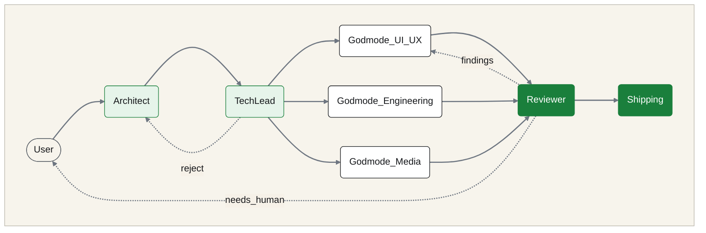
```mermaid
%%{init: {"theme": "base", "themeVariables": {"lineColor": "#6e7681", "edgeLabelBackground": "#f6f1e8", "textColor": "#15171A", "clusterBkg": "#F7F4EC", "clusterBorder": "#B9B5AA", "titleColor": "#15171A", "primaryColor": "#FFFFFF", "primaryBorderColor": "#15171A", "primaryTextColor": "#15171A"}}}%%
flowchart LR
    subgraph SG[" "]
    direction LR
    U(["User"]) --> A("Architect") --> T("TechLead")
    T --> UX("Godmode_UI_UX") & EN("Godmode_Engineering") & ME("Godmode_Media")
    UX & EN & ME --> R("Reviewer") --> S("Shipping")
    T -.->|reject| A
    R -.->|findings| UX
    R -.->|needs_human| U
    end

    classDef plan fill:#E6F4EA,stroke:#1A7F3C,color:#15171A
    classDef build fill:#FFFFFF,stroke:#15171A,color:#15171A
    classDef gate fill:#1A7F3C,stroke:#1A7F3C,color:#FFFFFF
    classDef human fill:#F7F4EC,stroke:#5B6168,color:#15171A
    classDef store fill:#F7F4EC,stroke:#B9B5AA,color:#15171A
    linkStyle default stroke:#6e7681,stroke-width:2px

    style SG fill:#F7F4EC,stroke:#B9B5AA,color:#15171A

    class A,T plan
    class UX,EN,ME build
    class R,S gate
    class U human
```

<p align="center"><sub><b>Node-Roster.</b> Die sieben Nodes des Graphen und die Kanten, die Arbeit zurücksenden: reject, findings und needs_human.</sub></p>

| Befehl | Mechanik | Wann |
|---|---|---|
| `/startcycle` | Lineare Kette, Datei-Hand-offs in `production_artifacts/`. Keine State-Machine, kein Repair-Loop. `/startcycle --skill=<name> <goal>` erzwingt einen Skill in jeder Node. | Ein geradliniger Build mit dem Agent-Roster, aber ohne Zeremonie. |
| `/startcycle-graph` | Der volle Graph: persistentes `state.json`, Reviewer-Repair-Loop, automatisiertes Quality Gate, menschliche Eskalation. | Feature-Arbeit, bei der Korrektheit mehr zählt als Geschwindigkeit, und wenn du einen Audit-Trail willst. |
| `/startcycle-graph-user` | Wegwerf-Fan-out mit 2-4 Nodes. Nichts persistent. Modell-Tiers pro Rolle; nutzt Antigravity, OpenCode oder Codex, falls installiert, sonst Claude-Code-Subagents. | Ein einmaliges „spawn ein paar Worker" in jedem Projekt. |

### Die drei Varianten im Vergleich

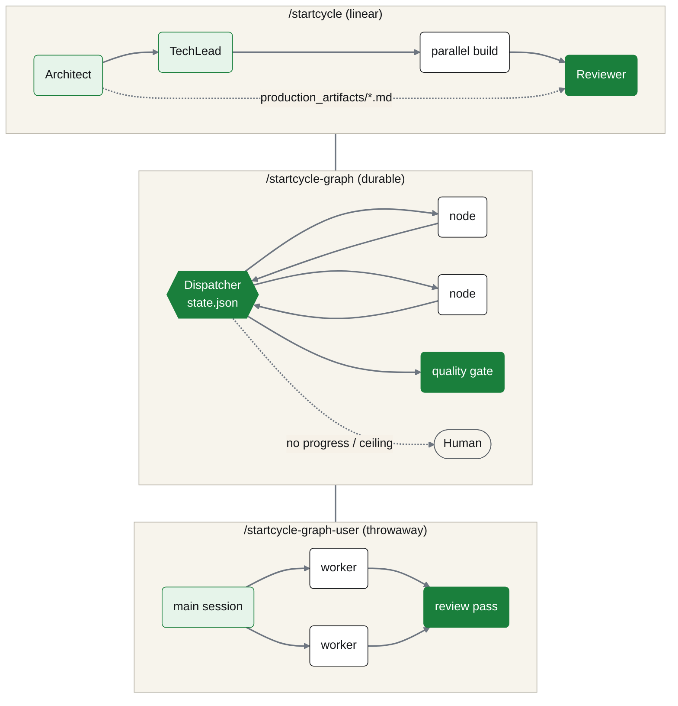
```mermaid
%%{init: {"theme": "base", "themeVariables": {"lineColor": "#6e7681", "edgeLabelBackground": "#f6f1e8", "textColor": "#15171A", "clusterBkg": "#F7F4EC", "clusterBorder": "#B9B5AA", "titleColor": "#15171A", "primaryColor": "#FFFFFF", "primaryBorderColor": "#15171A", "primaryTextColor": "#15171A"}}}%%
flowchart TB
    subgraph L["/startcycle (linear)"]
        direction LR
        L1("Architect") --> L2("TechLead") --> L3("parallel build") --> L4("Reviewer")
        L1 -. "production_artifacts/*.md" .-> L4
    end
    subgraph G["/startcycle-graph (durable)"]
        direction LR
        D{{"Dispatcher<br/>state.json"}}
        D --> N1("node") --> D
        D --> N2("node") --> D
        D --> Q("quality gate")
        D -. "no progress / ceiling" .-> H(["Human"])
    end
    subgraph F["/startcycle-graph-user (throwaway)"]
        direction LR
        F0("main session") --> W1("worker") & W2("worker") --> F3("review pass")
    end
    L ~~~ G ~~~ F

    classDef plan fill:#E6F4EA,stroke:#1A7F3C,color:#15171A
    classDef build fill:#FFFFFF,stroke:#15171A,color:#15171A
    classDef gate fill:#1A7F3C,stroke:#1A7F3C,color:#FFFFFF
    classDef human fill:#F7F4EC,stroke:#5B6168,color:#15171A
    classDef store fill:#F7F4EC,stroke:#B9B5AA,color:#15171A
    linkStyle default stroke:#6e7681,stroke-width:2px

    class L1,L2,F0 plan
    class L3,N1,N2,W1,W2 build
    class L4,Q,F3,D gate
    class H human
    style L fill:#F7F4EC,stroke:#B9B5AA,color:#15171A
    style G fill:#F7F4EC,stroke:#B9B5AA,color:#15171A
    style F fill:#F7F4EC,stroke:#B9B5AA,color:#15171A
```

<p align="center"><sub><b>Drei Varianten.</b> Die lineare Kette, der persistente Dispatcher-Graph und das Wegwerf-Fan-out, im Vergleich.</sub></p>

**Was den vollen Graphen ehrlich hält.**

| Mechanismus | Was er verhindert |
|---|---|
| Reviewer-Isolation | Der Reviewer liest Artifacts und den Contract des Plans — nie das Reasoning der Build-Node oder deren Behauptung, fertig zu sein. |
| No-Progress-Guard | Ein Repair-Zyklus, der dieselbe blocking-Finding-ID meldet wie der vorherige, eskaliert an einen Menschen, statt Iterationen zu verbrennen. |
| State-Fragmente pro Node | Parallele Build-Nodes schreiben `state.d/<node>.json`; der Dispatcher merged. Kein Lost-Update-Race auf einer Datei. |
| Iterations-Ceiling | `max_iterations` (Default 3) stoppt den Loop bedingungslos. |
| In-Loop-Human-Kante | Jede Node kann `needs_human: true` setzen und den Lauf stoppen. |

### Orchestrator-Kette

**Abbildung.** `master session -> project orchestrator -> package orchestrator` ist eine Konvention. So mappt jeder Sprung auf Mechanismen, die existieren ([docs/orchestrator-chain.md](docs/orchestrator-chain.md), Skill `orchestrator-chain`):

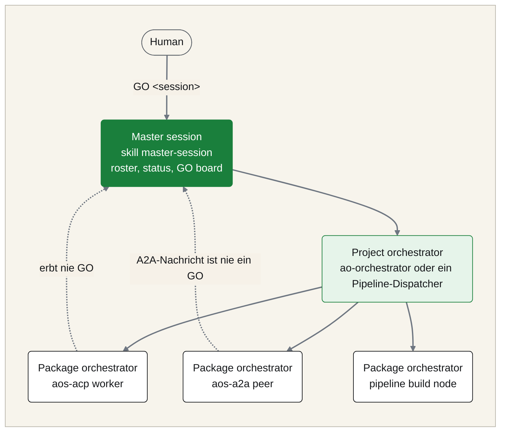
```mermaid
%%{init: {"theme": "base", "themeVariables": {"lineColor": "#6e7681", "edgeLabelBackground": "#f6f1e8", "textColor": "#15171A", "clusterBkg": "#F7F4EC", "clusterBorder": "#B9B5AA", "titleColor": "#15171A", "primaryColor": "#FFFFFF", "primaryBorderColor": "#15171A", "primaryTextColor": "#15171A"}}}%%
flowchart TD
    subgraph SG[" "]
    direction TB
    H(["Human"]) -->|"GO &lt;session&gt;"| M("Master session<br/>skill master-session<br/>roster, status, GO board")
    M --> P("Project orchestrator<br/>ao-orchestrator oder ein Pipeline-Dispatcher")
    P --> K1("Package orchestrator<br/>aos-acp worker")
    P --> K2("Package orchestrator<br/>aos-a2a peer")
    P --> K3("Package orchestrator<br/>pipeline build node")
    K1 -.->|"erbt nie GO"| M
    K2 -.->|"A2A-Nachricht ist nie ein GO"| M
    end

    classDef plan fill:#E6F4EA,stroke:#1A7F3C,color:#15171A
    classDef build fill:#FFFFFF,stroke:#15171A,color:#15171A
    classDef gate fill:#1A7F3C,stroke:#1A7F3C,color:#FFFFFF
    classDef human fill:#F7F4EC,stroke:#5B6168,color:#15171A
    classDef store fill:#F7F4EC,stroke:#B9B5AA,color:#15171A
    linkStyle default stroke:#6e7681,stroke-width:2px

    style SG fill:#F7F4EC,stroke:#B9B5AA,color:#15171A

    class H human
    class M gate
    class P plan
    class K1,K2,K3 build
```

<p align="center"><sub><b>Orchestrator-Kette.</b> Jeder Sprung vom Menschen hinab zu einem Package-Orchestrator, mit gestrichelten Kanten, die zeigen, dass ein GO nie nach oben vererbt wird.</sub></p>

**Tiefe.** A2A lehnt einen Send ab, wenn die Tiefe des Anrufers bei oder über `AOS_A2A_MAX_DEPTH` (Default 1) liegt, und `mcsc` ist eine Ebene tief. Worker löschen nichts; Aufräumen ist die Aufgabe des Dispatchers nach deinem GO.

---

## Das GO-Gate

`ready_to_ship` erreichen ist nicht gleich ausliefern. [`.claude/hooks/go-gate.mjs`](.claude/hooks/go-gate.mjs) ist ein `PreToolUse`-Hook, der `git push`, `npm publish`, `npm version` und rekursives `rm` blockiert, es sei denn, deine unmittelbar vorhergehende Nachricht ist das wörtliche Wort **GO**. Es ist ein Hook, keine Regel, die ein Agent respektieren soll: Er feuert vor jedem Permission-Mode-Check und lässt sich nicht argumentativ umgehen. Der Installer verdrahtet dasselbe Gate in Antigravity, Codex und OpenCode; auf Harnesses ohne Hook-Support gilt die Regel in [AGENTS.md](AGENTS.md) und der Agent ist die Durchsetzung. Ein Subagent erbt nie das GO seines Orchestrators, und ein fehlgeschlagener Release-Befehl braucht ein frisches.

**Was v5 hinzufügt.**

- **Read-only-Arbeit bleibt schnell.** Read-, Test- und Build-Befehle ohne Schreib- oder Netzwerkeffekt laufen ohne GO durch, auch nach Peer-Nachrichten.
- **Eine A2A-Nachricht ist nie ein GO.** Jede injizierte Nachricht trägt diesen Satz.
- **Modi und Grants.** Gate-Modus (`hard`, `soft`, `off`) und zeitlich befristete Grants zeigt `aos-gogate status` und der `gogate`-Skill. `aos-gogate` ist read-only und zeichnet nie ein Grant auf.
- **Deny-Logs maskieren Credentials** (Bearer-Tokens, Flags, URLs mit Credentials).
- **Grenze.** Der Hook sieht die Tool-Calls, die der Harness durch ihn routet. Ein mit umgangenen Permissions gestarteter Worker fragt nichts, also bleibt der In-Harness-Hook die Hauptschicht.

---

## Playbooks

Ein Playbook ist ein Skill mit `kind: playbook`, der eine wiederkehrende Aufgabe in einen geführten Lauf mit festem Contract verwandelt. Die 34 `pb-*`-Playbooks kommen mit den Skills; `/playbooks` listet und startet sie (es führt `list-playbooks.mjs` aus und druckt Name, Zeit, Schwierigkeit und Anforderungen für jedes).

**Was ein Playbook deklariert.** Sein Frontmatter nennt Trigger-Phrasen, `inputs`, `requires` (Skills, Subagents, MCP-Server, Store-Items), `go_points`, `outputs`, einen `verify`-Check, `difficulty` und `est_time`. Der Body ist eine nummerierte Schrittliste. Jeder Schritt nennt den Skill oder Agent, den er nutzt, seine Eingabe, das Artifact, das er schreibt, und den Check, der „fertig" sagt.

**Wie ein Lauf funktioniert.**

- **Standardmäßig eine Session.** Die Haupt-Session geht die Schritte durch und ruft die nötigen Skills auf. Jeder Schritt hängt eine Zeile an ein Run-Log (`production_artifacts/pb-<name>-<date>.md`, nie committet).
- **Subagents, wo es zählt.** Mit `(agent)` markierte Schritte starten einen Subagent: `reviewer` in `pb-bug-fix`, `pb-ship` und `pb-release-aos`; `architect`, `techlead` und `reviewer` in `pb-harness-work`, `pb-idea-to-launch` und `pb-redesign-app`; `security-reviewer` und `silent-failure-hunter` in `pb-security-sweep`; `opensource-forker` und `opensource-sanitizer` in `pb-open-source`. Auf einem Harness ohne Subagents liest die Haupt-Session die Agentendatei und führt denselben Contract inline aus. `pb-master` geht einen Schritt weiter und führt eine Control-Session über mehrere Claude-Code-, Codex- oder OpenCode-Sessions.
- **GO-Punkte sind Teil des Contracts.** Ein `[GO]`-Schritt stoppt mit `WAITING FOR GO: <step>`, bis du **GO** tippst; ein GO deckt genau einen Schritt, genau einmal. Der go-gate-Hook ist nur das Sicherheitsnetz. Ein fehlgeschlagener Check stoppt den Lauf und landet im Log; nichts wird stillschweigend wiederholt.

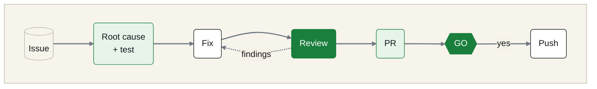
```mermaid
%%{init: {"theme": "base", "themeVariables": {"lineColor": "#6e7681", "edgeLabelBackground": "#f6f1e8", "textColor": "#15171A", "clusterBkg": "#F7F4EC", "clusterBorder": "#B9B5AA", "titleColor": "#15171A", "primaryColor": "#FFFFFF", "primaryBorderColor": "#15171A", "primaryTextColor": "#15171A"}}}%%
flowchart LR
    subgraph SG[" "]
    direction LR
    I[("Issue")] --> C1("Root cause<br/>+ test")
    C1 --> C2("Fix")
    C2 --> R("Review")
    R -.->|findings| C2
    R --> C3("PR")
    C3 --> G{{"GO"}}
    G -->|yes| C4("Push")
    end

    classDef plan fill:#E6F4EA,stroke:#1A7F3C,color:#15171A
    classDef build fill:#FFFFFF,stroke:#15171A,color:#15171A
    classDef gate fill:#1A7F3C,stroke:#1A7F3C,color:#FFFFFF
    classDef store fill:#F7F4EC,stroke:#B9B5AA,color:#15171A
    linkStyle default stroke:#6e7681,stroke-width:2px

    style SG fill:#F7F4EC,stroke:#B9B5AA,color:#15171A

    class I store
    class C1,C3 plan
    class C2,C4 build
    class R,G gate
```

<p align="center"><sub><b>pb-bug-fix.</b> Das Issue ist der Contract, der Test kommt vor dem Fix, der Reviewer sieht nur den Diff und das Issue, und der Push wartet auf dein GO.</sub></p>

<details>
<summary><b>Playbooks nach Domäne (34)</b></summary>

| Playbook | Zweck | Subagents | Zeit · Level |
|---|---|---|---|
| **Bauen und Code** | | | |
| `pb-bug-fix` | Aus einem GitHub-Issue einen getesteten Fix auf einem Branch mit offener PR machen. | reviewer | 30-90 min · intermediate |
| `pb-project-new` | Ein neues privates GitHub-Projekt auf die AOS-Art starten. | — | 20-40 min · intermediate |
| `pb-idea-to-launch` | Aus einer Idee ein deploytes Prototyp machen. | architect, techlead, reviewer | 2-6 h · advanced |
| `pb-harness-work` | Den Agent-Harness selbst verändern (Hooks, Gates, Memory, Permissions, Plugins) — auf den sicheren Weg. | architect, techlead, reviewer | 1-3 h · advanced |
| `pb-security-sweep` | Security-Sweep über ein Repo: Secrets, Dependencies, Diff, ein gerankter Findings-Report. | security-reviewer, silent-failure-hunter | 1-2 h · advanced |
| `pb-open-source` | Ein Projekt auf Open Sourcing vorbereiten: sanitizierter Fork, Sanitizer-Urteil, README und LICENSE, neues privates Repo. | opensource-forker, opensource-sanitizer | 1-3 h · advanced |
| `pb-worktrees-land` | Git-Worktrees über deine Repos aufräumen; entfernt nur gemergte. | — | 10-30 min · intermediate |
| **Release, CI und Betrieb** | | | |
| `pb-ship` | Die Arbeit des Tages in einem Repo ausliefern: Triage, jeden offenen PR reviewen, mergen. | reviewer | 20-60 min · intermediate |
| `pb-release-aos` | Eine neue AOS-Version über die release-please-PR auf npm bringen, gemergt erst nach GO. | reviewer | 30-60 min · advanced |
| `pb-ci-fix` | Rote CI fixen oder GitHub Actions komplett aufsetzen; Push erst nach GO. | — | 15-45 min · intermediate |
| `pb-deploy-saas` | Eine SaaS-App auf die BDB-Fleet deployen: Pre-Flight, Guardrail-Plan, grüne CI, Deploy nach GO, Health-Check. | — | 30-90 min · advanced |
| `pb-health-weekly` | Wöchentlicher Health-Report über die BDB-Repos: Version-Drift und CI-Status. | — | 15-30 min · intermediate |
| **Design und Web** | | | |
| `pb-landing-page` | Eine Landingpage bauen und launchen: bestätigte Copy, Brand-Tokens, UI- und SEO-Review, Deploy nach GO. | — | 1-3 h · intermediate |
| `pb-redesign-app` | Das UI einer App gegen ein Audit überholen. | architect, techlead, reviewer | 2-4 h · advanced |
| `pb-docs-site` | Die Docs eines Projekts als statisches HTML-Handbuch auf GitHub Pages veröffentlichen. | — | 30-90 min · intermediate |
| `pb-newsletter` | Aus einem Recap oder Changelog-Bereich einen Newsletter-Entwurf machen, in dem jeder Claim eine Quellzeile zitiert. | — | 20-40 min · intermediate |
| **Media und Eventtech** | | | |
| `pb-show-build` | Eine Show über Licht (grandMA3), Media (Resolume) und Visuals (TouchDesigner) aus einer Cue-Liste bauen, offline first. | — | 2-6 h · advanced |
| `pb-crew-call-sheet` | Ein Crew-Call-Sheet und ein Load-in-/Load-out-Plan für einen Showtag bauen; an die Crew senden erst nach GO. | — | 10-20 min · beginner |
| `pb-event-tracker` | Ein Spreadsheet für ein Event: Gäste, Vendor, Timeline, Budget, mit entworfenen Vendor-Nachrichten. | — | 20-40 min · intermediate |
| `pb-clip-from-moodboard` | Aus einem Look-Brief und Referenzbildern einen fertigen Social Clip machen. | — | 1-3 h · advanced |
| `pb-image-to-3d` | Aus einem Referenzbild ein bereinigtes, skaliertes 3D-Asset machen. | — | 30-90 min · advanced |
| `pb-launch-video` | Aus einer laufenden App oder Landingpage ein kurzes Launch-Video machen. | — | 30-90 min · intermediate |
| `pb-social-pack` | Aus einem Release-Recap ein Social Pack machen, in dem jeder Claim auf eine Facts-Datei zurückgeht. | — | 30-60 min · intermediate |
| **Hardware** | | | |
| `pb-pcb-to-case` | Von einem KiCad-Board zu einem parametrischen OpenSCAD-Gehäuse, das passt. | — | 1-3 h · advanced |
| **Management und Office** | | | |
| `pb-offer` | Ein Kundenangebot entwerfen, mit Positionen ausschließlich aus deiner Preisliste; senden erst nach GO. | — | 10-20 min · beginner |
| `pb-invoice-check` | Rechnungen und Belege Zeile für Zeile gegen deine Angebote prüfen. Nichts wird bezahlt oder gesendet. | — | 10-20 min · beginner |
| `pb-inbox-zero` | Einen E-Mail-Backlog in Antworten, Delegieren, Archivieren und Ignorieren sortieren, und die Antworten entwerfen. | — | 10-20 min · beginner |
| `pb-meeting-actions` | Aus einem Meeting-Transkript Notizen, Entscheidungen und Verantwortliche machen; das Follow-up senden erst nach GO. | — | 10-20 min · beginner |
| `pb-handover` | Eine Übergabe-Notiz für eine Kollegin oder Kollegen aus dem State eines Projektordners schreiben. | — | 10-20 min · beginner |
| `pb-week-plan` | Zerstreute To-do-Listen und Notizen in einen priorisierten Wochenplan verwandeln. | — | 10-20 min · beginner |
| `pb-focus-chunks` | Eine große Aufgabe in Häppchen von höchstens 25 Minuten teilen, jedes mit Done-Check. | — | 5-10 min · beginner |
| `pb-todo` | Aus einem Satz eine Aufgabenzeile in der richtigen To-do-Liste machen. | — | 2-5 min · beginner |
| **Maschine und Sessions** | | | |
| `pb-machine-setup` | Eine neue Maschine zu einer verifizierten AOS-Installation bringen. | — | 30-60 min · intermediate |
| `pb-master` | Eine Control-Session über mehrere Claude-Code-, Codex- oder OpenCode-Sessions: Roster, Status-Board, GO-Board. | — | 15 min Setup, dann über die Session · advanced |

</details>

---

## Factory

**Was es ist.** Vier experimentelle Skills, die Feedback, Telemetrie, Fehler, Issues und Pull Requests in einen wiederholbaren Review-Loop verwandeln: sammeln und triagen, für systemische Ursachen zurückschauen, PRs reviewen, und dir einen Digest liefern, was noch eine menschliche Entscheidung braucht. In AOS berichten und entwerfen sie; jeder externe Schreibvorgang wartet auf dein GO. `plan-arbiter` kommt daneben für den Vergleich konkurrierender Pläne.

### Der Loop

| Skill | Liest | Schreibt | Braucht GO? |
| --- | --- | --- | --- |
| `factory-collect` | die Quellen in `workflows.collect.sources` | Triage-Report, Antwort-Entwürfe, vorgeschlagene Close-Formulierungen; optionaler lokaler Fix | Antwort, Close, Push, Merge, Publish |
| `factory-lookback` | konfigurierte Quellen über einen begrenzten Zeitraum, frühere Fixes | Pattern-Report; optionaler lokaler systemischer Fix | Antwort, Close, Publish, Merge |
| `factory-review-prs` | PRs, die den konfigurierten Filtern entsprechen | Findings pro PR, Kommentar-Entwürfe, Approve- und Merge-Bereitschaft | Antwort, Approve, Merge |
| `factory-human-digest` | konfigurierte Repositories und Quellen (Default: letzte 7 Tage) | Entscheidungs-Queue, sonst nichts | Read-only |

### Wie man es ausführt

- **Namentlich aufrufen.** Den Agenten bitten, den Skill auszuführen, z. B. `factory-collect`; jede `SKILL.md` trägt einen „Use when"-Trigger. Von Hand starten und den Report lesen, bevor irgendetwas eingeplant wird.
- **Konfigurieren.** `.agent-factory/config.yaml`, von allen vier Skills gelesen. Schlüssel, wie in den Skills genannt: `workflows.collect.sources`, `workflows.collect.implement`, `workflows.lookback`, `workflows.lookback.implement`, `workflows.human-digest`, plus ein optionales `skill_prompts.<skill-name>` pro Skill. Fehlt die Datei, stoppt der Skill und fragt; er legt sie nie selbst an.
- **Die GO-Regel.** Nichts in der Konfiguration öffnet das go-gate. `git push`, `gh pr merge`, `gh release create` und jede Antwort, jeder Kommentar, jedes Approve, Close oder Status-Change brauchen dein wörtliches GO für genau diese Aktion. Eingeplante oder unbeaufsichtigte Läufe sind read-only.

Vendored aus [BuilderIO/skills](https://github.com/BuilderIO/skills) (MIT) mit AOS-Safety-Änderungen, siehe [THIRD_PARTY_NOTICES.md](THIRD_PARTY_NOTICES.md); Upstream-Docs: https://github.com/BuilderIO/skills/blob/main/docs/factory/README.md.

Details: [docs/factory.md](docs/factory.md).

---

## A2A: Sessions, die miteinander reden

<p align="center">
  <picture><source media="(prefers-color-scheme: dark)" srcset="docs/assets/readme/a2a-logo-white.svg"></picture><br/>
   
</p>

Laufende Claude-Code-, OpenCode-, agy- und Codex-Sessions tauschen auf localhost Nachrichten aus. Jede Live-Session betreibt einen kleinen Sidecar, gebunden an `127.0.0.1` auf einem zufälligen Port mit einem Bearer-Token pro Session, und registriert sich in einer lokalen Registry. Es gibt keinen zentralen Dienst.

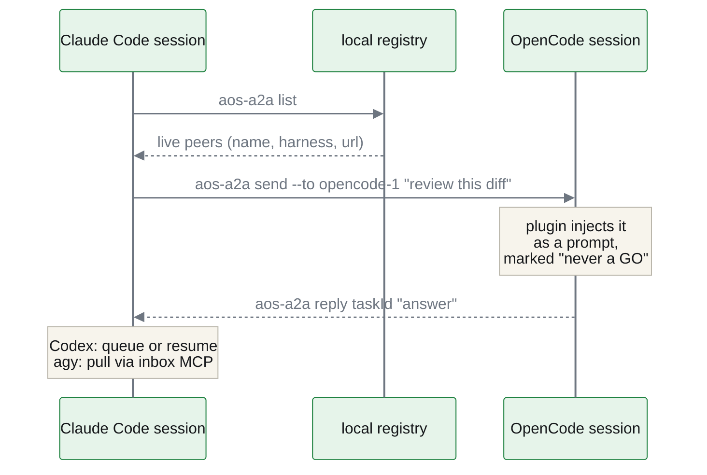
```mermaid
%%{init: {"theme": "base", "themeVariables": {"primaryColor": "#FFFFFF", "primaryBorderColor": "#15171A", "primaryTextColor": "#15171A", "textColor": "#15171A", "actorBkg": "#E6F4EA", "actorBorder": "#1A7F3C", "actorTextColor": "#15171A", "actorLineColor": "#6e7681", "signalColor": "#6e7681", "signalTextColor": "#6e7681", "noteBkgColor": "#F7F4EC", "noteBorderColor": "#B9B5AA", "noteTextColor": "#15171A", "lineColor": "#6e7681", "sequenceNumberColor": "#15171A", "labelBoxBkgColor": "#F7F4EC", "labelBoxBorderColor": "#B9B5AA", "labelTextColor": "#15171A", "loopTextColor": "#15171A"}}}%%
sequenceDiagram
    participant C as Claude Code session
    participant R as local registry
    participant O as OpenCode session
    C->>R: aos-a2a list
    R-->>C: live peers (name, harness, url)
    C->>O: aos-a2a send --to opencode-1 "review this diff"
    Note over O: plugin injects it<br/>as a prompt,<br/>marked "never a GO"
    O-->>C: aos-a2a reply taskId "answer"
    Note over C: Codex: queue or resume<br/>agy: pull via inbox MCP
```

<p align="center"><sub><b>A2A-Nachrichtenfluss.</b> Eine Claude-Code-Session listet die laufenden Peers in der lokalen Registry, schickt einer OpenCode-Session eine Nachricht und bekommt die Antwort zurück.</sub></p>

```bash
aos-a2a list                              # laufende Peers
aos-a2a send --to <name> "<text>"         # eine Session anschreiben
aos-a2a reply <taskId> "<answer>"         # eine eingehende Nachricht beantworten
```

Eingehend pro Harness: Claude Code drain't die Inbox in einem Hook, OpenCode bekommt ein Plugin-Inject, Codex bekommt `codex queue` oder `codex exec resume`, agy zieht über ein Inbox-MCP (eine laufende interaktive agy-Session kann nicht beschrieben werden). Für andere Kanäle nutze `mcsc` (Einmal-Aufgabe) oder `aos-acp` (Worker, der ein GO brauchen kann): [docs/delegation-routing.md](docs/delegation-routing.md). Details: [docs/a2a.md](docs/a2a.md). **In Arbeit:** Intercom und a2abook auf A2A.

---

## Tools

<p align="center"><br/><sub><b>Tool-Landschaft.</b> Der universal Harness oben, mit den AOS-Tools und optionalen Modulen darunter.</sub></p>

<details>
<summary><b>Original v3.4.0 Übersichts-Skizze</b></summary>

<p align="center"><br/><sub><b>v3.4.0-Übersicht.</b> Konzeptionelle Skizze aus v3.4.0; die Komponenten sind seitdem gewachsen, die Tabelle unten ist aktuell.</sub></p>

</details>

| Tool | Befehl | Was es tut |
|---|---|---|
| Plan Canvas | `aos-plan-canvas open <file>` (Skill `plan-canvas`) | Öffnet einen Plan oder ein HTML-Artifact in einer lokalen Browser-Canvas, in der du Elemente annotierst, chattest und freigibst oder Änderungen anforderst. Pläne aus den Pipelines öffnen sich hier per Default. |
| agenttrail | `aos-trail` (Skill `agenttrail`, Port 5330) | Live-Board eines Multi-Agent-Builds: welche Komponente, welcher Agent oder Harness, was fertig ist, was hängt. Gespeist von den Trail-Relay-Hooks, `mcsc` und `aos-acp`. |
| archify | `aos-archify` (Skill `archify`) | Validierte Architektur-, Sequenz-, Datenfluss- und State-Diagramme als standalone HTML mit SVG-Export; nimmt Mermaid entgegen. |
| AOS Store | `aos store list \| search <q> \| install <name> [--project]`, `aos store ui` (auch `aos-store`, Slash-Befehl `/aos-store`) | AOS-Core-, ECC- und Scenario-Skills (scenario-labs/skills, MIT) und Agents stöbern und installieren; nötige Skills werden zusammen installiert, und jede Datei ist SHA-256-verifiziert. Die Web-UI auf `http://127.0.0.1:4322` zeigt, was installiert ist, previewt die exakten Zielpfade und installiert erst nach deiner Bestätigung. `list` und `search` lesen einen gepinnten Offline-Index. |
| Launchpad | `aos-dashboard [--port 7900] [--no-open]` | Eine Seite mit jedem lokalen BDB-Dienst (memB, Synapse, OpenWiki, AO, Remote, AOS Store): Status, Start/Stop, Logs. Als Autostart-Eintrag registriert. |
| Doctor | `aos doctor [--json] [--net]` (auch `aos-doctor`) | Prüft Dependencies, Skill-Platzierung pro Harness, Daemons, Hooks, Module und das MCP-Gateway; Exit-Code 1, wenn etwas Aufmerksamkeit braucht. Das Erste, was man ausführt, wenn etwas zickt. |
| Fleet Band | Claude-Code-Mod `plugins/bdb-aos-fleet` | Zweizeiliges Band: Gate-Modus (draufklicken öffnet den Gate-Pane), Token-Wetter, Sessions die arbeiten oder warten mit GO-Zählern, und die aktiven Projekte. Braucht Claude Code >= 2.1.287; Abschalten mit `AOS_NO_FLEET=1`. |
| GO-Helfer | `aos-gogate status [--session <id>] \| preset <name> \| presets` | Read-only Gate-Status und Preset-Texte. Zeichnet nie ein Grant auf. |
| A2A | `aos-a2a list \| send \| reply \| status \| cancel` | Nachrichten zwischen laufenden Harness-Sessions. |
| MCP-Gateway | `aos-gateway status \| enable \| direct \| adopt` | Ein lokaler Endpunkt für geteilte MCP-Server. Opt-in. |
| Config | `aos-config show \| propose \| set <key> <value>` | Maschinenweite `~/.agents/aos-config.json`: Workspace-Root, Domänen, User-Id. |
| mcsc | MCP-Tools `delegate_agy`, `delegate_opencode`, `delegate_codex`, `delegate_smart` (Skill `mcsc`) | Delegiert eine Aufgabe an einen anderen installierten CLI-Harness und streamt seine Tool-Calls zu agenttrail. Dem direkten CLI-Aufruf vorzuziehen. |

### Fleet Band und Token-Wetter

**Token-Wetter.** Der Fleet-Mod übersetzt die Context-Prozent einer Session in ein Wetterwort mit Rat und einer Sparkline: etwa `ok` bei niedriger Auslastung, `compact soon` um 80 Prozent, `compact or start a new session` über 90. Dasselbe Band listet deine Claude-Sessions — welche arbeitet, welche auf dich wartet, und wie viele GO-Requests jede ausstehend hat. Quelle: `plugins/bdb-aos-fleet`.

---

## MCP-Server

[`mcp_config.json`](mcp_config.json) definiert <!-- count:mcps -->21<!-- /count --> lokale stdio-Server, gebaut oder aufgewärmt vom Installer aus `mcps/`. Sie erreichen deine Harnesses auf einem von zwei Wegen:

- **Direkt (Default).** Jeder Server wird in die MCP-Konfiguration jedes Harness geschrieben, sodass jeder Harness dasselbe Toolset sieht.
- **Durch das MCP-Gateway (Opt-in).** Jeder Harness bekommt einen einzigen `aos`-Eintrag, der auf `127.0.0.1:7790` zeigt; dahinter betreibt [1mcp](https://github.com/1mcp-app/agent) die Server auf der Gateway-Allow-Liste einmal für alle Harnesses. `aos-gateway adopt` holt auch deine eigenen lokalen Server dahinter, und `aos-gateway direct` schaltet zurück. deja, memB, mcsc und die OS-Control-Server bleiben immer direkt.

Die Spalte „Routing" sagt, welchen Weg ein Server nimmt, wenn das Gateway an ist; „Erreicht die App via" sagt, wie er mit seiner Anwendung spricht. API-Keys und Tokens liegen in `~/.aos/secrets.env` (Modus 0600), nie inline in einer Harness-Konfiguration: [docs/mcp-secrets.md](docs/mcp-secrets.md).

| Server | App | Erreicht die App via | Routing | Skill |
|---|---|---|---|---|
| **3D / CAD** | | | | |
| `bdb_blender_mcp` | Blender | Socket-Integration; der offizielle Blender-MCP wird stattdessen gewählt, wenn Blender >= 5.1 gefunden wird | gateway (offizielle Wahl: direkt) | `bdb-blender-mcp` |
| `bdb_rhino_mcp` | Rhino 3D, Grasshopper | McNeel-Yak-Router, braucht Rhino auf dem Host | direkt | `bdb-rhino-mcp` |
| `bdb_rhino_mcp_fallback` | Rhino 3D | GOLEM 3D (105 Tools) | direkt | `bdb-rhino-mcp` |
| `bdb_unreal_mcp` | Unreal Engine 5 | Web Remote Control API, Port 30010 | gateway | `bdb-unreal-mcp` |
| **Video / Post** | | | | |
| `bdb_davinci_mcp` | DaVinci Resolve | Resolve-Scripting-API (162 Tools) | gateway | `bdb-davinci-mcp` |
| `bdb_after_effects_mcp` | After Effects | gepinntes `@kumoproductions/mcp-aftereffects`, Node >= 24; Legacy-Server nur mit `AOS_AE_MCP=legacy` | gateway | `bdb-after-effects-mcp` |
| `bdb_after_effects_mcp_fallback` | After Effects | Go-Server, ExtendScript | direkt | `bdb-after-effects-mcp` |
| `adobe_uxp_mcp` | Photoshop, Illustrator, Premiere Pro, After Effects | UXP-WebSocket-Bridge | gateway | `bdb-adobe-suite-mcp` |
| **Show Control / Live** | | | | |
| `bdb_grandma3_mcp` | grandMA3 | typisierte `ma3_*`-Tools, OSC/UDP Port 8000 | gateway | `bdb-grandma3-mcp` |
| `bdb_resolume_mcp` | Resolume Arena | REST-API, Port 8080; der offizielle Arena-Server wird gewählt, wenn seine Binary gefunden wird | gateway (offizielle Wahl: direkt) | `bdb-resolume-mcp` |
| `bdb_td_minddesigner` | TouchDesigner | MindDesigner-Bridge, Port 9980 | direkt | `bdb-touchdesigner-mcp` |
| `bdb_td_backup` | TouchDesigner | stdio-Bridge, Fallback | direkt | `bdb-touchdesigner-mcp` |
| **Design / Browser** | | | | |
| `open_design_mcp` | Open Design | lokaler Daemon auf 127.0.0.1:3000 | gateway | — |
| `chrome-devtools` | Chrome | Puppeteer | direkt | — |
| **OS-Steuerung** | | | | |
| `zavora_computer_use` | macOS, Linux-Desktop | `npx -y @zavora-ai/computer-use-mcp@7.4.0`, natives Rust-Modul im npm-Package gebündelt | direkt | `bdb-computer-use-mcp` |
| `bdb_windows_computer_use` | Windows-Desktop | Win32, COM, UIAutomation, lokales Tesseract-OCR | direkt | `bdb-computer-use-mcp` |
| **Memory / Infra** | | | | |
| `memb_mcp` | memB | lokales SQLite + ONNX, WebUI auf Port 8088 | direkt | `memb-skill`, `bdb-memb-mcp` |
| `deja` | Agent-Transkripte | lokaler Index, Secrets geschwärzt | direkt | `deja-memory` |
| `mcsc` | andere Harnesses | startet agy, OpenCode oder Codex und streamt zu agenttrail | direkt | `mcsc` |
| `github` | GitHub | `@modelcontextprotocol/server-github` | gateway | `github` |
| `bdb_remoteos_mcp` | RemoteOS | Multi-Cloud-Gateway mit 4-Augen-Freigabe | direkt | — |

**Routing.** Die Allow-Liste in `lib/gateway/config.js` entscheidet: die neun als `gateway` markierten Server werden geteilt über den einen `aos`-Eintrag, sobald du es aktivierst; alles andere bleibt in jedem Harness direkt.

### MCP-Gateway und ein MCP pro App

**Ein MCP pro App.** Für Blender, Resolume und After Effects hält der Installer einen einzigen Kandidaten fest (`mcp_picks.json`): den offiziellen Blender-MCP, wenn Blender >= 5.1 gefunden wird, den offiziellen Resolume-Server, wenn die Arena-Binary gefunden wird, sonst den gebündelten Server. Der After-Effects-Server ist ein gepinntes `npx`-Package und braucht Node >= 24 (der Legacy-Server nur mit `AOS_AE_MCP=legacy`).

**Gateway (Opt-in).** `aos-gateway` betreibt einen Token-prüfenden Forwarder auf `127.0.0.1:7790` vor `@1mcp/agent` und teilt eine Allow-Liste der mitgelieferten Server hinter einem `aos`-Eintrag pro Harness. `aos-gateway adopt` holt deine eigenen lokalen stdio-Server dahinter (und überspringt Remote-Einträge sowie Einträge mit inline Secrets). `aos-gateway direct` dreht alles zurück. Das Token stoppt Browser, nicht andere lokale Prozesse. `deja`, `memb_mcp` und `mcsc` bleiben direkt.

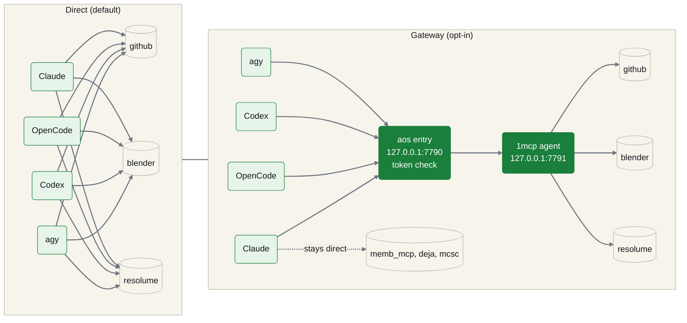
```mermaid
%%{init: {"theme": "base", "themeVariables": {"lineColor": "#6e7681", "edgeLabelBackground": "#f6f1e8", "textColor": "#15171A", "clusterBkg": "#F7F4EC", "clusterBorder": "#B9B5AA", "titleColor": "#15171A", "primaryColor": "#FFFFFF", "primaryBorderColor": "#15171A", "primaryTextColor": "#15171A"}}}%%
flowchart LR
    subgraph D["Direct (default)"]
        direction LR
        H1("Claude") --> S1[("github")] & S2[("blender")] & S3[("resolume")]
        H2("OpenCode") --> S1 & S2 & S3
        H3("Codex") --> S1 & S2 & S3
        H4("agy") --> S1 & S2 & S3
    end
    subgraph G["Gateway (opt-in)"]
        direction LR
        G1("Claude") & G2("OpenCode") & G3("Codex") & G4("agy") --> F("aos entry<br/>127.0.0.1:7790<br/>token check")
        F --> M("1mcp agent<br/>127.0.0.1:7791") --> U1[("github")] & U2[("blender")] & U3[("resolume")]
        G1 -.->|"stays direct"| X[("memb_mcp, deja, mcsc")]
    end
    D ~~~ G

    classDef plan fill:#E6F4EA,stroke:#1A7F3C,color:#15171A
    classDef build fill:#FFFFFF,stroke:#15171A,color:#15171A
    classDef gate fill:#1A7F3C,stroke:#1A7F3C,color:#FFFFFF
    classDef human fill:#F7F4EC,stroke:#5B6168,color:#15171A
    classDef store fill:#F7F4EC,stroke:#B9B5AA,color:#15171A
    linkStyle default stroke:#6e7681,stroke-width:2px

    class H1,H2,H3,H4,G1,G2,G3,G4 plan
    class S1,S2,S3,U1,U2,U3,X store
    class F,M gate
    style D fill:#F7F4EC,stroke:#B9B5AA,color:#15171A
    style G fill:#F7F4EC,stroke:#B9B5AA,color:#15171A
```

<p align="center"><sub><b>Direktes und Gateway-Routing.</b> Per Default redet jeder Harness direkt mit jedem Server; mit aktiviertem Gateway teilen sie sich einen aos-Eintrag vor dem 1mcp-Agent.</sub></p>

**Referenz.** [docs/mcp-gateway.md](docs/mcp-gateway.md).

---

## Plugins und Marketplace

**Plugin-Manifest.** `.claude-plugin/plugin.json` + `marketplace.json` (generiert von `npm run plugin:build`). In Claude Code kannst du den Marketplace hinzufügen mit `/plugin marketplace add hybridlabor-api/aos` und installieren: `bdb-aos@bdb-marketplace` (Skills und Subagents) oder `bdb-aos-fleet@bdb-marketplace` (das Fleet Band für Claude Code). Der Marketplace-Weg trägt nur Skills und Subagents; der npm-Installer oben ist der empfohlene Weg, weil er auch Gate-Hooks und MCP-Server aufsetzt.

**Skills-Discovery.** Jeder Harness findet Skills in seinem nativen Verzeichnis (`~/.claude/skills`, `~/.agents/skills`, `~/.codex/skills`, `~/.roo/skills` usw.). Um nach der Installation weitere Skills zu stöbern und zu installieren:

```bash
npx skills add hybridlabor-api/aos
```

Das findet alle <!-- count:skills -->264<!-- /count --> kuratierten Skills und installiert sie in das universelle `~/.agents/skills`-Verzeichnis (genutzt von allen Harnesses und der AOS CLI).

---

## AOS CLI

Ein leichtgewichtiger CLI-Harness auf Basis von [pi](https://github.com/earendil-works/pi), einem Coding-Agent, der im Terminal läuft. AOS CLI liest `~/.agents/skills` (vom Installer geschrieben) und `~/.agents/AGENTS.md` (den Dispatcher-Graph als Systeminstruktionen), betreibt keine eigenen MCP-Server und braucht **Node >= 22.19** (pis Untergrenze, höher als der Haupt-AOS-Installer).

```bash
aos-cli "what is the fastest way to fix this bug"
aos-cli --continue                    # die vorherige Session fortsetzen
```

Der CLI-Launcher (`packages/aos-cli/bin/aos-cli.mjs`) kommt mit einem AOS-Themed-Dark-Mode (`aos.json`), den zehn Core-Skills aus `core-skills.json` (ask-tim, aos-setup, systematic-debugging, archify usw.) und zwei In-Session-Read-only-Befehlen (`/aos` zeigt das Installationsmenü; `/aos-status` führt den Health-Check aus).

Installieren über den AOS-Installer mit dem AOS-CLI-Ziel: `npx -y @hybridlabor-api/aos@latest -y --platforms=10`. Das Package ist privat und nicht auf npm veröffentlicht — `npm i -g @hybridlabor-api/aos-cli` funktioniert also nicht.

---

## Memory und Wissen

Als optionale Module vom Installer installiert; `aos doctor` verifiziert sie und das Launchpad zeigt sie.

- **memB** (`@hybridlabor-api/memb`): lokales, offline Vektorgedächtnis mit MCP-Server (`add_memory`, `search_memory`, `list_memories`, `delete_memory`), WebUI auf Port 8088 und einem Ambient-Hook, der relevante Memories in Claude-Code-Sessions injiziert. Skills: `memb-skill`, `memb-ingest`, `bdb-memb-mcp`.
- **deja** (`@vshulcz/deja-vu`, mit memB installiert): indexiert deine Agent-Transkripte lokal mit geschwärzten Secrets; `deja fix` bei einem Fehler, `deja wip` beim Wiederaufnehmen, `deja search` für vergangene Sessions. Skill: `deja-memory`.
- **OpenWiki** (`openwiki` CLI): generiert und aktualisiert ein grounded Wiki einer Codebase, mit Visualizer auf Port 4321 und einem Background-Daemon. Skill: `openwiki-skill`; das eigene Wiki dieses Repos liegt unter [`.openwiki/`](.openwiki/quickstart.md).
- **Synapse** (`@hybridlabor-api/bdb-synapse`): rendert ein Repository als 3D-Code-Stadt und spielt Agent-Sessions durch sie zurück. Skill: `synapse-integration-skill`.

`aos-setup` bringt eine Maschine für alle vier in einen verifizierten Zustand; `aos-project-init` bindet ein Projekt an sie (Slug, Wiki, Memory, `AGENTS.md`).

---

## Was enthalten ist

### Die Subagents (21)

**Roster.** Der Dispatcher-Graph kompiliert diese Agents, verfügbar als Claude-Code-Subagents und ladbar in Antigravity, Cursor, Codex, OpenCode und andere:

| Agent | Zweck |
|---|---|
| **Architect** | Verwandelt das Ziel des Users in einen Systemplan. Liest die bestehende Architektur, bevor er Änderungen vorschlägt. |
| **TechLead** | Prüft den Plan auf eine Capability Map (Modulgrenzen, Abhängigkeitsrichtung, Build-Reihenfolge), bevor eine Build-Node startet. Approves oder Rejects zurück an den Architect. |
| **UI_UX** | Lead Frontend Designer. Erzwingt Anti-Slop-Prinzipien, DTCG-Design-Tokens, High-Agency-Frontend-Geschmack und fluide Motion-Dynamik. |
| **Engineering** | Senior Fullstack & Backend Engineer. Erzwingt Domain-Driven Design, Clean Architecture, TDD-Zyklen und Database-Best-Practices. |
| **Media_EventTech** | Creative-Tech & Show-Control-Spezialist. Herrscht über 3D-Modeling, TouchDesigner-Netzwerke, DaVinci Resolve, Licht und Resolume. |
| **Reviewer** | Adversarial Review des Build-Node-Outputs gegen den Contract des Plans. Modelliert nach der doubt-driven-development-Disziplin. |
| **Shipping** | Release Gatekeeper & QA Auditor. Fährt das automatisierte Quality Gate (Lint, Typecheck, Tests, a11y, SEO) und erzwingt das GO-Gate. |
| **Database Reviewer** | PostgreSQL-Spezialist für Query-Optimierung, Schema-Design, Security und Performance. |
| **Security Reviewer** | Security-Lücken erkennen und beheben. Flagged Secrets, SSRF, Injection, unsichere Kryptografie und OWASP Top 10. |
| **Silent-Failure Hunter** | Prüft Code auf stille Fehler, verschluckte Exceptions, schlechte Fallbacks und fehlende Fehler-Weitergabe. |
| **Go-Build Resolver** | Behebt Go-Build-, Vet- und Kompilierfehler mit minimalen Änderungen. |
| **Opensource Forker** | Forkt ein Projekt fürs Open-Sourcing: streift Secrets, ersetzt interne Referenzen, generiert `.env.example`. |
| **Opensource Sanitizer** | Verifiziert, dass ein Open-Source-Fork vollständig sanitiziert ist. Scannt auf geleakte Secrets, PII, interne Referenzen. |

### Skills nach Kategorie

**Kategorien.** <!-- count:skills -->264<!-- /count --> kuratierte Skills, von jedem Harness auffindbar (der volle generierte Katalog folgt in der nächsten Sektion):

- **bdb-core**: AOS-Core-Infrastruktur, Pipelines, Tools und Utilities: `startcycle`, `startcycle-graph`, `startcycle-graph-user`, `agenttrail`, `plan-canvas`, `aos-a2a`, `aos-gateway`, `aos-store`, `master-session` und mehr.
- **design-ui-ux**: Frontend, UI-Design, Accessibility, Tokens, Motion, Anti-Slop: `senior-frontend`, `ui-component`, `ui-review`, `tailwind-patterns`, `shadcn`, `wcag-audit-patterns` und mehr.
- **engineering-method**: Architektur, Testing, Debugging, CI/CD, Codequalität: `software-architecture`, `test-driven-development`, `systematic-debugging`, `ci-pipeline`, `github-actions-generator`, `dockerfile-validator` und mehr.
- **library**: Sprach- und Framework-Spezifika: TypeScript, Node.js, Python, React, Postgres, Prisma, Next.js, Drizzle ORM, Go und mehr.
- **media-eventtech**: 3D, Video, Show Control, Spatial Design: `godmode-eventtech`, `threejs-skills`, die Creative-Software-MCP-Skills und mehr.
- **engineering-hardware**: PCB- und Elektrodesign: `godmode-hardware-pcb`.

### Alles stöbern

**Generierter Katalog.** Gebaut aus den Repo-Dateien (Frontmatter jeder `SKILL.md`, `agents/`, `commands/`). Eine Sektion öffnen für Namen und Einzeiler-Beschreibungen.
<!-- BEGIN GENERATED CATALOG: regenerate from the repo, do not hand-edit -->

<details>
<summary><b>Harnesses (9)</b></summary>

| Harness | Skills | Subagents | Hooks and gates | MCP | Extras |
|---|:---:|:---:|:---:|:---:|---|
| Claude Code / Desktop | yes | yes | yes (GO gate, graph gate, env-file protection, Conventional Commits, memB inject, trail relay, A2A inbox) | yes | slash commands, fleet band, plugin manifest |
| Google Antigravity (agy) | yes | yes | gate-only hooks | yes | `/bdb-aos:<cmd>` commands, inbox MCP for A2A |
| Codex CLI | yes | yes | GO gate, graph gate | yes | `$bdb-aos:<cmd>` commands, A2A queue/resume |
| OpenCode | yes | yes | via `bdb-aos.js` plugin | yes | `/bdb-aos-<cmd>` commands, A2A inject |
| Cursor | yes | no | no | yes | `.cursor/rules` |
| Windsurf | yes | no | no | yes | `mcp.json` |
| Roo Code / Cline | yes | no | no | yes | `.roomodes` |
| Aider | yes | no | no | no | none |
| AOS CLI (pi) | yes | system prompt | no | no | 10 core skills, dark theme |

</details>

<details>
<summary><b>Tools and CLIs (12)</b></summary>

| Command | What it does |
|---|---|
| `aos` | Installer menu: update, doctor, reconfigure, uninstall. |
| `aos doctor` | Verify dependencies, skill placement, daemons, hooks, modules, gateway. |
| `aos store` | Browse and install skills and agents (CLI and web UI on port 4322). |
| `aos-plan-canvas` | Open plans and HTML artifacts in the annotation canvas (port 4519). |
| `aos-trail` | agenttrail live map (port 5330). |
| `aos-archify` | Architecture and sequence diagrams as standalone HTML. |
| `aos-dashboard` | Launchpad for local services (port 7900). |
| `aos-a2a` | List, send to and reply to live harness peers. |
| `aos-acp` | Start workers whose guarded commands need a GO token. |
| `aos-gateway` | Local MCP gateway: serve, enable, direct, adopt, status. |
| `aos-gogate` | Read-only gate status and presets. |
| `aos-config` | Machine-level AOS configuration. |

</details>

<details>
<summary><b>MCP servers (21)</b></summary>

| Server | Domain |
|---|---|
| `github`, `chrome-devtools` | Issues, PRs, workflows; browser automation and debugging |
| `bdb_unreal_mcp` | Unreal Engine (Web Remote Control, port 30010) |
| `bdb_rhino_mcp`, `bdb_rhino_mcp_fallback` | Rhino 3D and Grasshopper |
| `bdb_davinci_mcp` | DaVinci Resolve |
| `bdb_grandma3_mcp` | grandMA3 (typed `ma3_*` tools) |
| `bdb_resolume_mcp` | Resolume Arena (REST, port 8080) |
| `adobe_uxp_mcp` | Adobe UXP bridge |
| `bdb_blender_mcp` | Blender |
| `bdb_after_effects_mcp`, `bdb_after_effects_mcp_fallback` | After Effects |
| `bdb_td_minddesigner`, `bdb_td_backup` | TouchDesigner (port 9980) |
| `zavora_computer_use`, `bdb_windows_computer_use` | Desktop control on macOS and Linux, and on Windows |
| `memb_mcp`, `deja` | Local memory and transcript search |
| `mcsc` | Delegation to other harnesses |
| `open_design_mcp` | Open Design |
| `bdb_remoteos_mcp` | RemoteOS multi-cloud gateway with 4-eyes approval |

</details>

<details>
<summary><b>Skills (229)</b></summary>

<details>
<summary><b>library (98)</b></summary>

| Skill | What it does |
|---|---|
| `ai-agent-development` | AI agent development workflow for building autonomous agents, multi-agent systems, and agent orchestration with CrewAI, LangGraph, and custom agents. |
| `ai-product` | Every product will be AI-powered. |
| `api-design-principles` | Master REST and GraphQL API design principles to build intuitive, scalable, and maintainable APIs that delight developers and stand the test of time. |
| `api-patterns` | API design principles and decision-making. |
| `apify-lead-generation` | Scrape leads from multiple platforms using Apify Actors. |
| `apify-ultimate-scraper` | AI-driven data extraction from 55+ Actors across all major platforms. |
| `bash-linux` | Bash/Linux terminal patterns. |
| `brainstorming` | Use before creative or constructive work (features, architecture, behavior). |
| `browser-automation` | Browser automation powers web testing, scraping, and AI agent interactions. |
| `cloudflare-workers-expert` | Expert in Cloudflare Workers and the Edge Computing ecosystem. |
| `copywriting` | Write rigorous, conversion-focused marketing copy for landing pages and emails. |
| `crewai` | Expert in CrewAI, the leading role-based multi-agent framework. |
| `database-design` | Database design principles and decision-making. |
| `debugger` | Debugging specialist for errors, test failures, and unexpected behavior. |
| `deep-research` | Run autonomous research tasks that plan, search, read, and synthesize information into comprehensive reports. |
| `docker-expert` | Advanced Docker containerization: optimization, security hardening, multi-stage builds, orchestration. |
| `documentation` | Documentation generation workflow covering API docs, architecture docs, README files, code comments, and technical writing. |
| `drizzle-orm-expert` | Expert in Drizzle ORM for TypeScript: schema design, relational queries, migrations, and serverless database integration. |
| `firecrawl` | Search, scrape, and interact with the web via the Firecrawl CLI. |
| `firecrawl-agent` | AI-powered autonomous data extraction that navigates complex sites and returns structured JSON. |
| `firecrawl-build` | Integrate Firecrawl into product code for web scraping, crawling, searching, and interaction. |
| `firecrawl-build-interact` | Integrate Firecrawl `/interact` into product code for dynamic pages and browser actions after scraping. |
| `firecrawl-build-onboarding` | Get Firecrawl credentials and SDK setup into a project. |
| `firecrawl-build-scrape` | Integrate Firecrawl `/scrape` into product code for single-page extraction. |
| `firecrawl-build-search` | Integrate Firecrawl `/search` into product code and agent workflows. |
| `firecrawl-crawl` | Bulk extract content from an entire website or site section. |
| `firecrawl-download` | Download an entire website as local files: markdown, screenshots, or multiple formats per page. |
| `firecrawl-interact` | Control and interact with a live browser session on any scraped page. |
| `firecrawl-map` | Discover and list all URLs on a website, with optional search filtering. |
| `firecrawl-scrape` | Extract clean markdown from any URL, including JavaScript-rendered SPAs. |
| `firecrawl-search` | Web search with full page content extraction. |
| `gemini-api-dev` | The Gemini API provides access to Google's most advanced AI models. |
| `gemini-api-integration` | Use when integrating Google Gemini API into projects. |
| `geo-fundamentals` | Generative Engine Optimization for AI search engines (ChatGPT, Claude, Perplexity). |
| `git-advanced-workflows` | Master advanced Git techniques to maintain clean history, collaborate effectively, and recover from any situation. |
| `git-pr-review` | Generate a concise and structured PR description from commit history with minimal token usage. |
| `github` | Use the `gh` CLI for issues, pull requests, Actions runs, and GitHub API queries. |
| `github-actions-templates` | Production-ready GitHub Actions workflow patterns for testing, building, and deploying applications. |
| `github-workflow-automation` | Patterns for automating GitHub workflows with AI assistance. |
| `go-concurrency-patterns` | Master Go concurrency with goroutines, channels, sync primitives, and context. |
| `go-playwright` | Robust browser automation using Playwright Go. |
| `golang-pro` | Master Go 1.21+ with modern patterns, advanced concurrency, performance optimization, and production-ready microservices. |
| `landing-page-generator` | Generates high-converting Next.js/React landing pages with Tailwind CSS. |
| `linear-claude-skill` | Manage Linear issues, projects, and teams. |
| `llm-app-patterns` | Production-ready patterns for building LLM applications. |
| `llm-application-dev-ai-assistant` | Creating intelligent conversational interfaces, chatbots, and AI-powered applications. |
| `llm-prompt-optimizer` | Use when improving prompts for any LLM. |
| `llm-structured-output` | Get reliable JSON, enums, and typed objects from LLMs using response_format, tool_use, and schema-constrained decoding. |
| `local-llm-expert` | Master local LLM inference, model selection, VRAM optimization, and local deployment using Ollama, llama.cpp, vLLM, and LM Studio. |
| `microservices-patterns` | Microservices architecture patterns: service boundaries, inter-service communication, data management, resilience. |
| `modern-javascript-patterns` | Modern JavaScript (ES6+) features, functional programming patterns, and best practices. |
| `monorepo-management` | Build efficient, scalable monorepos that enable code sharing, consistent tooling, and atomic changes. |
| `n8n-code-javascript` | Write JavaScript code in n8n Code nodes. |
| `n8n-code-python` | Write Python code in n8n Code nodes. |
| `n8n-expression-syntax` | Validate n8n expression syntax and fix common errors. |
| `n8n-mcp-tools-expert` | Expert guide for using n8n-mcp MCP tools effectively. |
| `n8n-workflow-patterns` | Proven architectural patterns for building n8n workflows. |
| `neon-postgres` | Expert patterns for Neon serverless Postgres, branching, connection pooling, and Prisma/Drizzle integration. |
| `nextjs-app-router-patterns` | Next.js 14+ App Router architecture, Server Components, and modern full-stack React development. |
| `nextjs-best-practices` | Next.js App Router principles. |
| `notion-automation` | Automate Notion tasks via Rube MCP (Composio): pages, databases, blocks, comments, users. |
| `obsidian-markdown` | Create and edit Obsidian Flavored Markdown with wikilinks, embeds, callouts, and properties. |
| `openapi-spec-generation` | Generate and maintain OpenAPI 3.1 specifications from code, design-first specs, and validation patterns. |
| `os-scripting` | Operating system and shell scripting troubleshooting workflow for Linux, macOS, and Windows. |
| `playwright-skill` | General-purpose browser automation skill. |
| `posix-shell-pro` | Expert in strict POSIX sh scripting for maximum portability across Unix-like systems. |
| `postgres-best-practices` | Postgres performance optimization and best practices from Supabase. |
| `postgresql` | Design a PostgreSQL-specific schema. |
| `prisma-expert` | Prisma ORM: schema design, migrations, query optimization, relations modeling, and database operations. |
| `product-manager-toolkit` | Essential tools and frameworks for modern product management, from discovery to delivery. |
| `programmatic-seo` | Design and evaluate programmatic SEO strategies for creating SEO-driven pages at scale. |
| `python-patterns` | Python development principles and decision-making. |
| `python-performance-optimization` | Profile and optimize Python code using cProfile, memory profilers, and performance best practices. |
| `python-pro` | Master Python 3.12+ with modern features, async programming, performance optimization, and production-ready practices. |
| `rag-engineer` | Expert in building Retrieval-Augmented Generation systems. |
| `rag-implementation` | RAG implementation workflow: embedding selection, vector database setup, chunking strategies, retrieval optimization. |
| `react-best-practices` | Performance optimization guide for React and Next.js applications, maintained by Vercel. |
| `react-component-performance` | Diagnose slow React components and suggest targeted performance fixes. |
| `react-patterns` | Modern React patterns and principles. |
| `readme` | Technical writer for comprehensive project documentation. |
| `remotion` | Generate walkthrough videos from Stitch projects using Remotion with transitions, zooming, and text overlays. |
| `schema-markup` | Design, validate, and optimize schema.org structured data for eligibility, correctness, and measurable SEO impact. |
| `seo` | Run a broad SEO audit across technical SEO, on-page SEO, schema, sitemaps, content quality, AI search readiness, and GEO. |
| `seo-audit` | Diagnose and audit SEO issues affecting crawlability, indexation, rankings, and organic performance. |
| `seo-technical` | Audit technical SEO across crawlability, indexability, security, URLs, mobile, Core Web Vitals, and structured data. |
| `slack-automation` | Automate Slack workspace operations including messaging, search, channel management, and reactions via Composio. |
| `tanstack-query-expert` | Expert in TanStack Query (React Query), asynchronous state management. |
| `tmux` | Expert tmux session, window, and pane management for terminal multiplexing and persistent remote workflows. |
| `turborepo-caching` | Configure Turborepo for efficient monorepo builds with local and remote caching. |
| `typescript-pro` | Master TypeScript with advanced types, generics, and strict type safety. |
| `using-neon` | Neon serverless Postgres: autoscaling, branching, instant restore, scale-to-zero. |
| `vector-database-engineer` | Expert in vector databases, embedding strategies, and semantic search implementation. |
| `vercel-ai-sdk-expert` | Expert in the Vercel AI SDK. |
| `vercel-deployment` | Expert knowledge for deploying to Vercel with Next.js. |
| `web-artifacts-builder` | Build powerful frontend claude.ai artifacts. |
| `web-performance-optimization` | Optimize loading speed, Core Web Vitals, bundle size, caching strategies, and runtime performance. |
| `web-scraper` | Multi-strategy intelligent web scraping. |
| `zustand-store-ts` | Create Zustand stores following established patterns with proper TypeScript types and middleware. |

</details>

<details>
<summary><b>engineering-method (51)</b></summary>

| Skill | What it does |
|---|---|
| `agent-tool-builder` | Tools are how AI agents interact with the world: schema to error handling. |
| `agentic-harness-patterns` | Harness patterns for coding agents: memory, permissions, context engineering, delegation, skills, hooks, bootstrap. |
| `archify` | Validated architecture, workflow, sequence, data-flow, and state diagrams as explorable standalone HTML with inline SVG. |
| `architect-review` | Master software architect specializing in modern architecture. |
| `bash-script-generator` | Create, generate, write, or scaffold bash/shell scripts (.sh), automation, or CLI tools. |
| `bash-script-validator` | Validate, lint, audit, or fix bash/shell/.sh scripts via ShellCheck. |
| `bdb-computer-use-mcp` | Native Rust/Node and Python computer-use servers to control macOS, Windows, and Linux desktops. |
| `bdb-security-audit` | Security auditing, diff analysis, defensive checklists, and vulnerability testing. |
| `bdb-shipping-skill` | Problem-framing pre-flight, one-way/two-way door classification, ADR-lite decision logging, post-ship outcome loop. |
| `ci-pipeline` | Set up a complete CI/CD pipeline for a project. |
| `clean-code` | The principles of "Clean Code". |
| `concise-planning` | Generate a clear, actionable, atomic checklist for a coding task. |
| `dispatching-parallel-agents` | Use when facing 2+ independent tasks that can be worked on without shared state. |
| `dockerfile-generator` | Create, generate, or write Dockerfiles and multi-stage Docker images. |
| `dockerfile-validator` | Validate, lint, audit, or scan a Dockerfile for security and best practices. |
| `domain-modeling` | Build and sharpen a project's domain model. |
| `executing-plans` | Execute a written implementation plan in a separate session with review checkpoints. |
| `factory-collect` | Experimental workflow for collecting and triaging product feedback, telemetry, runtime errors, and issue reports. |
| `factory-lookback` | Experimental workflow for auditing recurring feedback, telemetry, and errors to find systemic fixes. |
| `factory-review-prs` | Experimental workflow for reviewing configured repositories' pull requests. |
| `finishing-a-development-branch` | Decide how to integrate finished work once implementation is complete and tests pass. |
| `github-actions-generator` | Create, generate, or scaffold GitHub Actions workflows and CI/CD pipelines. |
| `github-actions-validator` | Validate, lint, audit, fix GitHub Actions workflows. |
| `github-repo` | Standards and workflows for writing, sanitizing, and publishing high-quality GitHub repositories. |
| `godmode-engineering` | Strict Domain-Driven Design, TypeScript strictness, and Clean Architecture. |
| `godmode-shipping` | The final gatekeeper for production releases. |
| `grill-me` | A relentless interview to sharpen a plan or design. |
| `grill-with-docs` | Like grill-me, and builds the project's domain model (glossary and ADRs) as it goes. |
| `grilling` | Grill the user relentlessly about a plan, decision, or idea. |
| `makefile-generator` | Create, generate, or scaffold Makefiles with .PHONY targets and build automation. |
| `makefile-validator` | Validate, lint, audit, or check Makefiles and .mk files for errors. |
| `planning-with-files` | Use persistent markdown files as working memory on disk. |
| `pr-recap` | Visual recap page for a PR or git range: changed-files tree, per-file notes, Verified vs Not verified table, risks. |
| `prompt-engineer` | Transforms prompts into optimized prompts using frameworks (RTF, RISEN, Chain of Thought, and more). |
| `prompt-engineering-patterns` | Advanced prompt engineering techniques to maximize LLM performance, reliability, and controllability. |
| `prototype` | Build a throwaway prototype to answer a design question. |
| `read-the-damn-docs` | Read the docs before implementing, integrating, upgrading, or debugging anything third-party. |
| `requesting-code-review` | Verify work meets requirements after completing tasks or before merging. |
| `simplify-code` | Review a diff for clarity and safe simplifications, then optionally apply low-risk fixes. |
| `software-architecture` | Guide for quality-focused software architecture. |
| `subagent-driven-development` | Execute implementation plans with independent tasks in the current session. |
| `systematic-debugging` | Use on any bug, test failure, or unexpected behavior, before proposing fixes. |
| `tdd-workflow` | Test-Driven Development workflow principles. |
| `test-driven-development` | Use when implementing any feature or bugfix, before writing implementation code. |
| `triage` | Move issues and external PRs through a state machine of triage roles and write agent-ready briefs. |
| `using-git-worktrees` | Ensure an isolated workspace for feature work and plan execution. |
| `verification-before-completion` | Run verification commands and confirm output before claiming work is complete or passing. |
| `wcag-audit-patterns` | Audit web content against WCAG 2.2 with actionable remediation strategies. |
| `webapp-testing` | Test local web applications with native Python Playwright scripts. |
| `writing-plans` | Write a plan for a multi-step task from a spec, before touching code. |
| `writing-plans-legacy` | Superseded AOS-era version of writing-plans, kept for its terse plan template. |

</details>

<details>
<summary><b>bdb-core (40)</b></summary>

| Skill | What it does |
|---|---|
| `agent-manager-skill` | Manage multiple local CLI agents via tmux sessions with cron-friendly scheduling. |
| `agent-memory-mcp` | Hybrid memory system: persistent, searchable knowledge management for AI agents. |
| `agent-pipeline` | Reference for the seven-node dispatcher graph that /startcycle-graph runs. |
| `agenttrail` | Live map of a multi-agent build in the browser: which plan component, which agent or harness, what is done, what is stuck. |
| `ao-orchestrator` | Multi-project orchestrator across repositories using the Agent Orchestrator (AO) daemon. |
| `aos-a2a` | List, send to and reply to live harness peers (Claude Code, OpenCode, Codex, agy) over A2A on localhost. |
| `aos-gateway` | Use the local MCP gateway and the per-app MCP picks. |
| `aos-project-init` | Interview a project folder into AOS: slug and domain, OpenWiki, memB, Synapse map, AGENTS.md. |
| `aos-setup` | Bring a machine to a complete, verified AOS installation. |
| `aos-store` | Browse, preview, and install AOS Core, ECC and Scenario skills and agents from a local web UI. |
| `ask-tim` | Ask which skill or flow fits your situation. |
| `bdb-aos` | Entry point for the BDB Agent OS suite installed as a Claude Code plugin. |
| `bdb-deploy` | Build and deploy a project to a real server via rsync over SSH. |
| `bdb-memb-mcp` | Model Context Protocol interface to the memB persistent agent memory layer. |
| `bdb-updater` | Proactively check for and install updates to the AOS package via npm. |
| `bdbhtmlmanueldocs` | Design system, standalone HTML template and GitHub Pages hosting workflow for neutral developer documentation. |
| `bdbrainstorm` | Multi-agent brainstorming, /grill-me and the Core Godmodes, ending in a hand-off to /startcycle-graph. |
| `bdbresilience` | CI/CD error recovery, file-based locking, diagnostic triage, and two-phase GO gate resilience for multi-agent pipelines. |
| `deja-memory` | Use `deja fix` on an error, `deja wip` when resuming, `deja search` for past sessions. |
| `design-control-loop` | Interview the user to design an agentic control loop tailored to their codebase, then build it. |
| `factory-human-digest` | Experimental workflow for summarizing work that still needs human judgment. |
| `gogate` | Show or explain the AOS go-gate mode (hard, soft, off) and the time-limited grants of this session. |
| `loop-templates` | Repeat a task on a schedule or until a condition holds (CI until green, follow a PR to merge). |
| `master-session` | One Claude Code session supervises several others: roster, status requests, GO board, idle notices, GO-token protocol. |
| `mcsc` | Delegate a task to another installed CLI harness (agy, OpenCode, Codex) from inside an AOS repo. |
| `memb-ingest` | Deep scan and ingest project files and past conversation logs into the local memB vector memory engine. |
| `memb-skill` | BDB local-first long-term memory engine (memB). |
| `openwiki-skill` | Initialize, update, and visualize codebase or personal knowledge wikis using OpenWiki. |
| `orchestrator-chain` | Hand work down the chain master session, project orchestrator, package orchestrator. |
| `plan-arbiter` | Compare, cross-review, merge, or arbitrate competing plans from multiple agents. |
| `plan-canvas` | Open plans and HTML artifacts in a local browser canvas where the human annotates, chats, and approves. |
| `quick-recap` | End each agent response with a red/yellow/green status line. |
| `startcycle` | Linear multi-agent build pipeline with file hand-offs in production_artifacts/. |
| `startcycle-graph` | The autonomous multi-agent build pipeline with durable state, repair loop and escalation. |
| `startcycle-graph-user` | A small, throwaway multi-agent fan-out in any project. |
| `stay-within-limits` | Respect 5-hour and weekly usage limits by checking usage between waves and pausing near the cap. |
| `subagent-setup` | Configure and synchronize multi-harness subagents with optional per-harness model overrides. |
| `synapse-integration-skill` | BDB Synapse (3D Codebase Visualizer) integration. |
| `teamwork-preview` | Interactive 9-step prompt crafting and delegation protocol for autonomous multi-agent teams. |
| `token-saver-config` | Context window output compression engine for CLI commands. |

</details>

<details>
<summary><b>design-ui-ux (20)</b></summary>

| Skill | What it does |
|---|---|
| `bdb-visual-edit` | Edit source from an element the human points at in a running local dev app (plan-canvas route "visual-edit"). |
| `bdbdesignpro` | Animation engine choice, motion tokens, scroll effects, micro-interactions, motion accessibility. |
| `design-spells` | Curated micro-interactions, delightful animations, and subtle design details. |
| `editable-design` | Fixed-canvas editable visual designs: posters, marketing graphics, covers, menus, banners, social cards. |
| `frontend-dev-guidelines` | Senior frontend engineering under strict architectural and performance standards. |
| `godmode-ui-ux` | Design lead for all frontend work: brand discovery, Anti-Slop rules, DTCG design tokens, fluid motion. |
| `live-preview-canvas` | Local HTML mock with a built-in feedback layer for visual comments. |
| `senior-frontend` | React components, Next.js performance, accessibility, frontend code quality. |
| `shadcn` | Add, customize, and troubleshoot shadcn/ui components. |
| `tailwind-patterns` | Tailwind CSS v4, CSS-first configuration, container queries, design token architecture. |
| `ui-component` | Generate a UI component following StyleSeed Toss conventions. |
| `ui-page` | Scaffold a mobile-first page using StyleSeed Toss layout patterns. |
| `ui-pattern` | Reusable UI patterns: card sections, grids, lists, forms, chart wrappers. |
| `ui-review` | Review UI code for design-system compliance, accessibility, mobile ergonomics. |
| `ui-tokens` | List, add, and update design tokens, keeping JSON, CSS variables, and dark-mode values in sync. |
| `ui-ux-pro-max` | Comprehensive design guide for web and mobile applications. |
| `ux-audit` | Audit screens against Nielsen's heuristics and mobile UX best practices. |
| `ux-feedback` | Loading, empty, error, and success feedback states. |
| `ux-flow` | User flows, progressive disclosure, hub-and-spoke navigation. |
| `ux-persuasion-engineer` | Behavioral UX: choice architecture, friction audits, commitment design, without coercion. |

</details>

<details>
<summary><b>media-eventtech (19)</b></summary>

| Skill | What it does |
|---|---|
| `bdb-adobe-suite-mcp` | Automate Photoshop, Illustrator, Premiere Pro, and After Effects via ExtendScript and UXP bridges. |
| `bdb-after-effects-mcp` | Compositions, layers, masks, keyframe animations, and ExtendScript in After Effects. |
| `bdb-blender-mcp` | Build 3D assets, apply materials, inspect scenes, and script bpy in Blender. |
| `bdb-davinci-mcp` | DaVinci Resolve timeline editing, media analysis, color grading, Fusion and Fairlight scripting. |
| `bdb-eventagency-skill` | Event agency operations: client intake, scoping, vendors, crew, production planning, pre-show logistics, wrap. |
| `bdb-grandma3-mcp` | Patch fixtures, execute console commands, and trigger macros on grandMA3. |
| `bdb-resolume-mcp` | Trigger clips, clear layers, adjust speeds, and query composition status in Resolume Arena. |
| `bdb-rhino-mcp` | Create and manipulate 3D models and run Grasshopper graphs in Rhino. |
| `bdb-touchdesigner-mcp` | TOP/CHOP chains, operator scripting, parameter inspection, and node-network debugging in TouchDesigner. |
| `bdb-unreal-mcp` | Control UE5 through a native C++ Automation Bridge plugin. |
| `bdb-vectorworks-mcp` | Search and retrieve Vectorworks Python and VectorScript API documentation. |
| `bdbmediastorm` | Brainstorm live event technology, show control, and real-time media systems. |
| `brag` | Turn the current project website into a short, shareable launch video. |
| `godmode-3d-creation` | 3D meshes, text-to-CAD, and scene reconstruction via TRELLIS, TripoSR, or Text-to-CAD engines. |
| `godmode-eventtech` | Real-time performance and multimedia operator work: signal flows, OSC/DMX, MCP orchestration, hardware limits. |
| `godmode-media-creation` | Assemble video timelines, sync beats, and create media via OpenMontage, Palmier Pro, or TouchDesigner. |
| `mcp-manage` | Check capabilities and guide use of specialized MCP servers like Unreal, Rhino, DaVinci, or TouchDesigner. |
| `spline-3d-integration` | Interactive 3D scenes from Spline.design in web projects. |
| `threejs-skills` | Create 3D scenes, interactive experiences, and visual effects using Three.js. |

</details>

<details>
<summary><b>engineering-hardware (1)</b></summary>

| Skill | What it does |
|---|---|
| `godmode-hardware-pcb` | Electrical schematics, PCB layouts, KiCad projects, OpenSCAD enclosures: DFM/DRC/ERC sign-off and co-design. |

</details>

</details>

<details>
<summary><b>Playbooks (34)</b></summary>

| Playbook | What it does |
|---|---|
| `pb-bug-fix` | Turn a GitHub issue into a tested fix on a branch with an open PR. |
| `pb-ci-fix` | Fix red CI or set up GitHub Actions end to end; push only after GO. |
| `pb-clip-from-moodboard` | Turn a look brief and reference images into a finished social clip. |
| `pb-crew-call-sheet` | Build a crew call sheet and a load-in / load-out plan for one show day. |
| `pb-deploy-saas` | Deploy a SaaS app to the BDB fleet: preflight, guardrail plan, green CI, deploy after GO, health check. |
| `pb-docs-site` | Publish a project's docs as a static HTML manual on GitHub Pages. |
| `pb-event-tracker` | One spreadsheet for an event: guests, vendors, timeline, budget. |
| `pb-focus-chunks` | Split one big task into chunks of at most 25 minutes, each with a done-check. |
| `pb-handover` | Write a handover note for a colleague from the state of a project folder. |
| `pb-harness-work` | Change the agent harness itself (hooks, gates, memory, permissions, plugins) the safe way. |
| `pb-health-weekly` | Weekly health report over the BDB repos: version drift and CI status. |
| `pb-idea-to-launch` | Turn an idea into a deployed prototype. |
| `pb-image-to-3d` | Turn one reference image into a cleaned, scaled 3D asset. |
| `pb-inbox-zero` | Sort an email backlog into reply, delegate, archive and ignore, and draft the replies. |
| `pb-invoice-check` | Check invoices and receipts line by line against your offers. |
| `pb-landing-page` | Build and launch a landing page: confirmed copy, brand tokens, UI and SEO review, deploy after GO. |
| `pb-launch-video` | Turn a live app or landing page into a short launch video. |
| `pb-machine-setup` | Bring a new machine to a verified AOS installation. |
| `pb-master` | One control session over several Claude Code, Codex or OpenCode sessions: roster, status board, GO board. |
| `pb-meeting-actions` | Turn a meeting transcript into notes, decisions and owners; send the follow-up only after GO. |
| `pb-newsletter` | Turn a recap or changelog range into a newsletter draft where every claim cites a source line. |
| `pb-offer` | Draft a client offer with line items priced only from your price list. |
| `pb-open-source` | Prepare a project for open sourcing: sanitized fork, sanitizer verdict, README and LICENSE, new private repo. |
| `pb-pcb-to-case` | From a KiCad board to a parametric enclosure that fits it. |
| `pb-project-new` | Start a new private GitHub project the AOS way. |
| `pb-redesign-app` | Overhaul one app's UI against an audit. |
| `pb-release-aos` | Release a new AOS version to npm through the release-please PR, merged only after GO. |
| `pb-security-sweep` | Security sweep over one repo: secrets, dependencies, diff, one ranked findings report. |
| `pb-ship` | Ship the day's work in one repo: triage, review every open PR, merge. |
| `pb-show-build` | Build a show across lights (grandMA3), media (Resolume) and visuals (TouchDesigner) from one cue list. |
| `pb-social-pack` | Turn a release recap into a social pack where every claim traces to a facts file. |
| `pb-todo` | Turn one sentence into a task line in the right to-do list. |
| `pb-week-plan` | Turn scattered to-do lists and notes into one prioritised plan for the week. |
| `pb-worktrees-land` | Clean up git worktrees across your repos; removes only merged ones. |

</details>

<details>
<summary><b>Subagents (21)</b></summary>

| Agent | What it does |
|---|---|
| `architect` | Turns the user's goal into a system plan. |
| `techlead` | Reviews the plan for a capability map before any build node starts. |
| `godmode-ui-ux` | Lead Frontend Designer and UI Engineer. |
| `godmode-engineering` | Senior Fullstack and Backend Engineer. |
| `godmode-media-eventtech` | Creative-Tech and Show-Control Specialist. |
| `reviewer` | Adversarial review of build-node output against the plan's contract. |
| `godmode-shipping` | Release Gatekeeper, QA and Verification Auditor. |
| `database-reviewer` | PostgreSQL specialist for query optimization, schema design, security, and performance. |
| `security-reviewer` | Security vulnerability detection and remediation. |
| `silent-failure-hunter` | Reviews code for silent failures, swallowed errors, bad fallbacks. |
| `go-build-resolver` | Resolves Go build, vet, and compilation errors with minimal changes. |
| `opensource-forker` | Forks a project for open-sourcing: strips secrets and internal references. |
| `opensource-sanitizer` | Verifies an open-source fork is fully sanitized before release. |

</details>

<details>
<summary><b>Slash commands (14)</b></summary>

| Command | What it does |
|---|---|
| `/brainstorm` | Brainstorm a topic with the matching skill: bdbrainstorm, bdbmediastorm, grill-me. |
| `/doctor` | Check the machine and project, and print suggested permissions.allow entries without writing settings. |
| `/graph` | Run the startcycle-graph pipeline. |
| `/init` | Set up the current project folder for AOS. |
| `/loop` | Run a prompt repeatedly on an interval. |
| `/mastersession` | Supervise other Claude Code sessions: roster, status, GO board, idle notices. |
| `/memb` | Query or store long-term memory with memB. |
| `/orchestrator` | Coordinate parallel coding agents across repositories through the AO daemon. |
| `/plan` | Plan end to end: draft, render in plan-canvas, annotate, await approval, hand off. |
| `/playbooks` | List all pb-* playbooks and start one. |
| `/setup` | Bring this machine to a complete, verified AOS installation. |
| `/shipping` | Pre-ship framing and the technical release gate, with approvals under the go-gate rules. |
| `/startproject` | Start a new composition: project init, brainstorm, then graph or startcycle. |
| `/store` | Browse and preview AOS skills, agents and playbooks in the local store UI. |

</details>

<!-- END GENERATED CATALOG -->

---

## Skills

<!-- count:skills -->264<!-- /count --> Skills, kuratiert aus Open-Source- und proprietären Sammlungen, die die komplette Softwareentwicklungs- und Creative-Pipeline abdecken. Jeder Skill ist ein Verzeichnis mit einer `SKILL.md`, deren Frontmatter `name`, `description` und eine `category` deklariert: `bdb-core`, `design-ui-ux`, `engineering-method`, `engineering-hardware`, `media-eventtech`, `library`.

**Persona-Schicht.** Die **Godmode**-Skills sind spezialisierte Personas, die direkt auf die Build- und Ship-Nodes des Dispatcher-Graphen mappen:

| Godmode | Besitzt | Mappt auf |
|---|---|---|
| `godmode-engineering` | Domain-Driven Design, Clean Architecture, striktes TypeScript/Python, systematisches Debugging, Database-Best-Practices. | **Engineering**-Node |
| `godmode-ui-ux` | Anti-Slop-Frontend-Prinzipien, DTCG-Design-Tokens, Motion-Dynamik, Accessibility (WCAG), High-Agency-Geschmack. | **UI_UX**-Node |
| `godmode-shipping` | Pre-Launch-Checks, automatisierte Quality Gates, sichere Rollback-Prozeduren, Go-Gate-Durchsetzung. | **Shipping**-Node |
| `godmode-eventtech` | Show Control, Signalfluss, DMX-Licht, TouchDesigner-Netzwerke, Resolume-Media-Server, Live-Event-Hardware. | **Media_EventTech**-Node |
| `godmode-3d-creation` | MCP-first 3D-Generierung, Mesh-Rekonstruktion, parametrisches CAD, Spatial Modeling. | Optionaler Spezialist |
| `godmode-media-creation` | Videoproduktion, Timeline-Assembly, Motion-Design-Pipelines, OpenMontage, Remotion. | Optionaler Spezialist |
| `godmode-hardware-pcb` | Schaltpläne, PCB-Layout und Routing, KiCad ERC/DRC/DFM-Gate, Gehäuse-Co-Design, OpenSCAD. | Optionaler Spezialist |

**Einstiegspunkte und Navigation.**

- **`ask-tim`**: Skill-Empfehlung nach Beschreibung
- **`bdbrainstorm`** und **`bdbmediastorm`**: Multi-Agent-Ideation-Sessions, endend in einem ausführbaren Plan
- **`teamwork-preview`**: Prompt-Crafting, Rollen-Delegation, Kollaborations-Setup
- **Grilling-Familie**: `grill-me` (allgemeines Audit), `grill-with-docs` (dokumentationsverankert), `triage` (Priorisierung)
- **CI/CD und Generatoren**: `ci-pipeline`, `github-actions-generator`, `dockerfile-generator`, `makefile-generator`
- **Codequalität**: `bdb-security-audit`, `systematic-debugging`, `silent-failure-hunter`, `bdbresilience`
- **Framework-Spezialisten**: Volle Abdeckung von TypeScript, React, Next.js, Drizzle ORM, Prisma, Python, Go und mehr

**Skills-CLI.** Die Bibliothek ist auch über die `skills`-CLI lesbar:

```bash
npx skills add hybridlabor-api/aos
```

### Playbooks

34 `pb-*`-Playbooks verwandeln wiederkehrende Aufgaben in geführte Läufe mit deklarierten GO-Punkten. Wie ein Lauf funktioniert und die volle Tabelle nach Domäne: siehe [Playbooks](#playbooks).

---

## Optionale Module

**Optional by design.** Der Module-Picker des Installers bietet diese an, und Quick Update hält sie aktuell. AOS funktioniert auch ohne sie eigenständig.

### memB: lokales Vektorgedächtnis

`@hybridlabor-api/memb`: offline, lokales Vektorgedächtnis mit MCP-Server, WebUI auf Port 8088 und einem Ambient-Hook, der relevante Memories in Claude-Code-Sessions injiziert. Skills: `memb-skill`, `memb-ingest`, `bdb-memb-mcp`.

### deja: Transkript-Indexierung

`@vshulcz/deja-vu`: indexiert deine Agent-Transkripte lokal (Secrets geschwärzt), mit `deja fix` bei einem Fehler, `deja wip` zum Wiederaufnehmen, `deja search` für vergangene Sessions. Wird mit memB installiert. Skill: `deja-memory`.

### OpenWiki: lebende Dokumentation

`openwiki` CLI: generiert und aktualisiert ein grounded Wiki einer Codebase, mit Visualizer auf Port 4321 und einem Background-Daemon. Skill: `openwiki-skill`. Das Wiki dieses Repos: [.openwiki/](.openwiki/quickstart.md).

**Synapse:** `@hybridlabor-api/bdb-synapse` rendert ein Repository als 3D-Code-Stadt und spielt Agent-Sessions als Lichtspuren zurück. Skill: `synapse-integration-skill`.

**AO (Agent Orchestrator):** `@hybridlabor-api/bdb-agent-orchestrator` orchestriert parallele Agents in Git-Worktrees mit Live-Terminal-Steuerung und CI/CD-Feedback. Skill: `ao-orchestrator`.

**Creator Extension:** `@hybridlabor-api/bdb-dev-creator-extension` liefert ComfyUI-MCP (FLUX, SDXL), Image-to-3D (TripoSR, TRELLIS) und automatisierte Videoproduktion (OpenMontage, Remotion). Skill: `bdb-dev-creator-extension`.

**Hardware und PCB:** `@hybridlabor-api/bdb-hardware-pcb` treibt KiCad- und OpenSCAD-Design mit ERC/DRC-Gate und parametrischem Gehäusedesign. Skills: `godmode-hardware-pcb`, `bdb-hardware-pcb`.

<details>
<summary><b>Wie die Module funktionieren (Diagramme)</b></summary>

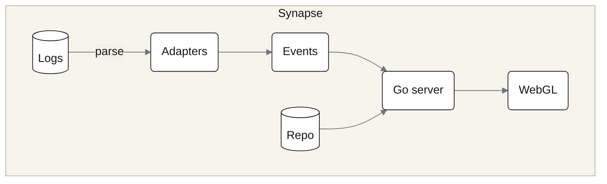
```mermaid
%%{init: {"theme": "base", "themeVariables": {"lineColor": "#6e7681", "edgeLabelBackground": "#f6f1e8", "textColor": "#15171A", "clusterBkg": "#F7F4EC", "clusterBorder": "#B9B5AA", "titleColor": "#15171A", "primaryColor": "#FFFFFF", "primaryBorderColor": "#15171A", "primaryTextColor": "#15171A"}}}%%
flowchart LR
    subgraph S["Synapse"]
    direction LR
    A[("Logs")] -->|parse| B("Adapters")
    B --> C("Events")
    C & D[("Repo")] --> E("Go server")
    E --> F("WebGL")
    end
    style S fill:#F7F4EC,stroke:#B9B5AA,color:#15171A
```

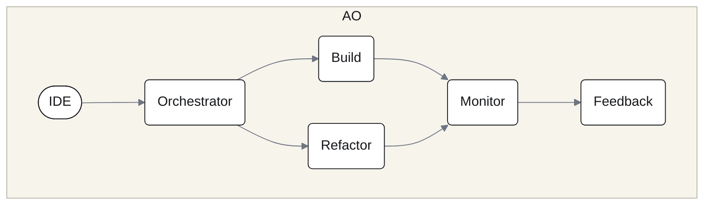
```mermaid
%%{init: {"theme": "base", "themeVariables": {"lineColor": "#6e7681", "edgeLabelBackground": "#f6f1e8", "textColor": "#15171A", "clusterBkg": "#F7F4EC", "clusterBorder": "#B9B5AA", "titleColor": "#15171A", "primaryColor": "#FFFFFF", "primaryBorderColor": "#15171A", "primaryTextColor": "#15171A"}}}%%
flowchart LR
    subgraph A["AO"]
    direction LR
    H(["IDE"]) --> O("Orchestrator")
    O --> S1("Build") & S2("Refactor")
    S1 & S2 --> C("Monitor")
    C --> F("Feedback")
    end
    style A fill:#F7F4EC,stroke:#B9B5AA,color:#15171A
```

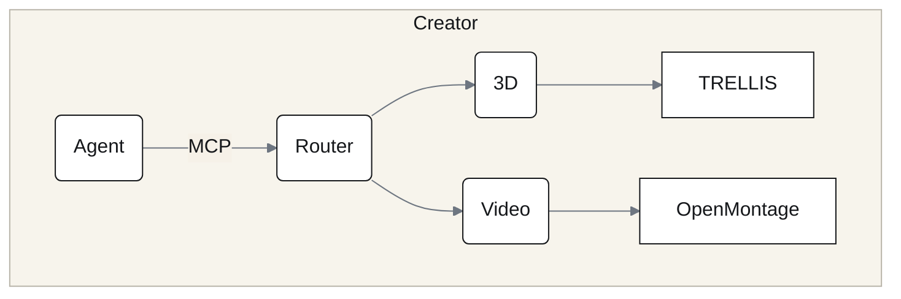
```mermaid
%%{init: {"theme": "base", "themeVariables": {"lineColor": "#6e7681", "edgeLabelBackground": "#f6f1e8", "textColor": "#15171A", "clusterBkg": "#F7F4EC", "clusterBorder": "#B9B5AA", "titleColor": "#15171A", "primaryColor": "#FFFFFF", "primaryBorderColor": "#15171A", "primaryTextColor": "#15171A"}}}%%
flowchart LR
    subgraph C["Creator"]
    direction LR
    A("Agent") -->|MCP| R("Router")
    R --> D("3D") & V("Video")
    D --> T["TRELLIS"]
    V --> O["OpenMontage"]
    end
    style C fill:#F7F4EC,stroke:#B9B5AA,color:#15171A
```

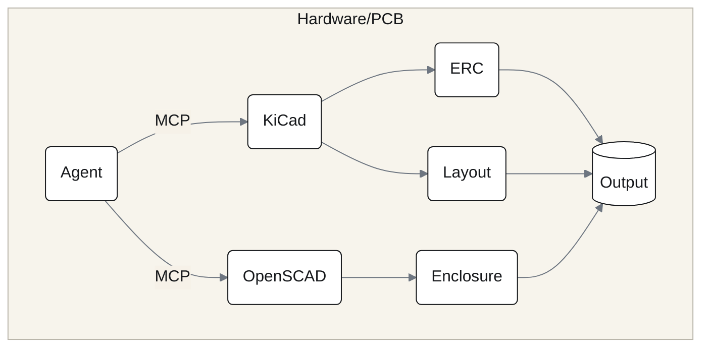
```mermaid
%%{init: {"theme": "base", "themeVariables": {"lineColor": "#6e7681", "edgeLabelBackground": "#f6f1e8", "textColor": "#15171A", "clusterBkg": "#F7F4EC", "clusterBorder": "#B9B5AA", "titleColor": "#15171A", "primaryColor": "#FFFFFF", "primaryBorderColor": "#15171A", "primaryTextColor": "#15171A"}}}%%
flowchart LR
    subgraph P["Hardware/PCB"]
    direction LR
    A("Agent") -->|MCP| K("KiCad") & O("OpenSCAD")
    K --> E("ERC") & L("Layout")
    O --> EN("Enclosure")
    E & L & EN --> F[("Output")]
    end
    style P fill:#F7F4EC,stroke:#B9B5AA,color:#15171A
```

</details>

### Heimdall Token Saver: CLI-Output-Kompression

`@hybridlabor-api/heimdall-token-saver`: komprimiert wiederkehrenden CLI-Output über Ambient-Hooks auf jedem Harness. Senkt den Token-Overhead auf großen Projekten. Skill: `token-saver-config`.

### Token-Optimierung auf einen Blick

| Hebel | Wie |
|---|---|
| Minimal-Profil | `--profile=minimal` überspringt Context-Injection-Hooks und optionale Module. |
| Keine Context-Hooks | `--no-hooks` behält die Gates und lässt memB-, Rules- und Trail-Injection weg. |
| Heimdall Token Saver | Komprimiert wiederkehrenden CLI-Output über Hooks. |
| Kein gepinntes Modell | Agents erben das Session-Modell; Overrides pro Rolle liegen in `~/.aos/pipeline.json` ([docs/agent-models.md](docs/agent-models.md)). |
| Token-Wetter | Das Fleet Band zeigt, wie voll der Context ist und wann ein Compact nötig ist. |

---

## Aktualisieren

**Update.** Denselben Befehl erneut ausführen. Der Installer sieht die installierte Version, bietet **Quick Update** an und aktualisiert Skills, Hooks, Templates und Module:

```bash
npx -y @hybridlabor-api/aos@latest
```

**Kein `aos update`-Subcommand.** Falls du einmal `npm i -g @hybridlabor-api/aos` ausgeführt hast, läuft ein nacktes `aos` auf deinem PATH gegen diese eingefrorene Kopie samt ihrer Version, nicht gegen die neueste; entweder sie aktualisieren (`npm i -g @hybridlabor-api/aos@latest`) oder entfernen und bei `npx` bleiben. Der Installer druckt den Update-Befehl selbst aus, wann immer eine neuere Version existiert; der `bdb-updater`-Skill wickelt denselben Check für die Nutzung aus einer Session.

---

## Deinstallation

```bash
aos-uninstall              # entfernt, was AOS installiert hat; Memory, Wikis und Credentials bleiben
aos-uninstall --purge      # entfernt zusätzlich ~/.MemBDB, ~/.openwiki, ~/.synapse, ~/.memb
aos-uninstall --dry-run    # alles listen, nichts löschen
```

**Wie es funktioniert.** Der Uninstaller arbeitet vom Install-Manifest: eine Datei, die noch dem von AOS geschriebenen Hash entspricht, wird entfernt; eine Datei, die du bearbeitet hast, wird stattdessen gesichert; eine Datei, die AOS nie geschrieben hat, wird nicht angefasst. Dieselbe Aktion steht im Installer-Menü. `aos-uninstall --restore-plugin-backup` stellt die losen Skill-Kopien wieder her, die der Installer beim Registrieren des Plugins entfernt hat; siehe [docs/plugin-migration.md](docs/plugin-migration.md). Die Deinstallation verschiebt deine gespeicherten Installationsoptionen nach `~/.aos/v5-settings.json.removed-<timestamp>`, statt sie zu löschen.

---

## FAQ

**Brauche ich alle neun Harnesses?** Nein. Der Installer schreibt nur in Harnesses, die er erkennt.

**Überschreibt er meine MCP-Konfiguration?** Nein. Bestehende Einträge bleiben, AOS merged seine eigenen dazu. `AOS_DISABLED_MCPS` hält ausgewählte Server draußen.

**Kann ich mit minimal Context installieren?** Ja: `--profile=minimal` oder `--no-hooks`. Das Gate und die Safety-Hooks bleiben so oder so.

**Funktioniert das GO-Gate auf jedem Harness?** Als echter Hook auf Claude Code, Antigravity, Codex und dem OpenCode-Plugin. Auf Cursor, Windsurf, Roo / Cline und Aider gilt nur die Regel in `AGENTS.md`.

**Kann ein Agent seinen eigenen Push freigeben?** Nicht durch das Gate: Nur dein selbst getipptes GO zählt — keine Agent-Nachricht, kein Subagent-Relay, keine A2A-Nachricht.

**Funktioniert AOS ohne AO, memB oder OpenWiki?** Ja. Alle sind optionale Module.

**Etwas ist kaputt.** Führe `aos doctor` aus. Es nennt, was fehlt, und beendet sich mit 1.

---

## Mitwirken

- [AGENTS.md](AGENTS.md) ist die einzige Quelle der Regeln für jeden Harness: der Skill-Contract, das Kategorie-Routing, das Release-Gate, Conventional Commits.
- Ein Skill ist ein Verzeichnis mit `SKILL.md`; das Frontmatter braucht `name` (gleich dem Verzeichnis), `description` und `category`. `npm run validate` erzwingt den Contract, ebenso CI bei jedem Push.
- `npm test` führt den Validator-Selftest, den Plugin-Manifest-Check und die Installer-, Store-, Doctor- und Cross-Harness-Hook-Tests aus.
- `.claude-plugin/plugin.json` und `marketplace.json` werden von `npm run plugin:build` generiert und von `npm run plugin:check` geprüft. Sie existieren heute; der Claude-Code-Marketplace-Installationsweg wird noch finalisiert, also bleibt der Installer oben der unterstützte Weg.
- Releases werden von release-please aus Conventional Commits geschnitten; `package.json` nicht von Hand bumpen. `feat:` bedeutet einen Minor-Bump.
- Skills, die aus anderen Projekten abgeleitet sind, vermerken `source:` im Frontmatter und einen Eintrag in [THIRD_PARTY_NOTICES.md](THIRD_PARTY_NOTICES.md).

Einen Bug gefunden oder willst du einen Skill hinzugefügt haben? [Ein Issue öffnen](https://github.com/hybridlabor-api/aos/issues).

---

## Links

- Package: [npmjs.com/package/@hybridlabor-api/aos](https://www.npmjs.com/package/@hybridlabor-api/aos)
- Source und Issues: [github.com/hybridlabor-api/aos](https://github.com/hybridlabor-api/aos) · [Issues](https://github.com/hybridlabor-api/aos/issues)
- [CHANGELOG.md](CHANGELOG.md) · [docs/skills_table.md](docs/skills_table.md)
- Schwester-Repos: [bdb-agent-orchestrator](https://github.com/hybridlabor-api/bdb-agent-orchestrator) · [bdb-synapse](https://github.com/hybridlabor-api/bdb-synapse) · [bdb-dev-creator-extension](https://github.com/hybridlabor-api/bdb-dev-creator-extension) · [bdb-hardware-pcb](https://github.com/hybridlabor-api/bdb-hardware-pcb) · [bdb-os-remote](https://github.com/hybridlabor-api/bdb-os-remote)

Lizenz: [Apache-2.0](LICENSE).
