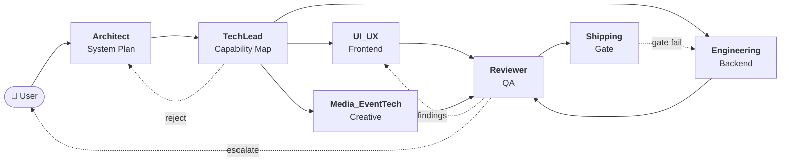
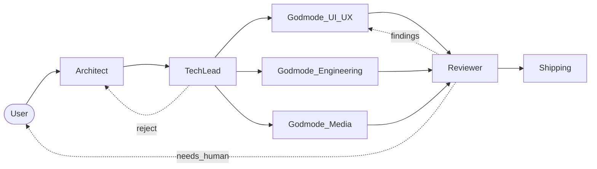
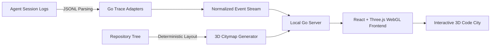
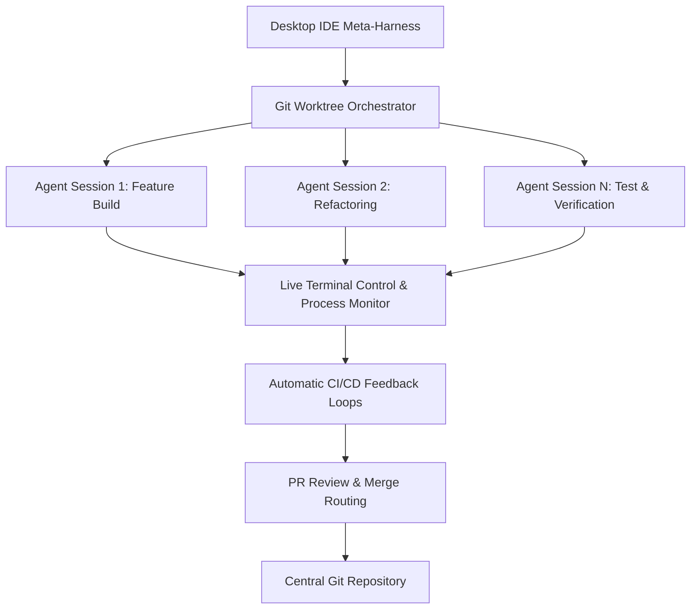
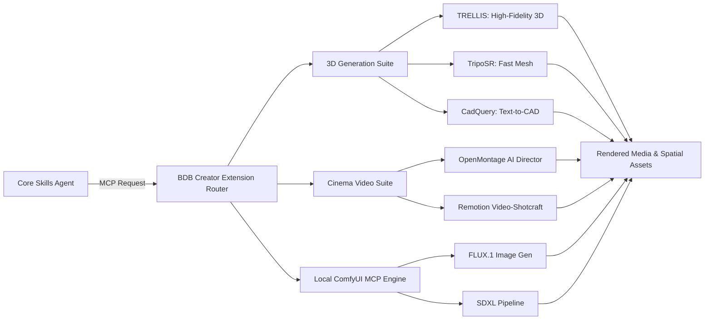
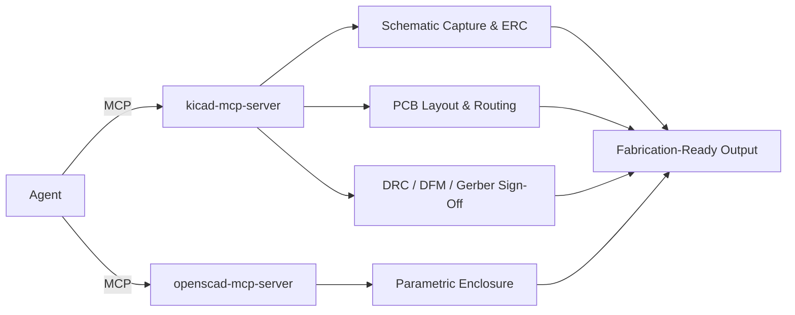

🌐 **Language / Sprache / Idioma**: [ 🇬🇧 English ](README.md) | **Deutsch** | [ 🇵🇹 Português ](README.pt.md)

# AOS — BDB Agent OS

[](https://www.npmjs.com/package/@hybridlabor-api/aos)
[](https://www.npmjs.com/package/@hybridlabor-api/aos)
[](https://github.com/hybridlabor-api/aos/stargazers)
[](https://github.com/hybridlabor-api/aos/commits/main)
[](https://github.com/hybridlabor-api/aos/actions)
[](LICENSE)
[](package.json)
[](#skills)
[](#mcp-server)
[](#unterstützte-harnesses)
[](https://github.com/NVIDIA/SkillSpector)
[](https://skills.sh/hybridlabor-api/aos)

AOS installiert eine kuratierte Skill-Bibliothek, ein Subagent-Verzeichnis, Gate-Hooks und eine ausführbare Multi-Agent-Build-Pipeline in jeden auf deinem Rechner installierten Coding-Agent-Harness.

```bash
npx -y @hybridlabor-api/aos@latest
```

Entwickelt für Nutzer, die bereits **Claude Code, Google Antigravity, Codex CLI, OpenCode, Cursor, Windsurf, Roo Code / Cline oder Aider** verwenden und möchten, dass alle gleich funktionieren.

Nach der Installation hast du:

- **<!-- count:skills -->223<!-- /count --> Skills** in sechs Kategorien, von jedem Harness als `<name>/SKILL.md` auffindbar.
- **<!-- count:agents -->13<!-- /count --> Subagents** (Architect, TechLead, Reviewer, die Godmodes, Security- und Silent-Failure-Reviewer) als natives Agenten-Format jedes Harness kompiliert.
- **<!-- count:mcps -->21<!-- /count --> MCP-Server** für Creative Software, Betriebssystemsteuerung, Memory und Harness-übergreifende Delegation.
- **Drei Pipelines** — `/startcycle`, `/startcycle-graph`, `/startcycle-graph-user` — und ein **GO-Gate**, das `git push`, `npm publish`, `npm version` und rekursive `rm` mechanisch blockiert.
- **Tools:** Plan Canvas, agenttrail, archify, der AOS Store, das Launchpad Dashboard und `aos doctor`.

---

## Der Dispatcher-Graph

Der Graph ist Harness-neutral und läuft auf Claude Codes Dynamic Workflows, Antigravitys paralleler Ausführung und jedem kompatiblen Agent Harness.


```mermaid
flowchart LR
    U(["👤 User"])
    A["<b>Architect</b><br/><span>System Plan</span>"]
    T["<b>TechLead</b><br/><span>Capability Map</span>"]
    UX["<b>UI_UX</b><br/><span>Frontend</span>"]
    EN["<b>Engineering</b><br/><span>Backend</span>"]
    ME["<b>Media_EventTech</b><br/><span>Creative</span>"]
    R["<b>Reviewer</b><br/><span>QA</span>"]
    S["<b>Shipping</b><br/><span>Gate</span>"]

    U --> A --> T
    T --> UX & EN & ME
    UX & EN & ME --> R
    R --> S

    T -.->|reject| A
    R -.->|findings| UX
    S -.->|gate fail| EN
    R -.->|escalate| U
```

---

## Installation

Anforderungen: Node.js >= 20. macOS, Linux und Windows (PowerShell).

```bash
npx -y @hybridlabor-api/aos@latest
```

**Erste Ausführung.** Das Installationsprogramm erkennt, welche Harnesses vorhanden sind, fragt, welche Ziele und welche Tier (Pro MEDIA oder Basic) gewünscht sind, kopiert die Skills in das Skill-Verzeichnis jedes Harness, kompiliert die Subagents, verbindet die Hooks, fügt die MCP-Konfiguration in die eigene Konfigurationsdatei jedes Harness ein (vorhandene Einträge bleiben erhalten) und bietet die unten aufgeführten optionalen Module an.

**Bei jeder späteren Ausführung** öffnet sich stattdessen ein Menü:

| Menüpunkt | Was es tut |
|---|---|
| Quick Update | Aktualisiert Skills, Templates, Hooks und installierte Module auf die gerade ausgeführte Version |
| Run System Checkup / Doctor | Führt `aos doctor` aus: Abhängigkeiten, Dateiplatzierung, Daemons, Hooks |
| Drop Local Project Harness | Kopiert den Dispatcher-Vertrag ins aktuelle Verzeichnis (siehe unten) |
| Reconfigure System | Ändere Ziele, Tier oder Optionen |
| Uninstall AOS | Entfernt, was das Installationsprogramm platziert hat; deine Daten bleiben |

### Nicht-interaktiv

```bash
npx -y @hybridlabor-api/aos@latest -y --platforms=2          # Claude only, all defaults
npx -y @hybridlabor-api/aos@latest -y --platforms=1,5 --mcps=none
npx -y @hybridlabor-api/aos@latest --dry-run                 # print what would change
```

`--platforms=` Werte: `0` universal (alle erkannt), `1` Antigravity, `2` Claude Desktop / Claude Code, `3` Cursor, `5` Codex CLI, `6` Windsurf, `7` Roo Code / Cline, `8` Aider, `10` AOS CLI. `4` (benutzerdefinierte Pfade) benötigt das interaktive Menü. `--mcps=<name,name>|all|none` wählt die MCP-Teilmenge. `--verbose` und `--no-intro` tun, was sie sagen.

### Lokales Projekt-Harness

Statt in `$HOME` zu installieren, platziere nur den Dispatcher-Vertrag (`.agents/`, die Gate-Hooks, die Agent-Definitionen, den `/startcycle-graph` Workflow, das OpenCode Plugin) in ein Repository:

```bash
cd your-project && npx -y @hybridlabor-api/aos@latest --project-harness -y
```

---

## Unterstützte Harnesses

Was das Installationsprogramm für jedes Ziel schreibt. Pfade sind die Standardwerte; das Installationsprogramm schreibt nur in Harnesses, die tatsächlich erkannt werden.

| Harness | Skills | Subagents | Hooks | Plugin / rules |
|---|---|---|---|---|
| Claude Code / Claude Desktop | `~/.claude/skills` | `~/.claude/agents` | `~/.claude/hooks` + `settings.json` (GO gate, graph gate, env-file protection, Conventional Commits, memB inject, trail relay) | `.claude-plugin/` manifest ships in the repo (see Contributing) |
| Google Antigravity | `~/.gemini/config/skills` | `~/.gemini/config/agents` | `~/.gemini/config/hooks.json` and `~/.gemini/antigravity-cli/hooks.json` | — |
| Codex CLI | `~/.codex/skills` | `~/.codex/agents` | `~/.codex/hooks` + `config.toml` | `.codex-plugin/` |
| OpenCode | `~/.config/opencode/skills` | `~/.opencode/agents` | via plugin | `bdb-aos.js` plugin + `/startcycle-graph` command, registered in `opencode.jsonc`; keeps a `/startcycle-graph` run moving on `session.idle` |
| Cursor | `~/.cursor/skills` | — | — | `.cursor/rules` (project) |
| Windsurf | `~/.windsurf/bdb-skills` | — | — | `mcp.json` |
| Roo Code / Cline | `~/.roo/skills` | — | — | `.roomodes` (project) |
| Aider | `~/.aider/bdb-skills` | — | — | — |
| AOS CLI (`pi`) | reads `~/.agents/skills` | `~/.agents/AGENTS.md` as system prompt | — | no MCP; separate install, Node >= 22.19 — see [packages/aos-cli](packages/aos-cli/README.md) |

Jede Installation schreibt auch die universelle Kopie zu `~/.agents/skills`, die von AOS CLI und der `skills` CLI gelesen wird.

---

## Die Pipelines

Der Vertrag lebt in [`.agents/graph.md`](.agents/graph.md), das Knoten-Register in [`.agents/nodes.json`](.agents/nodes.json), der ausführbare Dispatcher in [`.claude/workflows/startcycle-dispatch.mjs`](.claude/workflows/startcycle-dispatch.mjs).

**Eine Regel: Knoten rufen sich gegenseitig nie auf.** Ein Dispatcher liest `production_artifacts/state.json` nach jeder Knotenrückkehr und entscheidet, was als nächstes ausgeführt wird. Es gibt keine Hand-off-Kette und keinen Agent, der einen anderen Agent auffordert zu gehen. Dieses Design gewährleistet Kontext-Treue, zentrale Nachverfolgbarkeit der Routing-Logik und Portabilität über Harnesses.

Jeder Knoten liest den Plan und seinen eigenen früheren Zustand, führt seine Arbeit aus, schreibt sein Artefakt und State-Fragmente und gibt zurück. Der Dispatcher verschmilzt Pro-Knoten-State-Fragmente (`state.d/<node>.json`), wertet Kanten-Prädikate aus und leitet zum nächsten Knoten weiter — oder eskaliert zum Benutzer, wenn ein No-Progress-Guard auslöst (gleicher blockierender Finding im zweiten Reparaturzyklus) oder die Iterations-Decke erreicht wird.


```mermaid
flowchart LR
    U(["User"]) --> A["Architect"] --> T["TechLead"]
    T --> UX["Godmode_UI_UX"] & EN["Godmode_Engineering"] & ME["Godmode_Media"]
    UX & EN & ME --> R["Reviewer"] --> S["Shipping"]
    T -.->|reject| A
    R -.->|findings| UX
    R -.->|needs_human| U
```

| Befehl | Maschinerie | Nutze wenn |
|---|---|---|
| `/startcycle` | Lineare Kette, Datei-Übergaben in `production_artifacts/`. Keine State Machine, keine Reparatur-Schleife. `/startcycle --skill=<name> <goal>` zwingt einen Skill in jeden Knoten. | Ein einfacher Build mit dem Agent-Verzeichnis, aber ohne die Zeremonie. |
| `/startcycle-graph` | Der vollständige Graph: dauerhaftes `state.json`, Reviewer-Reparaturschleife, automatisierte Quality-Gate, menschliche Eskalation. | Feature-Work, bei dem Korrektheit wichtiger ist als Geschwindigkeit und du eine Audit-Spur möchtest. |
| `/startcycle-graph-user` | Verwerfbare 2–4 Knoten-Ausfächerung. Nichts dauerhaft. Modell-gestaffelt pro Rolle; verwendet Antigravity, OpenCode oder Codex, falls installiert, sonst Claude Code Subagents. | Ein einmaliger "spawne ein paar Worker" in jedem Projekt. |

Was den vollständigen Graph ehrlich hält:

| Mechanismus | Was es verhindert |
|---|---|
| Reviewer isolation | Der Reviewer liest Artefakte und den Plan-Vertrag, nie die Begründung des Build-Knotens oder dessen Behauptung, fertig zu sein. |
| No-progress guard | Eine Reparaturzyklus, der die gleiche blockierende Finding-ID wie der vorherige meldet, eskaliert zu einem Menschen statt Iterationen zu verschwenden. |
| Per-node state fragments | Parallele Build-Knoten schreiben `state.d/<node>.json`; der Dispatcher führt zusammen. Kein Lost-Update Race auf einer Datei. |
| Iteration ceiling | `max_iterations` (Standard 3) stoppt die Schleife bedingungslos. |
| In-loop human edge | Jeder Knoten kann `needs_human: true` setzen und den Lauf stoppen. |

## Das GO-Gate

Das Erreichen von `ready_to_ship` ist kein Versand. [`.claude/hooks/go-gate.mjs`](.claude/hooks/go-gate.mjs) ist ein `PreToolUse` Hook, der `git push`, `npm publish`, `npm version` und rekursive `rm` blockiert, wenn deine unmittelbar vorherige Nachricht nicht das Wort **GO** ist. Es ist ein Hook, nicht eine Regel, die ein Agent respektieren soll: es wird vor jeder Berechtigungs-Modus-Prüfung ausgelöst und kann nicht diskutiert werden. Der Installer verbindet das gleiche Gate in Antigravity, Codex und OpenCode; auf Harnesses ohne Hook-Unterstützung gilt die Regel in [AGENTS.md](AGENTS.md) und der Agent ist die Durchsetzung. Ein Subagent erbt niemals das GO des Orchestrators, und ein fehlgeschlagener Release-Befehl benötigt einen neuen.

---

## Tools


*Konzeptübersicht aus v3.4.0. Die Komponenten sind seitdem gewachsen; die folgenden Abschnitte sind aktuell.*

| Tool | Befehl | Was es tut |
|---|---|---|
| Plan Canvas | `aos-plan-canvas open <file>` (skill `plan-canvas`) | Öffnet einen Plan oder HTML-Artefakt in einer lokalen Browser-Canvas, wo du Elemente annotierst, chattest und Änderungen genehmigst oder anforderst. Pläne aus den Pipelines öffnen sich hier standardmäßig. |
| agenttrail | `aos-trail` (skill `agenttrail`, port 5330) | Live-Board einer Multi-Agent-Build: welche Komponente, welcher Agent oder Harness, was ist fertig, was ist stecken geblieben. Gespeist von den Trail-Relay-Hooks und von `mcsc`. |
| archify | `aos-archify` (skill `archify`) | Validierte Architektur-, Sequenz-, Datenfluss- und State-Diagramme als eigenständige HTML mit SVG-Export; akzeptiert Mermaid. |
| AOS Store | `aos store list \| search <q> \| install <name> [--project]`, `aos store ui` (auch `aos-store`, slash command `/aos-store`) | Durchsuche und installiere Skills und Agents aus AOS Core, ECC und Scenario (scenario-labs/skills, MIT); benötigte Skills werden mitinstalliert, jede Datei wird per SHA-256 geprüft. Die Web-UI auf `http://127.0.0.1:4322` zeigt, was installiert ist, zeigt die genauen Zielpfade in der Vorschau an und installiert nur nach deiner Bestätigung. Multi-Datei-Skills werden komplett installiert. `list` und `search` lesen einen angehefteten Offline-Index. |
| Launchpad | `aos-dashboard [--port 7900] [--no-open]` | Eine Seite mit jedem lokalen BDB-Service (memB, Synapse, OpenWiki, AO, Remote, AOS Store): Status, Start/Stop, Logs. Registriert als Autostart-Eintrag. |
| Doctor | `aos doctor [--json] [--net]` (auch `aos-doctor`) | Überprüft Abhängigkeiten, Skill-Platzierung pro Harness, Daemons, Hooks und Module; beendet sich mit 1, wenn etwas Aufmerksamkeit benötigt. Das erste, das zu laufen ist, wenn etwas nicht funktioniert. |
| Config | `aos-config show \| propose \| set <key> <value>` | Maschinenebene `~/.agents/aos-config.json`: Workspace-Root, Domänen, Benutzer-ID. |
| mcsc | MCP tools `delegate_agy`, `delegate_opencode`, `delegate_codex`, `delegate_smart` (skill `mcsc`) | Delegiert eine Aufgabe an einen anderen installierten CLI-Harness und streamt seine Tool-Aufrufe zu agenttrail. Bevorzugt gegenüber dem Aufruf der CLI. |

---

## AOS CLI

Ein leichtes CLI-Harness, das auf [pi](https://github.com/earendil-works/pi) aufgebaut ist, ein Coding-Agent, der im Terminal läuft. AOS CLI liest `~/.agents/skills` (vom Installationsprogramm geschrieben) und `~/.agents/AGENTS.md` (der Dispatcher-Graph als Systeminstruktion), führt keine eigenen MCP-Server aus und benötigt **Node >= 22.19** (pi's Basis, höher als der Haupt-AOS-Installer).

```bash
aos-cli "what is the fastest way to fix this bug"
aos-cli --continue                    # resume the previous session
```

Der CLI-Launcher (`packages/aos-cli/bin/aos-cli.mjs`) bringt ein dunkles AOS-Theme (`aos.json`), die zehn Kern-Skills aus `core-skills.json` (ask-tim, aos-setup, systematic-debugging, archify, etc.) und zwei In-Session-Nur-Lese-Befehlen (`/aos` zeigt das Install-Menü; `/aos-status` führt die Health-Überprüfung aus).

Installiere es durch den AOS Installer mit dem AOS CLI Target: `npx -y @hybridlabor-api/aos@latest -y --platforms=10`. Das Paket ist privat und wird nicht auf npm veröffentlicht, daher funktioniert `npm i -g @hybridlabor-api/aos-cli` nicht.


---

## Plugins und Marketplace

**Plugin-Manifest:** `.claude-plugin/plugin.json` + `marketplace.json` (erzeugt mit `npm run plugin:build`). Der Installationsweg über den Claude-Marketplace wird noch finalisiert; bis dahin ist der oben beschriebene npm-Installer der unterstützte Weg.

**Skills discovery:** Jeder Harness findet Skills in seinem nativen Verzeichnis (`~/.claude/skills`, `~/.agents/skills`, `~/.codex/skills`, `~/.roo/skills`, etc.). Um nach der Installation weitere Skills zu durchsuchen und zu installieren:

```bash
npx skills add hybridlabor-api/aos
```

Dies entdeckt alle <!-- count:skills -->223<!-- /count --> kuratierten Skills und installiert sie in das universelle `~/.agents/skills` Verzeichnis (verwendet von allen Harnesses und dem AOS CLI).

---

## Speicher und Wissen

Installiert als optionale Module durch das Installationsprogramm; `aos doctor` überprüft sie und das Launchpad zeigt sie.

- **memB** (`@hybridlabor-api/memb`) — lokal, offline Vektor-Memory mit einem MCP-Server (`add_memory`, `search_memory`, `list_memories`, `delete_memory`), WebUI auf Port 8088 und ein Ambient-Hook, der relevante Memories in Claude Code Sessions einfügt. Skills: `memb-skill`, `memb-ingest`, `bdb-memb-mcp`.
- **deja** (`@vshulcz/deja-vu`, mit memB installiert) — indiziert deine Agent-Transkripte lokal mit bereinigten Geheimnissen; `deja fix` bei einem Fehler, `deja wip` beim Fortsetzen, `deja search` für vergangene Sessions. Skill: `deja-memory`.
- **OpenWiki** (`openwiki` CLI) — erzeugt und aktualisiert ein fundiertes Wiki eines Codebase mit Visualizer auf Port 4321 und einem Background-Daemon. Skill: `openwiki-skill`; das eigene Wiki dieses Repos ist unter [`.openwiki/`](.openwiki/quickstart.md).
- **Synapse** (`@hybridlabor-api/bdb-synapse`) — rendert ein Repository als 3D-Code-Stadt und spielt Agent-Sessions darin ab. Skill: `synapse-integration-skill`.

`aos-setup` bringt einen Rechner in einen geprüften Zustand für alle vier; `aos-project-init` bindet ein Projekt an sie (slug, wiki, memory, `AGENTS.md`).

---

## Was enthalten ist

### Die <!-- count:agents -->13<!-- /count --> Subagents

Der Dispatcher-Graph kompiliert diese Agents, verfügbar als Claude Code Subagents und ladbar in Antigravity, Cursor, Codex, OpenCode und andere:

| Agent | Zweck |
|---|---|
| **Architect** | Wandelt das Ziel des Benutzers in einen Systemplan um. Liest vorhandene Architektur, bevor Änderungen vorgeschlagen werden. |
| **TechLead** | Überprüft den Plan auf eine Fähigkeitskarte (Modulgrenzen, Abhängigkeitsrichtung, Build-Reihenfolge), bevor ein Build-Knoten startet. Genehmigt oder lehnt zurück zu Architect ab. |
| **UI_UX** | Lead Frontend Designer. Setzt Anti-Slop-Prinzipien durch, DTCG-Design-Tokens, hochwertigen Frontend-Geschmack und flüssige Motion-Dynamik. |
| **Engineering** | Senior Fullstack & Backend Engineer. Setzt Domain-Driven Design, Clean Architecture, TDD-Zyklen und Datenbankbest Practices durch. |
| **Media_EventTech** | Creative-Tech & Show-Control Spezialist. Beherrscht 3D-Modellierung, TouchDesigner-Netzwerke, DaVinci Resolve, Lighting und Resolume. |
| **Reviewer** | Adversarische Überprüfung der Build-Knoten-Ausgabe gegen den Plan-Vertrag. Modelliert nach Doubt-Driven-Development Disziplin. |
| **Shipping** | Release Gatekeeper & QA Auditor. Führt das automatisierte Quality Gate (Lint, Typecheck, Tests, a11y, seo) aus und setzt das GO Gate durch. |
| **Database Reviewer** | PostgreSQL Spezialist für Query Optimierung, Schema-Design, Sicherheit und Performance. |
| **Security Reviewer** | Sicherheitslücken-Erkennung und Remediation. Flaggt Geheimnisse, SSRF, Injection, unsicheres Crypto und OWASP Top 10. |
| **Silent-Failure Hunter** | Überprüft Code auf stille Ausfallmöglichkeiten, verschluckte Fehler, schlechte Fallbacks und fehlende Fehler-Propagation. |
| **Go-Build Resolver** | Löst Go Build-, Vet- und Compilierungsfehler mit minimalen Änderungen. |
| **Opensource Forker** | Forkt ein Projekt zum Open-Sourcing — entfernt Geheimnisse, ersetzt interne Referenzen, generiert `.env.example`. |
| **Opensource Sanitizer** | Verifiziert, dass ein Open-Source-Fork vollständig bereinigt ist. Scannt auf durchgesickerte Geheimnisse, PII, interne Referenzen. |

### Skills nach Kategorie

<!-- count:skills -->223<!-- /count --> kuratierte Skills, von jedem Harness auffindbar:

- **bdb-core** (30 Skills): Core AOS Infrastruktur, Pipelines, Tools und Utilities — `startcycle`, `startcycle-graph`, `startcycle-graph-user`, `agenttrail`, `plan-canvas`, `aos-doctor`, `aos-store`, `bdb-dev-os-skill` und mehr.
- **design-ui-ux** (19 Skills): Frontend, UI Design, Barrierefreiheit, Tokens, Motion, Anti-Slop — `senior-frontend`, `ui-component`, `ui-review`, `tailwind-patterns`, `shadcn`, `wcag-audit-patterns` und mehr.
- **engineering-method** (46 Skills): Architektur, Testing, Debugging, CI/CD, Code-Qualität — `software-architecture`, `test-driven-development`, `systematic-debugging`, `ci-pipeline`, `github-actions-generator`, `dockerfile-validator` und mehr.
- **library** (98 Skills): Language/Framework-Spezifika — TypeScript, Node.js, Python, React, Postgres, Prisma, Next.js, Drizzle ORM, Go und mehr.
- **media-eventtech** (19 Skills): 3D, Video, Show Control, Spatial Design — `godmode-eventtech`, `synapse-integration-skill`, `threejs-skills`, `blender-expert` und mehr.
- **engineering-hardware** (1 Skill): PCB und Electrical Design — `godmode-hardware-pcb`.

Der vollständige Katalog mit detaillierten Beschreibungen: [docs/skills_table.md](docs/skills_table.md) — Hinweis: Diese Datei ist veraltet und listet 163 von 213 Skills auf.

---

## Skills

<!-- count:skills -->223<!-- /count --> Skills, kuratiert aus Open-Source- und proprietären Sammlungen, die die gesamte Software-Entwicklung und Creative-Pipeline abdecken. Jeder Skill ist ein Verzeichnis mit einem `SKILL.md` Frontmatter, das `name`, `description` und eine `category` erklärt: `bdb-core`, `design-ui-ux`, `engineering-method`, `engineering-hardware`, `media-eventtech`, `library`.

**Persona Layer:** Die **Godmode** Skills sind spezialisierte Personas, die direkt den Build- und Shipping-Knoten des Dispatcher-Graphs zugeordnet sind:

| Godmode | Besitzt | Zugeordnet zu |
|---|---|---|
| `godmode-engineering` | Domain-Driven Design, Clean Architecture, striktes TypeScript/Python, systematisches Debugging, Datenbankbest Practices. | **Engineering** Knoten |
| `godmode-ui-ux` | Anti-Slop Frontend Prinzipien, DTCG Design Tokens, Motion Dynamik, Barrierefreiheit (WCAG), hochwertigen Geschmack. | **UI_UX** Knoten |
| `godmode-shipping` | Pre-Launch Checks, automatisierte Quality Gates, sichere Rollback-Prozeduren, Go-Gate Durchsetzung. | **Shipping** Knoten |
| `godmode-eventtech` | Show Control, Signalfluss, DMX Lighting, TouchDesigner Netzwerke, Resolume Media Server, Live-Event Hardware. | **Media_EventTech** Knoten |
| `godmode-3d-creation` | MCP-first 3D Generierung, Mesh Rekonstruktion, parametrisches CAD, räumliche Modellierung. | Optionaler Spezialist |
| `godmode-media-creation` | Video Produktion, Timeline Assembly, Motion Design Pipelines, OpenMontage, Remotion. | Optionaler Spezialist |
| `godmode-hardware-pcb` | Elektrische Schemata, PCB Layout und Routing, KiCad ERC/DRC/DFM Gate, Gehäuse Co-Design, OpenSCAD. | Optionaler Spezialist |

**Einstiegspunkte & Navigation:**
- **`ask-tim`** — Skill Empfehlung nach Beschreibung
- **`bdbrainstorm`** und **`bdbmediastorm`** — Multi-Agent Ideation Sessions, die in einem ausführbaren Plan enden
- **`teamwork-preview`** — Prompt Crafting, Rollen-Delegation, Collaboration Setup
- **Grilling Familie** — `grill-me` (allgemeine Überprüfung), `grill-with-docs` (dokumentations-fundiert), `triage` (Priorisierung)
- **CI/CD & Generators** — `ci-pipeline`, `github-actions-generator`, `dockerfile-generator`, `makefile-generator`
- **Code Qualität** — `bdb-security-audit`, `systematic-debugging`, `silent-failure-hunter`, `bdbresilience`
- **Framework Spezialisten** — Vollständige Abdeckung von TypeScript, React, Next.js, Drizzle ORM, Prisma, Python, Go und mehr

Der vollständige Katalog mit Beschreibungen und Details: [docs/skills_table.md](docs/skills_table.md) (Hinweis: listet derzeit 163 von 213).

Die Bibliothek ist auch durch die `skills` CLI lesbar:

```bash
npx skills add hybridlabor-api/aos
```

---

## MCP-Server

[`mcp_config.json`](mcp_config.json) definiert <!-- count:mcps -->21<!-- /count --> Server, vom Installer aus `mcps/` gebaut oder gewärmt und in jedes Harness MCP-Konfiguration zusammengeführt. Jeder Server stellt Tools für eine spezifische Domäne bereit; jeder Harness sieht den gleichen Satz, wodurch per-Tool Inkompatibilität vermieden wird.

**Creative Software Integrationen** (Primär- und Fallback-Paare für Redundanz):
- **Unreal Engine** — `bdb_unreal_mcp` (Web Remote Control API auf Port 30010), Skill: `bdb-unreal-mcp`
- **Rhino 3D & Grasshopper** — `bdb_rhino_mcp` (McNeel's Yak Router) + `bdb_rhino_mcp_fallback` (GOLEM 3D, 105 Tools), Skill: `bdb-rhino-mcp`
- **DaVinci Resolve** — `bdb_davinci_mcp` (Workspace Scripts, 162 Tools) + `bdb_davinci_mcp_studio` (Node.js für Studio) + `bdb_davinci_mcp_fallback`, Skill: `bdb-davinci-mcp`
- **Blender** — `bdb_blender_mcp` (Socket Integration) + `bdb_blender_mcp_fallback`, Skill: `bdb-blender-mcp`
- **After Effects** — `bdb_after_effects_mcp` + `bdb_after_effects_mcp_fallback`, Skill: `bdb-after-effects-mcp`
- **TouchDesigner** — `bdb_touchdesigner_mcp` (MindDesigner Bridge auf Port 9980) + `bdb_touchdesigner_mcp_fallback`, Skill: `bdb-touchdesigner-mcp`
- **Zusätzliche:** grandMA3 (OSC/UDP auf Port 8000), Resolume (REST API auf Port 8080), Vectorworks (semantisches RAG auf Port 8765), Adobe UXP Bridge, Open Design

**OS Steuerung & System Automation:**
- **macOS/Linux** — `zavora_computer_use` (`npx -y @zavora-ai/computer-use-mcp@7.4.0`, natives Rust-Modul im npm-Paket), Skill: `bdb-computer-use-mcp`
- **Windows** — `bdb_windows_computer_use` (Win32 / COM / UIAutomation, lokales OCR mit Tesseract)

**Memory, Delegation & Infrastruktur:**
- **memB** — `memb_mcp` (lokales offline Vektor Memory, SQLite + ONNX Model)
- **deja** — lokale Transkript-Indexierung (Geheimnisse bereinigt)
- **mcsc** — Multi-Harness Task Delegation
- **GitHub** — native MCP Tools für Issues, PRs, Workflows
- **Chrome DevTools** — Browser Automation & Debugging
- **RemoteOS** — Multi-Cloud Execution Gateway mit 4-Augen-Genehmigungssystem

---

## Optionale Module

Das Installationsprogramm bietet sie zur Auswahl an, und Quick Update hält sie aktuell. Alle sind optional; AOS funktioniert standalone ohne eines von ihnen.

### memB — Lokaler Vektor-Speicher

`@hybridlabor-api/memb`: offline, lokales Vektor-Memory mit einem MCP-Server, WebUI auf Port 8088 und ein Ambient-Hook, der relevante Memories in Claude Code Sessions einfügt. Skill: `memb-skill`, `memb-ingest`, `bdb-memb-mcp`.

### deja — Transkript-Indexierung

`@vshulcz/deja-vu`: indiziert deine Agent-Transkripte lokal (Geheimnisse bereinigt), mit `deja fix` bei einem Fehler, `deja wip` zum Fortsetzen, `deja search` für vergangene Sessions. Mit memB installiert. Skill: `deja-memory`.

### OpenWiki — Lebende Dokumentation

`openwiki` CLI: erzeugt und aktualisiert ein fundiertes Wiki eines Codebase mit Visualizer auf Port 4321 und einem Background-Daemon. Skill: `openwiki-skill`. Dieses Repos Wiki: [.openwiki/](.openwiki/quickstart.md).

### Synapse — 3D-Code-Stadt

`@hybridlabor-api/bdb-synapse`: rendert ein Repository als 3D-Code-Stadt und spielt Agent-Sessions als Lichtspuren ab. Skill: `synapse-integration-skill`.


```mermaid
flowchart LR
    A[Agent Session Logs] -->|JSONL Parsing| B[Go Trace Adapters]
    B --> C[Normalized Event Stream]
    D[Repository Tree] -->|Deterministic Layout| E[3D Citymap Generator]
    C & E --> F[Local Go Server]
    F --> G[React + Three.js WebGL Frontend]
    G --> H[Interactive 3D Code City]
```

### AO — Agent-Orchestrator

`@hybridlabor-api/bdb-agent-orchestrator`: parallele Agents in Git Worktrees mit Live Terminal Steuerung und automatisierten CI/CD Feedback Loops. Skill: `ao-orchestrator`.


```mermaid
flowchart TD
    A[Desktop IDE Meta-Harness] --> B[Git Worktree Orchestrator]
    B --> C[Agent Session 1: Feature Build]
    B --> D[Agent Session 2: Refactoring]
    B --> E[Agent Session N: Test & Verification]
    C --> F[Live Terminal Control & Process Monitor]
    D --> F
    E --> F
    F --> G[Automatic CI/CD Feedback Loops]
    G --> H[PR Review & Merge Routing]
    H --> I[Central Git Repository]
```

### Creator-Erweiterung — Medien & 3D

`@hybridlabor-api/bdb-dev-creator-extension`: ComfyUI MCP Fähigkeiten (FLUX, SDXL), Image-to-3D (TripoSR, TRELLIS) und automatisierte Video Production (OpenMontage, Remotion). Skill: `bdb-dev-creator-extension`.


```mermaid
flowchart LR
    A[Core Skills Agent] -->|MCP Request| B[BDB Creator Extension Router]
    B --> C[3D Generation Suite]
    B --> D[Cinema Video Suite]
    B --> E[Local ComfyUI MCP Engine]
    C --> C1[TRELLIS: High-Fidelity 3D]
    C --> C2[TripoSR: Fast Mesh]
    C --> C3[CadQuery: Text-to-CAD]
    D --> D1[OpenMontage AI Director]
    D --> D2[Remotion Video-Shotcraft]
    E --> E1[FLUX.1 Image Gen]
    E --> E2[SDXL Pipeline]
    C1 & C2 & C3 & D1 & D2 & E1 & E2 --> F[Rendered Media & Spatial Assets]
```

### Hardware & PCB — Elektrische Konstruktion

`@hybridlabor-api/bdb-hardware-pcb`: KiCad und OpenSCAD Design Module, angetrieben durch `godmode-hardware-pcb` Skill. Stellt ERC/DRC Gate, Gerber Sign-Off und parametrisches Gehäuse-Design bereit. Skills: `godmode-hardware-pcb`, `bdb-hardware-pcb`.


```mermaid
flowchart LR
    A[Agent] -->|MCP| B[kicad-mcp-server]
    A -->|MCP| C[openscad-mcp-server]
    B --> D[Schematic Capture & ERC]
    B --> E[PCB Layout & Routing]
    B --> F[DRC / DFM / Gerber Sign-Off]
    C --> G[Parametric Enclosure]
    D & E & F & G --> H[Fabrication-Ready Output]
```

### Heimdall Token Saver — CLI-Ausgabenkompression

`@hybridlabor-api/heimdall-token-saver`: komprimiert wiederholte CLI-Ausgabe über Ambient Hooks auf jedem Harness. Reduziert Token-Overhead bei großen Projekten. Skill: `token-saver-config`.

---

## Aktualisierung

Führe den gleichen Befehl erneut aus. Das Installationsprogramm sieht die installierte Version, bietet **Quick Update** an und aktualisiert Skills, Hooks, Templates und Module:

```bash
npx -y @hybridlabor-api/aos@latest
```

Es gibt keinen `aos update` Unterbefehl. Wenn du einmal `npm i -g @hybridlabor-api/aos` ausgeführt hast, führt ein einfaches `aos` auf deinem PATH diese eingefrorene Kopie und ihre Version aus, nicht die neueste; aktualisiere sie entweder (`npm i -g @hybridlabor-api/aos@latest`) oder entferne sie und bleibe bei `npx`. Das Installationsprogramm gibt selbst den Update-Befehl aus, wenn eine neuere Version existiert; die `bdb-updater` Skill umschließt die gleiche Überprüfung zur Verwendung innerhalb einer Session.

## Deinstallation

```bash
aos-uninstall              # removes what AOS installed; memory, wikis and credentials stay
aos-uninstall --purge      # also removes ~/.MemBDB, ~/.openwiki, ~/.synapse, ~/.memb
aos-uninstall --dry-run    # list everything, delete nothing
```

Das Deinstallationsprogramm arbeitet aus dem Installationsmanifest: Eine Datei, die immer noch den Hash entspricht, den AOS geschrieben hat, wird entfernt, eine Datei, die du bearbeitet hast, wird stattdessen gesichert, eine Datei, die AOS nie geschrieben hat, wird nicht berührt. Die gleiche Aktion ist im Installer-Menü.

---

## Beitragen

- [AGENTS.md](AGENTS.md) ist die einzige Quelle der Regeln für jeden Harness: der Skill-Vertrag, Kategorie-Routing, das Release-Gate, Conventional Commits.
- Ein Skill ist ein Verzeichnis mit `SKILL.md`; das Frontmatter benötigt `name` (gleich dem Verzeichnisnamen), `description` und `category`. `npm run validate` erzwingt den Vertrag, ebenso CI bei jedem Push.
- `npm test` führt den Validator-Selbsttest, die Plugin-Manifest-Prüfung und das Installationsprogramm-, Store-, Doctor- und Cross-Harness-Hook-Tests durch.
- `.claude-plugin/plugin.json` und `marketplace.json` werden von `npm run plugin:build` generiert und durch `npm run plugin:check` überprüft. Sie existieren heute; der Claude Code Marketplace-Installationspfad wird noch finalisiert, daher bleibt das obige Installationsprogramm der unterstützte Weg.
- Releases werden von Release-Please aus Conventional Commits geschnitten; kein manuelles Anheben der Version in `package.json`. `feat:` bedeutet einen Minor-Sprung.
- Skills, die von anderen Projekten abgeleitet sind, notieren `source:` im Frontmatter und einen Eintrag in [THIRD_PARTY_NOTICES.md](THIRD_PARTY_NOTICES.md).

## Links

- Paket: [npmjs.com/package/@hybridlabor-api/aos](https://www.npmjs.com/package/@hybridlabor-api/aos)
- Quellcode und Issues: [github.com/hybridlabor-api/aos](https://github.com/hybridlabor-api/aos) · [issues](https://github.com/hybridlabor-api/aos/issues)
- [CHANGELOG.md](CHANGELOG.md) · [docs/skills_table.md](docs/skills_table.md)
- Schwester-Repos: [bdb-agent-orchestrator](https://github.com/hybridlabor-api/bdb-agent-orchestrator) · [bdb-synapse](https://github.com/hybridlabor-api/bdb-synapse) · [bdb-dev-creator-extension](https://github.com/hybridlabor-api/bdb-dev-creator-extension) · [bdb-hardware-pcb](https://github.com/hybridlabor-api/bdb-hardware-pcb) · [bdb-os-remote](https://github.com/hybridlabor-api/bdb-os-remote)

License: [Apache-2.0](LICENSE).
