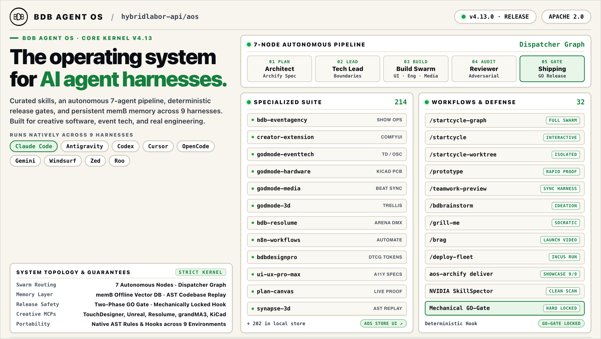
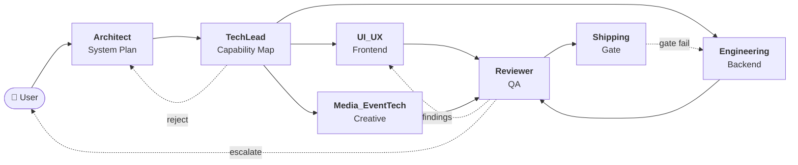
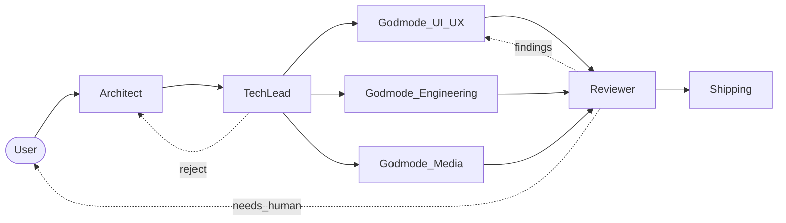
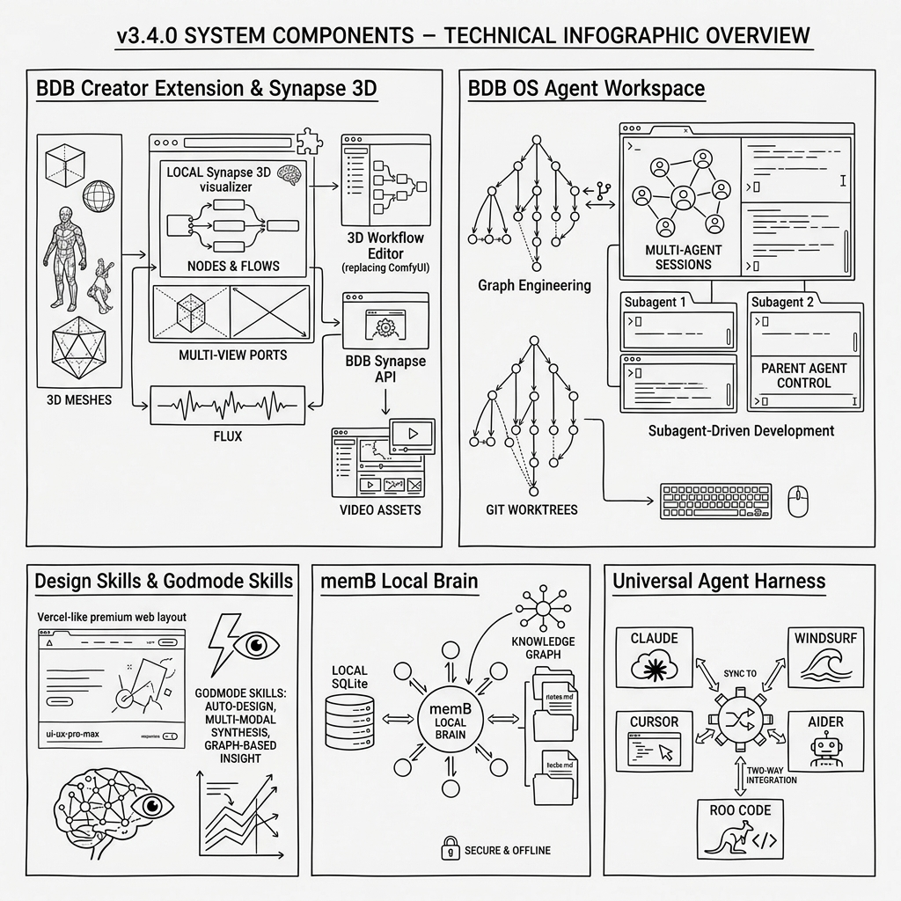
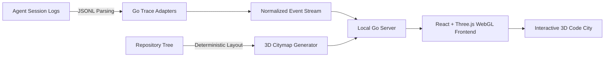
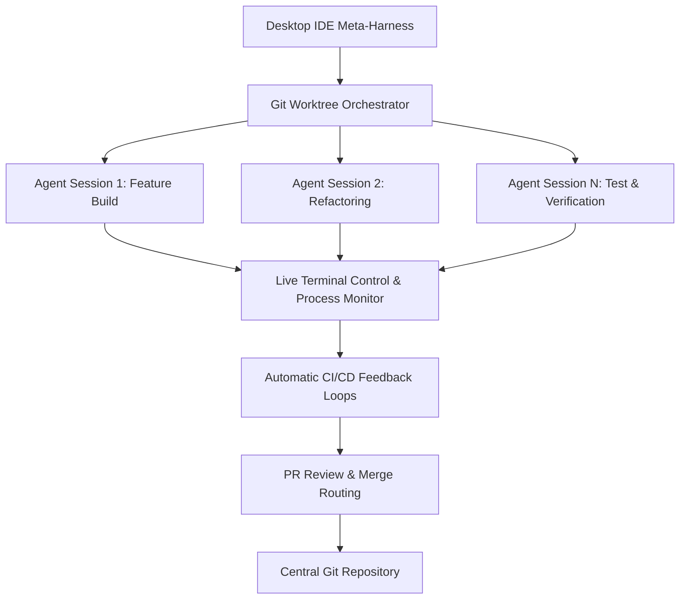
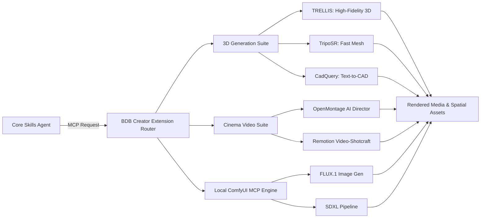
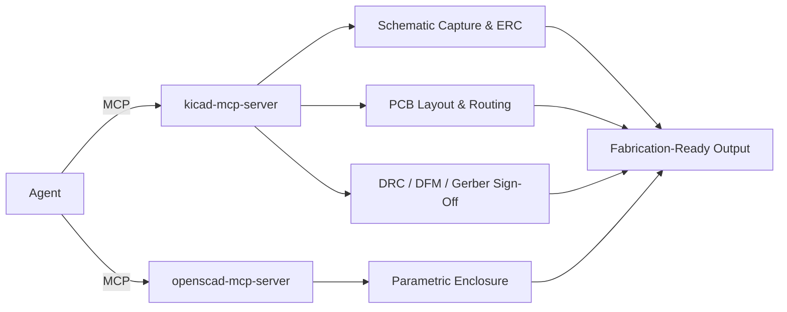

🌐 **Language / Sprache / Idioma**: **English** | [ 🇩🇪 Deutsch ](README.de.md) | [ 🇵🇹 Português ](README.pt.md)

# AOS — BDB Agent OS

[](https://www.npmjs.com/package/@hybridlabor-api/aos)
[](https://www.npmjs.com/package/@hybridlabor-api/aos)
[](https://github.com/hybridlabor-api/aos/stargazers)
[](https://github.com/hybridlabor-api/aos/commits/main)
[](https://github.com/hybridlabor-api/aos/actions)
[](LICENSE)
[](package.json)
[](#skills)
[](#mcp-servers)
[](#supported-harnesses)
[](https://github.com/NVIDIA/SkillSpector)
[](https://skills.sh/hybridlabor-api/aos)

AOS installs a curated skill library, a subagent roster, gate hooks and a runnable multi-agent build pipeline into every coding-agent harness on your machine.

```bash
npx -y @hybridlabor-api/aos@latest
```

Built for people who already run **Claude Code, Google Antigravity, Codex CLI, OpenCode, Cursor, Windsurf, Roo Code / Cline or Aider** and want all of them to behave the same way.

After install you have:

- **<!-- count:skills -->224<!-- /count --> skills** in six categories, discoverable by every harness as `<name>/SKILL.md`.
- **<!-- count:agents -->13<!-- /count --> subagents** (Architect, TechLead, Reviewer, the Godmodes, security and silent-failure reviewers) compiled into each harness's native agent format.
- **<!-- count:mcps -->21<!-- /count --> MCP servers** for creative software, OS control, memory and cross-harness delegation.
- **Three pipelines** — `/startcycle`, `/startcycle-graph`, `/startcycle-graph-user` — and a **GO gate** that mechanically blocks `git push`, `npm publish`, `npm version` and recursive `rm`.
- **Tools:** Plan Canvas, agenttrail, archify, the AOS Store, the Launchpad dashboard and `aos doctor`.

---

## The Dispatcher Graph

The graph is harness-neutral and runs on Claude Code's Dynamic Workflows, Antigravity's parallel execution, and any compatible agent harness.



---

## Install

Requirements: Node.js >= 20. macOS, Linux and Windows (PowerShell).

```bash
npx -y @hybridlabor-api/aos@latest
```

**First run.** The installer detects which harnesses are present, asks which to target and which tier (Pro MEDIA or Basic), copies the skills into each harness's skill directory, compiles the subagents, wires the hooks, merges the MCP configuration into each harness's own config file (existing entries are kept), and offers the optional modules listed below.

**Every later run** opens a menu instead:

| Menu item | What it does |
|---|---|
| Quick Update | Refreshes skills, templates, hooks and installed modules to the version you just ran |
| Run System Checkup / Doctor | Runs `aos doctor`: dependencies, file placement, daemons, hooks |
| Drop Local Project Harness | Copies the dispatcher contract into the current directory (see below) |
| Reconfigure System | Change targets, tier or options |
| Uninstall AOS | Removes what the installer placed; your data stays |

### Non-interactive

```bash
npx -y @hybridlabor-api/aos@latest -y --platforms=2          # Claude only, all defaults
npx -y @hybridlabor-api/aos@latest -y --platforms=1,5 --mcps=none
npx -y @hybridlabor-api/aos@latest --dry-run                 # print what would change
```

`--platforms=` values: `0` universal (all detected), `1` Antigravity, `2` Claude Desktop / Claude Code, `3` Cursor, `5` Codex CLI, `6` Windsurf, `7` Roo Code / Cline, `8` Aider, `10` AOS CLI. `4` (custom paths) needs the interactive menu. `--mcps=<name,name>|all|none` picks the MCP subset. `--verbose` and `--no-intro` do what they say.

### Local project harness

Instead of installing into `$HOME`, drop only the dispatcher contract (`.agents/`, the gate hooks, the agent definitions, the `/startcycle-graph` workflow, the OpenCode plugin) into one repository:

```bash
cd your-project && npx -y @hybridlabor-api/aos@latest --project-harness -y
```

---

## Supported harnesses

What the installer writes for each target. Paths are the defaults; the installer only writes to harnesses it actually detects.

| Harness | Skills | Subagents | Hooks | Plugin / rules |
|---|---|---|---|---|
| Claude Code / Claude Desktop | `~/.claude/skills` | `~/.claude/agents` | `~/.claude/hooks` + `settings.json` (GO gate, graph gate, env-file protection, Conventional Commits, memB inject, trail relay) | `.claude-plugin/` manifest ships in the repo (see Contributing) |
| Google Antigravity | `~/.gemini/config/skills` | `~/.gemini/config/agents` | `~/.gemini/config/hooks.json` and `~/.gemini/antigravity-cli/hooks.json` | root `plugin.json` / `plugins/bdb-aos/plugin.json`, commands `/bdb-aos:<cmd>`, see [docs/codex-agy-setup.md](docs/codex-agy-setup.md) |
| Codex CLI | `~/.codex/skills` | `~/.codex/agents` | `~/.codex/hooks` + `config.toml` | `.codex-plugin/` + `.agents/plugins/marketplace.json`, commands `$bdb-aos:<cmd>`, see [docs/codex-agy-setup.md](docs/codex-agy-setup.md) |
| OpenCode | `~/.config/opencode/skills` | `~/.opencode/agents` | via plugin | `bdb-aos.js` plugin + `/startcycle-graph` command, registered in `opencode.jsonc`; keeps a `/startcycle-graph` run moving on `session.idle`; generated `/bdb-aos-<cmd>` commands; opt-in extras, see [docs/opencode-setup.md](docs/opencode-setup.md) |
| Cursor | `~/.cursor/skills` | — | — | `.cursor/rules` (project) |
| Windsurf | `~/.windsurf/bdb-skills` | — | — | `mcp.json` |
| Roo Code / Cline | `~/.roo/skills` | — | — | `.roomodes` (project) |
| Aider | `~/.aider/bdb-skills` | — | — | — |
| AOS CLI (`pi`) | reads `~/.agents/skills` | `~/.agents/AGENTS.md` as system prompt | — | no MCP; separate install, Node >= 22.19 — see [packages/aos-cli](packages/aos-cli/README.md) |

Every install also writes the universal copy to `~/.agents/skills`, which is what the AOS CLI and the `skills` CLI read.

---

## The pipelines

The contract lives in [`.agents/graph.md`](.agents/graph.md), the node roster in [`.agents/nodes.json`](.agents/nodes.json), the executable dispatcher in [`.claude/workflows/startcycle-dispatch.mjs`](.claude/workflows/startcycle-dispatch.mjs).

**One rule: nodes never invoke each other.** A dispatcher reads `production_artifacts/state.json` after each node returns and decides what runs next. There is no hand-off chain and no agent telling another agent to go. This design ensures context fidelity, single-place auditability of routing logic, and portability across harnesses.

Each node reads the plan and its own prior state, executes its work, writes its artifact and state fragments, and returns. The dispatcher merges per-node state fragments (`state.d/<node>.json`), evaluates edge predicates, and routes to the next node — or escalates to the user if a no-progress guard triggers (same blocking finding on the second repair cycle) or the iteration ceiling is reached.



| Command | Machinery | Use when |
|---|---|---|
| `/startcycle` | Linear chain, file hand-offs in `production_artifacts/`. No state machine, no repair loop. `/startcycle --skill=<name> <goal>` forces a skill into every node. | A straightforward build with the agent roster but without the ceremony. |
| `/startcycle-graph` | The full graph: durable `state.json`, Reviewer repair loop, automated quality gate, human escalation. | Feature work where correctness matters more than speed and you want an audit trail. |
| `/startcycle-graph-user` | Throwaway 2–4 node fan-out. Nothing persistent. Model-tiered per role; uses Antigravity, OpenCode or Codex if installed, Claude Code subagents otherwise. | A one-off "spawn a few workers" in any project. |

What keeps the full graph honest:

| Mechanism | What it prevents |
|---|---|
| Reviewer isolation | The Reviewer reads artifacts and the plan's contract, never the build node's reasoning or its claim that it is done. |
| No-progress guard | A repair cycle that reports the same blocking finding ID as the previous one escalates to a human instead of burning iterations. |
| Per-node state fragments | Parallel build nodes write `state.d/<node>.json`; the dispatcher merges. No lost-update race on one file. |
| Iteration ceiling | `max_iterations` (default 3) stops the loop unconditionally. |
| In-loop human edge | Any node can set `needs_human: true` and stop the run. |

## The GO gate

Reaching `ready_to_ship` is not shipping. [`.claude/hooks/go-gate.mjs`](.claude/hooks/go-gate.mjs) is a `PreToolUse` hook that blocks `git push`, `npm publish`, `npm version` and recursive `rm` unless your immediately preceding message is the literal word **GO**. It is a hook, not a rule an agent is asked to respect: it fires before any permission-mode check and cannot be argued around. The installer wires the same gate into Antigravity, Codex and OpenCode; on harnesses without hook support the rule in [AGENTS.md](AGENTS.md) applies and the agent is the enforcement. A subagent never inherits its orchestrator's GO, and a failed release command needs a fresh one.

---

## Tools



*Conceptual overview from v3.4.0. Components have grown since; the sections below are current.*

| Tool | Command | What it does |
|---|---|---|
| Plan Canvas | `aos-plan-canvas open <file>` (skill `plan-canvas`) | Opens a plan or HTML artifact in a local browser canvas where you annotate elements, chat, and approve or request changes. Plans from the pipelines open here by default. |
| agenttrail | `aos-trail` (skill `agenttrail`, port 5330) | Live board of a multi-agent build: which component, which agent or harness, what is done, what is stuck. Fed by the trail-relay hooks and by `mcsc`. |
| archify | `aos-archify` (skill `archify`) | Validated architecture, sequence, data-flow and state diagrams as standalone HTML with SVG export; accepts Mermaid. |
| AOS Store | `aos store list \| search <q> \| install <name> [--project]`, `aos store ui` (also `aos-store`, slash command `/aos-store`) | Browse and install AOS Core, ECC and Scenario (scenario-labs/skills, MIT) skills and agents; required skills are installed together and every file is SHA-256 verified. The web UI on `http://127.0.0.1:4322` shows what is installed, previews the exact target paths, and installs only after you confirm. Multi-file skills are installed completely. `list` and `search` read a pinned offline index. |
| Launchpad | `aos-dashboard [--port 7900] [--no-open]` | One page with every local BDB service (memB, Synapse, OpenWiki, AO, Remote, AOS Store): status, start/stop, logs. Registered as an autostart entry. |
| Doctor | `aos doctor [--json] [--net]` (also `aos-doctor`) | Verifies dependencies, skill placement per harness, daemons, hooks and modules; exits 1 when something needs attention. The first thing to run when anything misbehaves. |
| Config | `aos-config show \| propose \| set <key> <value>` | Machine-level `~/.agents/aos-config.json`: workspace root, domains, user id. |
| mcsc | MCP tools `delegate_agy`, `delegate_opencode`, `delegate_codex`, `delegate_smart` (skill `mcsc`) | Delegates a task to another installed CLI harness and streams its tool calls to agenttrail. Preferred over shelling out to the CLI. |

---

## AOS CLI

A lightweight CLI harness built on [pi](https://github.com/earendil-works/pi), a coding agent that runs in the terminal. AOS CLI reads `~/.agents/skills` (written by the installer) and `~/.agents/AGENTS.md` (the dispatcher graph as system instructions), runs no MCP servers of its own, and needs **Node >= 22.19** (pi's floor, higher than the main AOS installer).

```bash
aos-cli "what is the fastest way to fix this bug"
aos-cli --continue                    # resume the previous session
```

The CLI launcher (`packages/aos-cli/bin/aos-cli.mjs`) ships with an AOS-themed dark mode (`aos.json`), the ten core skills from `core-skills.json` (ask-tim, aos-setup, systematic-debugging, archify, etc.), and two in-session read-only commands (`/aos` shows the install menu; `/aos-status` runs the health check).

Install it through the AOS installer with the AOS CLI target: `npx -y @hybridlabor-api/aos@latest -y --platforms=10`. The package is private and is not published on npm, so `npm i -g @hybridlabor-api/aos-cli` does not work.


---

## Plugins and Marketplace

**Plugin manifest:** `.claude-plugin/plugin.json` + `marketplace.json` (generated by `npm run plugin:build`). The Claude marketplace installation path is being finalized; for now, the npm installer above is the supported installation route.

**Skills discovery:** Every harness finds skills in its native directory (`~/.claude/skills`, `~/.agents/skills`, `~/.codex/skills`, `~/.roo/skills`, etc.). To browse and install additional skills after install:

```bash
npx skills add hybridlabor-api/aos
```

This discovers all <!-- count:skills -->224<!-- /count --> curated skills and installs them into the universal `~/.agents/skills` directory (used by all harnesses and the AOS CLI).

---

## Memory and knowledge

Installed as optional modules by the installer; `aos doctor` verifies them and the Launchpad shows them.

- **memB** (`@hybridlabor-api/memb`) — local, offline vector memory with an MCP server (`add_memory`, `search_memory`, `list_memories`, `delete_memory`), a WebUI on port 8088, and an ambient hook that injects relevant memories into Claude Code sessions. Skills: `memb-skill`, `memb-ingest`, `bdb-memb-mcp`.
- **deja** (`@vshulcz/deja-vu`, installed with memB) — indexes your agent transcripts locally with secrets redacted; `deja fix` on an error, `deja wip` when resuming, `deja search` for past sessions. Skill: `deja-memory`.
- **OpenWiki** (`openwiki` CLI) — generates and refreshes a grounded wiki of a codebase, with a visualizer on port 4321 and a background daemon. Skill: `openwiki-skill`; this repo's own wiki is under [`.openwiki/`](.openwiki/quickstart.md).
- **Synapse** (`@hybridlabor-api/bdb-synapse`) — renders a repository as a 3D code city and replays agent sessions through it. Skill: `synapse-integration-skill`.

`aos-setup` brings a machine to a verified state for all four; `aos-project-init` binds one project to them (slug, wiki, memory, `AGENTS.md`).

---

## What's Included

### The <!-- count:agents -->13<!-- /count --> Subagents

The dispatcher graph compiles these agents, available as Claude Code subagents and loadable into Antigravity, Cursor, Codex, OpenCode and others:

| Agent | Purpose |
|---|---|
| **Architect** | Turns the user's goal into a system plan. Reads existing architecture before proposing changes. |
| **TechLead** | Reviews the plan for a capability map (module boundaries, dependency direction, build order) before any build node starts. Approves or rejects back to Architect. |
| **UI_UX** | Lead Frontend Designer. Enforces Anti-Slop principles, DTCG design tokens, high-agency frontend taste, and fluid motion dynamics. |
| **Engineering** | Senior Fullstack & Backend Engineer. Enforces Domain-Driven Design, Clean Architecture, TDD cycles, and database best practices. |
| **Media_EventTech** | Creative-Tech & Show-Control Specialist. Governs 3D modeling, TouchDesigner networks, DaVinci Resolve, lighting, and Resolume. |
| **Reviewer** | Adversarial review of build-node output against the plan's contract. Modeled on doubt-driven-development discipline. |
| **Shipping** | Release Gatekeeper & QA Auditor. Runs the automated quality gate (lint, typecheck, tests, a11y, seo) and enforces the GO gate. |
| **Database Reviewer** | PostgreSQL specialist for query optimization, schema design, security, and performance. |
| **Security Reviewer** | Security vulnerability detection and remediation. Flags secrets, SSRF, injection, unsafe crypto, and OWASP Top 10. |
| **Silent-Failure Hunter** | Reviews code for silent failures, swallowed errors, bad fallbacks, and missing error propagation. |
| **Go-Build Resolver** | Resolves Go build, vet, and compilation errors with minimal changes. |
| **Opensource Forker** | Forks a project for open-sourcing — strips secrets, replaces internal references, generates `.env.example`. |
| **Opensource Sanitizer** | Verifies an open-source fork is fully sanitized. Scans for leaked secrets, PII, internal references. |

### Skills by Category

<!-- count:skills -->224<!-- /count --> curated skills, discoverable by every harness:

- **bdb-core** (31 skills): Core AOS infrastructure, pipelines, tools, and utilities — `startcycle`, `startcycle-graph`, `startcycle-graph-user`, `agent-orchestrator`, `agenttrail`, `plan-canvas`, `aos-doctor`, `aos-store`, `bdb-dev-os-skill`, and more.
- **design-ui-ux** (19 skills): Frontend, UI design, accessibility, tokens, motion, anti-slop — `senior-frontend`, `ui-component`, `ui-review`, `tailwind-patterns`, `shadcn`, `wcag-audit-patterns`, and more.
- **engineering-method** (46 skills): Architecture, testing, debugging, CI/CD, code quality — `software-architecture`, `test-driven-development`, `systematic-debugging`, `ci-pipeline`, `github-actions-generator`, `dockerfile-validator`, and more.
- **library** (98 skills): Language/framework specifics — TypeScript, Node.js, Python, React, Postgres, Prisma, Next.js, Drizzle ORM, Go, and more.
- **media-eventtech** (19 skills): 3D, video, show control, spatial design — `godmode-eventtech`, `synapse-integration-skill`, `threejs-skills`, `blender-expert`, and more.
- **engineering-hardware** (1 skill): PCB and electrical design — `godmode-hardware-pcb`.

The full catalog with detailed descriptions: [docs/skills_table.md](docs/skills_table.md) — note: this file is out of date and lists 164 of 214 skills.

---

## Skills

<!-- count:skills -->224<!-- /count --> skills, curated from open-source and proprietary collections, covering the full software development and creative pipeline. Every skill is a directory with a `SKILL.md` frontmatter declaring `name`, `description`, and one `category`: `bdb-core`, `design-ui-ux`, `engineering-method`, `engineering-hardware`, `media-eventtech`, `library`.

**Persona Layer:** The **Godmode** skills are specialized personas that directly map to the build and ship nodes of the dispatcher graph:

| Godmode | Owns | Maps to |
|---|---|---|
| `godmode-engineering` | Domain-Driven Design, Clean Architecture, strict TypeScript/Python, systematic debugging, database best practices. | **Engineering** node |
| `godmode-ui-ux` | Anti-slop frontend principles, DTCG design tokens, motion dynamics, accessibility (WCAG), high-agency taste. | **UI_UX** node |
| `godmode-shipping` | Pre-launch checks, automated quality gates, safe rollback procedures, Go-gate enforcement. | **Shipping** node |
| `godmode-eventtech` | Show control, signal flow, DMX lighting, TouchDesigner networks, Resolume media servers, live-event hardware. | **Media_EventTech** node |
| `godmode-3d-creation` | MCP-first 3D generation, mesh reconstruction, parametric CAD, spatial modeling. | Optional specialist |
| `godmode-media-creation` | Video production, timeline assembly, motion design pipelines, OpenMontage, Remotion. | Optional specialist |
| `godmode-hardware-pcb` | Electrical schematics, PCB layout and routing, KiCad ERC/DRC/DFM gate, enclosure co-design, OpenSCAD. | Optional specialist |

**Entry Points & Navigation:**
- **`ask-tim`** — Skill recommendation by description
- **`bdbrainstorm`** and **`bdbmediastorm`** — Multi-agent ideation sessions ending in an executable plan
- **`teamwork-preview`** — Prompt crafting, role delegation, collaboration setup
- **Grilling family** — `grill-me` (general audit), `grill-with-docs` (documentation-grounded), `triage` (prioritization)
- **CI/CD & Generators** — `ci-pipeline`, `github-actions-generator`, `dockerfile-generator`, `makefile-generator`
- **Code Quality** — `bdb-security-audit`, `systematic-debugging`, `silent-failure-hunter`, `bdbresilience`
- **Framework Specialists** — Full coverage of TypeScript, React, Next.js, Drizzle ORM, Prisma, Python, Go, and more

The full catalog with descriptions and details: [docs/skills_table.md](docs/skills_table.md) (note: currently lists 164 of 214).

The library is also readable by the `skills` CLI:

```bash
npx skills add hybridlabor-api/aos
```

---

## MCP servers

[`mcp_config.json`](mcp_config.json) defines <!-- count:mcps -->21<!-- /count --> servers, built or warmed by the installer from `mcps/` and merged into each harness's MCP configuration. Each server exposes tools for a specific domain; every harness sees the same set, avoiding per-tool incompatibilities.

**Creative software integrations** (primary and fallback pairs for redundancy):
- **Unreal Engine** — `bdb_unreal_mcp` (Web Remote Control API on port 30010), skill: `bdb-unreal-mcp`
- **Rhino 3D & Grasshopper** — `bdb_rhino_mcp` (McNeel's Yak router) + `bdb_rhino_mcp_fallback` (GOLEM 3D, 105 tools), skill: `bdb-rhino-mcp`
- **DaVinci Resolve** — `bdb_davinci_mcp` (workspace scripts, 162 tools) + `bdb_davinci_mcp_studio` (Node.js for Studio) + `bdb_davinci_mcp_fallback`, skill: `bdb-davinci-mcp`
- **Blender** — `bdb_blender_mcp` (socket integration) + `bdb_blender_mcp_fallback`, skill: `bdb-blender-mcp`
- **After Effects** — `bdb_after_effects_mcp` + `bdb_after_effects_mcp_fallback`, skill: `bdb-after-effects-mcp`
- **TouchDesigner** — `bdb_touchdesigner_mcp` (MindDesigner bridge on port 9980) + `bdb_touchdesigner_mcp_fallback`, skill: `bdb-touchdesigner-mcp`
- **Additional:** grandMA3 (OSC/UDP on port 8000), Resolume (REST API on port 8080), Vectorworks (semantic RAG on port 8765), Adobe UXP bridge, Open Design

**OS control & system automation:**
- **macOS/Linux** — `zavora_computer_use` (native Rust NAPI binary, no runtime compile), skill: `bdb-computer-use-mcp`
- **Windows** — `bdb_windows_computer_use` (Win32 / COM / UIAutomation, local OCR with Tesseract)

**Memory, delegation & infrastructure:**
- **memB** — `memb_mcp` (local offline vector memory, SQLite + ONNX model)
- **deja** — local transcript indexing (secrets redacted)
- **mcsc** — multi-harness task delegation
- **GitHub** — native MCP tools for issues, PRs, workflows
- **Chrome DevTools** — browser automation & debugging
- **RemoteOS** — multi-cloud execution gateway with 4-eyes approval engine

---

## Optional modules

The installer's module picker offers, and Quick Update keeps current. All are optional; AOS works standalone without any of them.

### memB — Local Vector Memory

`@hybridlabor-api/memb`: offline, local vector memory with an MCP server, WebUI on port 8088, and an ambient hook that injects relevant memories into Claude Code sessions. Skill: `memb-skill`, `memb-ingest`, `bdb-memb-mcp`.

### deja — Transcript Indexing

`@vshulcz/deja-vu`: indexes your agent transcripts locally (secrets redacted), with `deja fix` on an error, `deja wip` to resume, `deja search` for past sessions. Installed with memB. Skill: `deja-memory`.

### OpenWiki — Living Documentation

`openwiki` CLI: generates and refreshes a grounded wiki of a codebase, with a visualizer on port 4321 and a background daemon. Skill: `openwiki-skill`. This repo's wiki: [.openwiki/](.openwiki/quickstart.md).

### Synapse — 3D Code City

`@hybridlabor-api/bdb-synapse`: renders a repository as a 3D code city and replays agent sessions as light trails. Skill: `synapse-integration-skill`.



### AO — Agent Orchestrator

`@hybridlabor-api/bdb-agent-orchestrator`: parallel agents in Git worktrees with live terminal control and automated CI/CD feedback loops. Skill: `agent-orchestrator`.



### Creator Extension — Media & 3D

`@hybridlabor-api/bdb-dev-creator-extension`: ComfyUI MCP capabilities (FLUX, SDXL), image-to-3D (TripoSR, TRELLIS), and automated video production (OpenMontage, Remotion). Skill: `bdb-dev-creator-extension`.



### Hardware & PCB — Electrical Design

`@hybridlabor-api/bdb-hardware-pcb`: KiCad and OpenSCAD design module, driven by `godmode-hardware-pcb` skill. Exposes ERC/DRC gate, gerber sign-off, and parametric enclosure design. Skills: `godmode-hardware-pcb`, `bdb-hardware-pcb`.



### Heimdall Token Saver — CLI Output Compression

`@hybridlabor-api/heimdall-token-saver`: compresses repeated CLI output via ambient hooks on every harness. Reduces token overhead on large projects. Skill: `token-saver-config`.

---

## Updating

Run the same command again. The installer sees the installed version, offers **Quick Update**, and refreshes skills, hooks, templates and modules:

```bash
npx -y @hybridlabor-api/aos@latest
```

There is no `aos update` subcommand. If you once ran `npm i -g @hybridlabor-api/aos`, a plain `aos` on your PATH runs that frozen copy and its version, not the latest; either update it (`npm i -g @hybridlabor-api/aos@latest`) or remove it and stay with `npx`. The installer prints the update command itself whenever a newer version exists; the `bdb-updater` skill wraps the same check for use from inside a session.

## Uninstall

```bash
aos-uninstall              # removes what AOS installed; memory, wikis and credentials stay
aos-uninstall --purge      # also removes ~/.MemBDB, ~/.openwiki, ~/.synapse, ~/.memb
aos-uninstall --dry-run    # list everything, delete nothing
```

The uninstaller works from the install manifest: a file that still matches the hash AOS wrote is removed, a file you edited is backed up instead, a file AOS never wrote is not touched. The same action is in the installer menu. `aos-uninstall --restore-plugin-backup` restores the loose skill copies the installer removed when it registered the plugin; see [docs/plugin-migration.md](docs/plugin-migration.md).

---

## Contributing

- [AGENTS.md](AGENTS.md) is the single source of rules for every harness: the skill contract, category routing, the release gate, Conventional Commits.
- A skill is a directory with `SKILL.md`; the frontmatter needs `name` (equal to the directory), `description` and `category`. `npm run validate` enforces the contract, as CI does on every push.
- `npm test` runs the validator self-test, the plugin-manifest check and the installer, store, doctor and cross-harness hook tests.
- `.claude-plugin/plugin.json` and `marketplace.json` are generated by `npm run plugin:build` and checked by `npm run plugin:check`. They exist today; the Claude Code marketplace install path is still being finalised, so the installer above remains the supported route.
- Releases are cut by release-please from Conventional Commits; do not bump `package.json` by hand. `feat:` means a minor bump.
- Skills derived from other projects record `source:` in the frontmatter and an entry in [THIRD_PARTY_NOTICES.md](THIRD_PARTY_NOTICES.md).

## Links

- Package: [npmjs.com/package/@hybridlabor-api/aos](https://www.npmjs.com/package/@hybridlabor-api/aos)
- Source and issues: [github.com/hybridlabor-api/aos](https://github.com/hybridlabor-api/aos) · [issues](https://github.com/hybridlabor-api/aos/issues)
- [CHANGELOG.md](CHANGELOG.md) · [docs/skills_table.md](docs/skills_table.md)
- Sibling repos: [bdb-agent-orchestrator](https://github.com/hybridlabor-api/bdb-agent-orchestrator) · [bdb-synapse](https://github.com/hybridlabor-api/bdb-synapse) · [bdb-dev-creator-extension](https://github.com/hybridlabor-api/bdb-dev-creator-extension) · [bdb-hardware-pcb](https://github.com/hybridlabor-api/bdb-hardware-pcb) · [bdb-os-remote](https://github.com/hybridlabor-api/bdb-os-remote)

License: [Apache-2.0](LICENSE).
