<div align="center">


**Language / Sprache / Idioma**: **English** · [Deutsch](README.de.md) · [Português](README.pt.md)

# AOS — BDB Agent OS

[](https://www.npmjs.com/package/@hybridlabor-api/aos)
[](https://www.npmjs.com/package/@hybridlabor-api/aos)
[](https://github.com/hybridlabor-api/aos/stargazers)
[](https://github.com/hybridlabor-api/aos/commits/main)
[](https://github.com/hybridlabor-api/aos/actions)
[](LICENSE)
[](package.json)
[](#skills)
[](#mcp-servers)
[](#supported-harnesses)
[](https://github.com/NVIDIA/SkillSpector)
[](https://skills.sh/hybridlabor-api/aos)

[](#the-subagents-21)
[](#playbooks)
[](#a2a-sessions-that-talk-to-each-other)
[](#mcp-gateway-and-one-mcp-per-app)
[](#the-go-gate)

<p align="center">
  <b>The operating system for AI agent harnesses.</b><br/>
  One install: the same skills in nine harnesses. Subagents and the hook-enforced GO gate on Claude Code, Antigravity, Codex and OpenCode.
</p>

<p align="center">
  Built for <b>event and media technicians</b>, <b>designers</b> and <b>managers</b>, for <b>builders of custom installations</b> (show control, 3D, PCB and enclosure), and just as much for <b>everyday coding</b> of apps, tools and plugins. The skill library and the MCP servers cover both worlds.
</p>

AOS installs a curated skill library, a subagent roster, gate hooks and a runnable multi-agent build pipeline into every coding-agent harness on your machine.

```bash
npx -y @hybridlabor-api/aos@latest
```

<p align="center">
  
  
  
  
  
  
  
  
  
</p>

<sub>Recommended: the full installer above. Alternatively, use the skills CLI:</sub>

<table>
<tr>
<td width="100%" valign="top" align="left"><b>Install skills only</b><br/><br/><code>npx skills add hybridlabor-api/aos</code><br/><br/><sub>Gate hooks and MCP servers require the full installer. Plugin marketplace route is in progress; see <a href="#plugins-and-marketplace">Plugins and marketplace</a>.</sub></td>
</tr>
</table>

<sub>Skills use the open <a href="https://agentskills.io">Agent Skills</a> format (<code>SKILL.md</code>). AOS installs them for <b>Claude Code, Google Antigravity, Codex CLI, OpenCode, Cursor, Windsurf, Roo Code / Cline, Aider and the AOS CLI</b>, so all of them behave the same way.</sub>

<p align="center">
  
</p>

</div>

---

## Why AOS

| | Harness default | With AOS |
|---|---|---|
| **Skills** | Each harness has its own skill folder and its own copies. | <!-- count:skills -->264<!-- /count --> skills in seven categories, written as `<name>/SKILL.md` into every harness you have. One source tree. |
| **Subagents** | Agent files written by hand, per harness, in that harness's format. | <!-- count:agents -->21<!-- /count --> subagents compiled into each harness's native agent format (Claude Code, Antigravity, Codex, OpenCode only; others use rules in AGENTS.md). |
| **Release safety** | A rule in a prompt that the agent is asked to respect. | A `PreToolUse` hook (Claude Code, Antigravity, Codex, OpenCode) or rules in AGENTS.md (others) that blocks `git push`, `npm publish`, `npm version` and recursive `rm` until your own message is the literal word **GO**. |
| **Multi-agent builds** | Agents that call agents, with the routing inside their prompts. | A dispatcher graph: nodes never invoke each other, state is durable, a repair loop has a no-progress guard, escalation goes to you. |
| **Plans** | Scroll back through the chat to find what was agreed. | Plan Canvas: annotate the plan in a browser, then approve it before any agent builds. |
| **Visibility** | Read logs in several terminals. | agenttrail live map per repo, and a fleet band in Claude Code with gate mode, token-weather and who waits for your GO. |
| **Sessions** | Each session is alone in its terminal. | A2A between live Claude Code, OpenCode, agy and Codex sessions on localhost. An inbound message is never a GO. |
| **Beyond code** | Coding assistants know code. | 19 media-eventtech skills and MCP servers for grandMA3, Resolume, TouchDesigner, Unreal, DaVinci, After Effects, Blender and Rhino; `godmode-hardware-pcb` for KiCad and OpenSCAD; playbooks for offers, invoices, crew call sheets and event trackers. |

## What you get

<table>
<tr>
<td width="33%" valign="top">🎯 <b>Skills</b><br/>264 curated skills in seven categories, discoverable by every harness as <code>&lt;name&gt;/SKILL.md</code>.<br/>→ <a href="#skills-at-a-glance">Skills at a glance</a></td>
<td width="33%" valign="top">👥 <b>Subagents</b><br/>21 subagents: Architect, TechLead, Reviewer, Godmodes and specialist reviewers.<br/>→ <a href="#the-dispatcher-graph">The dispatcher graph</a></td>
<td width="33%" valign="top">🔌 <b>MCP servers</b><br/>21 servers for creative software, OS control, memory and cross-harness delegation.<br/>→ <a href="#mcp-servers">MCP servers</a></td>
</tr>
<tr>
<td width="33%" valign="top">🚀 <b>Pipelines & GO gate</b><br/><code>/startcycle</code>, <code>/startcycle-graph</code>, <code>/startcycle-graph-user</code>, and hook-enforced release gate.<br/>→ <a href="#the-pipelines">The pipelines</a></td>
<td width="33%" valign="top">💬 <b>Sessions that talk</b><br/>A2A between Claude Code, OpenCode, agy and Codex sessions on localhost.<br/>→ <a href="#a2a-sessions-that-talk-to-each-other">A2A</a></td>
<td width="33%" valign="top">🛠️ <b>Tools</b><br/>Plan Canvas, agenttrail, archify, AOS Store, Launchpad, fleet band, aos doctor.<br/>→ <a href="#skills-at-a-glance">Tools</a></td>
</tr>
</table>

<table>
<tr>
<td width="20%" valign="top"><b>Event & media tech</b><br/>• Live show control: grandMA3, Resolume, TouchDesigner<br/>• Media production: Unreal, DaVinci, After Effects</td>
<td width="20%" valign="top"><b>Design</b><br/>• UI/UX design system and brand discovery<br/>• Landing pages, app redesigns, Plan Canvas</td>
<td width="20%" valign="top"><b>Management</b><br/>• Offers, invoices, budget tracking<br/>• Crew sheets, event planning, meeting actions</td>
<td width="20%" valign="top"><b>Custom builds</b><br/>• PCB design and OpenSCAD enclosures<br/>• 3D assets, Rhino, Blender modeling</td>
<td width="20%" valign="top"><b>General dev</b><br/>• Backend, frontend, testing, and shipping<br/>• 21 subagents, three pipelines, library skills</td>
</tr>
</table>

See [Playbooks](#playbooks) for guided workflows across these domains.

---

## Quick start

| I want to... | Run |
|---|---|
| Install for every harness I have | `npx -y @hybridlabor-api/aos@latest` |
| Install with low context overhead | `npx -y @hybridlabor-api/aos@latest --profile=minimal` |
| Refresh only the gates and hooks | `npx -y @hybridlabor-api/aos@latest --hooks-only` |
| See what would change first | `npx -y @hybridlabor-api/aos@latest --dry-run` |
| Check a broken setup | `aos doctor` |
| Browse and add skills and agents | `aos store ui` |
| Plan a feature, then build it | `/plan`, then `/startcycle-graph` |

---

## See it in action

<p align="center">
<br/>
<sub><b>agenttrail.</b> The live map of a multi-agent build while it runs. <a href="docs/assets/readme/agenttrail-live.mp4">▶ Full-quality video</a></sub>
</p>

<table>
<tr>
<td width="50%" valign="top" align="center">
<br/>
<sub><b>Plan Canvas.</b> Annotate the plan in the browser, then approve it before any agent builds.</sub>
</td>
<td width="50%" valign="top" align="center">
<br/>
<sub><b>AO workspace.</b> The pipeline monitor, plan to ship, with role and model routing per node.</sub>
</td>
</tr>
<tr>
<td width="50%" valign="top" align="center">
<br/>
<sub><b>AOS Store.</b> Skills, agents and playbooks on 127.0.0.1:4322.</sub>
</td>
<td width="50%" valign="top" align="center">
<br/>
<sub><b>Codenotch.</b> Agents running and busy per harness.</sub>
</td>
</tr>
</table>

<p align="center">
<br/>
<sub><b>Fleet band.</b> In Claude Code: gate mode, token-weather, and the sessions that wait for your GO.</sub>
</p>

<p align="center">
<br/>
<sub><b>Installer.</b> <code>npx -y @hybridlabor-api/aos@latest</code>: boot, pre-flight telemetry, then the setup menu. <a href="docs/assets/readme/aos-installer.mp4">▶ Full-quality video</a></sub>
</p>

---

## Skills at a glance

- [**`/startcycle`**](skills/basic/startcycle/SKILL.md) - linear build pipeline (Architect, TechLead, parallel build, Reviewer) with file hand-offs in `production_artifacts/`
- [**`/startcycle-graph`**](skills/basic/startcycle-graph/SKILL.md) - dispatcher graph with durable `state.json`, Reviewer repair loop, quality gate and escalation
  - The dispatcher invokes the subagents [`architect`](agents/architect.md), [`techlead`](agents/techlead.md), [`godmode-ui-ux`](agents/godmode-ui-ux.md), [`godmode-engineering`](agents/godmode-engineering.md), [`godmode-media-eventtech`](agents/godmode-media-eventtech.md), [`reviewer`](agents/reviewer.md) and [`godmode-shipping`](agents/godmode-shipping.md); they never call each other
- [**`/startcycle-graph-user`**](skills/basic/startcycle-graph-user/SKILL.md) - throwaway 2-4 node fan-out for any project, nothing persistent left behind
- [**`/plan`**](commands/plan.md) - draft, render in a browser canvas, annotate, await approval, then hand off
  - [**`plan-canvas`**](skills/global_config/plan-canvas/SKILL.md) - local canvas where you annotate elements, chat and approve or request changes
  - [**`plan-arbiter`**](skills/global_config/plan-arbiter/SKILL.md) - compare competing plans from several agents and produce one recommended plan
- [**`/bdbrainstorm`**](skills/bdbrainstorm/SKILL.md) - multi-agent brainstorm that ends in a hand-off to `/startcycle-graph`
  - [**`/grill-me`**](skills/global_config/grill-me/SKILL.md) - relentless interview to sharpen a plan or design
  - [**`bdbmediastorm`**](skills/basic/bdbmediastorm/SKILL.md) - brainstorming for live event tech, show control and real-time media
- [**`/playbooks`**](commands/playbooks.md) - list every `pb-*` playbook with duration, difficulty and requirements, and start one
  - [`pb-bug-fix`](skills/playbooks/pb-bug-fix/SKILL.md) - GitHub issue to tested fix and PR; push and PR only after GO
  - [`pb-ship`](skills/playbooks/pb-ship/SKILL.md) - triage, review and gate the day's PRs; merge only after GO
  - [`pb-release-aos`](skills/playbooks/pb-release-aos/SKILL.md) - release AOS to npm through the release-please PR
  - [`pb-show-build`](skills/playbooks/pb-show-build/SKILL.md) - build a show across grandMA3, Resolume and TouchDesigner, offline first
  - [`pb-offer`](skills/playbooks/pb-offer/SKILL.md) - draft a client offer priced from your price list; send only after GO
- [**`factory-collect`**](skills/global_config/factory-collect/SKILL.md) - Factory: collect and triage feedback, telemetry, errors and issue reports
  - [`factory-lookback`](skills/global_config/factory-lookback/SKILL.md) - audit recurring problems across sources for systemic fixes
  - [`factory-review-prs`](skills/global_config/factory-review-prs/SKILL.md) - review a configured PR queue; approve and merge stay with you
  - [`factory-human-digest`](skills/global_config/factory-human-digest/SKILL.md) - read-only digest of what still needs a human decision
- [**`gogate`**](skills/global_config/gogate/SKILL.md) - show or explain the go-gate mode (hard, soft, off) and the time-limited grants; CLI: `aos-gogate`
- [**`aos-a2a`**](skills/global_config/aos-a2a/SKILL.md) - list, send to and reply to live harness peers over A2A on localhost
  - [`master-session`](skills/basic/master-session/SKILL.md) - supervise several sessions: roster, status requests, GO board; workers can be spawned through `aos-acp`
  - [`mcsc`](skills/global_config/mcsc/SKILL.md) - delegate a task to another installed CLI harness (agy, OpenCode, Codex)
- [**`agenttrail`**](skills/global_config/agenttrail/SKILL.md) - live browser map of a multi-agent build; CLI: `aos-trail`
- [**`aos-store`**](skills/global_config/aos-store/SKILL.md) - browse, preview and install skills and agents from a local web UI (`aos store`)
- [**`memb-skill`**](skills/global_config/memb-skill/SKILL.md) - local-first long-term memory engine (memB)
  - [`memb-ingest`](skills/memb-ingest/SKILL.md) - ingest project files and conversation logs into memB
- [**`openwiki-skill`**](skills/global_config/openwiki-skill/SKILL.md) - initialize, update and visualize codebase wikis with OpenWiki
- [**`synapse-integration-skill`**](skills/synapse-integration-skill/SKILL.md) - BDB Synapse 3D codebase visualizer integration
- [**`/doctor`**](commands/doctor.md) - check the machine and the current project, print suggested `permissions.allow` entries, write no settings
- [**`aos-setup`**](skills/global_config/aos-setup/SKILL.md) - bring a machine to a complete, verified AOS installation
  - [`aos-project-init`](skills/global_config/aos-project-init/SKILL.md) - set up a project folder: slug, wiki, memory, Synapse map, `AGENTS.md`
- **Godmodes** - domain rulebooks
  - [`godmode-engineering`](skills/basic/godmode-engineering/SKILL.md) - strict DDD, TypeScript strictness, Clean Architecture, 5-step debugging triage
  - [`godmode-ui-ux`](skills/basic/godmode-ui-ux/SKILL.md) - brand discovery, Anti-Slop rules, DTCG design tokens, fluid motion
  - [`godmode-eventtech`](skills/basic/godmode-eventtech/SKILL.md) - show-control execution for grandMA3, Resolume, Unreal, Rhino, Vectorworks and Adobe MCP
  - [`godmode-hardware-pcb`](skills/basic/godmode-hardware-pcb/SKILL.md) - schematics, PCB layout, KiCad and OpenSCAD enclosures with DFM/DRC/ERC sign-off
  - [`godmode-shipping`](skills/basic/godmode-shipping/SKILL.md) - final gatekeeper: pre-launch checks, feature-flag rollouts, rollback planning
- **Vendored helpers** from [BuilderIO/skills](https://github.com/BuilderIO/skills)
  - [`read-the-damn-docs`](skills/global_config/read-the-damn-docs/SKILL.md) - forces a docs pass before coding third-party APIs from memory
  - [`stay-within-limits`](skills/global_config/stay-within-limits/SKILL.md) - respect 5-hour and weekly usage limits in long or parallel runs
  - [`quick-recap`](skills/global_config/quick-recap/SKILL.md) - end each response with a red/yellow/green status line

Full catalogs (every skill, subagent, playbook and MCP server) are in the collapsible lists under What's included.

---

## What's new in v5

v5 changes how AOS gets onto a machine and how its parts talk to each other.

| Area | What changed |
|---|---|
| **Installer** | Rebuilt flow: Kernel, Harnesses, Packages, Optional, Verify. Profiles `minimal`, `standard`, `full`; `--no-hooks`, `--hooks-only`, `--without=<ids>`; repair and uninstall from the manifest; one version check at the start with Update as the default. See [Install](#install) and [docs/install-options.md](docs/install-options.md). |
| **MCP gateway** | `aos-gateway`: one local endpoint (1mcp behind a token-checking forwarder) in front of an allow list of shipped servers, `aos-gateway adopt` for your own stdio servers, and **one MCP per app** (Blender, Resolume, After Effects). Opt-in. [docs/mcp-gateway.md](docs/mcp-gateway.md). |
| **A2A** | Live Claude Code, OpenCode, agy and Codex sessions message each other with `aos-a2a`. An inbound message is never a GO. [docs/a2a.md](docs/a2a.md). Intercom and a2abook on top of it are **in progress**. |
| **Native agents** | Subagents are compiled into the formats and paths each harness really reads, including OpenCode and agy. No model is pinned unless you set one: [docs/agent-models.md](docs/agent-models.md). |
| **Fleet mod** | A band in Claude Code: gate mode, token-weather (context percent as a weather word plus a sparkline), and which sessions work or wait for you with their GO counts. `aos-gogate` shows gate state read-only. |
| **agenttrail** | One live map per repo, started automatically, with a link in your session. A v2 control room is **in progress**. |
| **Plan Canvas** | Plans open in a local canvas; annotations are dispatched back to the agent. |
| **go-gate** | Read, test and build commands with no write or network effect pass without a GO; deny logs mask credentials; hooks in four harnesses. |
| **Playbooks and Factory** | 34 `pb-*` playbooks, the `factory-*` skills and `plan-arbiter`. |
| **Orchestrator chain** | master session, project orchestrator, package orchestrator, mapped to real mechanisms. |

**In progress, not claimed as shipped.** agenttrail v2 control room, the AOS Hub (services, catalog and store in one page; today there is the Launchpad and the Store), A2A intercom and a2abook, A2A `spawn` mode, `skill-create` and `instinct-*`.

---

## The dispatcher graph

The graph is harness-neutral and runs on Claude Code's Dynamic Workflows, Antigravity's parallel execution, and any compatible agent harness.

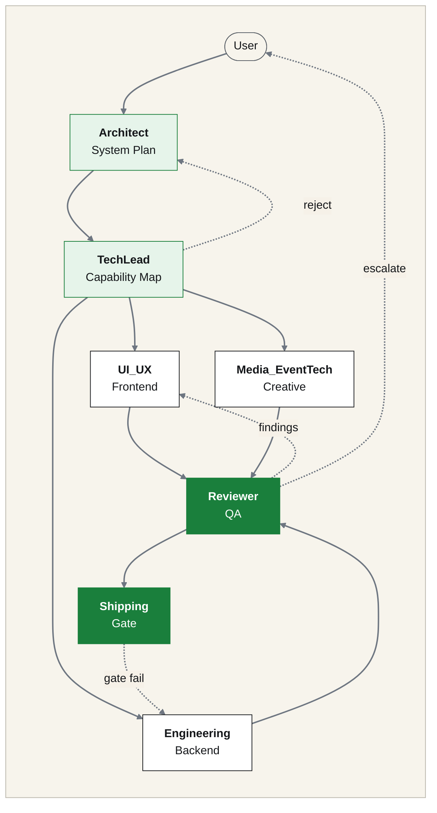

<p align="center"><sub><b>Dispatcher graph.</b> Architect and TechLead plan, three build nodes work in parallel, Reviewer and Shipping gate the result, and dashed edges route rejections and escalations.</sub></p>

---

## Install

**Requirements.** Node.js >= 20. macOS, Linux and Windows (PowerShell).

```bash
npx -y @hybridlabor-api/aos@latest
```

**First run.** The installer detects which harnesses are present, asks which to target and which tier (Pro MEDIA or Basic), copies the skills into each harness's skill directory, compiles the subagents, wires the hooks, merges the MCP configuration into each harness's own config file (existing entries are kept), and offers the optional modules listed below.

**Every later run** opens a menu instead:

| Menu item | What it does |
|---|---|
| Quick Update | Refreshes skills, templates, hooks and installed modules to the version you just ran |
| Run System Checkup / Doctor | Runs `aos doctor`: dependencies, file placement, daemons, hooks |
| Drop Local Project Harness | Copies the dispatcher contract into the current directory (see below) |
| Reconfigure System | Change targets, tier, profile or options |
| Uninstall AOS | Removes what the installer placed; your data stays |

### Profiles and options

| Flag | Effect |
|---|---|
| `--profile=standard` (default) | Skills, agents, rules, all hooks, MCPs, OpenWiki, Token Saver, fleet. |
| `--profile=minimal` | Skills, agents and harness rules only. No context-injection hooks, OpenWiki, Token Saver, Codenotch, optional modules, gateway or fleet. The low-context choice. |
| `--profile=full` | `standard` plus every optional module (same as `--modules=all` with `-y`). |
| `--no-hooks` | Skips only the context-injection hooks (`memb-inject`, `rules-inject`, `trail-relay`, `trail-autostart`). |
| `--hooks-only` | Installs or refreshes hooks and their settings entries, then exits. With `--no-hooks` it refreshes the gates only. |
| `--without=id,id` | Excludes packages by registry id (`memb, synapse, openwiki, remote, ao, creator, hardware, installer, deja, token-saver, codenotch, gateway, fleet`). Saved, so updates and repair skip them. |
| `AOS_DISABLED_MCPS=a,b` | Keeps those shipped MCP server names out of the harness configs the installer writes. |
| `--dry-run` | Prints what would change and writes nothing. |

**The gate and safety hooks are always installed.** No profile or flag removes `go-gate`, `go-token`, `go-grant`, `graph-gate`, `conventional-commits` or `env-file-protection`. The OpenCode plugin is not affected by `--no-hooks` or `minimal`. Profile choices are saved in `~/.aos/v5-settings.json`. Full reference: [docs/install-options.md](docs/install-options.md).

### Non-interactive

```bash
npx -y @hybridlabor-api/aos@latest -y --platforms=2          # Claude only, all defaults
npx -y @hybridlabor-api/aos@latest -y --platforms=1,5 --mcps=none
npx -y @hybridlabor-api/aos@latest --dry-run                 # print what would change
```

`--platforms=` values: `0` universal (all detected), `1` Antigravity, `2` Claude Desktop / Claude Code, `3` Cursor, `5` Codex CLI, `6` Windsurf, `7` Roo Code / Cline, `8` Aider, `10` AOS CLI. `4` (custom paths) needs the interactive menu. `--mcps=<name,name>|all|none` picks the MCP subset. `--verbose` and `--no-intro` do what they say.

### Local project harness

Instead of installing into `$HOME`, drop only the dispatcher contract (`.agents/`, the gate hooks, the agent definitions, the `/startcycle-graph` workflow, the OpenCode plugin) into one repository:

```bash
cd your-project && npx -y @hybridlabor-api/aos@latest --project-harness -y
```

---

## Supported harnesses

**What gets written.** The installer writes the following for each target. Paths are the defaults; the installer only writes to harnesses it actually detects.

| Harness | Skills | Subagents | Hooks | Plugin / rules |
|---|---|---|---|---|
| Claude Code / Claude Desktop | `~/.claude/skills` | `~/.claude/agents` | `~/.claude/hooks` + `settings.json` (GO gate, graph gate, env-file protection, Conventional Commits, memB inject, trail relay, A2A inbox) | `.claude-plugin/` manifest ships in the repo (see Contributing); fleet mod registered in `settings.json` |
| Google Antigravity | `~/.gemini/config/skills` | `~/.gemini/config/agents/<name>/agent.md` | `~/.gemini/config/hooks.json` and `~/.gemini/antigravity-cli/hooks.json` | root `plugin.json` / `plugins/bdb-aos/plugin.json`, commands `/bdb-aos:<cmd>`, see [docs/codex-agy-setup.md](docs/codex-agy-setup.md) |
| Codex CLI | `~/.codex/skills` | `~/.codex/agents` | `~/.codex/hooks` + `config.toml` | `.codex-plugin/` + `.agents/plugins/marketplace.json`, commands `$bdb-aos:<cmd>`, see [docs/codex-agy-setup.md](docs/codex-agy-setup.md) |
| OpenCode | `~/.config/opencode/skills` | `~/.config/opencode/agents` | via plugin | `bdb-aos.js` plugin + `/startcycle-graph` command, registered in `opencode.jsonc`; keeps a `/startcycle-graph` run moving on `session.idle`; generated `/bdb-aos-<cmd>` commands; opt-in extras, see [docs/opencode-setup.md](docs/opencode-setup.md) |
| Cursor | `~/.cursor/skills` | none | none | `.cursor/rules` (project) |
| Windsurf | `~/.windsurf/bdb-skills` | none | none | `mcp.json` |
| Roo Code / Cline | `~/.roo/skills` | none | none | `.roomodes` (project) |
| Aider | `~/.aider/bdb-skills` | none | none | none |
| AOS CLI (`pi`) | reads `~/.agents/skills` | `~/.agents/AGENTS.md` as system prompt | none | no MCP; separate install, Node >= 22.19, see [packages/aos-cli](packages/aos-cli/README.md) |
| BDB AO Codenotch (macOS app, Windows installer) | macOS `/Applications` or `~/Applications`; Windows per-user NSIS install (`/S`, no admin) | none | none | installed by default on macOS and Windows (never Linux); opt out with `--no-codenotch` or `AOS_CODENOTCH=0`; failures only warn; DMG from the public releases repo created by Tim, SHA-256 verified, ad-hoc signed with quarantine removed, see [docs/codenotch.md](docs/codenotch.md) |

Every install also writes the universal copy to `~/.agents/skills`, which is what the AOS CLI and the `skills` CLI read.

<details>
<summary><b>Capability map per harness (4)</b></summary>

**Delegation, A2A and gate hooks.** Rows state what the code in this repo does. Source: [docs/harness-capabilities.md](docs/harness-capabilities.md).

| Capability | Claude Code | OpenCode | Codex | agy |
|---|---|---|---|---|
| Delegation out (`aos-acp`) | yes | yes | yes | via shell commands (no ACP client of its own) |
| A2A inbound | UserPromptSubmit drain + Stop nudge | plugin inject as synthetic prompt | `codex queue` / `codex exec resume` | pull only, inbox MCP `a2a_inbox_pull`; a running interactive session cannot be pushed into |
| A2A reply | `aos-a2a reply` via pre-approved Bash rules | reply file written by the plugin | answer to the queued or resumed prompt | `a2a_reply` tool, or `aos-a2a reply` |
| A2A sidecar mode | `--mode live` | `--mode live` | `--mode live` | `--mode live` |
| GO gate hook | yes | yes (plugin, shared hooks) | yes (smoke-tested, [docs/codex-gate-smoke.md](docs/codex-gate-smoke.md)) | gate-only hooks (`PreToolUse`, `PreInvocation`, `Stop`) |
| Never-GO on A2A inbound | yes | yes | yes | yes |

</details>

---

## The pipelines

The contract lives in [`.agents/graph.md`](.agents/graph.md), the node roster in [`.agents/nodes.json`](.agents/nodes.json), the executable dispatcher in [`.claude/workflows/startcycle-dispatch.mjs`](.claude/workflows/startcycle-dispatch.mjs).

**One rule: nodes never invoke each other.** A dispatcher reads `production_artifacts/state.json` after each node returns and decides what runs next. There is no hand-off chain and no agent telling another agent to go. This design ensures context fidelity, single-place auditability of routing logic, and portability across harnesses.

Each node reads the plan and its own prior state, executes its work, writes its artifact and state fragments, and returns. The dispatcher merges per-node state fragments (`state.d/<node>.json`), evaluates edge predicates, and routes to the next node, or escalates to the user if a no-progress guard triggers (same blocking finding on the second repair cycle) or the iteration ceiling is reached.

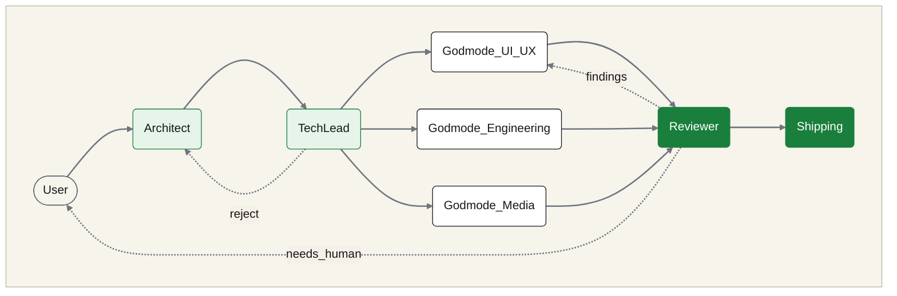

<p align="center"><sub><b>Node roster.</b> The seven nodes of the graph and the edges that send work back: reject, findings and needs_human.</sub></p>

| Command | Machinery | Use when |
|---|---|---|
| `/startcycle` | Linear chain, file hand-offs in `production_artifacts/`. No state machine, no repair loop. `/startcycle --skill=<name> <goal>` forces a skill into every node. | A straightforward build with the agent roster but without the ceremony. |
| `/startcycle-graph` | The full graph: durable `state.json`, Reviewer repair loop, automated quality gate, human escalation. | Feature work where correctness matters more than speed and you want an audit trail. |
| `/startcycle-graph-user` | Throwaway 2-4 node fan-out. Nothing persistent. Model-tiered per role; uses Antigravity, OpenCode or Codex if installed, Claude Code subagents otherwise. | A one-off "spawn a few workers" in any project. |

### The three variants side by side

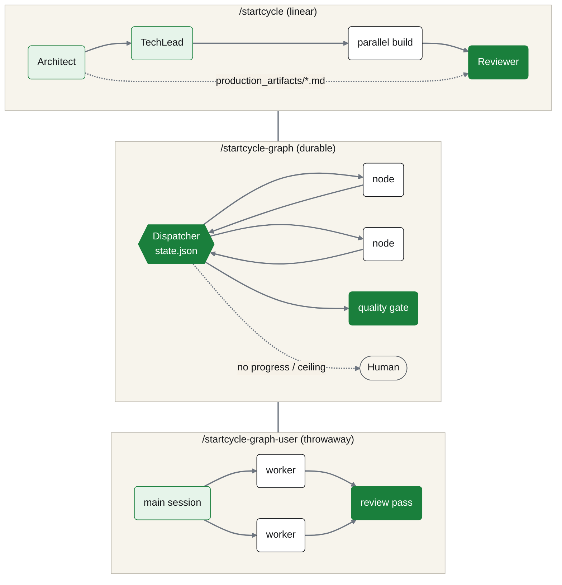

<p align="center"><sub><b>Three variants.</b> The linear chain, the durable dispatcher graph and the throwaway fan-out, side by side.</sub></p>

**What keeps the full graph honest.**

| Mechanism | What it prevents |
|---|---|
| Reviewer isolation | The Reviewer reads artifacts and the plan's contract, never the build node's reasoning or its claim that it is done. |
| No-progress guard | A repair cycle that reports the same blocking finding ID as the previous one escalates to a human instead of burning iterations. |
| Per-node state fragments | Parallel build nodes write `state.d/<node>.json`; the dispatcher merges. No lost-update race on one file. |
| Iteration ceiling | `max_iterations` (default 3) stops the loop unconditionally. |
| In-loop human edge | Any node can set `needs_human: true` and stop the run. |

### Orchestrator chain

**Mapping.** `master session -> project orchestrator -> package orchestrator` is a convention. This is how each hop maps to mechanisms that exist ([docs/orchestrator-chain.md](docs/orchestrator-chain.md), skill `orchestrator-chain`):

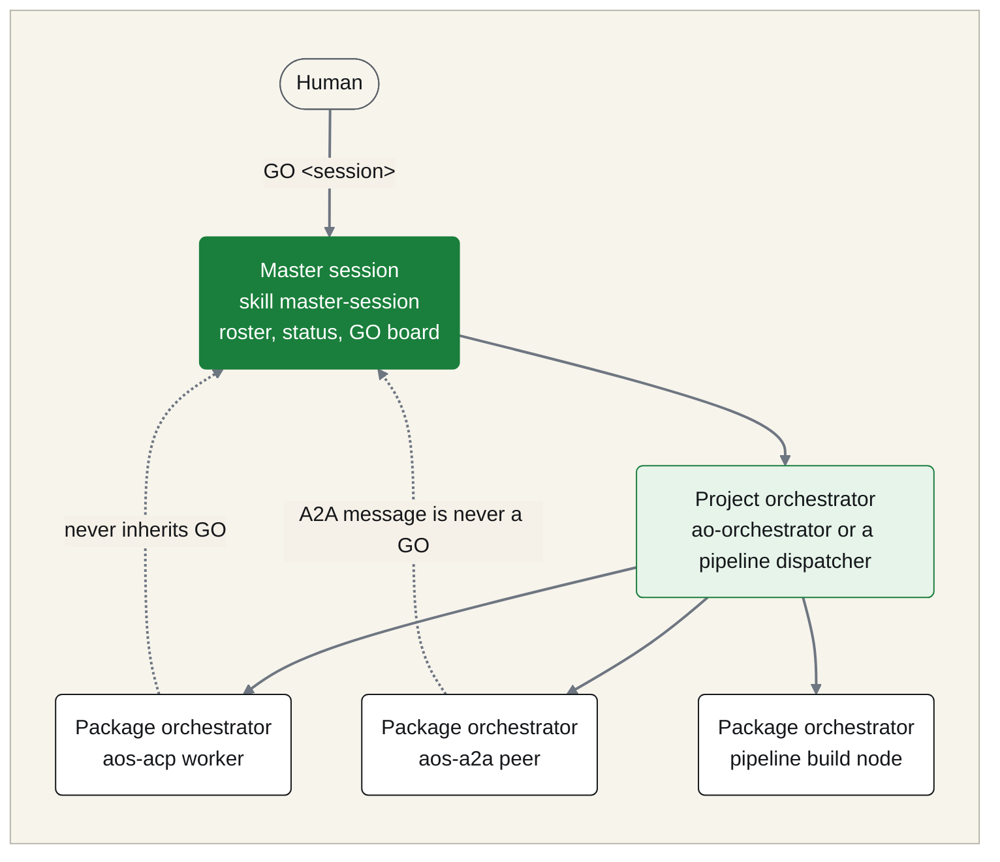

<p align="center"><sub><b>Orchestrator chain.</b> Each hop from the human down to a package orchestrator, with dashed edges showing that a GO is never inherited upward.</sub></p>

**Depth.** A2A rejects a send when the caller's depth is at or above `AOS_A2A_MAX_DEPTH` (default 1) and `mcsc` is one level deep. Workers delete nothing; cleanup is the dispatcher's job after your GO.

---

## The GO gate

Reaching `ready_to_ship` is not shipping. [`.claude/hooks/go-gate.mjs`](.claude/hooks/go-gate.mjs) is a `PreToolUse` hook that blocks `git push`, `npm publish`, `npm version` and recursive `rm` unless your immediately preceding message is the literal word **GO**. It is a hook, not a rule an agent is asked to respect: it fires before any permission-mode check and cannot be argued around. The installer wires the same gate into Antigravity, Codex and OpenCode; on harnesses without hook support the rule in [AGENTS.md](AGENTS.md) applies and the agent is the enforcement. A subagent never inherits its orchestrator's GO, and a failed release command needs a fresh one.

**What v5 adds.**

- **Read-only work stays fast.** Read, test and build commands with no write or network effect pass without a GO, also after peer messages.
- **An A2A message is never a GO.** Every injected message carries that line.
- **Modes and grants.** Gate mode (`hard`, `soft`, `off`) and time-limited grants are shown by `aos-gogate status` and the `gogate` skill. `aos-gogate` is read-only and never records a grant.
- **Deny logs mask credentials** (bearer tokens, flags, URLs with credentials).
- **Limit.** The hook sees tool calls the harness routes through it. A worker started with permissions bypassed asks for nothing, so the in-harness hook stays the main layer.

---

## Playbooks

A playbook is a skill with `kind: playbook` that turns a recurring job into a guided run with a fixed contract. The 34 `pb-*` playbooks ship with the skills; list and start them with `/playbooks` (it runs `list-playbooks.mjs` and prints name, time, difficulty and requirements for each).

**What a playbook declares.** Its frontmatter names trigger phrases, `inputs`, `requires` (skills, subagents, MCP servers, store items), `go_points`, `outputs`, a `verify` check, `difficulty` and `est_time`. The body is a numbered step list. Each step names the skill or agent it uses, its input, the artifact it writes and the check that says it is done.

**How a run works.**

- **One session by default.** The main session walks the steps and calls the required skills. Every step appends one line to a run log (`production_artifacts/pb-<name>-<date>.md`, never committed).
- **Subagents where it matters.** Steps marked `(agent)` run a subagent: `reviewer` in `pb-bug-fix`, `pb-ship` and `pb-release-aos`; `architect`, `techlead` and `reviewer` in `pb-harness-work`, `pb-idea-to-launch` and `pb-redesign-app`; `security-reviewer` and `silent-failure-hunter` in `pb-security-sweep`; `opensource-forker` and `opensource-sanitizer` in `pb-open-source`. On a harness without subagents the main session reads the agent file and runs the same contract inline. `pb-master` goes one step further and runs a control session over several Claude Code, Codex or OpenCode sessions.
- **GO points are part of the contract.** A `[GO]` step stops with `WAITING FOR GO: <step>` until you type **GO**; one GO covers one step, once. The go-gate hook is only the backstop. A failed check stops the run and is written into the log; nothing is retried silently.

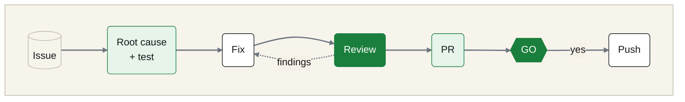

<p align="center"><sub><b>pb-bug-fix.</b> The issue is the contract, the test comes before the fix, the Reviewer sees only the diff and the issue, and the push waits for your GO.</sub></p>

<details>
<summary><b>Playbooks by domain (34)</b></summary>

| Playbook | Purpose | Subagents | Time · level |
|---|---|---|---|
| **Build and code** | | | |
| `pb-bug-fix` | Turn a GitHub issue into a tested fix on a branch with an open PR. | reviewer | 30-90 min · intermediate |
| `pb-project-new` | Start a new private GitHub project the AOS way. | — | 20-40 min · intermediate |
| `pb-idea-to-launch` | Turn an idea into a deployed prototype. | architect, techlead, reviewer | 2-6 h · advanced |
| `pb-harness-work` | Change the agent harness itself (hooks, gates, memory, permissions, plugins) the safe way. | architect, techlead, reviewer | 1-3 h · advanced |
| `pb-security-sweep` | Security sweep over one repo: secrets, dependencies, diff, one ranked findings report. | security-reviewer, silent-failure-hunter | 1-2 h · advanced |
| `pb-open-source` | Prepare a project for open sourcing: sanitized fork, sanitizer verdict, README and LICENSE, new private repo. | opensource-forker, opensource-sanitizer | 1-3 h · advanced |
| `pb-worktrees-land` | Clean up git worktrees across your repos; removes only merged ones. | — | 10-30 min · intermediate |
| **Release, CI and operations** | | | |
| `pb-ship` | Ship the day's work in one repo: triage, review every open PR, merge. | reviewer | 20-60 min · intermediate |
| `pb-release-aos` | Release a new AOS version to npm through the release-please PR, merged only after GO. | reviewer | 30-60 min · advanced |
| `pb-ci-fix` | Fix red CI or set up GitHub Actions end to end; push only after GO. | — | 15-45 min · intermediate |
| `pb-deploy-saas` | Deploy a SaaS app to the BDB fleet: preflight, guardrail plan, green CI, deploy after GO, health check. | — | 30-90 min · advanced |
| `pb-health-weekly` | Weekly health report over the BDB repos: version drift and CI status. | — | 15-30 min · intermediate |
| **Design and web** | | | |
| `pb-landing-page` | Build and launch a landing page: confirmed copy, brand tokens, UI and SEO review, deploy after GO. | — | 1-3 h · intermediate |
| `pb-redesign-app` | Overhaul one app's UI against an audit. | architect, techlead, reviewer | 2-4 h · advanced |
| `pb-docs-site` | Publish a project's docs as a static HTML manual on GitHub Pages. | — | 30-90 min · intermediate |
| `pb-newsletter` | Turn a recap or changelog range into a newsletter draft where every claim cites a source line. | — | 20-40 min · intermediate |
| **Media and event tech** | | | |
| `pb-show-build` | Build a show across lights (grandMA3), media (Resolume) and visuals (TouchDesigner) from one cue list, offline first. | — | 2-6 h · advanced |
| `pb-crew-call-sheet` | Build a crew call sheet and a load-in / load-out plan for one show day; send to the crew only after GO. | — | 10-20 min · beginner |
| `pb-event-tracker` | One spreadsheet for an event: guests, vendors, timeline, budget, with vendor messages drafted. | — | 20-40 min · intermediate |
| `pb-clip-from-moodboard` | Turn a look brief and reference images into a finished social clip. | — | 1-3 h · advanced |
| `pb-image-to-3d` | Turn one reference image into a cleaned, scaled 3D asset. | — | 30-90 min · advanced |
| `pb-launch-video` | Turn a live app or landing page into a short launch video. | — | 30-90 min · intermediate |
| `pb-social-pack` | Turn a release recap into a social pack where every claim traces to a facts file. | — | 30-60 min · intermediate |
| **Hardware** | | | |
| `pb-pcb-to-case` | From a KiCad board to a parametric OpenSCAD enclosure that fits it. | — | 1-3 h · advanced |
| **Management and office** | | | |
| `pb-offer` | Draft a client offer with line items priced only from your price list; send only after GO. | — | 10-20 min · beginner |
| `pb-invoice-check` | Check invoices and receipts line by line against your offers. Nothing is paid or sent. | — | 10-20 min · beginner |
| `pb-inbox-zero` | Sort an email backlog into reply, delegate, archive and ignore, and draft the replies. | — | 10-20 min · beginner |
| `pb-meeting-actions` | Turn a meeting transcript into notes, decisions and owners; send the follow-up only after GO. | — | 10-20 min · beginner |
| `pb-handover` | Write a handover note for a colleague from the state of a project folder. | — | 10-20 min · beginner |
| `pb-week-plan` | Turn scattered to-do lists and notes into one prioritised plan for the week. | — | 10-20 min · beginner |
| `pb-focus-chunks` | Split one big task into chunks of at most 25 minutes, each with a done-check. | — | 5-10 min · beginner |
| `pb-todo` | Turn one sentence into a task line in the right to-do list. | — | 2-5 min · beginner |
| **Machine and sessions** | | | |
| `pb-machine-setup` | Bring a new machine to a verified AOS installation. | — | 30-60 min · intermediate |
| `pb-master` | One control session over several Claude Code, Codex or OpenCode sessions: roster, status board, GO board. | — | 15 min setup, then session-long · advanced |

</details>

---

## Factory

**What it is.** Four experimental skills that turn feedback, telemetry, errors, issues and pull requests into a repeatable review loop: collect and triage, look back for systemic causes, review PRs, and hand you a digest of what still needs a human. In AOS they report and draft; every external write waits for your GO. `plan-arbiter` ships alongside them for comparing competing plans.

### The loop

| Skill | Reads | Writes | Needs GO? |
| --- | --- | --- | --- |
| `factory-collect` | the sources in `workflows.collect.sources` | triage report, draft replies, proposed close wording; optional local fix | Reply, close, push, merge, publish |
| `factory-lookback` | configured sources over a bounded period, prior fixes | pattern report; optional local systemic fix | Reply, close, publish, merge |
| `factory-review-prs` | PRs matching the configured filters | per-PR findings, draft comments, approval and merge readiness | Reply, approve, merge |
| `factory-human-digest` | configured repositories and sources (default last 7 days) | decision queue, nothing else | Read-only |

### How to run

- **Invoke by name.** Ask the agent to run the skill, for example `factory-collect`; each `SKILL.md` carries a "Use when" trigger. Start by hand and read the report before enabling anything scheduled.
- **Configure.** `.agent-factory/config.yaml`, read by all four skills. Keys named in the skills: `workflows.collect.sources`, `workflows.collect.implement`, `workflows.lookback`, `workflows.lookback.implement`, `workflows.human-digest`, and an optional `skill_prompts.<skill-name>` per skill. If the file is missing the skill stops and asks; it never creates it.
- **The GO rule.** Nothing in the config opens the go-gate. `git push`, `gh pr merge`, `gh release create` and every reply, comment, approval, close or status change need your literal GO for that exact action. Scheduled or unattended runs are read-only.

Vendored from [BuilderIO/skills](https://github.com/BuilderIO/skills) (MIT) with AOS safety changes, see [THIRD_PARTY_NOTICES.md](THIRD_PARTY_NOTICES.md); upstream docs: https://github.com/BuilderIO/skills/blob/main/docs/factory/README.md.

Details: [docs/factory.md](docs/factory.md).

---

## A2A: sessions that talk to each other

<p align="center">
  <picture><source media="(prefers-color-scheme: dark)" srcset="docs/assets/readme/a2a-logo-white.svg"></picture><br/>
   
</p>

Live Claude Code, OpenCode, agy and Codex sessions exchange messages on localhost. Each live session runs a small sidecar bound to `127.0.0.1` on a random port with a per-session bearer token and registers in a local registry. There is no central service.

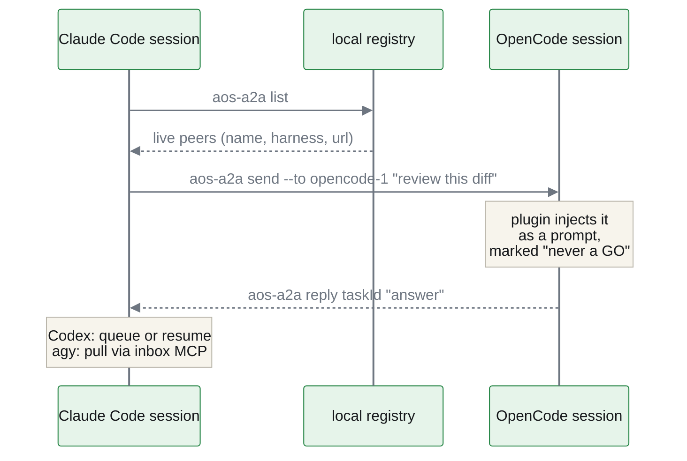

<p align="center"><sub><b>A2A message flow.</b> A Claude Code session lists live peers in the local registry, sends a message to an OpenCode session and gets the reply back.</sub></p>

```bash
aos-a2a list                              # live peers
aos-a2a send --to <name> "<text>"         # message a session
aos-a2a reply <taskId> "<answer>"         # answer an incoming message
```

Inbound per harness: Claude Code drains the inbox in a hook, OpenCode gets a plugin injection, Codex gets `codex queue` or `codex exec resume`, agy pulls through an inbox MCP (a running interactive agy session cannot be pushed into). For other channels use `mcsc` (one-shot task) or `aos-acp` (worker that may need a GO): [docs/delegation-routing.md](docs/delegation-routing.md). Details: [docs/a2a.md](docs/a2a.md). **In progress:** intercom and a2abook on top of A2A.

---

## Tools

<p align="center"><br/><sub><b>Tool landscape.</b> The universal harness on top, with the AOS tools and optional modules below it.</sub></p>

<details>
<summary><b>Original v3.4.0 overview sketch</b></summary>

<p align="center"><br/><sub><b>v3.4.0 overview.</b> Conceptual sketch from v3.4.0; components have grown since, and the table below is current.</sub></p>

</details>

| Tool | Command | What it does |
|---|---|---|
| Plan Canvas | `aos-plan-canvas open <file>` (skill `plan-canvas`) | Opens a plan or HTML artifact in a local browser canvas where you annotate elements, chat, and approve or request changes. Plans from the pipelines open here by default. |
| agenttrail | `aos-trail` (skill `agenttrail`, port 5330) | Live board of a multi-agent build: which component, which agent or harness, what is done, what is stuck. Fed by the trail-relay hooks, `mcsc` and `aos-acp`. |
| archify | `aos-archify` (skill `archify`) | Validated architecture, sequence, data-flow and state diagrams as standalone HTML with SVG export; accepts Mermaid. |
| AOS Store | `aos store list \| search <q> \| install <name> [--project]`, `aos store ui` (also `aos-store`, slash command `/aos-store`) | Browse and install AOS Core, ECC and Scenario (scenario-labs/skills, MIT) skills and agents; required skills are installed together and every file is SHA-256 verified. The web UI on `http://127.0.0.1:4322` shows what is installed, previews the exact target paths, and installs only after you confirm. `list` and `search` read a pinned offline index. |
| Launchpad | `aos-dashboard [--port 7900] [--no-open]` | One page with every local BDB service (memB, Synapse, OpenWiki, AO, Remote, AOS Store): status, start/stop, logs. Registered as an autostart entry. |
| Doctor | `aos doctor [--json] [--net]` (also `aos-doctor`) | Verifies dependencies, skill placement per harness, daemons, hooks, modules and the MCP gateway; exits 1 when something needs attention. The first thing to run when anything misbehaves. |
| Fleet band | Claude Code mod `plugins/bdb-aos-fleet` | Two-line band: gate mode (click it for the gate pane), token-weather, sessions that work or wait with GO counts, and the active projects. Needs Claude Code >= 2.1.287; opt out with `AOS_NO_FLEET=1`. |
| GO helper | `aos-gogate status [--session <id>] \| preset <name> \| presets` | Read-only gate status and preset texts. Never records a grant. |
| A2A | `aos-a2a list \| send \| reply \| status \| cancel` | Messages between live harness sessions. |
| MCP gateway | `aos-gateway status \| enable \| direct \| adopt` | One local endpoint for shared MCP servers. Opt-in. |
| Config | `aos-config show \| propose \| set <key> <value>` | Machine-level `~/.agents/aos-config.json`: workspace root, domains, user id. |
| mcsc | MCP tools `delegate_agy`, `delegate_opencode`, `delegate_codex`, `delegate_smart` (skill `mcsc`) | Delegates a task to another installed CLI harness and streams its tool calls to agenttrail. Preferred over shelling out to the CLI. |

### Fleet band and token-weather

**Token-weather.** The fleet mod turns the context percent of a session into a weather word with advice and a sparkline: for example `ok` at low use, `compact soon` around 80 percent, `compact or start a new session` above 90. The same band lists your Claude sessions, which work, which wait for you, and how many GO requests each has pending. Source: `plugins/bdb-aos-fleet`.

---

## MCP servers

[`mcp_config.json`](mcp_config.json) defines <!-- count:mcps -->21<!-- /count --> local stdio servers, built or warmed by the installer from `mcps/`. They reach your harnesses in one of two ways:

- **Direct (default).** Each server is written into every harness's MCP configuration, so every harness sees the same tool set.
- **Through the MCP gateway (opt-in).** Every harness gets one `aos` entry pointing at `127.0.0.1:7790`; behind it, [1mcp](https://github.com/1mcp-app/agent) runs the servers on the gateway allow list once for all harnesses. `aos-gateway adopt` moves your own local servers behind it too, and `aos-gateway direct` switches back. deja, memB, mcsc and the OS-control servers always stay direct.

The column "Routing" says which path a server takes when the gateway is on; "Reaches the app via" says how it talks to its application. API keys and tokens live in `~/.aos/secrets.env` (mode 0600), never inline in a harness config: [docs/mcp-secrets.md](docs/mcp-secrets.md).

| Server | App | Reaches the app via | Routing | Skill |
|---|---|---|---|---|
| **3D / CAD** | | | | |
| `bdb_blender_mcp` | Blender | socket integration; the official Blender MCP is picked instead when Blender >= 5.1 is found | gateway (official pick: direct) | `bdb-blender-mcp` |
| `bdb_rhino_mcp` | Rhino 3D, Grasshopper | McNeel Yak router, needs Rhino on the host | direct | `bdb-rhino-mcp` |
| `bdb_rhino_mcp_fallback` | Rhino 3D | GOLEM 3D (105 tools) | direct | `bdb-rhino-mcp` |
| `bdb_unreal_mcp` | Unreal Engine 5 | Web Remote Control API, port 30010 | gateway | `bdb-unreal-mcp` |
| **Video / post** | | | | |
| `bdb_davinci_mcp` | DaVinci Resolve | Resolve scripting API (162 tools) | gateway | `bdb-davinci-mcp` |
| `bdb_after_effects_mcp` | After Effects | pinned `@kumoproductions/mcp-aftereffects`, Node >= 24; legacy server only with `AOS_AE_MCP=legacy` | gateway | `bdb-after-effects-mcp` |
| `bdb_after_effects_mcp_fallback` | After Effects | Go server, ExtendScript | direct | `bdb-after-effects-mcp` |
| `adobe_uxp_mcp` | Photoshop, Illustrator, Premiere Pro, After Effects | UXP WebSocket bridge | gateway | `bdb-adobe-suite-mcp` |
| **Show control / live** | | | | |
| `bdb_grandma3_mcp` | grandMA3 | typed `ma3_*` tools, OSC/UDP port 8000 | gateway | `bdb-grandma3-mcp` |
| `bdb_resolume_mcp` | Resolume Arena | REST API, port 8080; the official Arena server is picked when its binary is found | gateway (official pick: direct) | `bdb-resolume-mcp` |
| `bdb_td_minddesigner` | TouchDesigner | MindDesigner bridge, port 9980 | direct | `bdb-touchdesigner-mcp` |
| `bdb_td_backup` | TouchDesigner | stdio bridge, fallback | direct | `bdb-touchdesigner-mcp` |
| **Design / browser** | | | | |
| `open_design_mcp` | Open Design | local daemon on 127.0.0.1:3000 | gateway | — |
| `chrome-devtools` | Chrome | Puppeteer | direct | — |
| **OS control** | | | | |
| `zavora_computer_use` | macOS, Linux desktop | `npx -y @zavora-ai/computer-use-mcp@7.4.0`, native Rust module bundled in the npm package | direct | `bdb-computer-use-mcp` |
| `bdb_windows_computer_use` | Windows desktop | Win32, COM, UIAutomation, local Tesseract OCR | direct | `bdb-computer-use-mcp` |
| **Memory / infra** | | | | |
| `memb_mcp` | memB | local SQLite + ONNX, WebUI on port 8088 | direct | `memb-skill`, `bdb-memb-mcp` |
| `deja` | agent transcripts | local index, secrets redacted | direct | `deja-memory` |
| `mcsc` | other harnesses | spawns agy, OpenCode or Codex and streams to agenttrail | direct | `mcsc` |
| `github` | GitHub | `@modelcontextprotocol/server-github` | gateway | `github` |
| `bdb_remoteos_mcp` | RemoteOS | multi-cloud gateway with 4-eyes approval | direct | — |

**Routing.** The allow list in `lib/gateway/config.js` decides: the nine servers marked `gateway` are shared through the one `aos` entry once you enable it; everything else stays direct in every harness.

### MCP gateway and one MCP per app

**One MCP per app.** For Blender, Resolume and After Effects the installer keeps a single candidate (`mcp_picks.json`): Blender official when Blender >= 5.1 is found, Resolume official when the Arena binary is found, the bundled server otherwise. The After Effects server is a pinned `npx` package and needs Node >= 24 (the legacy server only with `AOS_AE_MCP=legacy`).

**Gateway (opt-in).** `aos-gateway` runs a token-checking forwarder on `127.0.0.1:7790` in front of `@1mcp/agent` and shares an allow list of shipped servers behind one `aos` entry per harness. `aos-gateway adopt` moves your own local stdio servers behind it (skipping remote entries and entries with inline secrets). `aos-gateway direct` reverses everything. The token stops browsers, not other local processes. `deja`, `memb_mcp` and `mcsc` stay direct.

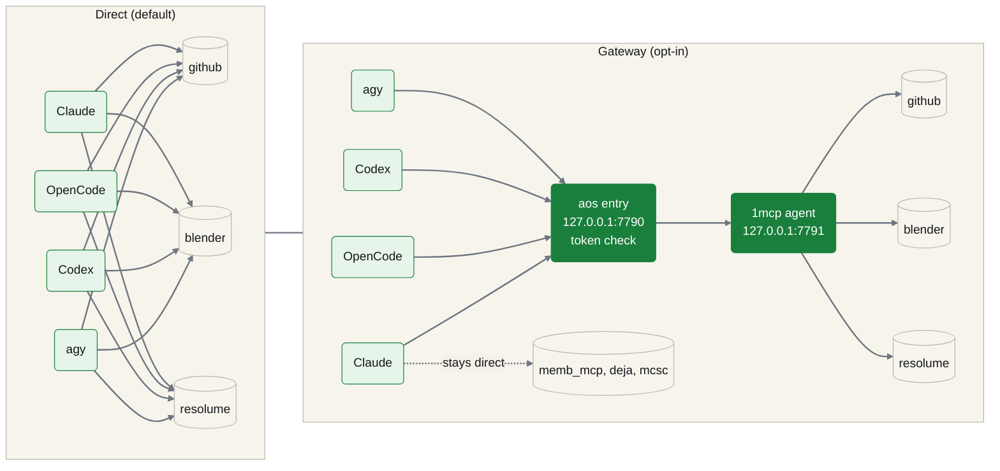

<p align="center"><sub><b>Direct and gateway routing.</b> By default every harness talks to each server directly; with the gateway enabled they share one aos entry in front of the 1mcp agent.</sub></p>

**Reference.** [docs/mcp-gateway.md](docs/mcp-gateway.md).

---

## Plugins and marketplace

**Plugin manifest.** `.claude-plugin/plugin.json` + `marketplace.json` (generated by `npm run plugin:build`). Inside Claude Code you can add the marketplace with `/plugin marketplace add hybridlabor-api/aos` and install `bdb-aos@bdb-marketplace` (skills and subagents) or `bdb-aos-fleet@bdb-marketplace` (the fleet band for Claude Code). The marketplace route carries skills and subagents only; the npm installer above is the recommended route because it also sets up gate hooks and MCP servers.

**Skills discovery.** Every harness finds skills in its native directory (`~/.claude/skills`, `~/.agents/skills`, `~/.codex/skills`, `~/.roo/skills`, etc.). To browse and install additional skills after install:

```bash
npx skills add hybridlabor-api/aos
```

This discovers all <!-- count:skills -->264<!-- /count --> curated skills and installs them into the universal `~/.agents/skills` directory (used by all harnesses and the AOS CLI).

---

## AOS CLI

A lightweight CLI harness built on [pi](https://github.com/earendil-works/pi), a coding agent that runs in the terminal. AOS CLI reads `~/.agents/skills` (written by the installer) and `~/.agents/AGENTS.md` (the dispatcher graph as system instructions), runs no MCP servers of its own, and needs **Node >= 22.19** (pi's floor, higher than the main AOS installer).

```bash
aos-cli "what is the fastest way to fix this bug"
aos-cli --continue                    # resume the previous session
```

The CLI launcher (`packages/aos-cli/bin/aos-cli.mjs`) ships with an AOS-themed dark mode (`aos.json`), the ten core skills from `core-skills.json` (ask-tim, aos-setup, systematic-debugging, archify, etc.), and two in-session read-only commands (`/aos` shows the install menu; `/aos-status` runs the health check).

Install it through the AOS installer with the AOS CLI target: `npx -y @hybridlabor-api/aos@latest -y --platforms=10`. The package is private and is not published on npm, so `npm i -g @hybridlabor-api/aos-cli` does not work.

---

## Memory and knowledge

Installed as optional modules by the installer; `aos doctor` verifies them and the Launchpad shows them.

- **memB** (`@hybridlabor-api/memb`): local, offline vector memory with an MCP server (`add_memory`, `search_memory`, `list_memories`, `delete_memory`), a WebUI on port 8088, and an ambient hook that injects relevant memories into Claude Code sessions. Skills: `memb-skill`, `memb-ingest`, `bdb-memb-mcp`.
- **deja** (`@vshulcz/deja-vu`, installed with memB): indexes your agent transcripts locally with secrets redacted; `deja fix` on an error, `deja wip` when resuming, `deja search` for past sessions. Skill: `deja-memory`.
- **OpenWiki** (`openwiki` CLI): generates and refreshes a grounded wiki of a codebase, with a visualizer on port 4321 and a background daemon. Skill: `openwiki-skill`; this repo's own wiki is under [`.openwiki/`](.openwiki/quickstart.md).
- **Synapse** (`@hybridlabor-api/bdb-synapse`): renders a repository as a 3D code city and replays agent sessions through it. Skill: `synapse-integration-skill`.

`aos-setup` brings a machine to a verified state for all four; `aos-project-init` binds one project to them (slug, wiki, memory, `AGENTS.md`).

---

## What's included

### The subagents (21)

**Roster.** The dispatcher graph compiles these agents, available as Claude Code subagents and loadable into Antigravity, Cursor, Codex, OpenCode and others:

| Agent | Purpose |
|---|---|
| **Architect** | Turns the user's goal into a system plan. Reads existing architecture before proposing changes. |
| **TechLead** | Reviews the plan for a capability map (module boundaries, dependency direction, build order) before any build node starts. Approves or rejects back to Architect. |
| **UI_UX** | Lead Frontend Designer. Enforces Anti-Slop principles, DTCG design tokens, high-agency frontend taste, and fluid motion dynamics. |
| **Engineering** | Senior Fullstack & Backend Engineer. Enforces Domain-Driven Design, Clean Architecture, TDD cycles, and database best practices. |
| **Media_EventTech** | Creative-Tech & Show-Control Specialist. Governs 3D modeling, TouchDesigner networks, DaVinci Resolve, lighting, and Resolume. |
| **Reviewer** | Adversarial review of build-node output against the plan's contract. Modeled on doubt-driven-development discipline. |
| **Shipping** | Release Gatekeeper & QA Auditor. Runs the automated quality gate (lint, typecheck, tests, a11y, seo) and enforces the GO gate. |
| **Database Reviewer** | PostgreSQL specialist for query optimization, schema design, security, and performance. |
| **Security Reviewer** | Security vulnerability detection and remediation. Flags secrets, SSRF, injection, unsafe crypto, and OWASP Top 10. |
| **Silent-Failure Hunter** | Reviews code for silent failures, swallowed errors, bad fallbacks, and missing error propagation. |
| **Go-Build Resolver** | Resolves Go build, vet, and compilation errors with minimal changes. |
| **Opensource Forker** | Forks a project for open-sourcing: strips secrets, replaces internal references, generates `.env.example`. |
| **Opensource Sanitizer** | Verifies an open-source fork is fully sanitized. Scans for leaked secrets, PII, internal references. |

### Skills by category

**Categories.** <!-- count:skills -->264<!-- /count --> curated skills, discoverable by every harness (the full generated catalog is in the next section):

- **bdb-core**: Core AOS infrastructure, pipelines, tools, and utilities: `startcycle`, `startcycle-graph`, `startcycle-graph-user`, `agenttrail`, `plan-canvas`, `aos-a2a`, `aos-gateway`, `aos-store`, `master-session`, and more.
- **design-ui-ux**: Frontend, UI design, accessibility, tokens, motion, anti-slop: `senior-frontend`, `ui-component`, `ui-review`, `tailwind-patterns`, `shadcn`, `wcag-audit-patterns`, and more.
- **engineering-method**: Architecture, testing, debugging, CI/CD, code quality: `software-architecture`, `test-driven-development`, `systematic-debugging`, `ci-pipeline`, `github-actions-generator`, `dockerfile-validator`, and more.
- **library**: Language and framework specifics: TypeScript, Node.js, Python, React, Postgres, Prisma, Next.js, Drizzle ORM, Go, and more.
- **media-eventtech**: 3D, video, show control, spatial design: `godmode-eventtech`, `threejs-skills`, the creative-software MCP skills, and more.
- **engineering-hardware**: PCB and electrical design: `godmode-hardware-pcb`.

### Browse everything

**Generated catalog.** Built from the repo files (frontmatter of every `SKILL.md`, `agents/`, `commands/`). Open a section to see names and one-line descriptions.

<!-- BEGIN GENERATED CATALOG: regenerate from the repo, do not hand-edit -->

<details>
<summary><b>Harnesses (9)</b></summary>

| Harness | Skills | Subagents | Hooks and gates | MCP | Extras |
|---|:---:|:---:|:---:|:---:|---|
| Claude Code / Desktop | yes | yes | yes (GO gate, graph gate, env-file protection, Conventional Commits, memB inject, trail relay, A2A inbox) | yes | slash commands, fleet band, plugin manifest |
| Google Antigravity (agy) | yes | yes | gate-only hooks | yes | `/bdb-aos:<cmd>` commands, inbox MCP for A2A |
| Codex CLI | yes | yes | GO gate, graph gate | yes | `$bdb-aos:<cmd>` commands, A2A queue/resume |
| OpenCode | yes | yes | via `bdb-aos.js` plugin | yes | `/bdb-aos-<cmd>` commands, A2A inject |
| Cursor | yes | no | no | yes | `.cursor/rules` |
| Windsurf | yes | no | no | yes | `mcp.json` |
| Roo Code / Cline | yes | no | no | yes | `.roomodes` |
| Aider | yes | no | no | no | none |
| AOS CLI (pi) | yes | system prompt | no | no | 10 core skills, dark theme |

</details>

<details>
<summary><b>Tools and CLIs (12)</b></summary>

| Command | What it does |
|---|---|
| `aos` | Installer menu: update, doctor, reconfigure, uninstall. |
| `aos doctor` | Verify dependencies, skill placement, daemons, hooks, modules, gateway. |
| `aos store` | Browse and install skills and agents (CLI and web UI on port 4322). |
| `aos-plan-canvas` | Open plans and HTML artifacts in the annotation canvas (port 4519). |
| `aos-trail` | agenttrail live map (port 5330). |
| `aos-archify` | Architecture and sequence diagrams as standalone HTML. |
| `aos-dashboard` | Launchpad for local services (port 7900). |
| `aos-a2a` | List, send to and reply to live harness peers. |
| `aos-acp` | Start workers whose guarded commands need a GO token. |
| `aos-gateway` | Local MCP gateway: serve, enable, direct, adopt, status. |
| `aos-gogate` | Read-only gate status and presets. |
| `aos-config` | Machine-level AOS configuration. |

</details>

<details>
<summary><b>MCP servers (21)</b></summary>

| Server | Domain |
|---|---|
| `github`, `chrome-devtools` | Issues, PRs, workflows; browser automation and debugging |
| `bdb_unreal_mcp` | Unreal Engine (Web Remote Control, port 30010) |
| `bdb_rhino_mcp`, `bdb_rhino_mcp_fallback` | Rhino 3D and Grasshopper |
| `bdb_davinci_mcp` | DaVinci Resolve |
| `bdb_grandma3_mcp` | grandMA3 (typed `ma3_*` tools) |
| `bdb_resolume_mcp` | Resolume Arena (REST, port 8080) |
| `adobe_uxp_mcp` | Adobe UXP bridge |
| `bdb_blender_mcp` | Blender |
| `bdb_after_effects_mcp`, `bdb_after_effects_mcp_fallback` | After Effects |
| `bdb_td_minddesigner`, `bdb_td_backup` | TouchDesigner (port 9980) |
| `zavora_computer_use`, `bdb_windows_computer_use` | Desktop control on macOS and Linux, and on Windows |
| `memb_mcp`, `deja` | Local memory and transcript search |
| `mcsc` | Delegation to other harnesses |
| `open_design_mcp` | Open Design |
| `bdb_remoteos_mcp` | RemoteOS multi-cloud gateway with 4-eyes approval |

</details>

<details>
<summary><b>Skills (229)</b></summary>

<details>
<summary><b>library (98)</b></summary>

| Skill | What it does |
|---|---|
| `ai-agent-development` | AI agent development workflow for building autonomous agents, multi-agent systems, and agent orchestration with CrewAI, LangGraph, and custom agents. |
| `ai-product` | Every product will be AI-powered. |
| `api-design-principles` | Master REST and GraphQL API design principles to build intuitive, scalable, and maintainable APIs that delight developers and stand the test of time. |
| `api-patterns` | API design principles and decision-making. |
| `apify-lead-generation` | Scrape leads from multiple platforms using Apify Actors. |
| `apify-ultimate-scraper` | AI-driven data extraction from 55+ Actors across all major platforms. |
| `bash-linux` | Bash/Linux terminal patterns. |
| `brainstorming` | Use before creative or constructive work (features, architecture, behavior). |
| `browser-automation` | Browser automation powers web testing, scraping, and AI agent interactions. |
| `cloudflare-workers-expert` | Expert in Cloudflare Workers and the Edge Computing ecosystem. |
| `copywriting` | Write rigorous, conversion-focused marketing copy for landing pages and emails. |
| `crewai` | Expert in CrewAI, the leading role-based multi-agent framework. |
| `database-design` | Database design principles and decision-making. |
| `debugger` | Debugging specialist for errors, test failures, and unexpected behavior. |
| `deep-research` | Run autonomous research tasks that plan, search, read, and synthesize information into comprehensive reports. |
| `docker-expert` | Advanced Docker containerization: optimization, security hardening, multi-stage builds, orchestration. |
| `documentation` | Documentation generation workflow covering API docs, architecture docs, README files, code comments, and technical writing. |
| `drizzle-orm-expert` | Expert in Drizzle ORM for TypeScript: schema design, relational queries, migrations, and serverless database integration. |
| `firecrawl` | Search, scrape, and interact with the web via the Firecrawl CLI. |
| `firecrawl-agent` | AI-powered autonomous data extraction that navigates complex sites and returns structured JSON. |
| `firecrawl-build` | Integrate Firecrawl into product code for web scraping, crawling, searching, and interaction. |
| `firecrawl-build-interact` | Integrate Firecrawl `/interact` into product code for dynamic pages and browser actions after scraping. |
| `firecrawl-build-onboarding` | Get Firecrawl credentials and SDK setup into a project. |
| `firecrawl-build-scrape` | Integrate Firecrawl `/scrape` into product code for single-page extraction. |
| `firecrawl-build-search` | Integrate Firecrawl `/search` into product code and agent workflows. |
| `firecrawl-crawl` | Bulk extract content from an entire website or site section. |
| `firecrawl-download` | Download an entire website as local files: markdown, screenshots, or multiple formats per page. |
| `firecrawl-interact` | Control and interact with a live browser session on any scraped page. |
| `firecrawl-map` | Discover and list all URLs on a website, with optional search filtering. |
| `firecrawl-scrape` | Extract clean markdown from any URL, including JavaScript-rendered SPAs. |
| `firecrawl-search` | Web search with full page content extraction. |
| `gemini-api-dev` | The Gemini API provides access to Google's most advanced AI models. |
| `gemini-api-integration` | Use when integrating Google Gemini API into projects. |
| `geo-fundamentals` | Generative Engine Optimization for AI search engines (ChatGPT, Claude, Perplexity). |
| `git-advanced-workflows` | Master advanced Git techniques to maintain clean history, collaborate effectively, and recover from any situation. |
| `git-pr-review` | Generate a concise and structured PR description from commit history with minimal token usage. |
| `github` | Use the `gh` CLI for issues, pull requests, Actions runs, and GitHub API queries. |
| `github-actions-templates` | Production-ready GitHub Actions workflow patterns for testing, building, and deploying applications. |
| `github-workflow-automation` | Patterns for automating GitHub workflows with AI assistance. |
| `go-concurrency-patterns` | Master Go concurrency with goroutines, channels, sync primitives, and context. |
| `go-playwright` | Robust browser automation using Playwright Go. |
| `golang-pro` | Master Go 1.21+ with modern patterns, advanced concurrency, performance optimization, and production-ready microservices. |
| `landing-page-generator` | Generates high-converting Next.js/React landing pages with Tailwind CSS. |
| `linear-claude-skill` | Manage Linear issues, projects, and teams. |
| `llm-app-patterns` | Production-ready patterns for building LLM applications. |
| `llm-application-dev-ai-assistant` | Creating intelligent conversational interfaces, chatbots, and AI-powered applications. |
| `llm-prompt-optimizer` | Use when improving prompts for any LLM. |
| `llm-structured-output` | Get reliable JSON, enums, and typed objects from LLMs using response_format, tool_use, and schema-constrained decoding. |
| `local-llm-expert` | Master local LLM inference, model selection, VRAM optimization, and local deployment using Ollama, llama.cpp, vLLM, and LM Studio. |
| `microservices-patterns` | Microservices architecture patterns: service boundaries, inter-service communication, data management, resilience. |
| `modern-javascript-patterns` | Modern JavaScript (ES6+) features, functional programming patterns, and best practices. |
| `monorepo-management` | Build efficient, scalable monorepos that enable code sharing, consistent tooling, and atomic changes. |
| `n8n-code-javascript` | Write JavaScript code in n8n Code nodes. |
| `n8n-code-python` | Write Python code in n8n Code nodes. |
| `n8n-expression-syntax` | Validate n8n expression syntax and fix common errors. |
| `n8n-mcp-tools-expert` | Expert guide for using n8n-mcp MCP tools effectively. |
| `n8n-workflow-patterns` | Proven architectural patterns for building n8n workflows. |
| `neon-postgres` | Expert patterns for Neon serverless Postgres, branching, connection pooling, and Prisma/Drizzle integration. |
| `nextjs-app-router-patterns` | Next.js 14+ App Router architecture, Server Components, and modern full-stack React development. |
| `nextjs-best-practices` | Next.js App Router principles. |
| `notion-automation` | Automate Notion tasks via Rube MCP (Composio): pages, databases, blocks, comments, users. |
| `obsidian-markdown` | Create and edit Obsidian Flavored Markdown with wikilinks, embeds, callouts, and properties. |
| `openapi-spec-generation` | Generate and maintain OpenAPI 3.1 specifications from code, design-first specs, and validation patterns. |
| `os-scripting` | Operating system and shell scripting troubleshooting workflow for Linux, macOS, and Windows. |
| `playwright-skill` | General-purpose browser automation skill. |
| `posix-shell-pro` | Expert in strict POSIX sh scripting for maximum portability across Unix-like systems. |
| `postgres-best-practices` | Postgres performance optimization and best practices from Supabase. |
| `postgresql` | Design a PostgreSQL-specific schema. |
| `prisma-expert` | Prisma ORM: schema design, migrations, query optimization, relations modeling, and database operations. |
| `product-manager-toolkit` | Essential tools and frameworks for modern product management, from discovery to delivery. |
| `programmatic-seo` | Design and evaluate programmatic SEO strategies for creating SEO-driven pages at scale. |
| `python-patterns` | Python development principles and decision-making. |
| `python-performance-optimization` | Profile and optimize Python code using cProfile, memory profilers, and performance best practices. |
| `python-pro` | Master Python 3.12+ with modern features, async programming, performance optimization, and production-ready practices. |
| `rag-engineer` | Expert in building Retrieval-Augmented Generation systems. |
| `rag-implementation` | RAG implementation workflow: embedding selection, vector database setup, chunking strategies, retrieval optimization. |
| `react-best-practices` | Performance optimization guide for React and Next.js applications, maintained by Vercel. |
| `react-component-performance` | Diagnose slow React components and suggest targeted performance fixes. |
| `react-patterns` | Modern React patterns and principles. |
| `readme` | Technical writer for comprehensive project documentation. |
| `remotion` | Generate walkthrough videos from Stitch projects using Remotion with transitions, zooming, and text overlays. |
| `schema-markup` | Design, validate, and optimize schema.org structured data for eligibility, correctness, and measurable SEO impact. |
| `seo` | Run a broad SEO audit across technical SEO, on-page SEO, schema, sitemaps, content quality, AI search readiness, and GEO. |
| `seo-audit` | Diagnose and audit SEO issues affecting crawlability, indexation, rankings, and organic performance. |
| `seo-technical` | Audit technical SEO across crawlability, indexability, security, URLs, mobile, Core Web Vitals, and structured data. |
| `slack-automation` | Automate Slack workspace operations including messaging, search, channel management, and reactions via Composio. |
| `tanstack-query-expert` | Expert in TanStack Query (React Query), asynchronous state management. |
| `tmux` | Expert tmux session, window, and pane management for terminal multiplexing and persistent remote workflows. |
| `turborepo-caching` | Configure Turborepo for efficient monorepo builds with local and remote caching. |
| `typescript-pro` | Master TypeScript with advanced types, generics, and strict type safety. |
| `using-neon` | Neon serverless Postgres: autoscaling, branching, instant restore, scale-to-zero. |
| `vector-database-engineer` | Expert in vector databases, embedding strategies, and semantic search implementation. |
| `vercel-ai-sdk-expert` | Expert in the Vercel AI SDK. |
| `vercel-deployment` | Expert knowledge for deploying to Vercel with Next.js. |
| `web-artifacts-builder` | Build powerful frontend claude.ai artifacts. |
| `web-performance-optimization` | Optimize loading speed, Core Web Vitals, bundle size, caching strategies, and runtime performance. |
| `web-scraper` | Multi-strategy intelligent web scraping. |
| `zustand-store-ts` | Create Zustand stores following established patterns with proper TypeScript types and middleware. |

</details>

<details>
<summary><b>engineering-method (51)</b></summary>

| Skill | What it does |
|---|---|
| `agent-tool-builder` | Tools are how AI agents interact with the world: schema to error handling. |
| `agentic-harness-patterns` | Harness patterns for coding agents: memory, permissions, context engineering, delegation, skills, hooks, bootstrap. |
| `archify` | Validated architecture, workflow, sequence, data-flow, and state diagrams as explorable standalone HTML with inline SVG. |
| `architect-review` | Master software architect specializing in modern architecture. |
| `bash-script-generator` | Create, generate, write, or scaffold bash/shell scripts (.sh), automation, or CLI tools. |
| `bash-script-validator` | Validate, lint, audit, or fix bash/shell/.sh scripts via ShellCheck. |
| `bdb-computer-use-mcp` | Native Rust/Node and Python computer-use servers to control macOS, Windows, and Linux desktops. |
| `bdb-security-audit` | Security auditing, diff analysis, defensive checklists, and vulnerability testing. |
| `bdb-shipping-skill` | Problem-framing pre-flight, one-way/two-way door classification, ADR-lite decision logging, post-ship outcome loop. |
| `ci-pipeline` | Set up a complete CI/CD pipeline for a project. |
| `clean-code` | The principles of "Clean Code". |
| `concise-planning` | Generate a clear, actionable, atomic checklist for a coding task. |
| `dispatching-parallel-agents` | Use when facing 2+ independent tasks that can be worked on without shared state. |
| `dockerfile-generator` | Create, generate, or write Dockerfiles and multi-stage Docker images. |
| `dockerfile-validator` | Validate, lint, audit, or scan a Dockerfile for security and best practices. |
| `domain-modeling` | Build and sharpen a project's domain model. |
| `executing-plans` | Execute a written implementation plan in a separate session with review checkpoints. |
| `factory-collect` | Experimental workflow for collecting and triaging product feedback, telemetry, runtime errors, and issue reports. |
| `factory-lookback` | Experimental workflow for auditing recurring feedback, telemetry, and errors to find systemic fixes. |
| `factory-review-prs` | Experimental workflow for reviewing configured repositories' pull requests. |
| `finishing-a-development-branch` | Decide how to integrate finished work once implementation is complete and tests pass. |
| `github-actions-generator` | Create, generate, or scaffold GitHub Actions workflows and CI/CD pipelines. |
| `github-actions-validator` | Validate, lint, audit, fix GitHub Actions workflows. |
| `github-repo` | Standards and workflows for writing, sanitizing, and publishing high-quality GitHub repositories. |
| `godmode-engineering` | Strict Domain-Driven Design, TypeScript strictness, and Clean Architecture. |
| `godmode-shipping` | The final gatekeeper for production releases. |
| `grill-me` | A relentless interview to sharpen a plan or design. |
| `grill-with-docs` | Like grill-me, and builds the project's domain model (glossary and ADRs) as it goes. |
| `grilling` | Grill the user relentlessly about a plan, decision, or idea. |
| `makefile-generator` | Create, generate, or scaffold Makefiles with .PHONY targets and build automation. |
| `makefile-validator` | Validate, lint, audit, or check Makefiles and .mk files for errors. |
| `planning-with-files` | Use persistent markdown files as working memory on disk. |
| `pr-recap` | Visual recap page for a PR or git range: changed-files tree, per-file notes, Verified vs Not verified table, risks. |
| `prompt-engineer` | Transforms prompts into optimized prompts using frameworks (RTF, RISEN, Chain of Thought, and more). |
| `prompt-engineering-patterns` | Advanced prompt engineering techniques to maximize LLM performance, reliability, and controllability. |
| `prototype` | Build a throwaway prototype to answer a design question. |
| `read-the-damn-docs` | Read the docs before implementing, integrating, upgrading, or debugging anything third-party. |
| `requesting-code-review` | Verify work meets requirements after completing tasks or before merging. |
| `simplify-code` | Review a diff for clarity and safe simplifications, then optionally apply low-risk fixes. |
| `software-architecture` | Guide for quality-focused software architecture. |
| `subagent-driven-development` | Execute implementation plans with independent tasks in the current session. |
| `systematic-debugging` | Use on any bug, test failure, or unexpected behavior, before proposing fixes. |
| `tdd-workflow` | Test-Driven Development workflow principles. |
| `test-driven-development` | Use when implementing any feature or bugfix, before writing implementation code. |
| `triage` | Move issues and external PRs through a state machine of triage roles and write agent-ready briefs. |
| `using-git-worktrees` | Ensure an isolated workspace for feature work and plan execution. |
| `verification-before-completion` | Run verification commands and confirm output before claiming work is complete or passing. |
| `wcag-audit-patterns` | Audit web content against WCAG 2.2 with actionable remediation strategies. |
| `webapp-testing` | Test local web applications with native Python Playwright scripts. |
| `writing-plans` | Write a plan for a multi-step task from a spec, before touching code. |
| `writing-plans-legacy` | Superseded AOS-era version of writing-plans, kept for its terse plan template. |

</details>

<details>
<summary><b>bdb-core (40)</b></summary>

| Skill | What it does |
|---|---|
| `agent-manager-skill` | Manage multiple local CLI agents via tmux sessions with cron-friendly scheduling. |
| `agent-memory-mcp` | Hybrid memory system: persistent, searchable knowledge management for AI agents. |
| `agent-pipeline` | Reference for the seven-node dispatcher graph that /startcycle-graph runs. |
| `agenttrail` | Live map of a multi-agent build in the browser: which plan component, which agent or harness, what is done, what is stuck. |
| `ao-orchestrator` | Multi-project orchestrator across repositories using the Agent Orchestrator (AO) daemon. |
| `aos-a2a` | List, send to and reply to live harness peers (Claude Code, OpenCode, Codex, agy) over A2A on localhost. |
| `aos-gateway` | Use the local MCP gateway and the per-app MCP picks. |
| `aos-project-init` | Interview a project folder into AOS: slug and domain, OpenWiki, memB, Synapse map, AGENTS.md. |
| `aos-setup` | Bring a machine to a complete, verified AOS installation. |
| `aos-store` | Browse, preview, and install AOS Core, ECC and Scenario skills and agents from a local web UI. |
| `ask-tim` | Ask which skill or flow fits your situation. |
| `bdb-aos` | Entry point for the BDB Agent OS suite installed as a Claude Code plugin. |
| `bdb-deploy` | Build and deploy a project to a real server via rsync over SSH. |
| `bdb-memb-mcp` | Model Context Protocol interface to the memB persistent agent memory layer. |
| `bdb-updater` | Proactively check for and install updates to the AOS package via npm. |
| `bdbhtmlmanueldocs` | Design system, standalone HTML template and GitHub Pages hosting workflow for neutral developer documentation. |
| `bdbrainstorm` | Multi-agent brainstorming, /grill-me and the Core Godmodes, ending in a hand-off to /startcycle-graph. |
| `bdbresilience` | CI/CD error recovery, file-based locking, diagnostic triage, and two-phase GO gate resilience for multi-agent pipelines. |
| `deja-memory` | Use `deja fix` on an error, `deja wip` when resuming, `deja search` for past sessions. |
| `design-control-loop` | Interview the user to design an agentic control loop tailored to their codebase, then build it. |
| `factory-human-digest` | Experimental workflow for summarizing work that still needs human judgment. |
| `gogate` | Show or explain the AOS go-gate mode (hard, soft, off) and the time-limited grants of this session. |
| `loop-templates` | Repeat a task on a schedule or until a condition holds (CI until green, follow a PR to merge). |
| `master-session` | One Claude Code session supervises several others: roster, status requests, GO board, idle notices, GO-token protocol. |
| `mcsc` | Delegate a task to another installed CLI harness (agy, OpenCode, Codex) from inside an AOS repo. |
| `memb-ingest` | Deep scan and ingest project files and past conversation logs into the local memB vector memory engine. |
| `memb-skill` | BDB local-first long-term memory engine (memB). |
| `openwiki-skill` | Initialize, update, and visualize codebase or personal knowledge wikis using OpenWiki. |
| `orchestrator-chain` | Hand work down the chain master session, project orchestrator, package orchestrator. |
| `plan-arbiter` | Compare, cross-review, merge, or arbitrate competing plans from multiple agents. |
| `plan-canvas` | Open plans and HTML artifacts in a local browser canvas where the human annotates, chats, and approves. |
| `quick-recap` | End each agent response with a red/yellow/green status line. |
| `startcycle` | Linear multi-agent build pipeline with file hand-offs in production_artifacts/. |
| `startcycle-graph` | The autonomous multi-agent build pipeline with durable state, repair loop and escalation. |
| `startcycle-graph-user` | A small, throwaway multi-agent fan-out in any project. |
| `stay-within-limits` | Respect 5-hour and weekly usage limits by checking usage between waves and pausing near the cap. |
| `subagent-setup` | Configure and synchronize multi-harness subagents with optional per-harness model overrides. |
| `synapse-integration-skill` | BDB Synapse (3D Codebase Visualizer) integration. |
| `teamwork-preview` | Interactive 9-step prompt crafting and delegation protocol for autonomous multi-agent teams. |
| `token-saver-config` | Context window output compression engine for CLI commands. |

</details>

<details>
<summary><b>design-ui-ux (20)</b></summary>

| Skill | What it does |
|---|---|
| `bdb-visual-edit` | Edit source from an element the human points at in a running local dev app (plan-canvas route "visual-edit"). |
| `bdbdesignpro` | Animation engine choice, motion tokens, scroll effects, micro-interactions, motion accessibility. |
| `design-spells` | Curated micro-interactions, delightful animations, and subtle design details. |
| `editable-design` | Fixed-canvas editable visual designs: posters, marketing graphics, covers, menus, banners, social cards. |
| `frontend-dev-guidelines` | Senior frontend engineering under strict architectural and performance standards. |
| `godmode-ui-ux` | Design lead for all frontend work: brand discovery, Anti-Slop rules, DTCG design tokens, fluid motion. |
| `live-preview-canvas` | Local HTML mock with a built-in feedback layer for visual comments. |
| `senior-frontend` | React components, Next.js performance, accessibility, frontend code quality. |
| `shadcn` | Add, customize, and troubleshoot shadcn/ui components. |
| `tailwind-patterns` | Tailwind CSS v4, CSS-first configuration, container queries, design token architecture. |
| `ui-component` | Generate a UI component following StyleSeed Toss conventions. |
| `ui-page` | Scaffold a mobile-first page using StyleSeed Toss layout patterns. |
| `ui-pattern` | Reusable UI patterns: card sections, grids, lists, forms, chart wrappers. |
| `ui-review` | Review UI code for design-system compliance, accessibility, mobile ergonomics. |
| `ui-tokens` | List, add, and update design tokens, keeping JSON, CSS variables, and dark-mode values in sync. |
| `ui-ux-pro-max` | Comprehensive design guide for web and mobile applications. |
| `ux-audit` | Audit screens against Nielsen's heuristics and mobile UX best practices. |
| `ux-feedback` | Loading, empty, error, and success feedback states. |
| `ux-flow` | User flows, progressive disclosure, hub-and-spoke navigation. |
| `ux-persuasion-engineer` | Behavioral UX: choice architecture, friction audits, commitment design, without coercion. |

</details>

<details>
<summary><b>media-eventtech (19)</b></summary>

| Skill | What it does |
|---|---|
| `bdb-adobe-suite-mcp` | Automate Photoshop, Illustrator, Premiere Pro, and After Effects via ExtendScript and UXP bridges. |
| `bdb-after-effects-mcp` | Compositions, layers, masks, keyframe animations, and ExtendScript in After Effects. |
| `bdb-blender-mcp` | Build 3D assets, apply materials, inspect scenes, and script bpy in Blender. |
| `bdb-davinci-mcp` | DaVinci Resolve timeline editing, media analysis, color grading, Fusion and Fairlight scripting. |
| `bdb-eventagency-skill` | Event agency operations: client intake, scoping, vendors, crew, production planning, pre-show logistics, wrap. |
| `bdb-grandma3-mcp` | Patch fixtures, execute console commands, and trigger macros on grandMA3. |
| `bdb-resolume-mcp` | Trigger clips, clear layers, adjust speeds, and query composition status in Resolume Arena. |
| `bdb-rhino-mcp` | Create and manipulate 3D models and run Grasshopper graphs in Rhino. |
| `bdb-touchdesigner-mcp` | TOP/CHOP chains, operator scripting, parameter inspection, and node-network debugging in TouchDesigner. |
| `bdb-unreal-mcp` | Control UE5 through a native C++ Automation Bridge plugin. |
| `bdb-vectorworks-mcp` | Search and retrieve Vectorworks Python and VectorScript API documentation. |
| `bdbmediastorm` | Brainstorm live event technology, show control, and real-time media systems. |
| `brag` | Turn the current project website into a short, shareable launch video. |
| `godmode-3d-creation` | 3D meshes, text-to-CAD, and scene reconstruction via TRELLIS, TripoSR, or Text-to-CAD engines. |
| `godmode-eventtech` | Real-time performance and multimedia operator work: signal flows, OSC/DMX, MCP orchestration, hardware limits. |
| `godmode-media-creation` | Assemble video timelines, sync beats, and create media via OpenMontage, Palmier Pro, or TouchDesigner. |
| `mcp-manage` | Check capabilities and guide use of specialized MCP servers like Unreal, Rhino, DaVinci, or TouchDesigner. |
| `spline-3d-integration` | Interactive 3D scenes from Spline.design in web projects. |
| `threejs-skills` | Create 3D scenes, interactive experiences, and visual effects using Three.js. |

</details>

<details>
<summary><b>engineering-hardware (1)</b></summary>

| Skill | What it does |
|---|---|
| `godmode-hardware-pcb` | Electrical schematics, PCB layouts, KiCad projects, OpenSCAD enclosures: DFM/DRC/ERC sign-off and co-design. |

</details>

</details>

<details>
<summary><b>Playbooks (34)</b></summary>

| Playbook | What it does |
|---|---|
| `pb-bug-fix` | Turn a GitHub issue into a tested fix on a branch with an open PR. |
| `pb-ci-fix` | Fix red CI or set up GitHub Actions end to end; push only after GO. |
| `pb-clip-from-moodboard` | Turn a look brief and reference images into a finished social clip. |
| `pb-crew-call-sheet` | Build a crew call sheet and a load-in / load-out plan for one show day. |
| `pb-deploy-saas` | Deploy a SaaS app to the BDB fleet: preflight, guardrail plan, green CI, deploy after GO, health check. |
| `pb-docs-site` | Publish a project's docs as a static HTML manual on GitHub Pages. |
| `pb-event-tracker` | One spreadsheet for an event: guests, vendors, timeline, budget. |
| `pb-focus-chunks` | Split one big task into chunks of at most 25 minutes, each with a done-check. |
| `pb-handover` | Write a handover note for a colleague from the state of a project folder. |
| `pb-harness-work` | Change the agent harness itself (hooks, gates, memory, permissions, plugins) the safe way. |
| `pb-health-weekly` | Weekly health report over the BDB repos: version drift and CI status. |
| `pb-idea-to-launch` | Turn an idea into a deployed prototype. |
| `pb-image-to-3d` | Turn one reference image into a cleaned, scaled 3D asset. |
| `pb-inbox-zero` | Sort an email backlog into reply, delegate, archive and ignore, and draft the replies. |
| `pb-invoice-check` | Check invoices and receipts line by line against your offers. |
| `pb-landing-page` | Build and launch a landing page: confirmed copy, brand tokens, UI and SEO review, deploy after GO. |
| `pb-launch-video` | Turn a live app or landing page into a short launch video. |
| `pb-machine-setup` | Bring a new machine to a verified AOS installation. |
| `pb-master` | One control session over several Claude Code, Codex or OpenCode sessions: roster, status board, GO board. |
| `pb-meeting-actions` | Turn a meeting transcript into notes, decisions and owners; send the follow-up only after GO. |
| `pb-newsletter` | Turn a recap or changelog range into a newsletter draft where every claim cites a source line. |
| `pb-offer` | Draft a client offer with line items priced only from your price list. |
| `pb-open-source` | Prepare a project for open sourcing: sanitized fork, sanitizer verdict, README and LICENSE, new private repo. |
| `pb-pcb-to-case` | From a KiCad board to a parametric enclosure that fits it. |
| `pb-project-new` | Start a new private GitHub project the AOS way. |
| `pb-redesign-app` | Overhaul one app's UI against an audit. |
| `pb-release-aos` | Release a new AOS version to npm through the release-please PR, merged only after GO. |
| `pb-security-sweep` | Security sweep over one repo: secrets, dependencies, diff, one ranked findings report. |
| `pb-ship` | Ship the day's work in one repo: triage, review every open PR, merge. |
| `pb-show-build` | Build a show across lights (grandMA3), media (Resolume) and visuals (TouchDesigner) from one cue list. |
| `pb-social-pack` | Turn a release recap into a social pack where every claim traces to a facts file. |
| `pb-todo` | Turn one sentence into a task line in the right to-do list. |
| `pb-week-plan` | Turn scattered to-do lists and notes into one prioritised plan for the week. |
| `pb-worktrees-land` | Clean up git worktrees across your repos; removes only merged ones. |

</details>

<details>
<summary><b>Subagents (21)</b></summary>

| Agent | What it does |
|---|---|
| `architect` | Turns the user's goal into a system plan. |
| `techlead` | Reviews the plan for a capability map before any build node starts. |
| `godmode-ui-ux` | Lead Frontend Designer and UI Engineer. |
| `godmode-engineering` | Senior Fullstack and Backend Engineer. |
| `godmode-media-eventtech` | Creative-Tech and Show-Control Specialist. |
| `reviewer` | Adversarial review of build-node output against the plan's contract. |
| `godmode-shipping` | Release Gatekeeper, QA and Verification Auditor. |
| `database-reviewer` | PostgreSQL specialist for query optimization, schema design, security, and performance. |
| `security-reviewer` | Security vulnerability detection and remediation. |
| `silent-failure-hunter` | Reviews code for silent failures, swallowed errors, bad fallbacks. |
| `go-build-resolver` | Resolves Go build, vet, and compilation errors with minimal changes. |
| `opensource-forker` | Forks a project for open-sourcing: strips secrets and internal references. |
| `opensource-sanitizer` | Verifies an open-source fork is fully sanitized before release. |

</details>

<details>
<summary><b>Slash commands (14)</b></summary>

| Command | What it does |
|---|---|
| `/brainstorm` | Brainstorm a topic with the matching skill: bdbrainstorm, bdbmediastorm, grill-me. |
| `/doctor` | Check the machine and project, and print suggested permissions.allow entries without writing settings. |
| `/graph` | Run the startcycle-graph pipeline. |
| `/init` | Set up the current project folder for AOS. |
| `/loop` | Run a prompt repeatedly on an interval. |
| `/mastersession` | Supervise other Claude Code sessions: roster, status, GO board, idle notices. |
| `/memb` | Query or store long-term memory with memB. |
| `/orchestrator` | Coordinate parallel coding agents across repositories through the AO daemon. |
| `/plan` | Plan end to end: draft, render in plan-canvas, annotate, await approval, hand off. |
| `/playbooks` | List all pb-* playbooks and start one. |
| `/setup` | Bring this machine to a complete, verified AOS installation. |
| `/shipping` | Pre-ship framing and the technical release gate, with approvals under the go-gate rules. |
| `/startproject` | Start a new composition: project init, brainstorm, then graph or startcycle. |
| `/store` | Browse and preview AOS skills, agents and playbooks in the local store UI. |

</details>

<!-- END GENERATED CATALOG -->

---

## Skills

<!-- count:skills -->264<!-- /count --> skills, curated from open-source and proprietary collections, covering the full software development and creative pipeline. Every skill is a directory with a `SKILL.md` frontmatter declaring `name`, `description`, and one `category`: `bdb-core`, `design-ui-ux`, `engineering-method`, `engineering-hardware`, `media-eventtech`, `library`.

**Persona layer.** The **Godmode** skills are specialized personas that directly map to the build and ship nodes of the dispatcher graph:

| Godmode | Owns | Maps to |
|---|---|---|
| `godmode-engineering` | Domain-Driven Design, Clean Architecture, strict TypeScript/Python, systematic debugging, database best practices. | **Engineering** node |
| `godmode-ui-ux` | Anti-slop frontend principles, DTCG design tokens, motion dynamics, accessibility (WCAG), high-agency taste. | **UI_UX** node |
| `godmode-shipping` | Pre-launch checks, automated quality gates, safe rollback procedures, Go-gate enforcement. | **Shipping** node |
| `godmode-eventtech` | Show control, signal flow, DMX lighting, TouchDesigner networks, Resolume media servers, live-event hardware. | **Media_EventTech** node |
| `godmode-3d-creation` | MCP-first 3D generation, mesh reconstruction, parametric CAD, spatial modeling. | Optional specialist |
| `godmode-media-creation` | Video production, timeline assembly, motion design pipelines, OpenMontage, Remotion. | Optional specialist |
| `godmode-hardware-pcb` | Electrical schematics, PCB layout and routing, KiCad ERC/DRC/DFM gate, enclosure co-design, OpenSCAD. | Optional specialist |

**Entry points and navigation.**

- **`ask-tim`**: Skill recommendation by description
- **`bdbrainstorm`** and **`bdbmediastorm`**: Multi-agent ideation sessions ending in an executable plan
- **`teamwork-preview`**: Prompt crafting, role delegation, collaboration setup
- **Grilling family**: `grill-me` (general audit), `grill-with-docs` (documentation-grounded), `triage` (prioritization)
- **CI/CD and generators**: `ci-pipeline`, `github-actions-generator`, `dockerfile-generator`, `makefile-generator`
- **Code quality**: `bdb-security-audit`, `systematic-debugging`, `silent-failure-hunter`, `bdbresilience`
- **Framework specialists**: Full coverage of TypeScript, React, Next.js, Drizzle ORM, Prisma, Python, Go, and more

**Skills CLI.** The library is also readable by the `skills` CLI:

```bash
npx skills add hybridlabor-api/aos
```

### Playbooks

34 `pb-*` playbooks turn recurring jobs into guided runs with declared GO points. See [Playbooks](#playbooks) for how a run works and the full table by domain.

---

## Optional modules

**Optional by design.** The installer's module picker offers these and Quick Update keeps them current. AOS works standalone without any of them.

### memB: local vector memory

`@hybridlabor-api/memb`: offline, local vector memory with an MCP server, WebUI on port 8088, and an ambient hook that injects relevant memories into Claude Code sessions. Skill: `memb-skill`, `memb-ingest`, `bdb-memb-mcp`.

### deja: transcript indexing

`@vshulcz/deja-vu`: indexes your agent transcripts locally (secrets redacted), with `deja fix` on an error, `deja wip` to resume, `deja search` for past sessions. Installed with memB. Skill: `deja-memory`.

### OpenWiki: living documentation

`openwiki` CLI: generates and refreshes a grounded wiki of a codebase, with a visualizer on port 4321 and a background daemon. Skill: `openwiki-skill`. This repo's wiki: [.openwiki/](.openwiki/quickstart.md).

**Synapse:** `@hybridlabor-api/bdb-synapse` renders a repository as a 3D code city and replays agent sessions as light trails. Skill: `synapse-integration-skill`.

**AO (Agent Orchestrator):** `@hybridlabor-api/bdb-agent-orchestrator` orchestrates parallel agents in Git worktrees with live terminal control and CI/CD feedback. Skill: `ao-orchestrator`.

**Creator Extension:** `@hybridlabor-api/bdb-dev-creator-extension` provides ComfyUI MCP (FLUX, SDXL), image-to-3D (TripoSR, TRELLIS), and automated video production (OpenMontage, Remotion). Skill: `bdb-dev-creator-extension`.

**Hardware and PCB:** `@hybridlabor-api/bdb-hardware-pcb` drives KiCad and OpenSCAD design with ERC/DRC gate and parametric enclosure design. Skills: `godmode-hardware-pcb`, `bdb-hardware-pcb`.

<details>
<summary><b>How the modules work (diagrams)</b></summary>

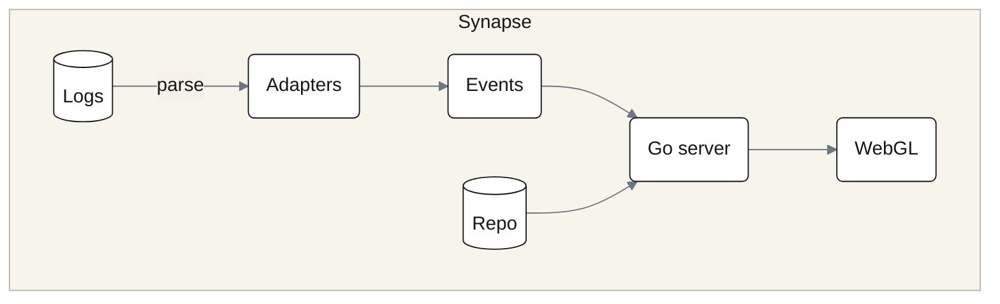

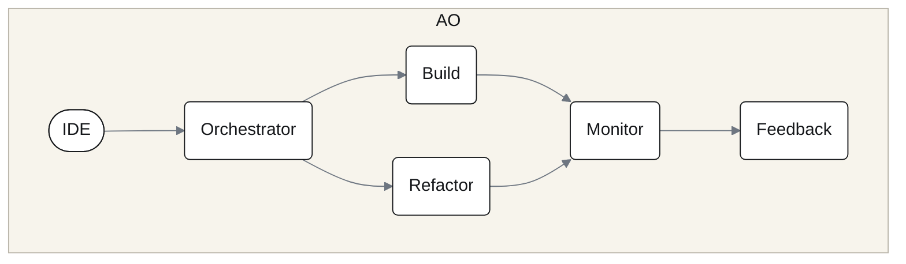

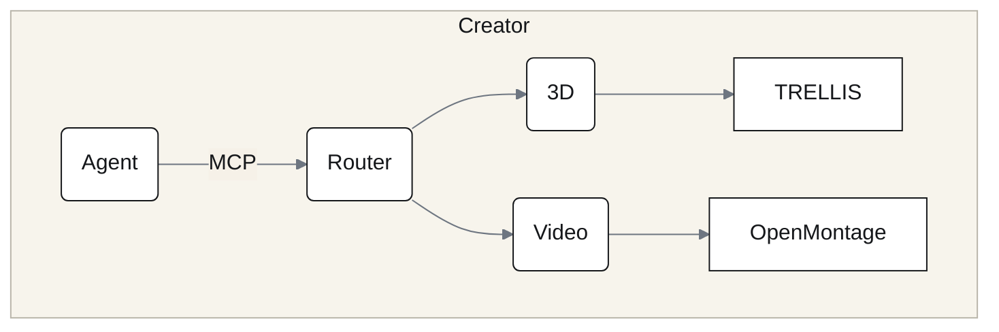

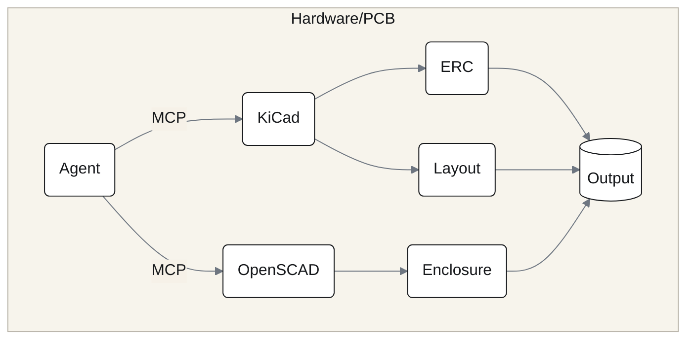

</details>

### Heimdall Token Saver: CLI output compression

`@hybridlabor-api/heimdall-token-saver`: compresses repeated CLI output via ambient hooks on every harness. Reduces token overhead on large projects. Skill: `token-saver-config`.

### Token optimization at a glance

| Lever | How |
|---|---|
| Minimal profile | `--profile=minimal` skips context-injection hooks and optional modules. |
| No context hooks | `--no-hooks` keeps the gates and drops memB, rules and trail injection. |
| Heimdall Token Saver | Compresses repeated CLI output via hooks. |
| No pinned model | Agents inherit the session model; per-role overrides live in `~/.aos/pipeline.json` ([docs/agent-models.md](docs/agent-models.md)). |
| Token-weather | The fleet band shows how full the context is and when to compact. |

---

## Updating

**Update.** Run the same command again. The installer sees the installed version, offers **Quick Update**, and refreshes skills, hooks, templates and modules:

```bash
npx -y @hybridlabor-api/aos@latest
```

**No `aos update` subcommand.** If you once ran `npm i -g @hybridlabor-api/aos`, a plain `aos` on your PATH runs that frozen copy and its version, not the latest; either update it (`npm i -g @hybridlabor-api/aos@latest`) or remove it and stay with `npx`. The installer prints the update command itself whenever a newer version exists; the `bdb-updater` skill wraps the same check for use from inside a session.

---

## Uninstall

```bash
aos-uninstall              # removes what AOS installed; memory, wikis and credentials stay
aos-uninstall --purge      # also removes ~/.MemBDB, ~/.openwiki, ~/.synapse, ~/.memb
aos-uninstall --dry-run    # list everything, delete nothing
```

**How it works.** The uninstaller works from the install manifest: a file that still matches the hash AOS wrote is removed, a file you edited is backed up instead, a file AOS never wrote is not touched. The same action is in the installer menu. `aos-uninstall --restore-plugin-backup` restores the loose skill copies the installer removed when it registered the plugin; see [docs/plugin-migration.md](docs/plugin-migration.md). Uninstall also moves your saved install options to `~/.aos/v5-settings.json.removed-<timestamp>` instead of deleting them.

---

## FAQ

**Do I need all nine harnesses?** No. The installer only writes to harnesses it detects.

**Will it overwrite my MCP config?** No. Existing entries are kept and AOS merges its own. `AOS_DISABLED_MCPS` keeps chosen servers out.

**Can I install with minimal context?** Yes: `--profile=minimal`, or `--no-hooks`. The gate and safety hooks stay either way.

**Does the GO gate work on every harness?** It is a real hook on Claude Code, Antigravity, Codex and the OpenCode plugin. On Cursor, Windsurf, Roo / Cline and Aider only the rule in `AGENTS.md` applies.

**Can an agent approve its own push?** Not through the gate: only your own typed GO counts, not an agent message, a subagent's relay or an A2A message.

**Does AOS work without AO, memB or OpenWiki?** Yes. All of them are optional modules.

**Something is broken.** Run `aos doctor`. It names what is missing and exits 1.

---

## Contributing

- [AGENTS.md](AGENTS.md) is the single source of rules for every harness: the skill contract, category routing, the release gate, Conventional Commits.
- A skill is a directory with `SKILL.md`; the frontmatter needs `name` (equal to the directory), `description` and `category`. `npm run validate` enforces the contract, as CI does on every push.
- `npm test` runs the validator self-test, the plugin-manifest check and the installer, store, doctor and cross-harness hook tests.
- `.claude-plugin/plugin.json` and `marketplace.json` are generated by `npm run plugin:build` and checked by `npm run plugin:check`. They exist today; the Claude Code marketplace install path is still being finalised, so the installer above remains the supported route.
- Releases are cut by release-please from Conventional Commits; do not bump `package.json` by hand. `feat:` means a minor bump.
- Skills derived from other projects record `source:` in the frontmatter and an entry in [THIRD_PARTY_NOTICES.md](THIRD_PARTY_NOTICES.md).

Found a bug or want a skill added? [Open an issue](https://github.com/hybridlabor-api/aos/issues).

---

## Links

- Package: [npmjs.com/package/@hybridlabor-api/aos](https://www.npmjs.com/package/@hybridlabor-api/aos)
- Source and issues: [github.com/hybridlabor-api/aos](https://github.com/hybridlabor-api/aos) · [issues](https://github.com/hybridlabor-api/aos/issues)
- [CHANGELOG.md](CHANGELOG.md) · [docs/skills_table.md](docs/skills_table.md)
- Sibling repos: [bdb-agent-orchestrator](https://github.com/hybridlabor-api/bdb-agent-orchestrator) · [bdb-synapse](https://github.com/hybridlabor-api/bdb-synapse) · [bdb-dev-creator-extension](https://github.com/hybridlabor-api/bdb-dev-creator-extension) · [bdb-hardware-pcb](https://github.com/hybridlabor-api/bdb-hardware-pcb) · [bdb-os-remote](https://github.com/hybridlabor-api/bdb-os-remote)

License: [Apache-2.0](LICENSE).
