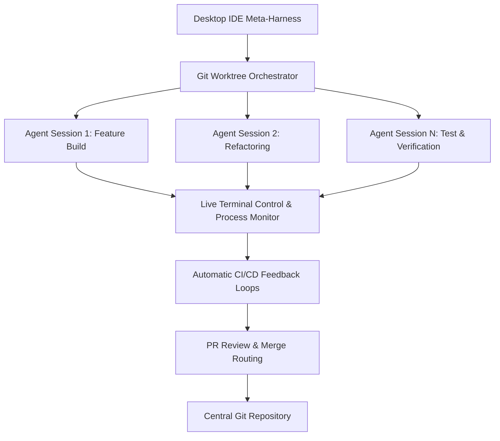
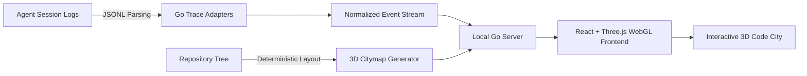

🌐 **Idioma / Language / Sprache**: [ 🇬🇧 English ](README.md) | [ 🇩🇪 Deutsch ](README.de.md) | **Português**

---

```text
█████▄ ████▄  █████▄   ▄████▄  ▄████  ██████ ███  ██ ██████   ▄████▄ ▄█████
██▄▄██ ██  ██ ██▄▄██   ██▄▄██ ██  ▄▄▄ ██▄▄   ██ ▀▄██   ██     ██  ██ ▀▀▀▄▄▄
██▄▄█▀ ████▀  ██▄▄█▀   ██  ██  ▀███▀  ██▄▄▄▄ ██   ██   ██     ▀████▀ █████▀

──────────────────────────── N O D E F O R G E ─────────────────────────────

                 BDB AGENT OS · CORE KERNEL · AOS -  v4.0.0
```

# 🚀 AOS — BDB Agent OS · Pacote Otimizado de Skills Criativas e Full-Stack

[](https://github.com/hybridlabor-api/aos/actions)
[](https://www.npmjs.com/package/@hybridlabor-api/aos)
[](https://github.com/hybridlabor-api/aos)
[](LICENSE)
[](https://github.com/hybridlabor-api/aos)

> **Potencializando agentes de código de IA com 154 skills hipercuradas, 21 wrappers MCP locais e um grafo dispatcher de multi-agentes executável.**

Bem-vindo ao **BDB Agent OS — AOS v4.0.0**: 154 skills curadas, 21 wrappers MCP locais e um grafo dispatcher que os transforma em um verdadeiro pipeline de build multi-agente, não apenas uma biblioteca de prompts. Aponte para um objetivo e ele planeja, constrói, revisa e implementa através de sete nós de agentes coordenados — com um portão imposto mecanicamente antes que qualquer coisa vá ao ar.

É neutro em relação ao harness por design, não "otimizado para uma ferramenta com outras como reflexão tardia": o grafo dispatcher é executado no Dynamic Workflows do Claude Code, as mesmas skills e configuração MCP são instaladas nativamente no **Google Antigravity, ChatGPT Codex / Codex CLI, Claude Desktop, Cursor, Aider, Roo Code, Cline e Windsurf**, e a variante leve `/startcycle-graph-user` recorre aos próprios subagentes do Claude Code em qualquer máquina que não tenha nenhum dos acima instalados.

> 🎙 **Audio Deep Dive: "Give AI Agents Control of Creative Software"**  
> <video src="assets/Give_AI_Agents_Control_of_Creative_Software.mp4" controls></video>

---

### 🔨 O que muda na v4.0.0 "AOS"

Este release move o pipeline multi-agente de prosa para uma máquina de estado executável e fortalece o instalador ao seu redor.

- **Um grafo dispatcher que realmente executa.** Sete nós, predicados de aresta explícitos, um loop de reparo do Revisor com guarda contra falta de progresso e escalonamento automático para um humano quando o loop para de progredir. [Detalhes abaixo](#-aos-o-grafo-dispatcher).
- **Três variantes de pipeline** (`/startcycle`, `/startcycle-graph`, `/startcycle-graph-user`) para que o maquinário corresponda à tarefa em vez de forçar cerimônia completa em uma alteração de dois arquivos.
- **Um portão GO imposto mecanicamente.** `git push`, `npm publish`, `npm version` e `rm` recursivo são bloqueados por um hook `PreToolUse` a menos que sua mensagem imediatamente anterior seja literalmente a palavra **GO** — fiscalização que sobrevive a alterações de modo de permissão, pois é um hook em vez de uma regra que o agente deve seguir.
- **Inicialização de daemon verificada.** O instalador não relata mais "serviço iniciado" por fé; ele conecta à porta e avisa se o daemon nunca subir. O mesmo para a tabela de status do ecossistema, que agora compara versões com precedência semver real em cada dist-tag em vez de desigualdade de strings contra `latest`.
- **Stores MCP separados por harness.** Claude Desktop e Claude Code leem arquivos diferentes; a instalação para um não pula mais silenciosamente o outro. Servidores existentes em ambos os arquivos são mesclados, não sobrescritos.
- **Instalações programáveis, não interativas.** `--platforms=<n[,n]>` seleciona alvos sem o menu, para que uma máquina que apenas roda Claude Code possa ser provisionada em CI sem herdar o padrão focado no Antigravity.

### 🪐 Universal Agent Harness
O instalador agora possui um motor Universal Sync totalmente automatizado. Ele varre seu sistema em busca do **Claude Desktop, Cursor, Windsurf, Aider, Roo/Cline** e injeta a configuração MCP curada e as regras de Godmode em todos os ambientes simultaneamente.
- **Local Project Harness:** Em vez de instalar globalmente em `$HOME`, os desenvolvedores podem injetar o contrato `.agents`, os hooks de portão e o workflow do dispatcher diretamente em um único projeto — `npx @hybridlabor-api/aos --project-harness`.

### 🧩 Integrações do Ecossistema
Este pacote atua como a ponte para três grandes capacidades upstream:
- **BDB OS Agent Workspace:** A camada de orquestração para agentes de IA paralelos. Inicie múltiplas sessões de agentes isoladas via Git-Worktrees com controle de terminal ao vivo, loops de feedback CI/CD automáticos e roteamento de revisão de PR.
- **BDB Creator Extension:** O pipeline de mídia agêntica de alta capacidade. Fornece aos agentes capacidades MCP locais do ComfyUI (FLUX, SDXL), geração Image-to-3D (TripoSR, TRELLIS) e produção de vídeo automatizada através do OpenMontage e Remotion.
- **BDB Synapse:** Visualização de Codebase 3D & Replay de Sessões de Agentes. Renderiza seu repositório como uma cidade de código interativa e repete as sessões de agentes como rastros de luz, mostrando quais arquivos foram lidos, editados e onde ocorreu atrito.

### 🔗 Plugins Complementares Recomendados (Claude Code)
Nenhum destes vem dentro deste pacote — são plugins do Claude Code independentes e mantidos pela comunidade que combinam naturalmente com o padrão de delegação `agy` que o [`/startcycle-graph-user`](#-aos-o-grafo-dispatcher) já usa. Instale-os separadamente se quiser o mesmo roteamento disponível fora de uma execução `/startcycle`.

- **[antigravity-for-claude-code](https://github.com/yuting0624/antigravity-for-claude-code)**
  — executa a CLI do Antigravity (`agy`, Gemini) como um sub-agente colaborador com roteamento de modelo inteligente em todo o ciclo de vida de software (SDLC).
  ```bash
  claude plugin marketplace add yuting0624/antigravity-for-claude-code
  claude plugin install antigravity@antigravity-for-claude-code
  ```
- **[opencode-plugin-cc](https://github.com/tasict/opencode-plugin-cc)** — adiciona
  comandos slash `/opencode:review` / `/opencode:adversarial-review`, permitindo que o Claude Code
  delegue um trabalho assíncrono para o OpenCode e configure um portão de revisão que bloqueia o progresso até que
  a revisão do OpenCode retorne limpa.
  ```bash
  claude plugin marketplace add https://github.com/tasict/opencode-plugin-cc.git
  claude plugin install opencode@tasict-opencode-plugin-cc
  ```

> [!CAUTION]
> Se você também tiver um marketplace `antigravity-plugin-cc` antigo instalado, desative-o e
> limpe o cache de plugins primeiro — dois plugins de roteamento `agy` ativos ao mesmo tempo causam um conflito de ativação dupla onde nenhum inicializa de forma limpa.

## Visão Geral

Este repositório entrega três coisas: uma biblioteca curada de skills para agentes de código, um
instalador que conecta eles (mais 21 wrappers MCP locais) em qualquer harness
que você use, e um grafo dispatcher que os orquestra como um pipeline de
build multi-agente. Veja [AOS: O Grafo Dispatcher](#-aos-o-grafo-dispatcher)
abaixo para entender como o próprio pipeline funciona.

## 🌟 ~154+ Skills Otimizadas (Atualizado para v4.0.0)

Começamos com um conjunto massivo de mais de 1.400 skills de IA brutas. Após rigorosos testes, filtragem e refinamento, destilamo-las em um conjunto hipercurado de **154+ Skills Otimizadas** (apresentando um motor nativo de documentação OpenWiki, o **cérebro de memória semântica local memB** e agora a **sincronização Universal Agent Harness na v4.0.0**).

Essas skills são projetadas com precisão para garantir que os agentes não percam tempo com tarefas redundantes e, em vez disso, operem com máxima autonomia, restrições arquitetônicas rígidas e robusta consciência de contexto.

### 🛡️ Os 6 Godmodes (Camada Apex)
Em vez de deixar os agentes vagando por instruções genéricas, o nível superior deste repositório impõe seis **Godmodes Hipercurados**. Eles atuam como os guardiões definitivos para sua base de código:
- **`godmode-engineering`**: Impõe Domain-Driven Design, verificações rígidas de TypeScript, Clean Architecture e depuração sistemática.
- **`godmode-ui-ux`**: O padrão de ouro do frontend. Impõe princípios "Anti-Slop" da BDB, acessibilidade e dinâmicas de movimento fluidas.
- **`godmode-shipping`**: O guardião final para lançamentos em produção. Impõe Spec-Driven Development, verificações pré-lançamento e rollbacks seguros.
- **`godmode-eventtech`**: O livro de regras supremo para o BDB Creator Engine, governando 3D, Mídia e 21 wrappers MCP de tecnologia criativa.
- **`godmode-3d-creation`**: Controla o pipeline 3D agêntico (TripoSR, TRELLIS) para modelos generativos e estruturas CAD.
- **`godmode-media-creation`**: Orquestra a produção automatizada de vídeo, narrativa e loops de geração do ComfyUI.

### 💻 Além dos Eventos: Agentes Web & Software Full-Stack
Embora fortemente otimizado para a indústria de tecnologia criativa, estas skills estão profundamente enraizadas na engenharia de software central:
- **Operações Web Autônomas**: Suíte completa de agentes especializados movidos a Firecrawl para extração estruturada de dados, interação web automatizada e operações complexas de scraping.
- **Desenvolvimento Full-Stack**: Criação de boilerplates Next.js App Router, construção de microsserviços Node.js escaláveis e desenvolvimento de frontends interativos.
- **Desenvolvimento de Aplicações**: Arquitetura de bancos de dados com Prisma/Drizzle, design de APIs REST/GraphQL e construção de aplicações web e mobile do zero.
- **Design & Garantia de Qualidade**: Auditoria de padrões de UI/UX (utilizando `ui-ux-pro-max`), aplicação de princípios de código limpo e configuração de pipelines CI/CD rígidos.

---

## 🗂️ A Biblioteca Completa de Skills

Abaixo está a visão geral completa de todas as skills curadas de agentes incluídas neste pacote. Elas são implantadas automaticamente na área de trabalho do seu agente pelo instalador interativo.

<details>
<summary><strong>👑 Core Godmodes</strong></summary>

| Nome da Skill | Descrição |
|------------|-------------|
| `godmode-3d-creation` | Skill mestre de orquestração para todas as tarefas de geração, modelagem e reconstrução 3D. Atua como o cérebro 3D para a BDB Creator Extension. |
| `godmode-engineering` | BDB Engineering Godmode. Impõe Domain-Driven Design rigoroso, estrito TypeScript, Clean Architecture e triagem sistemática de depuração em 5 etapas. |
| `godmode-eventtech` | BDB EventTech Godmode. O livro de regras supremo para o BDB Creator Engine, governando Godmode-3D, Godmode-Media e os 21 wrappers MCP de tecnologia criativa. |
| `godmode-media-creation` | Skill mestre de orquestração para todas as tarefas de criação de mídia (Vídeo, Áudio, Imagem, Motion Design). Atua como o cérebro para a BDB Creator Extension. |
| `godmode-shipping` | BDB Shipping Godmode. O guardião final para lançamentos em produção. Impõe Spec-Driven Development, rigorosas verificações pré-lançamento, feature flags e estratégias de rollback. |
| `godmode-ui-ux` | BDB UI/UX Godmode. O padrão de ouro absoluto para design frontend. Impõe princípios Anti-Slop, acessibilidade corporativa, dinâmicas de movimento fluidas e geração de design orientada a dados em todos os harnesses de agentes. |

</details>

<details>
<summary><strong>⚙️ Sistema & Configuração</strong></summary>

#### 🤖 Agentes & Automação
| Nome da Skill | Descrição |
|------------|-------------|
| `agent-manager-skill` | Gerencia múltiplos agentes CLI locais via sessões tmux (iniciar/parar/monitorar/atribuir) com agendamento amigável para cron. |
| `agent-memory-mcp` | A hybrid memory system that provides persistent, searchable knowledge management for AI agents (Architecture, Patterns, Decisions). |
| `agent-orchestrator` | Meta-skill que orquestra todos os agentes do ecossistema. Scan automatico de skills, match por capacidades, coordenacao de workflows multi-skill e registry management. |
| `agent-pipeline` | Referência para o ciclo de vida do BDB (define → plan → build → verify/review → ship) que o grafo dispatcher do `/startcycle-graph` realmente executa. |
| `agent-tool-builder` | Tools are how AI agents interact with the world. A well-designed tool is the difference between an agent that works and one that hallucinates, fails silently, or costs 10x more tokens than necessary. This skill covers tool design from schema to error handling. |
| `ai-agent-development` | AI agent development workflow for building autonomous agents, multi-agent systems, and agent orchestration with CrewAI, LangGraph, and custom agents. |
| `apify-lead-generation` | Scrape leads from multiple platforms using Apify Actors. |
| `apify-ultimate-scraper` | AI-driven data extraction from 55+ Actors across all major platforms. This skill automatically selects the best Actor for your task. |
| `bdbrainstorm` | Combines multi-agent brainstorming, the /grill-me slash command, subagent-driven-development, and ui-ux-pro-max to force a comprehensive, multi-agent ideation and UI/UX design workflow. |
| `browser-automation` | Browser automation powers web testing, scraping, and AI agent interactions. The difference between a flaky script and a reliable system comes down to understanding selectors, waiting strategies, and anti-detection patterns. |
| `crewai` | Expert in CrewAI - the leading role-based multi-agent framework used by 60% of Fortune 500 companies. |
| `documentation` | Documentation generation workflow covering API docs, architecture docs, README files, code comments, and technical writing. |
| `git-advanced-workflows` | Master advanced Git techniques to maintain clean history, collaborate effectively, and recover from any situation with confidence. |
| `github-actions-templates` | Production-ready GitHub Actions workflow patterns for testing, building, and deploying applications. |
| `github-repo` | Standards and workflows for writing, formatting, sanitizing, and publishing high-quality GitHub repositories, complementing openwiki-skill. |
| `github-workflow-automation` | Patterns for automating GitHub workflows with AI assistance, inspired by [Gemini CLI](https://github.com/google-gemini/gemini-cli) and modern DevOps practices. |
| `go-playwright` | Expert capability for robust, stealthy, and efficient browser automation using Playwright Go. |
| `google-sheets-automation` | Lightweight Google Sheets integration with standalone OAuth authentication. No MCP server required. Full read/write access. |
| `n8n-code-javascript` | Write JavaScript code in n8n Code nodes. Use when writing JavaScript in n8n, using $input/$json/$node syntax, making HTTP requests with $helpers, working with dates using DateTime, troubleshooting Code node errors, or choosing between Code node modes. |
| `n8n-code-python` | Write Python code in n8n Code nodes. Use when writing Python in n8n, using _input/_json/_node syntax, working with standard library, or need to understand Python limitations in n8n Code nodes. |
| `n8n-expression-syntax` | Validate n8n expression syntax and fix common errors. Use when writing n8n expressions, using {{}} syntax, accessing $json/$node variables, troubleshooting expression errors, or working with webhook data in workflows. |
| `n8n-mcp-tools-expert` | Expert guide for using n8n-mcp MCP tools effectively. Use when searching for nodes, validating configurations, accessing templates, managing workflows, or using any n8n-mcp tool. Provides tool selection guidance, parameter formats, and common patterns. |
| `n8n-workflow-patterns` | Proven architectural patterns for building n8n workflows. |
| `notion-automation` | Automate Notion tasks via Rube MCP (Composio): pages, databases, blocks, comments, users. Always search tools first for current schemas. |
| `os-scripting` | Operating system and shell scripting troubleshooting workflow for Linux, macOS, and Windows. Covers bash scripting, system administration, debugging, and automation. |
| `rag-implementation` | RAG (Retrieval-Augmented Generation) implementation workflow covering embedding selection, vector database setup, chunking strategies, and retrieval optimization. |
| `slack-automation` | Automate Slack workspace operations including messaging, search, channel management, and reaction workflows through Composio's Slack toolkit. |
| `subagent-driven-development` | Use when executing implementation plans with independent tasks in the current session |
| `tdd-workflow` | Test-Driven Development workflow principles. RED-GREEN-REFACTOR cycle. |
| `tmux` | Expert tmux session, window, and pane management for terminal multiplexing, persistent remote workflows, and shell scripting automation. |

#### 🎨 Frontend & UI/UX
| Nome da Skill | Descrição |
|------------|-------------|
| `MCP_Manage` | Manages the BDB specialized MCP servers including Unreal Engine, Rhino 7/8, DaVinci Resolve, grandMA3, Resolume, GitHub, Chrome DevTools, and TouchDesigner. |
| `api-design-principles` | Master REST and GraphQL API design principles to build intuitive, scalable, and maintainable APIs that delight developers and stand the test of time. |
| `api-patterns` | API design principles and decision-making. REST vs GraphQL vs tRPC selection, response formats, versioning, pagination. |
| `database-design` | Database design principles and decision-making. Schema design, indexing strategy, ORM selection, serverless databases. |
| `design-taste-frontend` | Use when building high-agency frontend interfaces with strict design taste, calibrated color, responsive layout, and motion rules. |
| `drizzle-orm-expert` | Expert in Drizzle ORM for TypeScript — schema design, relational queries, migrations, and serverless database integration. Use when building type-safe database layers with Drizzle. |
| `frontend-design` | You are a frontend designer-engineer, not a layout generator. |
| `frontend-dev-guidelines` | You are a senior frontend engineer operating under strict architectural and performance standards. Use when creating components or pages, adding new features, or fetching or mutating data. |
| `landing-page-generator` | Generates high-converting Next.js/React landing pages with Tailwind CSS. Uses PAS, AIDA, and BAB frameworks for optimized copy/components (Heroes, Features, Pricing). Focuses on Core Web Vitals/SEO. |
| `llm-application-dev-ai-assistant` | You are an AI assistant development expert specializing in creating intelligent conversational interfaces, chatbots, and AI-powered applications. Design comprehensive AI assistant solutions with natur |
| `nextjs-app-router-patterns` | Comprehensive patterns for Next.js 14+ App Router architecture, Server Components, and modern full-stack React development. |
| `nextjs-best-practices` | Next.js App Router principles. Server Components, data fetching, routing patterns. |
| `openapi-spec-generation` | Generate and maintain OpenAPI 3.1 specifications from code, design-first specs, and validation patterns. Use when creating API documentation, generating SDKs, or ensuring API contract compliance. |
| `postgres-best-practices` | Postgres performance optimization and best practices from Supabase. Use this skill when writing, reviewing, or optimizing Postgres queries, schema designs, or database configurations. |
| `postgresql` | Design a PostgreSQL-specific schema. Covers best-practices, data types, indexing, constraints, performance patterns, and advanced features |
| `prisma-expert` | You are an expert in Prisma ORM with deep knowledge of schema design, migrations, query optimization, relations modeling, and database operations across PostgreSQL, MySQL, and SQLite. |
| `programmatic-seo` | Design and evaluate programmatic SEO strategies for creating SEO-driven pages at scale using templates and structured data. |
| `react-best-practices` | Comprehensive performance optimization guide for React and Next.js applications, maintained by Vercel. Use when writing new React components or Next.js pages, implementing data fetching (client or server-side), or reviewing code for performance issues. |
| `react-component-performance` | Diagnose slow React components and suggest targeted performance fixes. |
| `react-patterns` | Modern React patterns and principles. Hooks, composition, performance, TypeScript best practices. |
| `schema-markup` | Design, validate, and optimize schema.org structured data for eligibility, correctness, and measurable SEO impact. |
| `senior-frontend` | Frontend development skill for React, Next.js, TypeScript, and Tailwind CSS applications. Use when building React components, optimizing Next.js performance, analyzing bundle sizes, scaffolding frontend projects, implementing accessibility, or reviewing frontend code quality. |
| `shadcn` | Manages shadcn/ui components and projects, providing context, documentation, and usage patterns for building modern design systems. |
| `software-architecture` | Guide for quality focused software architecture. This skill should be used when users want to write code, design architecture, analyze code, in any case that relates to software development. |
| `spline-3d-integration` | Use when adding interactive 3D scenes from Spline.design to web projects, including React embedding and runtime control API. |
| `tailwind-patterns` | Tailwind CSS v4 principles. CSS-first configuration, container queries, modern patterns, design token architecture. |
| `tanstack-query-expert` | Expert in TanStack Query (React Query) — asynchronous state management. Covers data fetching, stale time configuration, mutations, optimistic updates, and Next.js App Router (SSR) integration. |
| `ui-component` | Generate a new UI component that follows StyleSeed Toss conventions for structure, tokens, accessibility, and component ergonomics. |
| `ui-page` | Scaffold a new mobile-first page using StyleSeed Toss layout patterns, section rhythm, and existing shell components. |
| `ui-pattern` | Generate reusable UI patterns such as card sections, grids, lists, forms, and chart wrappers using StyleSeed Toss primitives. |
| `ui-review` | Review UI code for StyleSeed design-system compliance, accessibility, mobile ergonomics, spacing discipline, and implementation quality. |
| `ui-tokens` | List, add, and update StyleSeed design tokens while keeping JSON sources, CSS variables, and dark-mode values in sync. |
| `ui-ux-pro-max` | Comprehensive design guide for web and mobile applications. Use when designing new UI components or pages, choosing color palettes and typography, or reviewing code for UX issues. |
| `ux-audit` | Audit screens against Nielsen's heuristics and mobile UX best practices using the StyleSeed Toss design language as the implementation context. |
| `ux-feedback` | Add loading, empty, error, and success feedback states to StyleSeed components and pages with practical mobile-first rules. |
| `ux-flow` | Design user flows and screen structure using StyleSeed UX patterns such as progressive disclosure, hub-and-spoke navigation, and information pyramids. |
| `ux-persuasion-engineer` | One sentence - what this skill does and when to invoke it |
| `vercel-ai-sdk-expert` | Expert in the Vercel AI SDK. Covers Core API (generateText, streamText), UI hooks (useChat, useCompletion), tool calling, and streaming UI components with React and Next.js. |
| `wcag-audit-patterns` | Comprehensive guide to auditing web content against WCAG 2.2 guidelines with actionable remediation strategies. |
| `web-artifacts-builder` | To build powerful frontend claude.ai artifacts, follow these steps: |
| `zustand-store-ts` | Create Zustand stores following established patterns with proper TypeScript types and middleware. |

#### 🗄️ Backend & Bancos de Dados
| Nome da Skill | Descrição |
|------------|-------------|
| `gemini-api-dev` | The Gemini API provides access to Google's most advanced AI models. Key capabilities include: |
| `gemini-api-integration` | Use when integrating Google Gemini API into projects. Covers model selection, multimodal inputs, streaming, function calling, and production best practices. |
| `github` | Use the `gh` CLI for issues, pull requests, Actions runs, and GitHub API queries. |
| `go-concurrency-patterns` | Master Go concurrency with goroutines, channels, sync primitives, and context. Use when building concurrent Go applications, implementing worker pools, or debugging race conditions. |
| `golang-pro` | Master Go 1.22+ with modern patterns, advanced concurrency, performance optimization, and production-ready microservices. |
| `llm-structured-output` | Get reliable JSON, enums, and typed objects from LLMs using response_format, tool_use, and schema-constrained decoding across OpenAI, Anthropic, and Google APIs. |
| `microservices-patterns` | Master microservices architecture patterns including service boundaries, inter-service communication, data management, and resilience patterns for building distributed systems. |
| `neon-postgres` | Expert patterns for Neon serverless Postgres, branching, connection pooling, and Prisma/Drizzle integration |
| `python-patterns` | Python development principles and decision-making. Framework selection, async patterns, type hints, project structure. Teaches thinking, not copying. |
| `python-performance-optimization` | Profile and optimize Python code using cProfile, memory profilers, and performance best practices. Use when debugging slow Python code, optimizing bottlenecks, or improving application performance. |
| `python-pro` | Master Python 3.12+ with modern features, async programming, performance optimization, and production-ready practices. Expert in the latest Python ecosystem including uv, ruff, pydantic, and FastAPI. |
| `rag-engineer` | Expert in building Retrieval-Augmented Generation systems. Masters embedding models, vector databases, chunking strategies, and retrieval optimization for LLM applications. |
| `using-neon` | Neon is a serverless Postgres platform that separates compute and storage to offer autoscaling, branching, instant restore, and scale-to-zero. It's fully compatible with Postgres and works with any language, framework, or ORM that supports Postgres. |
| `vector-database-engineer` | Expert in vector databases, embedding strategies, and semantic search implementation. Masters Pinecone, Weaviate, Qdrant, Milvus, and pgvector for RAG applications, recommendation systems, and similar |
| `web-scraper` | Web scraping inteligente multi-estrategia. Extrai dados estruturados de paginas web (tabelas, listas, precos). Paginacao, monitoramento e export CSV/JSON. |
| `webapp-testing` | To test local web applications, write native Python Playwright scripts. |

#### 🚀 DevOps & Infraestrutura
| Nome da Skill | Descrição |
|------------|-------------|
| `bash-linux` | Bash/Linux terminal patterns. Critical commands, piping, error handling, scripting. Use when working on macOS or Linux systems. |
| `cloudflare-workers-expert` | Expert in Cloudflare Workers and the Edge Computing ecosystem. Covers Wrangler, KV, D1, Durable Objects, and R2 storage. |
| `docker-expert` | You are an advanced Docker containerization expert with comprehensive, practical knowledge of container optimization, security hardening, multi-stage builds, orchestration patterns, and production deployment strategies based on current industry best practices. |
| `git-pr-review` | Generate a concise and structured PR description from commit history with minimal token usage |
| `llm-app-patterns` | Production-ready patterns for building LLM applications, inspired by [Dify](https://github.com/langgenius/dify) and industry best practices. |
| `local-llm-expert` | Master local LLM inference, model selection, VRAM optimization, and local deployment using Ollama, llama.cpp, vLLM, and LM Studio. Expert in quantization formats (GGUF, EXL2) and local AI privacy. |
| `posix-shell-pro` | Expert in strict POSIX sh scripting for maximum portability across Unix-like systems. Specializes in shell scripts that run on any POSIX-compliant shell (dash, ash, sh, bash --posix). |
| `turborepo-caching` | Configure Turborepo for efficient monorepo builds with local and remote caching. Use when setting up Turborepo, optimizing build pipelines, or implementing distributed caching. |
| `vercel-deployment` | Expert knowledge for deploying to Vercel with Next.js |

#### 🧠 IA & LLM
| Nome da Skill | Descrição |
|------------|-------------|
| `ai-product` | Every product will be AI-powered. The question is whether you'll build it right or ship a demo that falls apart in production. |
| `llm-prompt-optimizer` | Use when improving prompts for any LLM. Applies proven prompt engineering techniques to boost output quality, reduce hallucinations, and cut token usage. |
| `openwiki-skill` | Direct Gemini-native integration of OpenWiki for autonomous, high-agency documentation management and release notes maintenance. |
| `prompt-engineer` | Transforms user prompts into optimized prompts using frameworks (RTF, RISEN, Chain of Thought, RODES, Chain of Density, RACE, RISE, STAR, SOAP, CLEAR, GROW) |
| `prompt-engineering-patterns` | Master advanced prompt engineering techniques to maximize LLM performance, reliability, and controllability. |

#### 📝 Documentação & Planejamento
| Nome da Skill | Descrição |
|------------|-------------|
| `architect-review` | Master software architect specializing in modern architecture |
| `concise-planning` | Use when a user asks for a plan for a coding task, to generate a clear, actionable, and atomic checklist. |
| `copywriting` | Write rigorous, conversion-focused marketing copy for landing pages and emails. Enforces brief confirmation and strict no-fabrication rules. |
| `deep-research` | Run autonomous research tasks that plan, search, read, and synthesize information into comprehensive reports. |
| `executing-plans` | Use when you have a written implementation plan to execute in a separate session with review checkpoints |
| `linear-claude-skill` | Manage Linear issues, projects, and teams |
| `memb-skill` | BDB local-first long-term memory engine (memB). Query, remember, and adapt preferences, code architectures, and developer patterns across tasks. |
| `modern-javascript-patterns` | Comprehensive guide for mastering modern JavaScript (ES6+) features, functional programming patterns, and best practices for writing clean, maintainable, and performant code. |
| `planning-with-files` | Work like Manus: Use persistent markdown files as your "working memory on disk." |
| `product-manager-toolkit` | Essential tools and frameworks for modern product management, from discovery to delivery. |
| `readme` | You are an expert technical writer creating comprehensive project documentation. Your goal is to write a README.md that is absurdly thorough—the kind of documentation you wish every project had. |
| `test-driven-development` | Use when implementing any feature or bugfix, before writing implementation code |
| `writing-plans` | Use when you have a spec or requirements for a multi-step task, before touching code |

#### 🧊 3D & Motion
| Nome da Skill | Descrição |
|------------|-------------|
| `remotion` | Generate walkthrough videos from Stitch projects using Remotion with smooth transitions, zooming, and text overlays |
| `threejs-skills` | Create 3D scenes, interactive experiences, and visual effects using Three.js. Use when user requests 3D graphics, WebGL experiences, 3D visualizations, animations, or interactive 3D elements. |

#### 📈 SEO & Marketing
| Nome da Skill | Descrição |
|------------|-------------|
| `geo-fundamentals` | Generative Engine Optimization for AI search engines (ChatGPT, Claude, Perplexity). |
| `seo` | Run a broad SEO audit across technical SEO, on-page SEO, schema, sitemaps, content quality, AI search readiness, and GEO. Use as the umbrella skill when the user asks for a full SEO analysis or strategy. |
| `seo-audit` | Diagnose and audit SEO issues affecting crawlability, indexation, rankings, and organic performance. |
| `seo-technical` | Audit technical SEO across crawlability, indexability, security, URLs, mobile, Core Web Vitals, structured data, JavaScript rendering, and related platform signals like robots.txt and AI crawler access. |

#### 🔧 Programação Central & Depuração
| Nome da Skill | Descrição |
|------------|-------------|
| `clean-code` | Esta skill incorpora os princípios do "Clean Code" de Robert C. Martin (Uncle Bob). Use-a para transformar "código que funciona" em "código que é limpo". |
| `debugger` | Debugging specialist for errors, test failures, and unexpected behavior. Use proactively when encountering any issues. |
| `playwright-skill` | IMPORTANT - Path Resolution: This skill can be installed in different locations (plugin system, manual installation, global, or project-specific). Before executing any commands, determine the skill directory based on where you loaded this SKILL.md file, and use that path in all commands below. |
| `simplify-code` | Review a diff for clarity and safe simplifications, then optionally apply low-risk fixes. |
| `systematic-debugging` | Use when encountering any bug, test failure, or unexpected behavior, before proposing fixes |
| `typescript-pro` | Master TypeScript with advanced types, generics, and strict type safety. Handles complex type systems, decorators, and enterprise-grade patterns. |

#### 📦 Outros Utilitários
| Nome da Skill | Descrição |
|------------|-------------|
| `bdb-updater` | Proactively check for and install updates to the BDB Antigravity Skills package via NPM. |
| `monorepo-management` | Build efficient, scalable monorepos that enable code sharing, consistent tooling, and atomic changes across multiple packages and applications. |
| `obsidian-markdown` | Create and edit Obsidian Flavored Markdown with wikilinks, embeds, callouts, properties, and other Obsidian-specific syntax. Use when working with .md files in Obsidian, or when the user mentions wikilinks, callouts, frontmatter, tags, embeds, or Obsidian notes. |
| `senior-fullstack` | Complete toolkit for senior fullstack with modern tools and best practices. |
| `token-saver-config` | Context window output compression engine for CLI commands (60-99% token reduction). |
| `web-performance-optimization` | Optimize website and web application performance including loading speed, Core Web Vitals, bundle size, caching strategies, and runtime performance |

</details>

<details>
<summary><strong>🌀 Ecossistema & Metodologias BDB</strong></summary>

| Nome da Skill | Descrição |
|------------|-------------|
| `bdbmediastorm` | The ultimate creative-tech and show-control brainstorming engine. Orchestrates multi-agent ideation focused on signal flow, hardware constraints, protocols, and BDB MCP integrations. Now strictly governed by the 3 Core Godmodes (engineering, ui-ux, shipping). |
| `bdbrainstorm` | Combines multi-agent brainstorming, the /grill-me slash command, and the 3 Core Godmodes (godmode-engineering, godmode-ui-ux, godmode-shipping) to force a comprehensive, multi-agent ideation and technical design workflow. |
| `github-repo` | Standards and workflows for writing, formatting, sanitizing, and publishing high-quality GitHub repositories, complementing openwiki-skill. |
| `memb-ingest` | Deep scan and ingest project files (.md, .json, AGENTS.md, .openwiki) and past conversation logs into the local memB vector memory engine. |

</details>

<details>
<summary><strong>🔥 Agentes Especializados de Workspace</strong></summary>

#### 🤖 Agentes & Automação
| Nome da Skill | Descrição |
|------------|-------------|
| `firecrawl-agent` | Extração de dados autônoma alimentada por IA que navega em sites complexos e retorna JSON estruturado. Use esta skill quando o usuário quiser dados estruturados de sites, precisar extrair tabelas de preços, listagens de produtos, entradas de diretório ou qualquer dado como JSON com um esquema. Acionado por "extrair dados estruturados", "obter todos os produtos", "puxar informações de preços", "extrair como JSON" ou quando o usuário fornece um esquema JSON para dados do site. Mais poderoso que a raspagem simples para extração estruturada de múltiplas páginas. |
| `firecrawl-build-onboarding` | Get Firecrawl credentials and SDK setup into a project. Use when an application needs `FIRECRAWL_API_KEY`, when an agent should add Firecrawl to `.env`, when the user wants to authenticate Firecrawl for app code, or when choosing the first SDK and docs for a new Firecrawl integration. This skill includes its own browser auth flow, so it does not depend on the website onboarding skill. |
| `firecrawl-build-search` | Integrate Firecrawl `/search` into product code and agent workflows. Use when an app needs discovery before extraction, when the feature starts with a query instead of a URL, or when the system should search the web and optionally hydrate result content. |

#### 🗄️ Backend & Bancos de Dados
| Nome da Skill | Descrição |
|------------|-------------|
| `firecrawl-build` | Integrate Firecrawl into product code for web scraping, crawling, searching, and interaction. Use this skill when an application needs to access web data, extract content, or automate web interactions. |
| `firecrawl-build-interact` | Integrate Firecrawl `/interact` into product code for dynamic pages and browser actions after scraping. Use when a feature needs clicks, form fills, pagination, authentication-aware flows, or other multi-step interactions that plain `/scrape` cannot complete. |
| `firecrawl-download` | Download an entire website as local files — markdown, screenshots, or multiple formats per page. Use this skill when the user wants to save a site locally, download documentation for offline use, bulk-save pages as files, or says "download the site", "save as local files", "offline copy", "download all the docs", or "save for reference". Combines site mapping and scraping into organized local directories. |
| `firecrawl-interact` | Control and interact with a live browser session on any scraped page — click buttons, fill forms, navigate flows, and extract data using natural language prompts or code. Use when the user needs to interact with a webpage beyond simple scraping: logging into a site, submitting forms, clicking through pagination, handling infinite scroll, navigating multi-step checkout or wizard flows, or when a regular scrape failed because content is behind JavaScript interaction. Also useful for authenticated scraping via profiles. Triggers on "interact", "click", "fill out the form", "log in to", "sign in", "submit", "paginated", "next page", "infinite scroll", "interact with the page", "navigate to", "open a session", or "scrape failed". |

#### 🚀 DevOps & Infraestrutura
| Nome da Skill | Descrição |
|------------|-------------|
| `firecrawl` | Search, scrape, and interact with the web via the Firecrawl CLI. Use this skill whenever the user wants to search the web, find articles, research a topic, look something up online, scrape a webpage, grab content from a URL, get data from a website, crawl documentation, download a site, or interact with pages that need clicks or logins. Also use when they say "fetch this page", "pull the content from", "get the page at https://", or reference external websites. This provides real-time web search with full page content and interact capabilities — beyond what Claude can do natively with built-in tools. Do NOT trigger for local file operations, git commands, deployments, or code editing tasks. |

#### 🧠 IA & LLM
| Nome da Skill | Descrição |
|------------|-------------|
| `firecrawl-scrape` | Extract clean markdown from any URL, including JavaScript-rendered SPAs. Use this skill whenever the user provides a URL and wants its content, says "scrape", "grab", "fetch", "pull", "get the page", "extract from this URL", or "read this webpage". Handles JS-rendered pages, multiple concurrent URLs, and returns LLM-optimized markdown. Use this instead of WebFetch for any webpage content extraction. |

#### 📝 Documentação & Planejamento
| Nome da Skill | Descrição |
|------------|-------------|
| `firecrawl-crawl` | Bulk extract content from an entire website or site section. Use this skill when the user wants to crawl a site, extract all pages from a docs section, bulk-scrape multiple pages following links, or says "crawl", "get all the pages", "extract everything under /docs", "bulk extract", or needs content from many pages on the same site. Handles depth limits, path filtering, and concurrent extraction. |

#### 📦 Outros Utilitários
| Nome da Skill | Descrição |
|------------|-------------|
| `firecrawl-build-scrape` | Integrate Firecrawl `/scrape` into product code for single-page extraction. Use when an app already has a URL and needs markdown, HTML, links, screenshots, metadata, or structured page output. Prefer this skill over broader crawl patterns when the feature is page-level. |
| `firecrawl-map` | Discover and list all URLs on a website, with optional search filtering. Use this skill when the user wants to find a specific page on a large site, list all URLs, see the site structure, find where something is on a domain, or says "map the site", "find the URL for", "what pages are on", or "list all pages". Essential when the user knows which site but not which exact page. |
| `firecrawl-search` | Web search with full page content extraction. Use this skill whenever the user asks to search the web, find articles, research a topic, look something up, find recent news, discover sources, or says "search for", "find me", "look up", "what are people saying about", or "find articles about". Returns real search results with optional full-page markdown — not just snippets. Provides capabilities beyond Claude's built-in WebSearch. |

</details>


---

## 🔄 AOS: O Grafo Dispatcher

A v4.0.0 substitui a antiga prosa linear da "pipeline de 5 agentes" por uma máquina de estados real e executável. O contrato vive em [`.agents/graph.md`](.agents/graph.md), a lista de nós em [`.agents/nodes.json`](.agents/nodes.json), e o dispatcher executável em [`.claude/workflows/startcycle-dispatch.mjs`](.claude/workflows/startcycle-dispatch.mjs).

**A única regra que todo o resto segue: nós nunca invocam uns aos outros.** Um único dispatcher lê `production_artifacts/state.json` após o retorno de cada nó e decide o que será executado a seguir. Não há cadeia de repasse (hand-off), nenhum agente dizendo a outro agente para prosseguir — o que impede o desvio de prompts que faz longos pipelines de agentes saírem do curso.


### O que faz o sistema se manter unido

| Mecanismo | O que previne |
|---|---|
| **Isolamento do Reviewer** | O Reviewer lê os artefatos de build e o contrato do plano — nunca o `goal` original, nunca o raciocínio de um nó de build ou sua afirmação de que o trabalho está concluído. Repassar a afirmação do implementador enviesa o revisor para a concordância; retê-la é o que torna a revisão adversária em vez de um mero carimbo. |
| **Guarda anti-inércia** | Se um ciclo de reparo retornar relatando o *mesmo* ID de descoberta bloqueante que o anterior, nada está realmente sendo consertado. A execução escala para um humano em vez de queimar iterações executando um loop idêntico. |
| **Fragmentos de estado por nó** | Os nós de build rodam em paralelo e cada um escreve seu próprio fragmento `state.d/<nó>.json`, mesclados depois — eles nunca escrevem em `state.json` diretamente. Gravadores paralelos em um arquivo JSON geram condição de corrida por atualização perdida; os fragmentos removem a corrida por construção. |
| **Teto de iteração** | `max_iterations` (padrão 3) para o loop incondicionalmente, deliberadamente configurado abaixo da própria sobreposição de parada de 8 hooks do Claude Code, para que a própria mensagem de escalonamento da execução chegue a você primeiro. |
| **Transição humana no loop** | Qualquer nó pode definir `needs_human: true` e parar a execução. Autonomia total soa bem até que um nó atinja algo que apenas um humano pode decidir — isso é uma aresta explícita no grafo, não uma interrupção dele. |
| **Lançamento com Portão-GO** | Alcançar `ready_to_ship` não é lançar. `git push`, `npm publish`, `npm version` e `rm` recursivo são bloqueados por um hook `PreToolUse` ([`.claude/hooks/go-gate.mjs`](.claude/hooks/go-gate.mjs)) a menos que sua mensagem imediatamente anterior seja a palavra literal **GO**. É um hook, não uma regra que um agente lê e tenta seguir — ele é acionado antes de qualquer verificação de modo de permissão e não pode ser contornado. |

### Três variantes — escolha pela quantidade de maquinário que a tarefa precisa

| Comando | Maquinário | Use quando |
|---|---|---|
| **`/startcycle`** | Cadeia linear, entregas de arquivo em `production_artifacts/`. Sem máquina de estado, sem loop de reparo. | Um build direto onde você quer a equipe de agentes, mas não a cerimônia. |
| **`/startcycle-graph`** | O grafo completo acima: `state.json` durável, loop de reparo do Reviewer, portão de qualidade, escalonamento automático. | Trabalho de feature real onde a exatidão importa mais que a velocidade, e você quer uma trilha de auditoria do que aconteceu. |
| **`/startcycle-graph-user`** | Delegação descartável de 2 a 4 nós. Nada persistente — sem inicialização `.agents/`, sem `state.json`. Modelos classificados por função (Opus planeja, Sonnet revisa, Haiku ou uma CLI externa faz o trabalho mecânico). | Um único "gerar alguns trabalhadores para esta tarefa" em *qualquer* projeto, incluindo aqueles que nunca ouviram falar deste repositório. |

A terceira variante assume deliberadamente nada sobre sua máquina: ela detecta se o Antigravity, OpenCode ou Codex estão presentes e recorre aos próprios subagentes do Claude Code quando nenhum está. As classificações de modelos são forçadas por função, em vez de herdadas de sua sessão, de forma que um passo de trabalhador mecânico não rode silenciosamente no Opus só porque é o que você tinha selecionado.

---

## 🧠 BDBrainstorm: O Motor Definitivo de Ideação

Incluída neste arsenal otimizado está nossa skill proprietária **BDBrainstorm**.

O BDBrainstorm combina brainstorming multi-agente, o comando slash `/grill-me`, desenvolvimento guiado por subagentes e workflows extremos de design UI/UX para forçar um processo abrangente de ideação multi-agente. Ele testa estresse em designs, projeta os sistemas por trás deles e gera planos de implementação executáveis de alta fidelidade.

---

## 🔌 21 Integrações Locais de MCPP


Em vez de depender de mocks rudimentares em python ou APIs remotas com falhas, este repositório empacota **21 wrappers MCP locais** (no diretório `mcps/`). Eles são construídos/preparados automaticamente e permitem que seu assistente de IA leia, escreva e execute comandos nos principais softwares criativos do mercado.

<details>
<summary><strong>🎨 Adobe Creative Cloud (Illustrator, Photoshop, After Effects, Premiere Pro)</strong></summary>

Fornecemos uma arquitetura de motor duplo otimizada para ambientes macOS e Windows:
- **Direct OS-Native Bridge (`bdb_adobe_mcp`)**: Executa scripts sem necessidade de instalação.
  - **macOS:** Direciona IDs de pacotes de aplicações diretamente via streams de comando AppleScript `do javascript` / `DoScript`.
  - **Windows:** Consulta e instancia automaticamente objetos COM locais via scripts wrapper em PowerShell e executa código ExtendScript `.jsx` temporário.
- **Cross-Platform UXP WebSocket Bridge (`bdb_adobe_uxp_mcp`)**: Um proxy WebSocket de três camadas (servidor Node.js na porta 8080 + plugins nativos de desenvolvedor UXP) para manipulação profunda de DOM e sessões WebSocket persistentes no Photoshop e Premiere Pro, funcionando identicamente no Windows e macOS.
</details>

<details>
<summary><strong>🎬 DaVinci Resolve (Cobertura Tripla)</strong></summary>

- **Principal: `bdb_davinci_mcp`**: Funciona nas versões **Gratuito e Studio** usando um loop de menu de script de workspace. Expõe 162 ferramentas (Timeline, clips, marcadores, grades, Fusion) e inclui modelos de IA locais baseados em CPU (Meta Demucs v4 para isolamento de voz, faster-whisper para legendas automáticas e rembg para remoção de fundo).
- **Studio: `bdb_davinci_mcp_studio`**: O servidor Node.js oficial (baseado no samuelgursky) para gerenciamento direto e avançado de linha do tempo e projetos no Resolve Studio.
- **Fallback: `bdb_davinci_mcp_fallback`**: Servidor python profissional Hoyt-harness para scripting no Studio.
</details>

<details>
<summary><strong>📐 Rhino 3D & Grasshopper (Twin-Engine)</strong></summary>

- **Principal: `bdb_rhino_mcp`**: Conector oficial da McNeel (gerenciado via roteador Yak) para leitura/escrita nativa de layouts geométricos do Rhino.
- **Fallback: `bdb_rhino_mcp_fallback`**: O servidor 3D GOLEM com 105 ferramentas para manipular dinamicamente ativos do Rhino 8, executar scripts e resolver definições do Grasshopper.
</details>

<details>
<summary><strong>🏗️ Integrações Especializadas Adicionais (Unreal, TouchDesigner, Vectorworks, etc.)</strong></summary>

### 🏗️ Vectorworks
- **Principal: `bdb_vectorworks_mcp`**: Índice de busca semântico baseado em RAG sobre documentação do VectorScript e API do Vectorworks (porta 8765) para desenho CAD automatizado.

### 🎮 Unreal Engine
- **Principal: `bdb_unreal_mcp`**: Conecta-se via Unreal Engine 5 Web Remote Control API (porta 30010) e o conjunto de ferramentas `gimmeDG`. Permite ao agente consultar, criar atores, editar materiais, escrever Blueprints e automatizar a manipulação de níveis/sequenciadores.

### 🧊 Blender (Twin-Engine)
- **Principal: `bdb_blender_mcp`**: Integração de soquete BlenderMCP para layout de cena, geração de malha e controles de viewport.
- **Fallback: `bdb_blender_mcp_fallback`**: Servidor python do djeada para gerenciar conexões TCP do Blender e scripting python bruto.

### 🎛️ TouchDesigner (Twin-Engine)
- **Principal: `bdb_touchdesigner_mcp`**: MindDesigner-Bridge (`tdmcp`) na porta 9980 para ler e escrever redes através de estruturas `.tox` personalizadas.
- **Fallback: `bdb_touchdesigner_mcp_fallback`**: Inspetor e consulta de nós TCP de fallback.

### 💡 grandMA3 & Resolume
- **grandMA3**: `bdb_ma3_mcp` envia streams de comandos OSC/UDP diretamente para sua mesa grandMA3 (porta 8000) para automatizar cues, macros e patch de fixtures.
- **Resolume**: `bdb_resolume_mcp` envolve a API REST do Arena (porta 8080) para sequenciar camadas, consultar status e disparar clipes.

### 🖥️ OS Control (Dual-Engine)
- **macOS/Linux: `zavora_computer_use`**: Empacotado com objetos binários nativos pré-compilados do Rust NAPI (macOS arm64/x64, Linux) para controlar mouse, teclado, janelas e aplicativos sem erros de compilação em tempo de execução.
- **Windows: `bdb_windows_computer_use`**: Controlador nativo Win32 / COM / UIAutomation baseado em python com suporte local a OCR (Tesseract) para automação avançada de GUI do Windows.

### 🧠 Local Semantic Brain (memB)
- **`memb_mcp`**: Expõe ferramentas padrão de memória de longo prazo (`add_memory`, `search_memory`, `delete_memory`, `list_memories`) usando um motor vetorial completamente local e offline-first (movido por um modelo ONNX empacotado de 30MB e SQLite).
</details>

---

## 📖 14 Skills Especializadas do Sistema

Este repositório também contém 14 configurações profundas de sistema e diretrizes de documentação mapeadas automaticamente. Se um agente de IA importar este pacote, ele lerá imediatamente esses arquivos markdown para aprender assinaturas de ferramentas, argumentos esperados, ganchos ExtendScript e etapas comuns de solução de problemas para cada aplicação.

<details>
<summary><strong>Ver Lista de Skills do Sistema</strong></summary>

- [`bdb-unreal-mcp.md`](skills/global_config/bdb-unreal-mcp.md)
- [`bdb-rhino-mcp.md`](skills/global_config/bdb-rhino-mcp.md)
- [`bdb-davinci-mcp.md`](skills/global_config/bdb-davinci-mcp.md)
- [`bdb-blender-mcp.md`](skills/global_config/bdb-blender-mcp.md)
- [`bdb-after-effects-mcp.md`](skills/global_config/bdb-after-effects-mcp.md)
- [`bdb-vectorworks-mcp.md`](skills/global_config/bdb-vectorworks-mcp.md)
- [`bdb-touchdesigner-mcp.md`](skills/global_config/bdb-touchdesigner-mcp.md)
- [`bdb-computer-use-mcp.md`](skills/global_config/bdb-computer-use-mcp.md)
- [`bdb-grandma3-mcp.md`](skills/global_config/bdb-grandma3-mcp.md)
- [`bdb-resolume-mcp.md`](skills/global_config/bdb-resolume-mcp.md)
- [`bdb-adobe-suite-mcp.md`](skills/global_config/bdb-adobe-suite-mcp.md)
- [`bdb-memb-mcp.md`](skills/global_config/bdb-memb-mcp.md)
- [`openwiki-skill`](skills/global_config/openwiki-skill/SKILL.md): Direct Gemini-native integration of OpenWiki for autonomous, high-agency documentation management and release notes maintenance.
- [`memb-skill`](skills/global_config/memb-skill/SKILL.md): BDB local-first long-term memory engine (memB). Query, remember, and adapt preferences, code architectures, and developer patterns across tasks.
</details>

---

## 🌐 OpenWiki & RepoGraph Code Health Engine (v4.0.0)

O **OpenWiki Engine** mantém autonomamente documentação viva da base de código, especificações de arquitetura, ADRs, notas de lançamento e análises de saúde do código em tempo real em todos os seus projetos ativos.

### 📚 Documentação & Dashboard
- **Entrypoint & Setup:** [.openwiki/quickstart.md](.openwiki/quickstart.md)
- **Architecture & Ecosystem:** [.openwiki/architecture.md](.openwiki/architecture.md)
- **Design Decisions (ADRs):** [.openwiki/decisions.md](.openwiki/decisions.md)
- **Changelog & History:** [.openwiki/release_notes.md](.openwiki/release_notes.md)
- **Code Health Report:** [.openwiki/code_health.md](.openwiki/code_health.md)
- **Interactive Live Dashboard:** [.openwiki/code_health_dashboard.html](.openwiki/code_health_dashboard.html)

<details>
<summary><strong>🧠 Arquitetura Multi-Provedor LLM & Zero-Token RepoGraph</strong></summary>

1. **Agilidade LLM Multi-Provedor:** Desacoplado de dependência de um único fornecedor. Configure qualquer backend LLM via variáveis de ambiente:
   - **Google GenAI:** `gemma-4-26b-a4b-it` (padrão via SDK `google-genai`, com fallback de descoberta automática de modelos)
   - **Groq:** `llama-3.3-70b-versatile` (latência ultra-baixa)
   - **Grok / xAI:** `grok-2-latest`
   - **Nvidia NIM:** `meta/llama-3.3-70b-instruct`
   - **OpenRouter:** `anthropic/claude-3.5-sonnet` (mais de 200 modelos)
   - **OpenAI:** `gpt-4o-mini` / `gpt-4o`
   - **Offline / Local:** Ollama (`llama3`), LM Studio ou qualquer endpoint compatível com OpenAI.
2. **Análise Git Zero-Token RepoGraph:** Analisa velocidade de hotspot de 90 dias, risco de fator-ônibus de autor único e índice de manutenibilidade puramente através de análise Git local determinística — custando **0 tokens LLM**.
3. **Dashboard HTML Ao Vivo de Nível Repowise:** `.openwiki/code_health_dashboard.html` fornece 6 painéis visuais SVG (Mapa de Aglomerado de Galáxias, Gráfico de Risco em Rosca, Matriz de Fator Ônibus, Churn de Velocidade de Commit, Leaderboard de Hotspot, Radar de Saúde da Arquitetura) com **atualização automática ao vivo a cada 60 segundos** e telemetria integrada de ADR do memB.
</details>

<details>
<summary><strong>⚙️ Configurando o Daemon em Segundo Plano</strong></summary>

Para garantir que a documentação do seu projeto e os dashboards de saúde do código nunca fiquem desatualizados, configure o daemon em segundo plano:

#### On macOS (LaunchAgent)
```bash
bash ~/.gemini/config/skills/openwiki-skill/scripts/install_daemon.sh
```

#### On Windows (Task Scheduler)
```powershell
powershell -ExecutionPolicy Bypass -File "$env:USERPROFILE\.gemini\config\skills\openwiki-skill\scripts\install_daemon.ps1"
```

#### Para Todas as Plataformas: Registrar Projetos & Monitorar
**Registrar Projetos:** Adicione caminhos de workspace ao seu arquivo de configuração em `~/.openwiki/projects.json`:
```json
{
  "projects": [
    "~/dev/bdb-dev/aos",
    "~/Projects/your-active-project"
  ],
  "interval_seconds": 3600
}
```

**Monitorar Execução:** Acompanhe os logs ativos para inspecionar o status de reconstrução da documentação em segundo plano:
```bash
tail -f ~/.openwiki/daemon.log
```
</details>

<details>
<summary><strong>🌍 BDB OS Remote Gateway & Thin-Client (`mcps/bdb-os-remote/`)</strong></summary>

- **Transporte SSE Zero-Trust:** Execute o Claude Desktop no seu laptop enquanto roda ferramentas nativamente na sua Workstation fixa através de um túnel seguro do Tailscale.
- **Topologia Assimétrica:** Instala `heimdall-token-saver` localmente no seu laptop para comprimir tokens *antes* de chamar o LLM, enquanto `memB`, `synapse` e operações de arquivos são roteadas para a Workstation.
- **Ferramenta de Clone Offline:** Arquivos de projeto em um clique transmitidos de forma contínua através do Tailscale sem pastas `node_modules` pesadas.
- **Repositório Direto:** Acesse o gateway em [github.com/hybridlabor-api/bdb-os-remote](https://github.com/hybridlabor-api/bdb-os-remote) ou instale via NPX:

```bash
npx @hybridlabor-api/bdb-os-remote installer
```
</details>

---

## 🖥️ BDB OS Agent Workspace: Orquestração Multi-Agente Paralela

[](https://github.com/hybridlabor-api/bdb-os-agent-workspace)
[](https://github.com/hybridlabor-api/bdb-os-agent-workspace)
[](https://github.com/hybridlabor-api/bdb-os-agent-workspace)
[](LICENSE)

**BDB OS Agent Workspace** é o Meta-Harness de Desktop e a camada de orquestração projetada para agentes de IA paralelos. Ele permite que desenvolvedores criem, gerenciem e coordenem múltiplas sessões de agentes isoladas simultaneamente em Git Worktrees independentes, com loops de feedback de terminal em tempo real e roteamento automatizado de revisão de PR.



<details>
<summary><strong>⚙️ Arquitetura & Orquestração de Worktrees</strong></summary>

- **Isolamento via Git Worktree:** Instancia árvores de trabalho dedicadas e limpas para cada sessão de subagente, prevenindo corrupção de estado de arquivos ou colisões de lock file durante edições concorrentes.
- **Meta-Harness de Desktop:** Coordena configurações multi-workspace, variáveis de ambiente e portas de servidor local em ambientes de desenvolvedor concorrentes.
- **Execução Paralela de Agentes:** Cria agentes autônomos trabalhando simultaneamente em módulos, features ou correções separadas, sem interferir no branch principal do workspace.
</details>

<details>
<summary><strong>🔬 Especificações Técnicas & Roteamento Automatizado</strong></summary>

- **Controle de Terminal ao Vivo:** Captura streams stdout/stderr de subagentes com monitoramento ativo de processos, controle de ciclo de vida de sessão e relatórios de status em tempo real.
- **Loops Automáticos de Feedback CI/CD:** Monitora saídas de testes e tarefas de build, roteando traces de erro diretamente de volta ao contexto do subagente em execução para reparo instantâneo.
- **Roteamento de Revisão de PR:** Empacota features concluídas, executa verificações automatizadas de segurança e saúde do código, e roteia Pull Requests gerados para revisão humana ou merge automatizado.
</details>

<details>
<summary><strong>🔌 Harnesses Suportados & Link Direto do Repositório</strong></summary>

- **Harnesses de Agentes Suportados:**
  - **Google Antigravity / AGY CLI**
  - **Claude Desktop & Claude Code**
  - **Cursor & Windsurf**
  - **Roo Code & Cline**
  - **ChatGPT Codex / Codex CLI**
  - **Aider & VS Code**
- **Repositório Direto:** Acesse o orquestrador de workspace em [github.com/hybridlabor-api/bdb-os-agent-workspace](https://github.com/hybridlabor-api/bdb-os-agent-workspace).

```bash
git clone https://github.com/hybridlabor-api/bdb-os-agent-workspace.git
```
</details>

---

## 🧿 BDB Synapse: Visualização 3D de Código & Replay de Sessões de Agentes

[](https://github.com/hybridlabor-api/bdb-synapse)
[](https://github.com/hybridlabor-api/bdb-synapse)
[](https://github.com/hybridlabor-api/bdb-synapse)
[](https://github.com/hybridlabor-api/bdb-synapse/blob/main/LICENSE)

**BDB Synapse** renderiza seu repositório como uma **cidade de código 3D** interativa e reproduz sessões de agentes de codificação como trilhas de luz se movendo através dela — mostrando quais arquivos foram lidos, editados, e onde ocorreu fricção. Um único binário Go, totalmente local, zero telemetria.

Inspirado e derivado de [cosmtrek/mindwalk](https://github.com/cosmtrek/mindwalk) (Licença MIT).



### Agentes Suportados

| Agente | Fonte de Log | Status |
|-------|-----------|--------|
| **Claude Code** | `~/.claude/projects/` | ✅ Nativo |
| **Codex CLI** | `~/.codex/sessions/` | ✅ Nativo |
| **Pi Agent** | `~/.pi/agent/sessions/` | ✅ Nativo |
| **Antigravity (agy)** | `~/.gemini/antigravity-cli/brain/` | ✅ Extensão BDB |

### Principais Recursos
- **Visualizações de Árvore & Terreno:** Repositório como uma árvore radial ou treemap — o brilho é proporcional a quão profundamente um arquivo foi tocado.
- **Estados de Toque:** Visto (verde musgo), Lido (azul luar), Editado (âmbar quente), Não visitado (escuro).
- **Deck de Reprodução:** Avance ou reproduza a sessão sobre um histograma agrupado. Observação permanece fria, mutação brilha quente.
- **Lentes de Agente:** Quando uma sessão iniciou subagentes, escolha uma lente para reproduzir o trace de qualquer subagente no mesmo mapa.
- **Avaliação de Sessão:** Peça a um CLI de agente local para julgar a trajetória da sessão contra critérios elaborados a partir do seu próprio pedido.

```bash
synapse                              # escaneia todos os diretórios de agentes, abre o navegador
synapse open <session.jsonl>         # reproduz uma sessão específica
synapse map <repo>                   # renderiza um mapa do repositório, sem necessidade de sessão
```

---

## 🧠 memB: Cérebro Semântico Personalizado (v4.0.0)

O BDB OS introduz um cérebro de memória semântica local, offline-first totalmente integrado baseado no **memB**. Ele fornece contexto de computação zero para SLMs e uma arquitetura de vault de arquivos planos AI-first.

<details>
<summary><strong>⚙️ Como Funciona o Ecossistema (Skills, Vaults & Obsidian)</strong></summary>

### 1. Ingestão via Skill `/memb-ingest`
O ecossistema inclui uma skill profundamente integrada (`/memb-ingest`). Quando um agente executa isso, o script `memb_ingest.py` rastreia recursivamente seu projeto (lendo `.openwiki`, `AGENTS.md`, transcrições e arquivos de arquitetura).
* **Embeddings Vetoriais Offline:** Ele empacota um modelo ONNX `all-MiniLM-L6-v2` pré-quantizado de 30MB para fragmentar e armazenar esses aprendizados nativamente em um banco de dados vetorial SQLite rápido (`~/.MemBDB/memb.db`), tudo sem acessar APIs externas.

### 2. Geração Autônoma de Vault AI-First
Assim que a ingestão é concluída, o memB gera nativamente um **Vault de Markdown físico** (`~/.MemBDB/memB_Vault`) estruturado em torno de uma topologia radial rigorosa de "God Mode":
* **Contexto Zero-Compute:** Um `AGENTS.md` universal e um `God_Mode.md` mestre são escritos na raiz. Modelos locais pequenos de inferência de 30MB podem se orientar macroscopicamente instantaneamente lendo esses arquivos físicos sem gastar tokens de contexto em chamadas de banco de dados complexas.
* **RAG Micro-Direcionado:** Para execução precisa, os pequenos LLMs consultam o banco de dados vetorial para recuperar apenas os 3-5 sub-arquivos exatos necessários.

### 3. O Plugin de Visualização do Obsidian
O memB inclui um **Plugin Obsidian** nativo (`obsidian-memb-plugin`) que atua como uma interface visual sobre seu vault físico.
* **Árvore Radial Top-Down:** Ele lê o `memB_Vault` gerado e o mapeia visualmente usando a visualização de grafo do Obsidian.
* Usando estritamente links direcionais de pai para filho (ex: God Mode -> Projetos -> Categoria -> Neurônio), o grafo do Obsidian se expande para fora como uma flor, evitando completamente o agrupamento de contexto em "buraco negro" visto em bancos de dados de grafos não estruturados.

### 4. Soberania de Dados & Segurança
* **Zero Telemetria:** Soberania absoluta de dados sem rastreamento remoto.
* **Filtragem de Segredos:** Bloqueia senhas, chaves de API brutas e strings de conexão antes da injeção.
</details>

---

## ⚡ Heimdall Token Saver: Compressão de Contexto CLI (v4.0.0)


**Heimdall Token Saver** é um motor de compressão de contexto ultra-rápido projetado para reduzir drasticamente o uso da janela de contexto para saídas de execução de ferramentas CLI em workflows de agentes de IA.

<details>
<summary><strong>⚙️ Propósito & Desempenho</strong></summary>

- **Compressão Automática de Contexto de Saída CLI:** Reduz a sobrecarga de tokens em **60–99%** em saídas de ferramentas CLI de alto volume, sem impactar a compreensão do agente.
- **Garantia de Perda Zero de Informação:** Preserva todas as mensagens de erro, asserções falhas, stack traces, códigos de saída e contexto de depuração acionável, enquanto remove espaços em branco redundantes, spinners de progresso e logs repetitivos.
- **Ocultação Automática de Segredos:** Detecta e oculta automaticamente senhas, tokens, chaves de API e variáveis de ambiente sensíveis antes de inserir a saída de comandos nas janelas de contexto do agente.
</details>

<details>
<summary><strong>🔬 Especificações Técnicas & Processadores</strong></summary>

- **36 Processadores Especializados:** Inclui regras de compressão adaptadas para:
  - **Controle de Versão & Ferramentas Dev:** `git` (status, diff, log, branch)
  - **Frameworks de Teste:** `pytest`, `jest`, `cargo test`, `vitest`, `go test`
  - **Contêineres & Infraestrutura:** `docker`, `kubectl`, `terraform`
  - **Gerenciadores de Pacotes & Sistemas de Build:** listas de pacotes e saídas de compilação de `npm`, `yarn`, `pnpm`, `pip`, `cargo`, `go`
- **Regras de Preservação:** Garante que números de linhas, rastros de erro e locais exatos de falhas permaneçam 100% intactos para o diagnóstico imediato da causa raiz.
</details>

<details>
<summary><strong>🔌 Integração de Agentes & Hooks</strong></summary>

- **Automated Hook Installation:** Configured and installed seamlessly via `installer.js`.
- **Supported Harnesses:**
  - **Claude Code:** Integrated via `PreToolUse` hook.
  - **Google Antigravity CLI:** Integrated via `AfterTool` hook.

### 📊 Diagnóstico CLI & Ferramentas
Você pode executar comandos de diagnóstico e benchmarking diretamente no seu terminal:
- **Verificar Versão:** `token-saver version`
- **Ver Economias & Estatísticas de Uso:** `token-saver stats`
- **Benchmark de Economia por Comando:** `token-saver benchmark '<command>'`
</details>

---

## 🛠️ Instalação

### 🆚 Qual Versão Devo Usar?

- **`@latest`** — o canal estável. Interface iterativa de seleção MCP, daemons em segundo plano ativos (`memB`, `OpenWiki`), biblioteca completa de skills.
- **`@next`** — um canal de staging ad-hoc usado ocasionalmente para grandes mudanças (como a renomeação v4.0.0 AOS) antes da promoção para `@latest` (que o CI publica automaticamente a cada release do release-please). Não é um canal paralelo permanente.
- **`bdb-antigravity-skills@legacy`** — o pacote original, pré-dispatcher, apenas para Antigravity, mantido para qualquer um que ainda dependa dele.

Toda execução lhe dá a mesma escolha: **Backup & Overwrite** (substitui com segurança a configuração existente) ou **Merge** (mescla as novas skills/configs/caminhos MCP com o que você já tem).

### Pergunte ao seu Agente de IA (Mais Fácil)
Diga ao seu assistente: *"Execute `npx -y @hybridlabor-api/aos@latest` para instalar o pacote de skills e configurar os servidores MCP locais."*

### Linha de Comando

```bash
# Estável
npx -y @hybridlabor-api/aos@latest

# Canal de staging para migração (v4.0.0 AOS)
# Nota: @next é usado apenas ocasionalmente para migrações ativas, não é um canal permanente.
npx -y @hybridlabor-api/aos@next
```
*(Funciona em terminais Mac/Linux, bem como no Windows PowerShell.)*

### Não-Interativo / CI

Selecione alvos sem o menu usando `--platforms=<n[,n]>` — `0` universal, `1` Antigravity, `2` Claude Desktop/Code, `3` Cursor, `5` Codex, `6` Windsurf, `7` Roo/Cline, `8` Aider:

```bash
npx -y @hybridlabor-api/aos -y --platforms=2
```

### Local Project Harness

Adicione apenas o contrato do dispatcher (`.agents/`, os hooks de portão, o fluxo `/startcycle-graph`) em um único projeto em vez de instalar globalmente em `$HOME`:

```bash
npx -y @hybridlabor-api/aos --project-harness
```

### SaaS Workstation Bootstrapper

Para a Frota Multi-Cloud da BDB: Handshake 2FA no navegador, bootstrap de certificado Step-CA, configuração SSH e injeção do gateway FastMCP em todos os editores detectados:

```bash
npx -y @hybridlabor-api/aos setup-saas
```

### A Partir da Fonte (Contribuindo)

```bash
git clone https://github.com/hybridlabor-api/aos.git
cd aos
npm install
node installer.js
```

---
*Elevate your agency. Dominate the workflow.*
