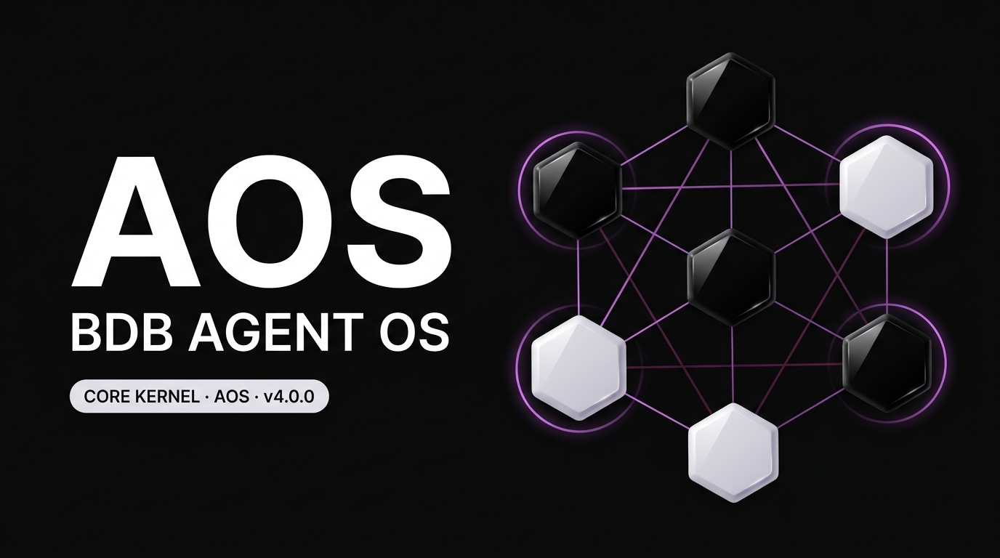
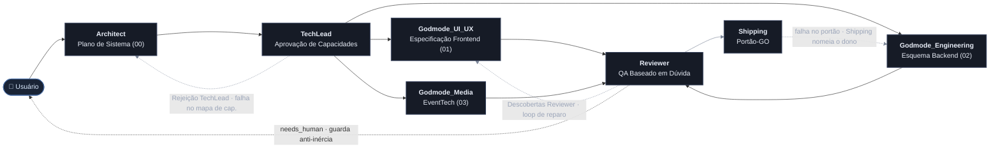
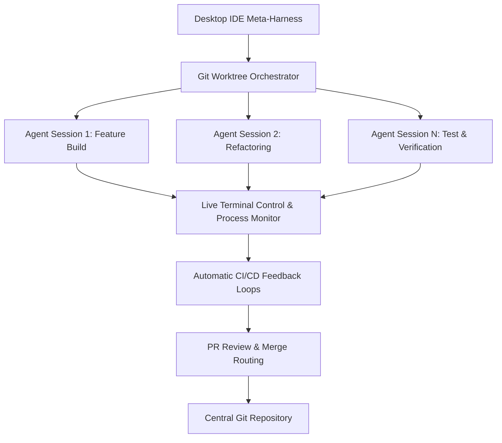
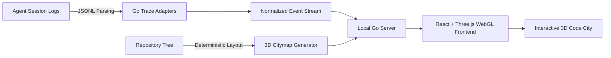

🌐 **Idioma / Language / Sprache**: [ 🇬🇧 English ](README.md) | [ 🇩🇪 Deutsch ](README.de.md) | **Português**

---

```text
█████▄ ████▄  █████▄   ▄████▄  ▄████  ██████ ███  ██ ██████   ▄████▄ ▄█████
██▄▄██ ██  ██ ██▄▄██   ██▄▄██ ██  ▄▄▄ ██▄▄   ██ ▀▄██   ██     ██  ██ ▀▀▀▄▄▄
██▄▄█▀ ████▀  ██▄▄█▀   ██  ██  ▀███▀  ██▄▄▄▄ ██   ██   ██     ▀████▀ █████▀

──────────────────────────── N O D E F O R G E ─────────────────────────────

                 BDB AGENT OS · CORE KERNEL · AOS -  v4.0.0
```

# 🚀 AOS — BDB Agent OS · Pacote Otimizado de Skills Criativas e Full-Stack

[](https://github.com/hybridlabor-api/aos/actions)
[](https://www.npmjs.com/package/@hybridlabor-api/aos)
[](https://github.com/hybridlabor-api/aos)
[](LICENSE)
[](https://github.com/hybridlabor-api/aos)
[](https://github.com/NVIDIA/SkillSpector)

> **Potencializando agentes de código de IA com 154 skills hipercuradas, 21 wrappers MCP locais e um grafo dispatcher de multi-agentes executável.**

Bem-vindo ao **BDB Agent OS — AOS v4.0.0**: 154 skills curadas, 21 wrappers MCP locais e um grafo dispatcher que os transforma em um verdadeiro pipeline de build multi-agente, não apenas uma biblioteca de prompts. Aponte para um objetivo e ele planeja, constrói, revisa e implementa através de sete nós de agentes coordenados — com um portão imposto mecanicamente antes que qualquer coisa vá ao ar.

É neutro em relação ao harness por design, não "otimizado para uma ferramenta com outras como reflexão tardia": o grafo dispatcher é executado no Dynamic Workflows do Claude Code, as mesmas skills e configuração MCP são instaladas nativamente no **Google Antigravity, ChatGPT Codex / Codex CLI, Claude Desktop, Cursor, Aider, Roo Code, Cline e Windsurf**, e a variante leve `/startcycle-graph-user` recorre aos próprios subagentes do Claude Code em qualquer máquina que não tenha nenhum dos acima instalados.

> 🎙 **Audio Deep Dive: "Give AI Agents Control of Creative Software"**  
> <video src="assets/Give_AI_Agents_Control_of_Creative_Software.mp4" controls></video>

---

### 🔨 O que muda na v4.0.0 "AOS"

Este release move o pipeline multi-agente de prosa para uma máquina de estado executável e fortalece o instalador ao seu redor.

- **Um grafo dispatcher que realmente executa.** Sete nós, predicados de aresta explícitos, um loop de reparo do Revisor com guarda contra falta de progresso e escalonamento automático para um humano quando o loop para de progredir. [Detalhes abaixo](#-aos-o-grafo-dispatcher).
- **Três variantes de pipeline** (`/startcycle`, `/startcycle-graph`, `/startcycle-graph-user`) para que o maquinário corresponda à tarefa em vez de forçar cerimônia completa em uma alteração de dois arquivos.
- **Um portão GO imposto mecanicamente.** `git push`, `npm publish`, `npm version` e `rm` recursivo são bloqueados por um hook `PreToolUse` a menos que sua mensagem imediatamente anterior seja literalmente a palavra **GO** — fiscalização que sobrevive a alterações de modo de permissão, pois é um hook em vez de uma regra que o agente deve seguir.
- **Inicialização de daemon verificada.** O instalador não relata mais "serviço iniciado" por fé; ele conecta à porta e avisa se o daemon nunca subir. O mesmo para a tabela de status do ecossistema, que agora compara versões com precedência semver real em cada dist-tag em vez de desigualdade de strings contra `latest`.
- **Stores MCP separados por harness.** Claude Desktop e Claude Code leem arquivos diferentes; a instalação para um não pula mais silenciosamente o outro. Servidores existentes em ambos os arquivos são mesclados, não sobrescritos.
- **Instalações programáveis, não interativas.** `--platforms=<n[,n]>` seleciona alvos sem o menu, para que uma máquina que apenas roda Claude Code possa ser provisionada em CI sem herdar o padrão focado no Antigravity.

### 🪐 Universal Agent Harness
O instalador agora possui um motor Universal Sync totalmente automatizado. Ele varre seu sistema em busca do **Claude Desktop, Cursor, Windsurf, Aider, Roo/Cline** e injeta a configuração MCP curada e as regras de Godmode em todos os ambientes simultaneamente.
- **Local Project Harness:** Em vez de instalar globalmente em `$HOME`, os desenvolvedores podem injetar o contrato `.agents`, os hooks de portão e o workflow do dispatcher diretamente em um único projeto — `npx @hybridlabor-api/aos --project-harness`.

### 🧩 Integrações do Ecossistema
Este pacote atua como a ponte para três grandes capacidades upstream:
- **BDB OS Agent Workspace:** A camada de orquestração para agentes de IA paralelos. Inicie múltiplas sessões de agentes isoladas via Git-Worktrees com controle de terminal ao vivo, loops de feedback CI/CD automáticos e roteamento de revisão de PR.
- **BDB Creator Extension:** O pipeline de mídia agêntica de alta capacidade. Fornece aos agentes capacidades MCP locais do ComfyUI (FLUX, SDXL), geração Image-to-3D (TripoSR, TRELLIS) e produção de vídeo automatizada através do OpenMontage e Remotion.
- **BDB Synapse:** Visualização de Codebase 3D & Replay de Sessões de Agentes. Renderiza seu repositório como uma cidade de código interativa e repete as sessões de agentes como rastros de luz, mostrando quais arquivos foram lidos, editados e onde ocorreu atrito.

### 🔗 Plugins Complementares Recomendados (Claude Code)
Nenhum destes vem dentro deste pacote — são plugins do Claude Code independentes e mantidos pela comunidade que combinam naturalmente com o padrão de delegação `agy` que o [`/startcycle-graph-user`](#-aos-o-grafo-dispatcher) já usa. Instale-os separadamente se quiser o mesmo roteamento disponível fora de uma execução `/startcycle`.

- **[antigravity-for-claude-code](https://github.com/yuting0624/antigravity-for-claude-code)**
  — executa a CLI do Antigravity (`agy`, Gemini) como um sub-agente colaborador com roteamento de modelo inteligente em todo o ciclo de vida de software (SDLC).
  ```bash
  claude plugin marketplace add yuting0624/antigravity-for-claude-code
  claude plugin install antigravity@antigravity-for-claude-code
  ```
- **[opencode-plugin-cc](https://github.com/tasict/opencode-plugin-cc)** — adiciona
  comandos slash `/opencode:review` / `/opencode:adversarial-review`, permitindo que o Claude Code
  delegue um trabalho assíncrono para o OpenCode e configure um portão de revisão que bloqueia o progresso até que
  a revisão do OpenCode retorne limpa.
  ```bash
  claude plugin marketplace add https://github.com/tasict/opencode-plugin-cc.git
  claude plugin install opencode@tasict-opencode-plugin-cc
  ```

> [!CAUTION]
> Se você também tiver um marketplace `antigravity-plugin-cc` antigo instalado, desative-o e
> limpe o cache de plugins primeiro — dois plugins de roteamento `agy` ativos ao mesmo tempo causam um conflito de ativação dupla onde nenhum inicializa de forma limpa.

## Visão Geral

Este repositório entrega três coisas: uma biblioteca curada de skills para agentes de código, um
instalador que conecta eles (mais 21 wrappers MCP locais) em qualquer harness
que você use, e um grafo dispatcher que os orquestra como um pipeline de
build multi-agente. Veja [AOS: O Grafo Dispatcher](#-aos-o-grafo-dispatcher)
abaixo para entender como o próprio pipeline funciona.

## 🌟 ~154+ Skills Otimizadas (Atualizado para v4.0.0)

Começamos com um conjunto massivo de mais de 1.400 skills de IA brutas. Após rigorosos testes, filtragem e refinamento, destilamo-las em um conjunto hipercurado de **154+ Skills Otimizadas** (apresentando um motor nativo de documentação OpenWiki, o **cérebro de memória semântica local memB** e agora a **sincronização Universal Agent Harness na v4.0.0**).

Essas skills são projetadas com precisão para garantir que os agentes não percam tempo com tarefas redundantes e, em vez disso, operem com máxima autonomia, restrições arquitetônicas rígidas e robusta consciência de contexto.

### 🛡️ Os 6 Godmodes (Camada Apex)
Em vez de deixar os agentes vagando por instruções genéricas, o nível superior deste repositório impõe seis **Godmodes Hipercurados**. Eles atuam como os guardiões definitivos para sua base de código:
- **`godmode-engineering`**: Impõe Domain-Driven Design, verificações rígidas de TypeScript, Clean Architecture e depuração sistemática.
- **`godmode-ui-ux`**: O padrão de ouro do frontend. Impõe princípios "Anti-Slop" da BDB, acessibilidade e dinâmicas de movimento fluidas.
- **`godmode-shipping`**: O guardião final para lançamentos em produção. Impõe Spec-Driven Development, verificações pré-lançamento e rollbacks seguros.
- **`godmode-eventtech`**: O livro de regras supremo para o BDB Creator Engine, governando 3D, Mídia e 21 wrappers MCP de tecnologia criativa.
- **`godmode-3d-creation`**: Controla o pipeline 3D agêntico (TripoSR, TRELLIS) para modelos generativos e estruturas CAD.
- **`godmode-media-creation`**: Orquestra a produção automatizada de vídeo, narrativa e loops de geração do ComfyUI.

### 💻 Além dos Eventos: Agentes Web & Software Full-Stack
Embora fortemente otimizado para a indústria de tecnologia criativa, estas skills estão profundamente enraizadas na engenharia de software central:
- **Operações Web Autônomas**: Suíte completa de agentes especializados movidos a Firecrawl para extração estruturada de dados, interação web automatizada e operações complexas de scraping.
- **Desenvolvimento Full-Stack**: Criação de boilerplates Next.js App Router, construção de microsserviços Node.js escaláveis e desenvolvimento de frontends interativos.
- **Desenvolvimento de Aplicações**: Arquitetura de bancos de dados com Prisma/Drizzle, design de APIs REST/GraphQL e construção de aplicações web e mobile do zero.
- **Design & Garantia de Qualidade**: Auditoria de padrões de UI/UX (utilizando `ui-ux-pro-max`), aplicação de princípios de código limpo e configuração de pipelines CI/CD rígidos.

---

## 🗂️ A Biblioteca Completa de Skills

Abaixo está a visão geral completa de todas as skills curadas de agentes incluídas neste pacote. Elas são implantadas automaticamente na área de trabalho do seu agente pelo instalador interativo.

<details>
<summary><strong>👑 Core Godmodes</strong></summary>

| Nome da Skill | Descrição |
|------------|-------------|
| `godmode-3d-creation` | Skill mestre de orquestração para todas as tarefas de geração, modelagem e reconstrução 3D. Atua como o cérebro 3D para a BDB Creator Extension. |
| `godmode-engineering` | BDB Engineering Godmode. Impõe Domain-Driven Design rigoroso, estrito TypeScript, Clean Architecture e triagem sistemática de depuração em 5 etapas. |
| `godmode-eventtech` | BDB EventTech Godmode. O livro de regras supremo para o BDB Creator Engine, governando Godmode-3D, Godmode-Media e os 21 wrappers MCP de tecnologia criativa. |
| `godmode-media-creation` | Skill mestre de orquestração para todas as tarefas de criação de mídia (Vídeo, Áudio, Imagem, Motion Design). Atua como o cérebro para a BDB Creator Extension. |
| `godmode-shipping` | BDB Shipping Godmode. O guardião final para lançamentos em produção. Impõe Spec-Driven Development, rigorosas verificações pré-lançamento, feature flags e estratégias de rollback. |
| `godmode-ui-ux` | BDB UI/UX Godmode. O padrão de ouro absoluto para design frontend. Impõe princípios Anti-Slop, acessibilidade corporativa, dinâmicas de movimento fluidas e geração de design orientada a dados em todos os harnesses de agentes. |

</details>

<details>
<summary><strong>⚙️ Sistema & Configuração</strong></summary>

#### 🤖 Agentes & Automação
| Nome da Skill | Descrição |
|------------|-------------|
| `agent-manager-skill` | Gerencia múltiplos agentes CLI locais via sessões tmux (iniciar/parar/monitorar/atribuir) com agendamento amigável para cron. |
| `agent-memory-mcp` | Um sistema de memória híbrida que fornece gerenciamento de conhecimento persistente e pesquisável para agentes de IA (Arquitetura, Padrões, Decisões). |
| `agent-orchestrator` | Meta-skill que orquestra todos os agentes do ecossistema. Scan automatico de skills, match por capacidades, coordenacao de workflows multi-skill e registry management. |
| `agent-pipeline` | Referência para o ciclo de vida do BDB (define → plan → build → verify/review → ship) que o grafo dispatcher do `/startcycle-graph` realmente executa. |
| `agent-tool-builder` | Ferramentas são como os agentes de IA interagem com o mundo. Uma ferramenta bem projetada é a diferença entre um agente que funciona e um que alucina, falha silenciosamente ou custa 10x mais tokens do que o necessário. Esta skill abrange o design de ferramentas desde o esquema até o tratamento de erros. |
| `ai-agent-development` | Fluxo de trabalho de desenvolvimento de agentes de IA para construir agentes autônomos, sistemas multi-agentes e orquestração de agentes com CrewAI, LangGraph e agentes personalizados. |
| `apify-lead-generation` | Raspar leads de múltiplas plataformas usando Apify Actors. |
| `apify-ultimate-scraper` | Extração de dados orientada por IA de mais de 55 Actors nas principais plataformas. Esta skill seleciona automaticamente o melhor Actor para a sua tarefa. |
| `bdbrainstorm` | Combina brainstorming multi-agente, o comando slash /grill-me, subagent-driven-development e ui-ux-pro-max para forçar um fluxo de trabalho abrangente de ideação multi-agente e design de UI/UX. |
| `browser-automation` | A automação de navegador potencializa testes web, raspagem e interações de agentes de IA. A diferença entre um script instável e um sistema confiável se resume a entender seletores, estratégias de espera e padrões anti-detecção. |
| `crewai` | Especialista em CrewAI - o principal framework multi-agente baseado em funções usado por 60% das empresas Fortune 500. |
| `documentation` | Fluxo de trabalho de geração de documentação abrangendo docs de API, docs de arquitetura, arquivos README, comentários de código e escrita técnica. |
| `git-advanced-workflows` | Domine técnicas avançadas de Git para manter um histórico limpo, colaborar efetivamente e se recuperar de qualquer situação com confiança. |
| `github-actions-templates` | Padrões de fluxo de trabalho do GitHub Actions prontos para produção para testar, compilar e implantar aplicações. |
| `github-repo` | Padrões e fluxos de trabalho para escrever, formatar, higienizar e publicar repositórios GitHub de alta qualidade, complementando a skill openwiki-skill. |
| `github-workflow-automation` | Padrões para automatizar fluxos de trabalho do GitHub com assistência de IA, inspirados pelo [Gemini CLI](https://github.com/google-gemini/gemini-cli) e práticas modernas de DevOps. |
| `go-playwright` | Capacidade especialista para automação de navegador robusta, furtiva e eficiente usando Playwright Go. |
| `google-sheets-automation` | Integração leve com Google Sheets com autenticação OAuth autônoma. Não requer servidor MCP. Acesso completo de leitura/escrita. |
| `n8n-code-javascript` | Escreva código JavaScript em nós Code do n8n. Use ao escrever JavaScript no n8n, usando sintaxe $input/$json/$node, fazendo requisições HTTP com $helpers, trabalhando com datas usando DateTime, solucionando erros de nó Code, ou escolhendo entre modos de nó Code. |
| `n8n-code-python` | Escreva código Python em nós Code do n8n. Use ao escrever Python no n8n, usando sintaxe _input/_json/_node, trabalhando com a biblioteca padrão, ou quando precisar entender as limitações do Python em nós Code do n8n. |
| `n8n-expression-syntax` | Valide a sintaxe de expressões n8n e corrija erros comuns. Use ao escrever expressões n8n, usando sintaxe {{}}, acessando variáveis $json/$node, solucionando erros de expressão, ou trabalhando com dados de webhook em fluxos de trabalho. |
| `n8n-mcp-tools-expert` | Guia especialista para usar ferramentas MCP n8n-mcp de forma eficaz. Use ao procurar nós, validar configurações, acessar templates, gerenciar fluxos de trabalho, ou usar qualquer ferramenta n8n-mcp. Fornece orientação de seleção de ferramentas, formatos de parâmetros e padrões comuns. |
| `n8n-workflow-patterns` | Padrões arquiteturais comprovados para construir fluxos de trabalho n8n. |
| `notion-automation` | Automatize tarefas do Notion via Rube MCP (Composio): páginas, bancos de dados, blocos, comentários, usuários. Sempre pesquise nas ferramentas primeiro para obter esquemas atuais. |
| `os-scripting` | Fluxo de trabalho de solução de problemas de sistema operacional e shell scripting para Linux, macOS e Windows. Abrange bash scripting, administração de sistemas, depuração e automação. |
| `rag-implementation` | Fluxo de trabalho de implementação de RAG (Retrieval-Augmented Generation) cobrindo seleção de embeddings, configuração de banco de dados vetorial, estratégias de chunking e otimização de recuperação. |
| `slack-automation` | Automatize operações do workspace Slack incluindo mensagens, busca, gerenciamento de canais e fluxos de trabalho de reações através do toolkit Slack da Composio. |
| `subagent-driven-development` | Use ao executar planos de implementação com tarefas independentes na sessão atual. |
| `tdd-workflow` | Princípios de fluxo de trabalho de Desenvolvimento Orientado a Testes (Test-Driven Development). Ciclo RED-GREEN-REFACTOR. |
| `tmux` | Especialista em gerenciamento de sessões, janelas e painéis tmux para multiplexação de terminal, fluxos de trabalho remotos persistentes e automação de shell scripting. |

#### 🎨 Frontend & UI/UX
| Nome da Skill | Descrição |
|------------|-------------|
| `MCP_Manage` | Gerencia os servidores MCP especializados da BDB incluindo Unreal Engine, Rhino 7/8, DaVinci Resolve, grandMA3, Resolume, GitHub, Chrome DevTools e TouchDesigner. |
| `api-design-principles` | Domine princípios de design de API REST e GraphQL para construir APIs intuitivas, escaláveis e de fácil manutenção que encantam os desenvolvedores e resistem ao teste do tempo. |
| `api-patterns` | Princípios de design de API e tomada de decisões. Seleção entre REST vs GraphQL vs tRPC, formatos de resposta, versionamento, paginação. |
| `database-design` | Princípios de design de banco de dados e tomada de decisões. Design de esquema, estratégia de indexação, seleção de ORM, bancos de dados serverless. |
| `design-taste-frontend` | Use ao construir interfaces frontend de alta agência com gosto de design rigoroso, cores calibradas, layout responsivo e regras de movimento. |
| `drizzle-orm-expert` | Especialista em Drizzle ORM para TypeScript — design de esquema, consultas relacionais, migrações e integração de banco de dados serverless. Use ao construir camadas de banco de dados type-safe com Drizzle. |
| `frontend-design` | Você é um engenheiro-designer frontend, não um gerador de layouts. |
| `frontend-dev-guidelines` | Você é um engenheiro frontend sênior operando sob rigorosos padrões arquiteturais e de desempenho. Use ao criar componentes ou páginas, adicionar novas features, ou buscar e mutar dados. |
| `landing-page-generator` | Gera landing pages de alta conversão Next.js/React com Tailwind CSS. Usa frameworks PAS, AIDA e BAB para copy/componentes otimizados (Heroes, Features, Pricing). Foca em Core Web Vitals/SEO. |
| `llm-application-dev-ai-assistant` | Você é um especialista em desenvolvimento de assistentes de IA especializado em criar interfaces conversacionais inteligentes, chatbots e aplicações movidas a IA. Crie soluções de assistente de IA abrangentes com natur |
| `nextjs-app-router-patterns` | Padrões abrangentes para arquitetura Next.js 14+ App Router, Server Components e desenvolvimento full-stack React moderno. |
| `nextjs-best-practices` | Princípios do Next.js App Router. Server Components, busca de dados, padrões de roteamento. |
| `openapi-spec-generation` | Gere e mantenha especificações OpenAPI 3.1 a partir de código, especificações design-first e padrões de validação. Use ao criar documentação de API, gerar SDKs ou garantir conformidade com contratos de API. |
| `postgres-best-practices` | Otimização de desempenho e melhores práticas de Postgres da Supabase. Use esta skill ao escrever, revisar ou otimizar consultas Postgres, designs de esquema ou configurações de banco de dados. |
| `postgresql` | Projete um esquema específico para PostgreSQL. Abrange melhores práticas, tipos de dados, indexação, restrições, padrões de desempenho e recursos avançados. |
| `prisma-expert` | Você é um especialista em Prisma ORM com profundo conhecimento em design de esquemas, migrações, otimização de consultas, modelagem de relações e operações de banco de dados em PostgreSQL, MySQL e SQLite. |
| `programmatic-seo` | Projete e avalie estratégias de programmatic SEO para criar páginas orientadas a SEO em escala usando templates e dados estruturados. |
| `react-best-practices` | Guia abrangente de otimização de desempenho para aplicações React e Next.js, mantido pela Vercel. Use ao escrever novos componentes React ou páginas Next.js, implementar busca de dados (client ou server-side), ou revisar código em busca de problemas de desempenho. |
| `react-component-performance` | Diagnostique componentes React lentos e sugira correções de desempenho direcionadas. |
| `react-patterns` | Padrões e princípios modernos do React. Hooks, composição, desempenho, melhores práticas de TypeScript. |
| `schema-markup` | Projete, valide e otimize dados estruturados schema.org para elegibilidade, correção e impacto de SEO mensurável. |
| `senior-frontend` | Skill de desenvolvimento frontend para aplicações React, Next.js, TypeScript e Tailwind CSS. Use ao construir componentes React, otimizar desempenho Next.js, analisar tamanhos de bundle, criar boilerplates de projetos frontend, implementar acessibilidade ou revisar a qualidade do código frontend. |
| `shadcn` | Gerencia componentes e projetos shadcn/ui, fornecendo contexto, documentação e padrões de uso para construir sistemas de design modernos. |
| `software-architecture` | Guia para arquitetura de software focada em qualidade. Esta skill deve ser usada quando os usuários quiserem escrever código, projetar arquitetura, analisar código, em qualquer caso relacionado ao desenvolvimento de software. |
| `spline-3d-integration` | Use ao adicionar cenas 3D interativas do Spline.design a projetos web, incluindo incorporação React e API de controle de tempo de execução. |
| `tailwind-patterns` | Princípios do Tailwind CSS v4. Configuração CSS-first, container queries, padrões modernos, arquitetura de design tokens. |
| `tanstack-query-expert` | Especialista em TanStack Query (React Query) — gerenciamento de estado assíncrono. Abrange busca de dados, configuração de tempo de expiração (stale time), mutações, atualizações otimistas e integração com Next.js App Router (SSR). |
| `ui-component` | Gere um novo componente de UI que siga as convenções do StyleSeed Toss para estrutura, tokens, acessibilidade e ergonomia de componente. |
| `ui-page` | Crie a estrutura de uma nova página mobile-first usando padrões de layout do StyleSeed Toss, ritmo de seção e componentes de shell existentes. |
| `ui-pattern` | Gere padrões de UI reutilizáveis como seções de cartões, grades, listas, formulários e invólucros de gráficos usando primitivos do StyleSeed Toss. |
| `ui-review` | Revise o código de UI quanto à conformidade com o sistema de design StyleSeed, acessibilidade, ergonomia mobile, disciplina de espaçamento e qualidade de implementação. |
| `ui-tokens` | Liste, adicione e atualize design tokens StyleSeed mantendo fontes JSON, variáveis CSS e valores de modo escuro perfeitamente sincronizados. |
| `ui-ux-pro-max` | Guia de design abrangente para aplicações web e mobile. Use ao projetar novos componentes de UI ou páginas, escolher paletas de cores e tipografia, ou revisar código em busca de problemas de UX. |
| `ux-audit` | Audite telas em relação às heurísticas de Nielsen e melhores práticas de UX mobile usando a linguagem de design StyleSeed Toss como contexto de implementação. |
| `ux-feedback` | Adicione estados de feedback de carregamento, vazio, erro e sucesso a componentes e páginas StyleSeed com regras práticas mobile-first. |
| `ux-flow` | Projete fluxos de usuários e estrutura de tela usando padrões de UX StyleSeed como divulgação progressiva, navegação hub-and-spoke e pirâmides de informação. |
| `ux-persuasion-engineer` | Uma frase - o que esta skill faz e quando invocá-la. |
| `vercel-ai-sdk-expert` | Especialista no Vercel AI SDK. Abrange Core API (generateText, streamText), hooks de UI (useChat, useCompletion), chamada de ferramentas e streaming de componentes de UI com React e Next.js. |
| `wcag-audit-patterns` | Guia abrangente para auditar conteúdo web contra diretrizes WCAG 2.2 com estratégias de remediação acionáveis. |
| `web-artifacts-builder` | Para construir artefatos frontend claude.ai poderosos, siga estes passos: |
| `zustand-store-ts` | Crie stores Zustand seguindo padrões estabelecidos com tipos TypeScript adequados e middlewares. |

#### 🗄️ Backend & Bancos de Dados
| Nome da Skill | Descrição |
|------------|-------------|
| `gemini-api-dev` | A Gemini API fornece acesso aos modelos de IA mais avançados do Google. As principais capacidades incluem: |
| `gemini-api-integration` | Use ao integrar a Google Gemini API em projetos. Abrange seleção de modelo, entradas multimodais, streaming, chamadas de função e melhores práticas de produção. |
| `github` | Use a CLI `gh` para issues, pull requests, execuções do Actions e consultas à GitHub API. |
| `go-concurrency-patterns` | Domine simultaneidade Go com goroutines, canais, primitivas sync e contexto. Use ao construir aplicações Go simultâneas, implementar pools de trabalhadores ou depurar condições de corrida. |
| `golang-pro` | Domine Go 1.22+ com padrões modernos, simultaneidade avançada, otimização de desempenho e microsserviços prontos para produção. |
| `llm-structured-output` | Obtenha JSON, enums e objetos tipados confiáveis de LLMs usando response_format, tool_use e decodificação com restrição de esquema em APIs OpenAI, Anthropic e Google. |
| `microservices-patterns` | Domine padrões de arquitetura de microsserviços incluindo limites de serviço, comunicação inter-serviços, gerenciamento de dados e padrões de resiliência para construir sistemas distribuídos. |
| `neon-postgres` | Padrões especialistas para Postgres serverless Neon, branching, pool de conexões e integração Prisma/Drizzle. |
| `python-patterns` | Princípios de desenvolvimento em Python e tomada de decisões. Seleção de framework, padrões assíncronos, dicas de tipo (type hints), estrutura de projeto. Ensina a pensar, não a copiar. |
| `python-performance-optimization` | Faça perfil e otimize código Python usando cProfile, profilers de memória e melhores práticas de desempenho. Use ao depurar código Python lento, otimizar gargalos ou melhorar o desempenho de aplicações. |
| `python-pro` | Domine Python 3.12+ com recursos modernos, programação assíncrona, otimização de desempenho e práticas prontas para produção. Especialista no ecossistema Python mais recente, incluindo uv, ruff, pydantic e FastAPI. |
| `rag-engineer` | Especialista em construir sistemas de Retrieval-Augmented Generation. Domina modelos de embedding, bancos de dados vetoriais, estratégias de chunking e otimização de recuperação para aplicações LLM. |
| `using-neon` | Neon é uma plataforma Postgres serverless que separa computação e armazenamento para oferecer dimensionamento automático, ramificação (branching), restauração instantânea e scale-to-zero. É totalmente compatível com Postgres e funciona com qualquer linguagem, framework ou ORM que suporte Postgres. |
| `vector-database-engineer` | Especialista em bancos de dados vetoriais, estratégias de embedding e implementação de busca semântica. Domina Pinecone, Weaviate, Qdrant, Milvus e pgvector para aplicações RAG, sistemas de recomendação e similares. |
| `web-scraper` | Web scraping inteligente multi-estrategia. Extrai dados estruturados de paginas web (tabelas, listas, precos). Paginacao, monitoramento e export CSV/JSON. |
| `webapp-testing` | Para testar aplicações web locais, escreva scripts nativos Python Playwright. |

#### 🚀 DevOps & Infraestrutura
| Nome da Skill | Descrição |
|------------|-------------|
| `bash-linux` | Padrões de terminal Bash/Linux. Comandos críticos, pipes, tratamento de erros, scripts. Use ao trabalhar em sistemas macOS ou Linux. |
| `cloudflare-workers-expert` | Especialista em Cloudflare Workers e ecossistema de Edge Computing. Abrange Wrangler, KV, D1, Durable Objects e armazenamento R2. |
| `docker-expert` | Você é um especialista avançado em conteinerização Docker com conhecimento prático e abrangente sobre otimização de contêineres, endurecimento de segurança, construções em múltiplas etapas, padrões de orquestração e estratégias de implantação em produção baseadas nas melhores práticas atuais da indústria. |
| `git-pr-review` | Gere uma descrição de PR concisa e estruturada a partir do histórico de commits com uso mínimo de tokens. |
| `llm-app-patterns` | Padrões prontos para produção para construir aplicações LLM, inspirados pelo [Dify](https://github.com/langgenius/dify) e pelas melhores práticas da indústria. |
| `local-llm-expert` | Domine a inferência LLM local, seleção de modelo, otimização de VRAM e implantação local usando Ollama, llama.cpp, vLLM e LM Studio. Especialista em formatos de quantização (GGUF, EXL2) e privacidade em IA local. |
| `posix-shell-pro` | Especialista em scripts POSIX sh estritos para máxima portabilidade em sistemas tipo Unix. Especializa-se em shell scripts que rodam em qualquer shell compatível com POSIX (dash, ash, sh, bash --posix). |
| `turborepo-caching` | Configure o Turborepo para builds eficientes de monorepo com cache local e remoto. Use ao configurar Turborepo, otimizar pipelines de build ou implementar cache distribuído. |
| `vercel-deployment` | Conhecimento especialista para implantar na Vercel com Next.js. |

#### 🧠 IA & LLM
| Nome da Skill | Descrição |
|------------|-------------|
| `ai-product` | Todo produto será impulsionado por IA. A questão é se você o construirá direito ou lançará uma demo que desmorona em produção. |
| `llm-prompt-optimizer` | Use ao melhorar prompts para qualquer LLM. Aplica técnicas comprovadas de engenharia de prompt para aumentar a qualidade da saída, reduzir alucinações e cortar uso de tokens. |
| `openwiki-skill` | Integração nativa do Gemini com o OpenWiki para gerenciamento autônomo e de alta agência de documentação e manutenção de notas de lançamento (release notes). |
| `prompt-engineer` | Transforma prompts de usuário em prompts otimizados usando frameworks (RTF, RISEN, Chain of Thought, RODES, Chain of Density, RACE, RISE, STAR, SOAP, CLEAR, GROW). |
| `prompt-engineering-patterns` | Domine técnicas avançadas de engenharia de prompt para maximizar o desempenho, a confiabilidade e a controlabilidade do LLM. |

#### 📝 Documentação & Planejamento
| Nome da Skill | Descrição |
|------------|-------------|
| `architect-review` | Mestre arquiteto de software especializado em arquitetura moderna. |
| `concise-planning` | Use quando um usuário pede um plano para uma tarefa de código, para gerar um checklist claro, acionável e atômico. |
| `copywriting` | Escreva copy de marketing rigoroso e focado em conversão para landing pages e e-mails. Impõe confirmação breve e regras estritas de não-fabricação. |
| `deep-research` | Execute tarefas autônomas de pesquisa que planejam, buscam, leem e sintetizam informações em relatórios abrangentes. |
| `executing-plans` | Use quando você tiver um plano de implementação escrito para executar em uma sessão separada com checkpoints de revisão. |
| `linear-claude-skill` | Gerencie issues, projetos e equipes no Linear. |
| `memb-skill` | Motor de memória local de longo prazo da BDB (memB). Consulte, lembre-se e adapte preferências, arquiteturas de código e padrões de desenvolvedor entre tarefas. |
| `modern-javascript-patterns` | Guia abrangente para dominar os recursos modernos do JavaScript (ES6+), padrões de programação funcional e melhores práticas para escrever código limpo, sustentável e de alto desempenho. |
| `planning-with-files` | Trabalhe como o Manus: Use arquivos markdown persistentes como sua "memória de trabalho em disco". |
| `product-manager-toolkit` | Ferramentas e frameworks essenciais para o gerenciamento de produtos moderno, da descoberta à entrega. |
| `readme` | Você é um redator técnico especialista na criação de documentação abrangente de projetos. Seu objetivo é escrever um README.md que seja absurdamente completo — o tipo de documentação que você gostaria que todo projeto tivesse. |
| `test-driven-development` | Use ao implementar qualquer recurso ou correção de bug, antes de escrever o código de implementação. |
| `writing-plans` | Use quando você tiver uma especificação ou requisitos para uma tarefa de múltiplas etapas, antes de tocar no código. |

#### 🧊 3D & Motion
| Nome da Skill | Descrição |
|------------|-------------|
| `remotion` | Gere vídeos de passo a passo de projetos Stitch usando Remotion com transições suaves, zoom e sobreposições de texto. |
| `threejs-skills` | Crie cenas 3D, experiências interativas e efeitos visuais usando Three.js. Use quando o usuário solicitar gráficos 3D, experiências WebGL, visualizações 3D, animações ou elementos 3D interativos. |

#### 📈 SEO & Marketing
| Nome da Skill | Descrição |
|------------|-------------|
| `geo-fundamentals` | Otimização de Motor Generativo (Generative Engine Optimization) para motores de busca de IA (ChatGPT, Claude, Perplexity). |
| `seo` | Execute uma auditoria SEO ampla abrangendo SEO técnico, SEO on-page, schema, sitemaps, qualidade de conteúdo, prontidão para busca por IA e GEO. Use como a skill guarda-chuva quando o usuário pedir uma análise ou estratégia completa de SEO. |
| `seo-audit` | Diagnostique e audite problemas de SEO que afetam crawlability, indexação, classificações e desempenho orgânico. |
| `seo-technical` | Audite o SEO técnico abrangendo crawlability, indexabilidade, segurança, URLs, mobile, Core Web Vitals, dados estruturados, renderização JavaScript e sinais de plataforma relacionados como robots.txt e acesso de crawler de IA. |

#### 🔧 Programação Central & Depuração
| Nome da Skill | Descrição |
|------------|-------------|
| `clean-code` | Esta skill incorpora os princípios do "Clean Code" de Robert C. Martin (Uncle Bob). Use-a para transformar "código que funciona" em "código que é limpo". |
| `debugger` | Especialista em depuração de erros, falhas de teste e comportamentos inesperados. Use proativamente ao encontrar quaisquer problemas. |
| `playwright-skill` | IMPORTANTE - Resolução de Caminho: Esta skill pode ser instalada em locais diferentes (sistema de plugin, instalação manual, global ou específico do projeto). Antes de executar qualquer comando, determine o diretório da skill com base em onde você carregou este arquivo SKILL.md, e use esse caminho em todos os comandos abaixo. |
| `simplify-code` | Revise um diff para buscar clareza e simplificações seguras e, opcionalmente, aplique correções de baixo risco. |
| `systematic-debugging` | Use ao encontrar qualquer bug, falha de teste ou comportamento inesperado, antes de propor correções. |
| `typescript-pro` | Domine TypeScript com tipos avançados, generics e estrita segurança de tipos. Lida com sistemas de tipos complexos, decorators e padrões de nível corporativo. |

#### 📦 Outros Utilitários
| Nome da Skill | Descrição |
|------------|-------------|
| `bdb-updater` | Verifique proativamente e instale atualizações no pacote BDB Antigravity Skills via NPM. |
| `monorepo-management` | Construa monorepos eficientes e escaláveis que possibilitem compartilhamento de código, ferramentas consistentes e alterações atômicas em múltiplos pacotes e aplicações. |
| `obsidian-markdown` | Crie e edite Obsidian Flavored Markdown com wikilinks, embeds, callouts, propriedades e outras sintaxes específicas do Obsidian. Use ao trabalhar com arquivos .md no Obsidian, ou quando o usuário mencionar wikilinks, callouts, frontmatter, tags, embeds ou notas Obsidian. |
| `senior-fullstack` | Kit de ferramentas completo para fullstack sênior com ferramentas modernas e melhores práticas. |
| `token-saver-config` | Motor de compressão de saída de janela de contexto para comandos CLI (60-99% de redução de tokens). |
| `web-performance-optimization` | Otimize o desempenho de sites e aplicações web, incluindo velocidade de carregamento, Core Web Vitals, tamanho de bundle, estratégias de cache e desempenho de tempo de execução. |

</details>

<details>
<summary><strong>🌀 Ecossistema & Metodologias BDB</strong></summary>

| Nome da Skill | Descrição |
|------------|-------------|
| `bdbmediastorm` | O motor definitivo para brainstorming tecnológico criativo e controle de shows. Orquestra a ideação multi-agente focada em fluxo de sinais, restrições de hardware, protocolos e integrações MCP da BDB. Agora rigorosamente governada pelos 3 Core Godmodes (engineering, ui-ux, shipping). |
| `bdbrainstorm` | Combina brainstorming multi-agente, o comando slash /grill-me e os 3 Core Godmodes (godmode-engineering, godmode-ui-ux, godmode-shipping) para forçar um fluxo de trabalho abrangente de ideação multi-agente e design técnico. |
| `github-repo` | Padrões e fluxos de trabalho para escrever, formatar, higienizar e publicar repositórios GitHub de alta qualidade, complementando a skill openwiki-skill. |
| `memb-ingest` | Varredura profunda e ingestão de arquivos de projeto (.md, .json, AGENTS.md, .openwiki) e logs de conversas passadas para o motor de memória vetorial local memB. |

</details>

<details>
<summary><strong>🔥 Agentes Especializados de Workspace</strong></summary>

#### 🤖 Agentes & Automação
| Nome da Skill | Descrição |
|------------|-------------|
| `firecrawl-agent` | Extração de dados autônoma alimentada por IA que navega em sites complexos e retorna JSON estruturado. Use esta skill quando o usuário quiser dados estruturados de sites, precisar extrair tabelas de preços, listagens de produtos, entradas de diretório ou qualquer dado como JSON com um esquema. Acionado por "extrair dados estruturados", "obter todos os produtos", "puxar informações de preços", "extrair como JSON" ou quando o usuário fornece um esquema JSON para dados do site. Mais poderoso que a raspagem simples para extração estruturada de múltiplas páginas. |
| `firecrawl-build-onboarding` | Adicione credenciais Firecrawl e configuração do SDK em um projeto. Use quando um aplicativo precisa de `FIRECRAWL_API_KEY`, quando um agente deve adicionar Firecrawl ao `.env`, quando o usuário deseja autenticar o Firecrawl para o código do aplicativo ou ao escolher a primeira documentação e SDK para uma nova integração Firecrawl. Esta skill inclui seu próprio fluxo de autenticação de navegador, portanto, não depende da skill de integração do site. |
| `firecrawl-build-search` | Integre o `/search` do Firecrawl em código de produto e fluxos de trabalho de agentes. Use quando um aplicativo precisar de descoberta antes da extração, quando a feature iniciar com uma query em vez de uma URL, ou quando o sistema precisar pesquisar na web e opcionalmente hidratar o conteúdo do resultado. |

#### 🗄️ Backend & Bancos de Dados
| Nome da Skill | Descrição |
|------------|-------------|
| `firecrawl-build` | Integre o Firecrawl no código de produto para scraping, crawling, buscas e interações web. Use esta skill quando uma aplicação precisar acessar dados web, extrair conteúdo ou automatizar interações web. |
| `firecrawl-build-interact` | Integre o `/interact` do Firecrawl em código de produto para páginas dinâmicas e ações de navegador após scraping. Use quando uma feature precisar de cliques, preenchimentos de formulário, paginação, fluxos com reconhecimento de autenticação, ou outras interações de múltiplas etapas que um simples `/scrape` não consegue completar. |
| `firecrawl-download` | Baixe um site inteiro como arquivos locais — markdown, capturas de tela, ou múltiplos formatos por página. Use esta skill quando o usuário quiser salvar um site localmente, baixar documentação para uso offline, salvar páginas em lote como arquivos, ou disser "baixar o site", "salvar como arquivos locais", "cópia offline", "baixar todas as docs", ou "salvar para referência". Combina mapeamento de site e scraping em diretórios locais organizados. |
| `firecrawl-interact` | Controle e interaja com uma sessão de navegador ao vivo em qualquer página raspada — clique em botões, preencha formulários, navegue em fluxos e extraia dados usando prompts em linguagem natural ou código. Use quando o usuário precisar interagir com uma página da web além da raspagem simples: fazendo login em um site, enviando formulários, clicando através de paginação, lidando com rolagem infinita, navegando no checkout ou fluxos de assistente de múltiplos passos, ou quando uma raspagem regular falhar porque o conteúdo está por trás da interação JavaScript. Também útil para raspagem autenticada via perfis. É ativada em comandos como "interagir", "clicar", "preencher o formulário", "fazer login em", "entrar", "enviar", "paginada", "próxima página", "rolagem infinita", "interagir com a página", "navegar para", "abrir uma sessão", ou "falha na raspagem". |

#### 🚀 DevOps & Infraestrutura
| Nome da Skill | Descrição |
|------------|-------------|
| `firecrawl` | Pesquise, raspe e interaja com a web através da CLI do Firecrawl. Use esta skill sempre que o usuário quiser buscar na web, encontrar artigos, pesquisar um tópico, procurar algo online, raspar uma página da web, capturar conteúdo de uma URL, obter dados de um site, fazer crawl de documentação, baixar um site ou interagir com páginas que precisam de cliques ou logins. Use também quando eles disserem "busque esta página", "puxe o conteúdo de", "obter a página em https://" ou referenciarem sites externos. Isso provê pesquisa web em tempo real com conteúdo completo da página e capacidades interativas — além do que o Claude pode fazer nativamente com as ferramentas embutidas. NÃO acione para operações de arquivos locais, comandos git, implantações ou tarefas de edição de código. |

#### 🧠 IA & LLM
| Nome da Skill | Descrição |
|------------|-------------|
| `firecrawl-scrape` | Extraia markdown limpo de qualquer URL, incluindo SPAs renderizados em JavaScript. Use esta skill sempre que o usuário fornecer uma URL e quiser seu conteúdo, disser "raspar", "pegar", "buscar", "puxar", "obter a página", "extrair desta URL", ou "ler esta página da web". Lida com páginas renderizadas em JS, múltiplas URLs simultâneas e retorna markdown otimizado para LLM. Use esta em vez do WebFetch para qualquer extração de conteúdo de página web. |

#### 📝 Documentação & Planejamento
| Nome da Skill | Descrição |
|------------|-------------|
| `firecrawl-crawl` | Extraia conteúdo em massa de um site inteiro ou seção de site. Use esta skill quando o usuário quiser fazer crawl de um site, extrair todas as páginas de uma seção de documentação, raspar várias páginas em lote seguindo links, ou disser "crawl", "obter todas as páginas", "extrair tudo em /docs", "extrair em lote", ou precisar de conteúdo de muitas páginas no mesmo site. Lida com limites de profundidade, filtragem de rotas e extração concorrente. |

#### 📦 Outros Utilitários
| Nome da Skill | Descrição |
|------------|-------------|
| `firecrawl-build-scrape` | Integre o `/scrape` do Firecrawl em código de produto para extração de página única. Use quando um aplicativo já tiver uma URL e precisar de markdown, HTML, links, capturas de tela, metadados ou saída de página estruturada. Prefira esta skill sobre padrões de crawl mais amplos quando a funcionalidade for ao nível da página. |
| `firecrawl-map` | Descubra e liste todas as URLs em um site, com filtragem de pesquisa opcional. Use esta skill quando o usuário quiser encontrar uma página específica em um site grande, listar todas as URLs, ver a estrutura do site, encontrar onde algo está em um domínio, ou disser "mapear o site", "encontrar a URL para", "quais páginas estão em", ou "listar todas as páginas". Essencial quando o usuário sabe qual site, mas não qual página exata. |
| `firecrawl-search` | Busca na web com extração completa do conteúdo da página. Use esta skill sempre que o usuário pedir para buscar na web, encontrar artigos, pesquisar um tópico, procurar por algo, descobrir notícias recentes, encontrar fontes, ou disser "buscar por", "encontre para mim", "procurar", "o que as pessoas estão dizendo sobre", ou "encontre artigos sobre". Retorna resultados de busca reais com markdown opcional da página completa — não apenas trechos. Provê capacidades além do WebSearch integrado do Claude. |

</details>


---

## 🔄 AOS: O Grafo Dispatcher

A v4.0.0 substitui a antiga prosa linear da "pipeline de 5 agentes" por uma máquina de estados real e executável. O contrato vive em [`.agents/graph.md`](.agents/graph.md), a lista de nós em [`.agents/nodes.json`](.agents/nodes.json), e o dispatcher executável em [`.claude/workflows/startcycle-dispatch.mjs`](.claude/workflows/startcycle-dispatch.mjs).

**A única regra que todo o resto segue: nós nunca invocam uns aos outros.** Um único dispatcher lê `production_artifacts/state.json` após o retorno de cada nó e decide o que será executado a seguir. Não há cadeia de repasse (hand-off), nenhum agente dizendo a outro agente para prosseguir — o que impede o desvio de prompts que faz longos pipelines de agentes saírem do curso.



### O que faz o sistema se manter unido

| Mecanismo | O que previne |
|---|---|
| **Isolamento do Reviewer** | O Reviewer lê os artefatos de build e o contrato do plano — nunca o `goal` original, nunca o raciocínio de um nó de build ou sua afirmação de que o trabalho está concluído. Repassar a afirmação do implementador enviesa o revisor para a concordância; retê-la é o que torna a revisão adversária em vez de um mero carimbo. |
| **Guarda anti-inércia** | Se um ciclo de reparo retornar relatando o *mesmo* ID de descoberta bloqueante que o anterior, nada está realmente sendo consertado. A execução escala para um humano em vez de queimar iterações executando um loop idêntico. |
| **Fragmentos de estado por nó** | Os nós de build rodam em paralelo e cada um escreve seu próprio fragmento `state.d/<nó>.json`, mesclados depois — eles nunca escrevem em `state.json` diretamente. Gravadores paralelos em um arquivo JSON geram condição de corrida por atualização perdida; os fragmentos removem a corrida por construção. |
| **Teto de iteração** | `max_iterations` (padrão 3) para o loop incondicionalmente, deliberadamente configurado abaixo da própria sobreposição de parada de 8 hooks do Claude Code, para que a própria mensagem de escalonamento da execução chegue a você primeiro. |
| **Transição humana no loop** | Qualquer nó pode definir `needs_human: true` e parar a execução. Autonomia total soa bem até que um nó atinja algo que apenas um humano pode decidir — isso é uma aresta explícita no grafo, não uma interrupção dele. |
| **Lançamento com Portão-GO** | Alcançar `ready_to_ship` não é lançar. `git push`, `npm publish`, `npm version` e `rm` recursivo são bloqueados por um hook `PreToolUse` ([`.claude/hooks/go-gate.mjs`](.claude/hooks/go-gate.mjs)) a menos que sua mensagem imediatamente anterior seja a palavra literal **GO**. É um hook, não uma regra que um agente lê e tenta seguir — ele é acionado antes de qualquer verificação de modo de permissão e não pode ser contornado. |

### Três variantes — escolha pela quantidade de maquinário que a tarefa precisa

| Comando | Maquinário | Use quando |
|---|---|---|
| **`/startcycle`** | Cadeia linear, entregas de arquivo em `production_artifacts/`. Sem máquina de estado, sem loop de reparo. | Um build direto onde você quer a equipe de agentes, mas não a cerimônia. |
| **`/startcycle-graph`** | O grafo completo acima: `state.json` durável, loop de reparo do Reviewer, portão de qualidade, escalonamento automático. | Trabalho de feature real onde a exatidão importa mais que a velocidade, e você quer uma trilha de auditoria do que aconteceu. |
| **`/startcycle-graph-user`** | Delegação descartável de 2 a 4 nós. Nada persistente — sem inicialização `.agents/`, sem `state.json`. Modelos classificados por função (Opus planeja, Sonnet revisa, Haiku ou uma CLI externa faz o trabalho mecânico). | Um único "gerar alguns trabalhadores para esta tarefa" em *qualquer* projeto, incluindo aqueles que nunca ouviram falar deste repositório. |

A terceira variante assume deliberadamente nada sobre sua máquina: ela detecta se o Antigravity, OpenCode ou Codex estão presentes e recorre aos próprios subagentes do Claude Code quando nenhum está. As classificações de modelos são forçadas por função, em vez de herdadas de sua sessão, de forma que um passo de trabalhador mecânico não rode silenciosamente no Opus só porque é o que você tinha selecionado.

---

## 🧠 BDBrainstorm: O Motor Definitivo de Ideação

Incluída neste arsenal otimizado está nossa skill proprietária **BDBrainstorm**.

O BDBrainstorm combina brainstorming multi-agente, o comando slash `/grill-me`, desenvolvimento guiado por subagentes e workflows extremos de design UI/UX para forçar um processo abrangente de ideação multi-agente. Ele testa estresse em designs, projeta os sistemas por trás deles e gera planos de implementação executáveis de alta fidelidade.

---

## 🔌 21 Integrações Locais de MCPP


Em vez de depender de mocks rudimentares em python ou APIs remotas com falhas, este repositório empacota **21 wrappers MCP locais** (no diretório `mcps/`). Eles são construídos/preparados automaticamente e permitem que seu assistente de IA leia, escreva e execute comandos nos principais softwares criativos do mercado.

<details>
<summary><strong>🎨 Adobe Creative Cloud (Illustrator, Photoshop, After Effects, Premiere Pro)</strong></summary>

Fornecemos uma arquitetura de motor duplo otimizada para ambientes macOS e Windows:
- **Direct OS-Native Bridge (`bdb_adobe_mcp`)**: Executa scripts sem necessidade de instalação.
  - **macOS:** Direciona IDs de pacotes de aplicações diretamente via streams de comando AppleScript `do javascript` / `DoScript`.
  - **Windows:** Consulta e instancia automaticamente objetos COM locais via scripts wrapper em PowerShell e executa código ExtendScript `.jsx` temporário.
- **Cross-Platform UXP WebSocket Bridge (`bdb_adobe_uxp_mcp`)**: Um proxy WebSocket de três camadas (servidor Node.js na porta 8080 + plugins nativos de desenvolvedor UXP) para manipulação profunda de DOM e sessões WebSocket persistentes no Photoshop e Premiere Pro, funcionando identicamente no Windows e macOS.
</details>

<details>
<summary><strong>🎬 DaVinci Resolve (Cobertura Tripla)</strong></summary>

- **Principal: `bdb_davinci_mcp`**: Funciona nas versões **Gratuito e Studio** usando um loop de menu de script de workspace. Expõe 162 ferramentas (Timeline, clips, marcadores, grades, Fusion) e inclui modelos de IA locais baseados em CPU (Meta Demucs v4 para isolamento de voz, faster-whisper para legendas automáticas e rembg para remoção de fundo).
- **Studio: `bdb_davinci_mcp_studio`**: O servidor Node.js oficial (baseado no samuelgursky) para gerenciamento direto e avançado de linha do tempo e projetos no Resolve Studio.
- **Fallback: `bdb_davinci_mcp_fallback`**: Servidor python profissional Hoyt-harness para scripting no Studio.
</details>

<details>
<summary><strong>📐 Rhino 3D & Grasshopper (Twin-Engine)</strong></summary>

- **Principal: `bdb_rhino_mcp`**: Conector oficial da McNeel (gerenciado via roteador Yak) para leitura/escrita nativa de layouts geométricos do Rhino.
- **Fallback: `bdb_rhino_mcp_fallback`**: O servidor 3D GOLEM com 105 ferramentas para manipular dinamicamente ativos do Rhino 8, executar scripts e resolver definições do Grasshopper.
</details>

<details>
<summary><strong>🏗️ Integrações Especializadas Adicionais (Unreal, TouchDesigner, Vectorworks, etc.)</strong></summary>

### 🏗️ Vectorworks
- **Principal: `bdb_vectorworks_mcp`**: Índice de busca semântico baseado em RAG sobre documentação do VectorScript e API do Vectorworks (porta 8765) para desenho CAD automatizado.

### 🎮 Unreal Engine
- **Principal: `bdb_unreal_mcp`**: Conecta-se via Unreal Engine 5 Web Remote Control API (porta 30010) e o conjunto de ferramentas `gimmeDG`. Permite ao agente consultar, criar atores, editar materiais, escrever Blueprints e automatizar a manipulação de níveis/sequenciadores.

### 🧊 Blender (Twin-Engine)
- **Principal: `bdb_blender_mcp`**: Integração de soquete BlenderMCP para layout de cena, geração de malha e controles de viewport.
- **Fallback: `bdb_blender_mcp_fallback`**: Servidor python do djeada para gerenciar conexões TCP do Blender e scripting python bruto.

### 🎛️ TouchDesigner (Twin-Engine)
- **Principal: `bdb_touchdesigner_mcp`**: MindDesigner-Bridge (`tdmcp`) na porta 9980 para ler e escrever redes através de estruturas `.tox` personalizadas.
- **Fallback: `bdb_touchdesigner_mcp_fallback`**: Inspetor e consulta de nós TCP de fallback.

### 💡 grandMA3 & Resolume
- **grandMA3**: `bdb_ma3_mcp` envia streams de comandos OSC/UDP diretamente para sua mesa grandMA3 (porta 8000) para automatizar cues, macros e patch de fixtures.
- **Resolume**: `bdb_resolume_mcp` envolve a API REST do Arena (porta 8080) para sequenciar camadas, consultar status e disparar clipes.

### 🖥️ OS Control (Dual-Engine)
- **macOS/Linux: `zavora_computer_use`**: Empacotado com objetos binários nativos pré-compilados do Rust NAPI (macOS arm64/x64, Linux) para controlar mouse, teclado, janelas e aplicativos sem erros de compilação em tempo de execução.
- **Windows: `bdb_windows_computer_use`**: Controlador nativo Win32 / COM / UIAutomation baseado em python com suporte local a OCR (Tesseract) para automação avançada de GUI do Windows.

### 🧠 Local Semantic Brain (memB)
- **`memb_mcp`**: Expõe ferramentas padrão de memória de longo prazo (`add_memory`, `search_memory`, `delete_memory`, `list_memories`) usando um motor vetorial completamente local e offline-first (movido por um modelo ONNX empacotado de 30MB e SQLite).
</details>

---

## 📖 14 Skills Especializadas do Sistema

Este repositório também contém 14 configurações profundas de sistema e diretrizes de documentação mapeadas automaticamente. Se um agente de IA importar este pacote, ele lerá imediatamente esses arquivos markdown para aprender assinaturas de ferramentas, argumentos esperados, ganchos ExtendScript e etapas comuns de solução de problemas para cada aplicação.

<details>
<summary><strong>Ver Lista de Skills do Sistema</strong></summary>

- [`bdb-unreal-mcp.md`](skills/global_config/bdb-unreal-mcp/SKILL.md)
- [`bdb-rhino-mcp.md`](skills/global_config/bdb-rhino-mcp/SKILL.md)
- [`bdb-davinci-mcp.md`](skills/global_config/bdb-davinci-mcp/SKILL.md)
- [`bdb-blender-mcp.md`](skills/global_config/bdb-blender-mcp/SKILL.md)
- [`bdb-after-effects-mcp.md`](skills/global_config/bdb-after-effects-mcp/SKILL.md)
- [`bdb-vectorworks-mcp.md`](skills/global_config/bdb-vectorworks-mcp/SKILL.md)
- [`bdb-touchdesigner-mcp.md`](skills/global_config/bdb-touchdesigner-mcp/SKILL.md)
- [`bdb-computer-use-mcp.md`](skills/global_config/bdb-computer-use-mcp/SKILL.md)
- [`bdb-grandma3-mcp.md`](skills/global_config/bdb-grandma3-mcp/SKILL.md)
- [`bdb-resolume-mcp.md`](skills/global_config/bdb-resolume-mcp/SKILL.md)
- [`bdb-adobe-suite-mcp.md`](skills/global_config/bdb-adobe-suite-mcp/SKILL.md)
- [`bdb-memb-mcp.md`](skills/global_config/bdb-memb-mcp/SKILL.md)
- [`openwiki-skill`](skills/global_config/openwiki-skill/SKILL.md): Direct Gemini-native integration of OpenWiki for autonomous, high-agency documentation management and release notes maintenance.
- [`memb-skill`](skills/global_config/memb-skill/SKILL.md): BDB local-first long-term memory engine (memB). Query, remember, and adapt preferences, code architectures, and developer patterns across tasks.
</details>

---

## 🌐 OpenWiki & RepoGraph Code Health Engine (v4.0.0)

O **OpenWiki Engine** mantém autonomamente documentação viva da base de código, especificações de arquitetura, ADRs, notas de lançamento e análises de saúde do código em tempo real em todos os seus projetos ativos.

### 📚 Documentação & Dashboard
- **Entrypoint & Setup:** [.openwiki/quickstart.md](.openwiki/quickstart.md)
- **Architecture & Ecosystem:** [.openwiki/architecture.md](.openwiki/architecture.md)
- **Design Decisions (ADRs):** [.openwiki/decisions.md](.openwiki/decisions.md)
- **Changelog & History:** [.openwiki/release_notes.md](.openwiki/release_notes.md)
- **Code Health Report:** [.openwiki/code_health.md](.openwiki/code_health.md)
- **Interactive Live Dashboard:** [.openwiki/code_health_dashboard.html](.openwiki/code_health_dashboard.html)

<details>
<summary><strong>🧠 Arquitetura Multi-Provedor LLM & Zero-Token RepoGraph</strong></summary>

1. **Agilidade LLM Multi-Provedor:** Desacoplado de dependência de um único fornecedor. Configure qualquer backend LLM via variáveis de ambiente:
   - **Google GenAI:** `gemma-4-26b-a4b-it` (padrão via SDK `google-genai`, com fallback de descoberta automática de modelos)
   - **Groq:** `llama-3.3-70b-versatile` (latência ultra-baixa)
   - **Grok / xAI:** `grok-2-latest`
   - **Nvidia NIM:** `meta/llama-3.3-70b-instruct`
   - **OpenRouter:** `anthropic/claude-3.5-sonnet` (mais de 200 modelos)
   - **OpenAI:** `gpt-4o-mini` / `gpt-4o`
   - **Offline / Local:** Ollama (`llama3`), LM Studio ou qualquer endpoint compatível com OpenAI.
2. **Análise Git Zero-Token RepoGraph:** Analisa velocidade de hotspot de 90 dias, risco de fator-ônibus de autor único e índice de manutenibilidade puramente através de análise Git local determinística — custando **0 tokens LLM**.
3. **Dashboard HTML Ao Vivo de Nível Repowise:** `.openwiki/code_health_dashboard.html` fornece 6 painéis visuais SVG (Mapa de Aglomerado de Galáxias, Gráfico de Risco em Rosca, Matriz de Fator Ônibus, Churn de Velocidade de Commit, Leaderboard de Hotspot, Radar de Saúde da Arquitetura) com **atualização automática ao vivo a cada 60 segundos** e telemetria integrada de ADR do memB.
</details>

<details>
<summary><strong>⚙️ Configurando o Daemon em Segundo Plano</strong></summary>

Para garantir que a documentação do seu projeto e os dashboards de saúde do código nunca fiquem desatualizados, configure o daemon em segundo plano:

#### On macOS (LaunchAgent)
```bash
bash ~/.gemini/config/skills/openwiki-skill/scripts/install_daemon.sh
```

#### On Windows (Task Scheduler)
```powershell
powershell -ExecutionPolicy Bypass -File "$env:USERPROFILE\.gemini\config\skills\openwiki-skill\scripts\install_daemon.ps1"
```

#### Para Todas as Plataformas: Registrar Projetos & Monitorar
**Registrar Projetos:** Adicione caminhos de workspace ao seu arquivo de configuração em `~/.openwiki/projects.json`:
```json
{
  "projects": [
    "~/dev/bdb-dev/aos",
    "~/Projects/your-active-project"
  ],
  "interval_seconds": 3600
}
```

**Monitorar Execução:** Acompanhe os logs ativos para inspecionar o status de reconstrução da documentação em segundo plano:
```bash
tail -f ~/.openwiki/daemon.log
```
</details>

<details>
<summary><strong>🌍 BDB OS Remote Gateway & Thin-Client (`mcps/bdb-os-remote/`)</strong></summary>

- **Transporte SSE Zero-Trust:** Execute o Claude Desktop no seu laptop enquanto roda ferramentas nativamente na sua Workstation fixa através de um túnel seguro do Tailscale.
- **Topologia Assimétrica:** Instala `heimdall-token-saver` localmente no seu laptop para comprimir tokens *antes* de chamar o LLM, enquanto `memB`, `synapse` e operações de arquivos são roteadas para a Workstation.
- **Ferramenta de Clone Offline:** Arquivos de projeto em um clique transmitidos de forma contínua através do Tailscale sem pastas `node_modules` pesadas.
- **Repositório Direto:** Acesse o gateway em [github.com/hybridlabor-api/bdb-os-remote](https://github.com/hybridlabor-api/bdb-os-remote) ou instale via NPX:

```bash
npx @hybridlabor-api/bdb-os-remote installer
```
</details>

---

## 🖥️ BDB OS Agent Workspace: Orquestração Multi-Agente Paralela

[](https://github.com/hybridlabor-api/bdb-os-agent-workspace)
[](https://github.com/hybridlabor-api/bdb-os-agent-workspace)
[](https://github.com/hybridlabor-api/bdb-os-agent-workspace)
[](LICENSE)

**BDB OS Agent Workspace** é o Meta-Harness de Desktop e a camada de orquestração projetada para agentes de IA paralelos. Ele permite que desenvolvedores criem, gerenciem e coordenem múltiplas sessões de agentes isoladas simultaneamente em Git Worktrees independentes, com loops de feedback de terminal em tempo real e roteamento automatizado de revisão de PR.



<details>
<summary><strong>⚙️ Arquitetura & Orquestração de Worktrees</strong></summary>

- **Isolamento via Git Worktree:** Instancia árvores de trabalho dedicadas e limpas para cada sessão de subagente, prevenindo corrupção de estado de arquivos ou colisões de lock file durante edições concorrentes.
- **Meta-Harness de Desktop:** Coordena configurações multi-workspace, variáveis de ambiente e portas de servidor local em ambientes de desenvolvedor concorrentes.
- **Execução Paralela de Agentes:** Cria agentes autônomos trabalhando simultaneamente em módulos, features ou correções separadas, sem interferir no branch principal do workspace.
</details>

<details>
<summary><strong>🔬 Especificações Técnicas & Roteamento Automatizado</strong></summary>

- **Controle de Terminal ao Vivo:** Captura streams stdout/stderr de subagentes com monitoramento ativo de processos, controle de ciclo de vida de sessão e relatórios de status em tempo real.
- **Loops Automáticos de Feedback CI/CD:** Monitora saídas de testes e tarefas de build, roteando traces de erro diretamente de volta ao contexto do subagente em execução para reparo instantâneo.
- **Roteamento de Revisão de PR:** Empacota features concluídas, executa verificações automatizadas de segurança e saúde do código, e roteia Pull Requests gerados para revisão humana ou merge automatizado.
</details>

<details>
<summary><strong>🔌 Harnesses Suportados & Link Direto do Repositório</strong></summary>

- **Harnesses de Agentes Suportados:**
  - **Google Antigravity / AGY CLI**
  - **Claude Desktop & Claude Code**
  - **Cursor & Windsurf**
  - **Roo Code & Cline**
  - **ChatGPT Codex / Codex CLI**
  - **Aider & VS Code**
- **Repositório Direto:** Acesse o orquestrador de workspace em [github.com/hybridlabor-api/bdb-os-agent-workspace](https://github.com/hybridlabor-api/bdb-os-agent-workspace).

```bash
git clone https://github.com/hybridlabor-api/bdb-os-agent-workspace.git
```
</details>

---

## 🧿 BDB Synapse: Visualização 3D de Código & Replay de Sessões de Agentes

[](https://github.com/hybridlabor-api/bdb-synapse)
[](https://github.com/hybridlabor-api/bdb-synapse)
[](https://github.com/hybridlabor-api/bdb-synapse)
[](https://github.com/hybridlabor-api/bdb-synapse/blob/main/LICENSE)

**BDB Synapse** renderiza seu repositório como uma **cidade de código 3D** interativa e reproduz sessões de agentes de codificação como trilhas de luz se movendo através dela — mostrando quais arquivos foram lidos, editados, e onde ocorreu fricção. Um único binário Go, totalmente local, zero telemetria.

Inspirado e derivado de [cosmtrek/mindwalk](https://github.com/cosmtrek/mindwalk) (Licença MIT).



### Agentes Suportados

| Agente | Fonte de Log | Status |
|-------|-----------|--------|
| **Claude Code** | `~/.claude/projects/` | ✅ Nativo |
| **Codex CLI** | `~/.codex/sessions/` | ✅ Nativo |
| **Pi Agent** | `~/.pi/agent/sessions/` | ✅ Nativo |
| **Antigravity (agy)** | `~/.gemini/antigravity-cli/brain/` | ✅ Extensão BDB |

### Principais Recursos
- **Visualizações de Árvore & Terreno:** Repositório como uma árvore radial ou treemap — o brilho é proporcional a quão profundamente um arquivo foi tocado.
- **Estados de Toque:** Visto (verde musgo), Lido (azul luar), Editado (âmbar quente), Não visitado (escuro).
- **Deck de Reprodução:** Avance ou reproduza a sessão sobre um histograma agrupado. Observação permanece fria, mutação brilha quente.
- **Lentes de Agente:** Quando uma sessão iniciou subagentes, escolha uma lente para reproduzir o trace de qualquer subagente no mesmo mapa.
- **Avaliação de Sessão:** Peça a um CLI de agente local para julgar a trajetória da sessão contra critérios elaborados a partir do seu próprio pedido.

```bash
synapse                              # escaneia todos os diretórios de agentes, abre o navegador
synapse open <session.jsonl>         # reproduz uma sessão específica
synapse map <repo>                   # renderiza um mapa do repositório, sem necessidade de sessão
```

---

## 🧠 memB: Cérebro Semântico Personalizado (v4.0.0)

O BDB OS introduz um cérebro de memória semântica local, offline-first totalmente integrado baseado no **memB**. Ele fornece contexto de computação zero para SLMs e uma arquitetura de vault de arquivos planos AI-first.

<details>
<summary><strong>⚙️ Como Funciona o Ecossistema (Skills, Vaults & Obsidian)</strong></summary>

### 1. Ingestão via Skill `/memb-ingest`
O ecossistema inclui uma skill profundamente integrada (`/memb-ingest`). Quando um agente executa isso, o script `memb_ingest.py` rastreia recursivamente seu projeto (lendo `.openwiki`, `AGENTS.md`, transcrições e arquivos de arquitetura).
* **Embeddings Vetoriais Offline:** Ele empacota um modelo ONNX `all-MiniLM-L6-v2` pré-quantizado de 30MB para fragmentar e armazenar esses aprendizados nativamente em um banco de dados vetorial SQLite rápido (`~/.MemBDB/memb.db`), tudo sem acessar APIs externas.

### 2. Geração Autônoma de Vault AI-First
Assim que a ingestão é concluída, o memB gera nativamente um **Vault de Markdown físico** (`~/.MemBDB/memB_Vault`) estruturado em torno de uma topologia radial rigorosa de "God Mode":
* **Contexto Zero-Compute:** Um `AGENTS.md` universal e um `God_Mode.md` mestre são escritos na raiz. Modelos locais pequenos de inferência de 30MB podem se orientar macroscopicamente instantaneamente lendo esses arquivos físicos sem gastar tokens de contexto em chamadas de banco de dados complexas.
* **RAG Micro-Direcionado:** Para execução precisa, os pequenos LLMs consultam o banco de dados vetorial para recuperar apenas os 3-5 sub-arquivos exatos necessários.

### 3. O Plugin de Visualização do Obsidian
O memB inclui um **Plugin Obsidian** nativo (`obsidian-memb-plugin`) que atua como uma interface visual sobre seu vault físico.
* **Árvore Radial Top-Down:** Ele lê o `memB_Vault` gerado e o mapeia visualmente usando a visualização de grafo do Obsidian.
* Usando estritamente links direcionais de pai para filho (ex: God Mode -> Projetos -> Categoria -> Neurônio), o grafo do Obsidian se expande para fora como uma flor, evitando completamente o agrupamento de contexto em "buraco negro" visto em bancos de dados de grafos não estruturados.

### 4. Soberania de Dados & Segurança
* **Zero Telemetria:** Soberania absoluta de dados sem rastreamento remoto.
* **Filtragem de Segredos:** Bloqueia senhas, chaves de API brutas e strings de conexão antes da injeção.
</details>

---

## ⚡ Heimdall Token Saver: Compressão de Contexto CLI (v4.0.0)


**Heimdall Token Saver** é um motor de compressão de contexto ultra-rápido projetado para reduzir drasticamente o uso da janela de contexto para saídas de execução de ferramentas CLI em workflows de agentes de IA.

<details>
<summary><strong>⚙️ Propósito & Desempenho</strong></summary>

- **Compressão Automática de Contexto de Saída CLI:** Reduz a sobrecarga de tokens em **60–99%** em saídas de ferramentas CLI de alto volume, sem impactar a compreensão do agente.
- **Garantia de Perda Zero de Informação:** Preserva todas as mensagens de erro, asserções falhas, stack traces, códigos de saída e contexto de depuração acionável, enquanto remove espaços em branco redundantes, spinners de progresso e logs repetitivos.
- **Ocultação Automática de Segredos:** Detecta e oculta automaticamente senhas, tokens, chaves de API e variáveis de ambiente sensíveis antes de inserir a saída de comandos nas janelas de contexto do agente.
</details>

<details>
<summary><strong>🔬 Especificações Técnicas & Processadores</strong></summary>

- **36 Processadores Especializados:** Inclui regras de compressão adaptadas para:
  - **Controle de Versão & Ferramentas Dev:** `git` (status, diff, log, branch)
  - **Frameworks de Teste:** `pytest`, `jest`, `cargo test`, `vitest`, `go test`
  - **Contêineres & Infraestrutura:** `docker`, `kubectl`, `terraform`
  - **Gerenciadores de Pacotes & Sistemas de Build:** listas de pacotes e saídas de compilação de `npm`, `yarn`, `pnpm`, `pip`, `cargo`, `go`
- **Regras de Preservação:** Garante que números de linhas, rastros de erro e locais exatos de falhas permaneçam 100% intactos para o diagnóstico imediato da causa raiz.
</details>

<details>
<summary><strong>🔌 Integração de Agentes & Hooks</strong></summary>

- **Automated Hook Installation:** Configured and installed seamlessly via `installer.js`.
- **Supported Harnesses:**
  - **Claude Code:** Integrated via `PreToolUse` hook.
  - **Google Antigravity CLI:** Integrated via `AfterTool` hook.

### 📊 Diagnóstico CLI & Ferramentas
Você pode executar comandos de diagnóstico e benchmarking diretamente no seu terminal:
- **Verificar Versão:** `token-saver version`
- **Ver Economias & Estatísticas de Uso:** `token-saver stats`
- **Benchmark de Economia por Comando:** `token-saver benchmark '<command>'`
</details>

---

## 🛠️ Instalação

### 🆚 Qual Versão Devo Usar?

- **`@latest`** — o canal estável. Interface iterativa de seleção MCP, daemons em segundo plano ativos (`memB`, `OpenWiki`), biblioteca completa de skills.
- **`@next`** — um canal de staging ad-hoc usado ocasionalmente para grandes mudanças (como a renomeação v4.0.0 AOS) antes da promoção para `@latest` (que o CI publica automaticamente a cada release do release-please). Não é um canal paralelo permanente.
- **`bdb-antigravity-skills@legacy`** — o pacote original, pré-dispatcher, apenas para Antigravity, mantido para qualquer um que ainda dependa dele.

Toda execução lhe dá a mesma escolha: **Backup & Overwrite** (substitui com segurança a configuração existente) ou **Merge** (mescla as novas skills/configs/caminhos MCP com o que você já tem).

### Pergunte ao seu Agente de IA (Mais Fácil)
Diga ao seu assistente: *"Execute `npx -y @hybridlabor-api/aos@latest` para instalar o pacote de skills e configurar os servidores MCP locais."*

### Linha de Comando

```bash
# Estável
npx -y @hybridlabor-api/aos@latest

# Canal de staging para migração (v4.0.0 AOS)
# Nota: @next é usado apenas ocasionalmente para migrações ativas, não é um canal permanente.
npx -y @hybridlabor-api/aos@next
```
*(Funciona em terminais Mac/Linux, bem como no Windows PowerShell.)*

### Não-Interativo / CI

Selecione alvos sem o menu usando `--platforms=<n[,n]>` — `0` universal, `1` Antigravity, `2` Claude Desktop/Code, `3` Cursor, `5` Codex, `6` Windsurf, `7` Roo/Cline, `8` Aider:

```bash
npx -y @hybridlabor-api/aos -y --platforms=2
```

### Local Project Harness

Adicione apenas o contrato do dispatcher (`.agents/`, os hooks de portão, o fluxo `/startcycle-graph`) em um único projeto em vez de instalar globalmente em `$HOME`:

```bash
npx -y @hybridlabor-api/aos --project-harness
```

### SaaS Workstation Bootstrapper

Para a Frota Multi-Cloud da BDB: Handshake 2FA no navegador, bootstrap de certificado Step-CA, configuração SSH e injeção do gateway FastMCP em todos os editores detectados:

```bash
npx -y @hybridlabor-api/aos setup-saas
```

### A Partir da Fonte (Contribuindo)

```bash
git clone https://github.com/hybridlabor-api/aos.git
cd aos
npm install
node installer.js
```

---
*Elevate your agency. Dominate the workflow.*
