<div align="center">


**Language / Sprache / Idioma**: [English](README.md) · [Deutsch](README.de.md) · **Português**

# AOS — BDB Agent OS

[](https://www.npmjs.com/package/@hybridlabor-api/aos)
[](https://www.npmjs.com/package/@hybridlabor-api/aos)
[](https://github.com/hybridlabor-api/aos/stargazers)
[](https://github.com/hybridlabor-api/aos/commits/main)
[](https://github.com/hybridlabor-api/aos/actions)
[](LICENSE)
[](package.json)
[](#skills)
[](#servidores-mcp)
[](#harnesses-suportados)
[](https://github.com/NVIDIA/SkillSpector)
[](https://skills.sh/hybridlabor-api/aos)

[](#os-subagents-21)
[](#playbooks)
[](#a2a-sess%C3%B5es-que-conversam-entre-si)
[](#gateway-mcp-e-um-mcp-por-app)
[](#o-go-gate)

<p align="center">
  <b>O sistema operativo para harnesses de agentes de IA.</b><br/>
  Uma instalação: as mesmas skills em nove harnesses. Subagents e o GO gate imposto por hook no Claude Code, Antigravity, Codex e OpenCode.
</p>

<p align="center">
  Feito para <b>técnicos de eventos e media</b>, <b>designers</b> e <b>gestores</b>, para <b>construtores de instalações à medida</b> (show control, 3D, PCB e caixas), e tanto para o <b>trabalho de código do dia a dia</b>: apps, ferramentas e plugins. A biblioteca de skills e os servidores MCP cobrem os dois mundos.
</p>

O AOS instala uma biblioteca de skills curada, um roster de subagents, gate hooks e uma pipeline de build multi-agente executável em cada harness de agente de código da sua máquina.

```bash
npx -y @hybridlabor-api/aos@latest
```

<p align="center">
  
  
  
  
  
  
  
  
  
</p>

<sub>Recomendado: o instalador completo acima. Em alternativa, a skills CLI:</sub>

<table>
<tr>
<td width="100%" valign="top" align="left"><b>Instalar apenas skills</b><br/><br/><code>npx skills add hybridlabor-api/aos</code><br/><br/><sub>Gate hooks e servidores MCP exigem o instalador completo. O caminho do marketplace de plugins está em curso; ver <a href="#plugins-e-marketplace">Plugins e marketplace</a>.</sub></td>
</tr>
</table>

<sub>As skills usam o formato aberto <a href="https://agentskills.io">Agent Skills</a> (<code>SKILL.md</code>). O AOS instala-as para <b>Claude Code, Google Antigravity, Codex CLI, OpenCode, Cursor, Windsurf, Roo Code / Cline, Aider e a AOS CLI</b>, para que todos se comportem da mesma forma.</sub>

<p align="center">
  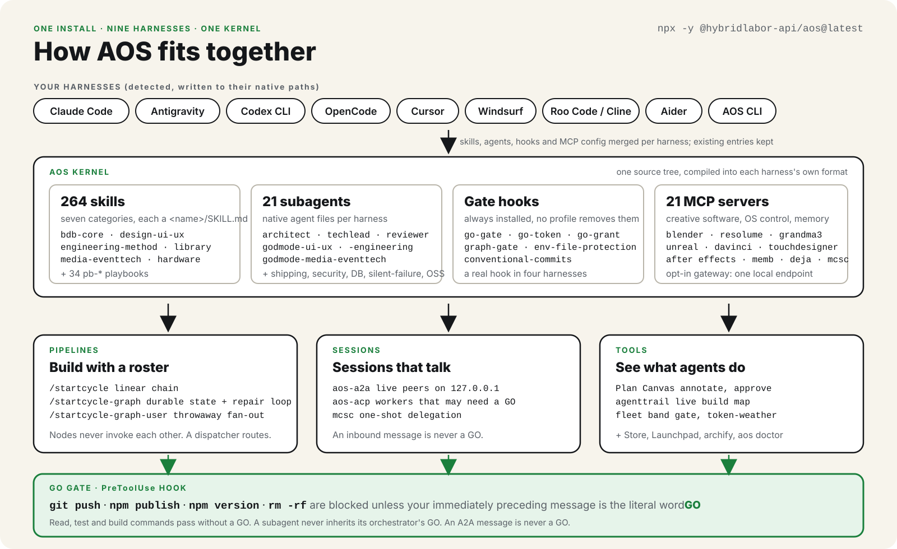
</p>

</div>

---

## Porquê o AOS

| | Padrão do harness | Com o AOS |
|---|---|---|
| **Skills** | Cada harness tem a sua própria pasta de skills e as suas próprias cópias. | <!-- count:skills -->264<!-- /count --> skills em sete categorias, escritas como `<name>/SKILL.md` em todos os harnesses que tiver. Uma única árvore de código-fonte. |
| **Subagents** | Ficheiros de agente escritos à mão, por harness, no formato desse harness. | <!-- count:agents -->21<!-- /count --> subagents compilados para o formato nativo de agente de cada harness (Claude Code, Antigravity, Codex, OpenCode; os outros usam regras no AGENTS.md). |
| **Segurança de release** | Uma regra num prompt que se pede ao agente para respeitar. | Um hook `PreToolUse` (Claude Code, Antigravity, Codex, OpenCode) ou regras no AGENTS.md (os outros) que bloqueia `git push`, `npm publish`, `npm version` e `rm` recursivo até a sua própria mensagem ser a palavra literal **GO**. |
| **Builds multi-agente** | Agentes que chamam agentes, com o roteamento dentro dos seus prompts. | Um dispatcher graph: os nós nunca se invocam entre si, o estado é durável, um repair loop tem um no-progress guard e a escalada vai para você. |
| **Planos** | Desfazer o scroll no chat para encontrar o que foi acordado. | Plan Canvas: anotar o plano no navegador e aprovar antes de qualquer agente construir. |
| **Visibilidade** | Ler logs em vários terminais. | Mapa em vivo do agenttrail por repositório, e uma fleet band no Claude Code com o modo do gate, o tempo dos tokens e quem espera pelo seu GO. |
| **Sessões** | Cada sessão está sozinha no seu terminal. | A2A entre sessões vivas de Claude Code, OpenCode, agy e Codex no localhost. Uma mensagem recebida nunca é um GO. |
| **Além do código** | Assistentes de código conhecem código. | 19 skills de media-eventtech e servidores MCP para grandMA3, Resolume, TouchDesigner, Unreal, DaVinci, After Effects, Blender e Rhino; `godmode-hardware-pcb` para KiCad e OpenSCAD; playbooks para orçamentos, faturas, crew call sheets e event trackers. |

## O que recebe

<table>
<tr>
<td width="33%" valign="top">🎯 <b>Skills</b><br/>264 skills curadas em sete categorias, descobertas por cada harness como <code>&lt;name&gt;/SKILL.md</code>.<br/>→ <a href="#skills-de-um-relance">Skills de um relance</a></td>
<td width="33%" valign="top">👥 <b>Subagents</b><br/>21 subagents: Architect, TechLead, Reviewer, Godmodes e revisores especializados.<br/>→ <a href="#o-dispatcher-graph">O dispatcher graph</a></td>
<td width="33%" valign="top">🔌 <b>Servidores MCP</b><br/>21 servidores para software criativo, controlo do SO, memória e delegação entre harnesses.<br/>→ <a href="#servidores-mcp">Servidores MCP</a></td>
</tr>
<tr>
<td width="33%" valign="top">🚀 <b>Pipelines &amp; GO gate</b><br/><code>/startcycle</code>, <code>/startcycle-graph</code>, <code>/startcycle-graph-user</code>, e o gate de release imposto por hook.<br/>→ <a href="#as-pipelines">As pipelines</a></td>
<td width="33%" valign="top">💬 <b>Sessões que conversam</b><br/>A2A entre sessões de Claude Code, OpenCode, agy e Codex no localhost.<br/>→ <a href="#a2a-sess%C3%B5es-que-conversam-entre-si">A2A</a></td>
<td width="33%" valign="top">🛠️ <b>Ferramentas</b><br/>Plan Canvas, agenttrail, archify, AOS Store, Launchpad, fleet band, aos doctor.<br/>→ <a href="#skills-de-um-relance">Ferramentas</a></td>
</tr>
</table>

<table>
<tr>
<td width="20%" valign="top"><b>Eventos &amp; media tech</b><br/>• Show control em vivo: grandMA3, Resolume, TouchDesigner<br/>• Produção de media: Unreal, DaVinci, After Effects</td>
<td width="20%" valign="top"><b>Design</b><br/>• Sistema de design UI/UX e brand discovery<br/>• Landing pages, redesigns de apps, Plan Canvas</td>
<td width="20%" valign="top"><b>Gestão</b><br/>• Orçamentos, faturas, controlo de budget<br/>• Crew sheets, planeamento de eventos, meeting actions</td>
<td width="20%" valign="top"><b>Builds à medida</b><br/>• Design de PCB e caixas OpenSCAD<br/>• Assets 3D, Rhino, modelação Blender</td>
<td width="20%" valign="top"><b>Dev geral</b><br/>• Backend, frontend, testes e shipping<br/>• 21 subagents, três pipelines, skills de biblioteca</td>
</tr>
</table>

Para fluxos guiados nestes domínios, ver [Playbooks](#playbooks).

---

## Início rápido

| Quero ... | Executar |
|---|---|
| Instalar em todos os meus harnesses | `npx -y @hybridlabor-api/aos@latest` |
| Instalar com pouco overhead de contexto | `npx -y @hybridlabor-api/aos@latest --profile=minimal` |
| Refrescar apenas os gates e hooks | `npx -y @hybridlabor-api/aos@latest --hooks-only` |
| Ver primeiro o que mudaria | `npx -y @hybridlabor-api/aos@latest --dry-run` |
| Verificar uma instalação avariada | `aos doctor` |
| Procurar e adicionar skills e agents | `aos store ui` |
| Planear uma feature e depois construí-la | `/plan`, depois `/startcycle-graph` |

---

## Vê-lo em ação

<p align="center">
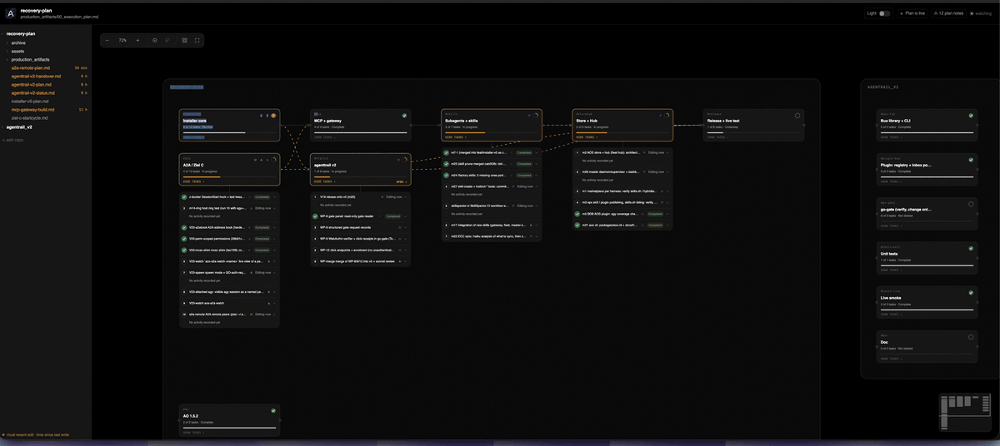<br/>
<sub><b>agenttrail.</b> O mapa em vivo de um build multi-agente enquanto corre. <a href="docs/assets/readme/agenttrail-live.mp4">▶ Vídeo em qualidade completa</a></sub>
</p>

<table>
<tr>
<td width="50%" valign="top" align="center">
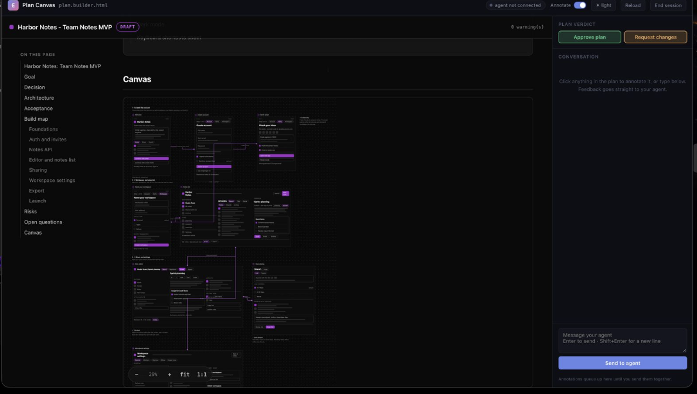<br/>
<sub><b>Plan Canvas.</b> Anotar o plano no navegador e aprová-lo antes de qualquer agente construir.</sub>
</td>
<td width="50%" valign="top" align="center">
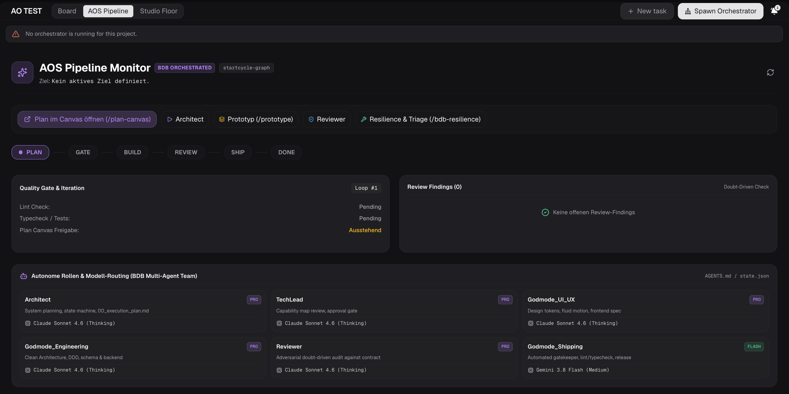<br/>
<sub><b>Workspace do AO.</b> O monitor da pipeline, do plano ao ship, com roteamento de papel e de modelo por nó.</sub>
</td>
</tr>
<tr>
<td width="50%" valign="top" align="center">
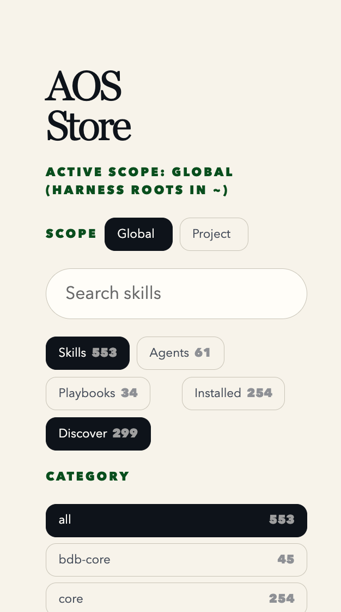<br/>
<sub><b>AOS Store.</b> Skills, agents e playbooks em 127.0.0.1:4322.</sub>
</td>
<td width="50%" valign="top" align="center">
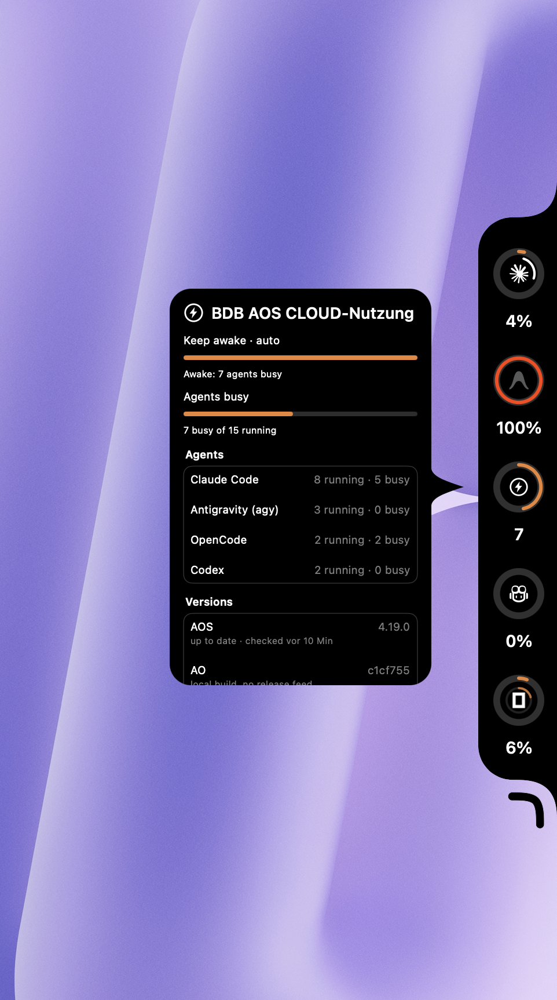<br/>
<sub><b>Codenotch.</b> Agents em execução e ocupados por harness.</sub>
</td>
</tr>
</table>

<p align="center">
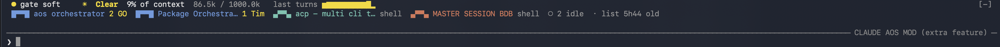<br/>
<sub><b>Fleet band.</b> No Claude Code: modo do gate, token-weather e as sessões que esperam pelo seu GO.</sub>
</p>

<p align="center">
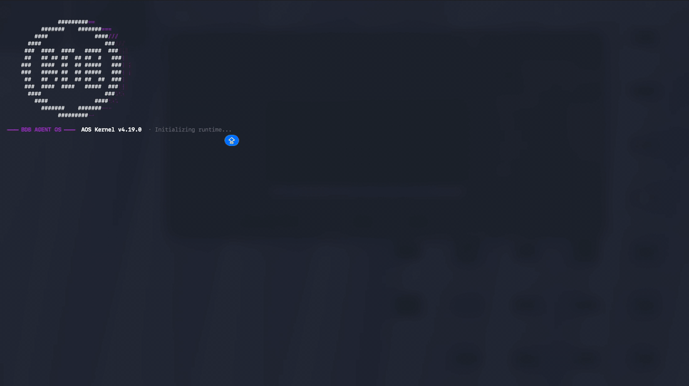<br/>
<sub><b>Instalador.</b> <code>npx -y @hybridlabor-api/aos@latest</code>: arranque, telemetria de pre-flight, depois o menu de configuração. <a href="docs/assets/readme/aos-installer.mp4">▶ Vídeo em qualidade completa</a></sub>
</p>

---

## Skills de um relance

- [**`/startcycle`**](skills/basic/startcycle/SKILL.md) - pipeline de build linear (Architect, TechLead, build em paralelo, Reviewer) com hand-offs por ficheiro em `production_artifacts/`
- [**`/startcycle-graph`**](skills/basic/startcycle-graph/SKILL.md) - dispatcher graph com `state.json` durável, repair loop do Reviewer, quality gate e escalada
  - O dispatcher invoca os subagents [`architect`](agents/architect.md), [`techlead`](agents/techlead.md), [`godmode-ui-ux`](agents/godmode-ui-ux.md), [`godmode-engineering`](agents/godmode-engineering.md), [`godmode-media-eventtech`](agents/godmode-media-eventtech.md), [`reviewer`](agents/reviewer.md) e [`godmode-shipping`](agents/godmode-shipping.md); nunca se chamam entre si
- [**`/startcycle-graph-user`**](skills/basic/startcycle-graph-user/SKILL.md) - fan-out descartável de 2-4 nós para qualquer projeto, nada persistente fica para trás
- [**`/plan`**](commands/plan.md) - redigir, renderizar numa canvas do navegador, anotar, aguardar aprovação, depois entregar
  - [**`plan-canvas`**](skills/global_config/plan-canvas/SKILL.md) - canvas local onde anota elementos, conversa e aprova ou pede alterações
  - [**`plan-arbiter`**](skills/global_config/plan-arbiter/SKILL.md) - comparar planos concorrentes de vários agentes e produzir um plano recomendado
- [**`/bdbrainstorm`**](skills/bdbrainstorm/SKILL.md) - brainstorm multi-agente que termina numa entrega ao `/startcycle-graph`
  - [**`/grill-me`**](skills/global_config/grill-me/SKILL.md) - entrevista implacável para afinar um plano ou um design
  - [**`bdbmediastorm`**](skills/basic/bdbmediastorm/SKILL.md) - brainstorm para event tech em vivo, show control e media em tempo real
- [**`/playbooks`**](commands/playbooks.md) - listar todos os playbooks `pb-*` com duração, dificuldade e requisitos, e iniciar um
  - [`pb-bug-fix`](skills/playbooks/pb-bug-fix/SKILL.md) - de issue do GitHub a fix testado e PR; push e PR só depois de GO
  - [`pb-ship`](skills/playbooks/pb-ship/SKILL.md) - triar, rever e fechar os PRs do dia; merge só depois de GO
  - [`pb-release-aos`](skills/playbooks/pb-release-aos/SKILL.md) - lançar o AOS no npm através da PR do release-please
  - [`pb-show-build`](skills/playbooks/pb-show-build/SKILL.md) - construir um show entre grandMA3, Resolume e TouchDesigner, offline primeiro
  - [`pb-offer`](skills/playbooks/pb-offer/SKILL.md) - redigir uma proposta de cliente com preços da sua lista de preços; enviar só depois de GO
- [**`factory-collect`**](skills/global_config/factory-collect/SKILL.md) - Factory: recolher e triar feedback, telemetria, erros e relatórios de issues
  - [`factory-lookback`](skills/global_config/factory-lookback/SKILL.md) - auditar problemas recorrentes entre fontes para correções sistémicas
  - [`factory-review-prs`](skills/global_config/factory-review-prs/SKILL.md) - rever uma fila de PRs configurada; aprovar e fazer merge ficam consigo
  - [`factory-human-digest`](skills/global_config/factory-human-digest/SKILL.md) - digest só de leitura do que ainda precisa de uma decisão humana
- [**`gogate`**](skills/global_config/gogate/SKILL.md) - mostrar ou explicar o modo do go-gate (hard, soft, off) e os grants de tempo limitado; CLI: `aos-gogate`
- [**`aos-a2a`**](skills/global_config/aos-a2a/SKILL.md) - listar, enviar e responder a peers de harness ativos por A2A no localhost
  - [`master-session`](skills/basic/master-session/SKILL.md) - supervisionar várias sessões: roster, pedidos de estado, quadro de GO; workers podem ser criados via `aos-acp`
  - [`mcsc`](skills/global_config/mcsc/SKILL.md) - delegar uma tarefa a outro harness de CLI instalado (agy, OpenCode, Codex)
- [**`agenttrail`**](skills/global_config/agenttrail/SKILL.md) - mapa em vivo no navegador de um build multi-agente; CLI: `aos-trail`
- [**`aos-store`**](skills/global_config/aos-store/SKILL.md) - procurar, pré-visualizar e instalar skills e agents numa web UI local (`aos store`)
- [**`memb-skill`**](skills/global_config/memb-skill/SKILL.md) - motor de memória de longo prazo local-first (memB)
  - [`memb-ingest`](skills/memb-ingest/SKILL.md) - ingerir ficheiros de projeto e logs de conversação no memB
- [**`openwiki-skill`**](skills/global_config/openwiki-skill/SKILL.md) - inicializar, atualizar e visualizar wikis de codebase com o OpenWiki
- [**`synapse-integration-skill`**](skills/synapse-integration-skill/SKILL.md) - integração do BDB Synapse (visualizador de codebase em 3D)
- [**`/doctor`**](commands/doctor.md) - verificar a máquina e o projeto atual, imprimir entradas `permissions.allow` sugeridas, não escreve settings
- [**`aos-setup`**](skills/global_config/aos-setup/SKILL.md) - levar uma máquina a uma instalação AOS completa e verificada
  - [`aos-project-init`](skills/global_config/aos-project-init/SKILL.md) - configurar uma pasta de projeto: slug, wiki, memória, mapa Synapse, `AGENTS.md`
- **Godmodes** - livros de regras por domínio
  - [`godmode-engineering`](skills/basic/godmode-engineering/SKILL.md) - DDD estrito, strictness de TypeScript, Clean Architecture, triagem de debugging em 5 passos
  - [`godmode-ui-ux`](skills/basic/godmode-ui-ux/SKILL.md) - brand discovery, regras anti-slop, design tokens DTCG, motion fluida
  - [`godmode-eventtech`](skills/basic/godmode-eventtech/SKILL.md) - execução de show control para grandMA3, Resolume, Unreal, Rhino, Vectorworks e Adobe MCP
  - [`godmode-hardware-pcb`](skills/basic/godmode-hardware-pcb/SKILL.md) - esquemas, layout de PCB, caixas KiCad e OpenSCAD com sign-off DFM/DRC/ERC
  - [`godmode-shipping`](skills/basic/godmode-shipping/SKILL.md) - gatekeeper final: verificações pré-lançamento, rollouts com feature flags, planeamento de rollback
- **Auxiliares vendados** de [BuilderIO/skills](https://github.com/BuilderIO/skills)
  - [`read-the-damn-docs`](skills/global_config/read-the-damn-docs/SKILL.md) - força uma passagem pelos docs antes de codificar APIs de terceiros de memória
  - [`stay-within-limits`](skills/global_config/stay-within-limits/SKILL.md) - respeitar os limites de 5 horas e semanais em execuções longas ou paralelas
  - [`quick-recap`](skills/global_config/quick-recap/SKILL.md) - terminar cada resposta com uma linha de estado vermelho/amarelo/verde

Os catálogos completos (cada skill, subagent, playbook e servidor MCP) estão nas listas dobráveis em "O que está incluído".

---

## O que há de novo no v5

O v5 muda a forma como o AOS chega a uma máquina e como as suas partes conversam entre si.

| Área | O que mudou |
|---|---|
| **Instalador** | Fluxo reconstruído: Kernel, Harnesses, Packages, Optional, Verify. Perfis `minimal`, `standard`, `full`; `--no-hooks`, `--hooks-only`, `--without=<ids>`; reparação e desinstalação a partir do manifest; uma verificação de versão no início com Update como predefinição. Ver [Instalar](#instalar) e [docs/install-options.md](docs/install-options.md). |
| **MCP gateway** | `aos-gateway`: um endpoint local (1mcp atrás de um forwarder com verificação de token) à frente de uma allow list dos servidores incluídos, `aos-gateway adopt` para os seus próprios servidores stdio, e **um MCP por app** (Blender, Resolume, After Effects). Opt-in. [docs/mcp-gateway.md](docs/mcp-gateway.md). |
| **A2A** | Sessões vivas de Claude Code, OpenCode, agy e Codex trocam mensagens com `aos-a2a`. Uma mensagem recebida nunca é um GO. [docs/a2a.md](docs/a2a.md). Intercom e a2abook por cima estão **em curso**. |
| **Agentes nativos** | Os subagents são compilados para os formatos e caminhos que cada harness realmente lê, incluindo OpenCode e agy. Nenhum modelo é fixado a menos que você defina um: [docs/agent-models.md](docs/agent-models.md). |
| **Fleet mod** | Uma banda no Claude Code: modo do gate, token-weather (percentagem de contexto como palavra de tempo mais uma sparkline) e quais sessões trabalham ou esperam por si com os seus contadores de GO. `aos-gogate` mostra o estado do gate em modo só de leitura. |
| **agenttrail** | Um mapa em vivo por repositório, iniciado automaticamente, com um link na sua sessão. Uma sala de controlo v2 está **em curso**. |
| **Plan Canvas** | Os planos abrem numa canvas local; as anotações são devolvidas ao agente. |
| **go-gate** | Comandos de leitura, teste e build sem efeito de escrita ou de rede passam sem GO; os logs de deny mascaram credenciais; hooks em quatro harnesses. |
| **Playbooks e Factory** | 34 playbooks `pb-*`, as skills `factory-*` e `plan-arbiter`. |
| **Cadeia de orquestradores** | master session, project orchestrator, package orchestrator, mapeados em mecanismos reais. |

**Em curso, sem ser declarado como lançado.** Sala de controlo agenttrail v2, o AOS Hub (serviços, catálogo e store numa página; hoje existem o Launchpad e a Store), intercom A2A e a2abook, modo `spawn` do A2A, `skill-create` e `instinct-*`.

---

## O dispatcher graph

O graph é neutro de harness e corre nos Dynamic Workflows do Claude Code, na execução paralela do Antigravity e em qualquer harness de agente compatível.

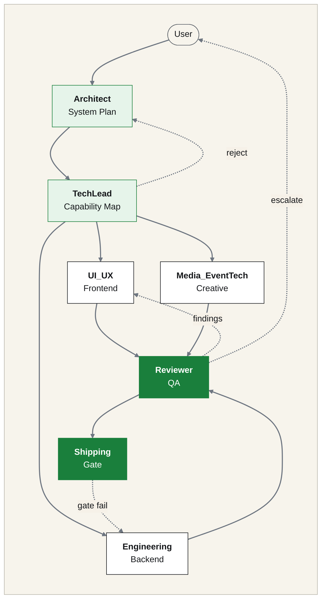
```mermaid
%%{init: {"theme": "base", "themeVariables": {"lineColor": "#6e7681", "edgeLabelBackground": "#f6f1e8", "textColor": "#15171A", "clusterBkg": "#F7F4EC", "clusterBorder": "#B9B5AA", "titleColor": "#15171A", "primaryColor": "#FFFFFF", "primaryBorderColor": "#15171A", "primaryTextColor": "#15171A"}}}%%
flowchart TB
    subgraph SG[" "]
    direction TB
    U(["User"])
    A["<b>Architect</b><br/>System Plan"]
    T["<b>TechLead</b><br/>Capability Map"]
    UX["<b>UI_UX</b><br/>Frontend"]
    EN["<b>Engineering</b><br/>Backend"]
    ME["<b>Media_EventTech</b><br/>Creative"]
    R["<b>Reviewer</b><br/>QA"]
    S["<b>Shipping</b><br/>Gate"]

    U --> A --> T
    T --> UX & EN & ME
    UX & EN & ME --> R
    R --> S

    T -.->|reject| A
    R -.->|findings| UX
    S -.->|gate fail| EN
    R -.->|escalate| U
    end

    classDef plan fill:#E6F4EA,stroke:#1A7F3C,color:#15171A
    classDef build fill:#FFFFFF,stroke:#15171A,color:#15171A
    classDef gate fill:#1A7F3C,stroke:#1A7F3C,color:#FFFFFF
    classDef human fill:#F7F4EC,stroke:#5B6168,color:#15171A
    classDef store fill:#F7F4EC,stroke:#B9B5AA,color:#15171A
    linkStyle default stroke:#6e7681,stroke-width:2px

    style SG fill:#F7F4EC,stroke:#B9B5AA,color:#15171A

    class A,T plan
    class UX,EN,ME build
    class R,S gate
    class U human
```

<p align="center"><sub><b>Dispatcher graph.</b> Architect e TechLead planeiam, três nós de build trabalham em paralelo, Reviewer e Shipping fecham o resultado, e arestas tracejadas encaminham rejeições e escaladas.</sub></p>

---

## Instalar

**Requisitos.** Node.js >= 20. macOS, Linux e Windows (PowerShell).

```bash
npx -y @hybridlabor-api/aos@latest
```

**Primeira execução.** O instalador deteta os harnesses presentes, pergunta quais ativar e qual o tier (Pro MEDIA ou Basic), copia as skills para a pasta de skills de cada harness, compila os subagents, liga os hooks, faz merge da configuração MCP no ficheiro de configuração próprio de cada harness (as entradas existentes são mantidas) e oferece os módulos opcionais listados abaixo.

**Cada execução seguinte** abre em vez disso um menu:

| Item do menu | O que faz |
|---|---|
| Quick Update | Atualiza skills, templates, hooks e módulos instalados para a versão que acabou de executar |
| Run System Checkup / Doctor | Executa `aos doctor`: dependências, colocação de ficheiros, daemons, hooks |
| Drop Local Project Harness | Copia o contrato do dispatcher para o diretório atual (ver abaixo) |
| Reconfigure System | Mudar destinos, tier, perfil ou opções |
| Uninstall AOS | Remove o que o instalador colocou; os seus dados ficam |

### Perfis e opções

| Flag | Efeito |
|---|---|
| `--profile=standard` (predefinição) | Skills, agents, regras, todos os hooks, MCPs, OpenWiki, Token Saver, fleet. |
| `--profile=minimal` | Apenas skills, agents e regras de harness. Sem hooks de injeção de contexto, OpenWiki, Token Saver, Codenotch, módulos opcionais, gateway nem fleet. A opção de pouco contexto. |
| `--profile=full` | `standard` mais todos os módulos opcionais (igual a `--modules=all` com `-y`). |
| `--no-hooks` | Salta apenas os hooks de injeção de contexto (`memb-inject`, `rules-inject`, `trail-relay`, `trail-autostart`). |
| `--hooks-only` | Instala ou refresca os hooks e as suas entradas de settings e sai. Com `--no-hooks` refresca apenas os gates. |
| `--without=id,id` | Exclui pacotes por id de registo (`memb, synapse, openwiki, remote, ao, creator, hardware, installer, deja, token-saver, codenotch, gateway, fleet`). Guardado, para que updates e reparações os ignorem. |
| `AOS_DISABLED_MCPS=a,b` | Mantém esses nomes de servidores MCP incluídos fora das configurações de harness que o instalador escreve. |
| `--dry-run` | Imprime o que mudaria e não escreve nada. |

**O gate e os hooks de segurança são sempre instalados.** Nenhum perfil ou flag remove `go-gate`, `go-token`, `go-grant`, `graph-gate`, `conventional-commits` ou `env-file-protection`. O plugin OpenCode não é afetado por `--no-hooks` nem por `minimal`. As escolhas de perfil ficam guardadas em `~/.aos/v5-settings.json`. Referência completa: [docs/install-options.md](docs/install-options.md).

### Não interativo

```bash
npx -y @hybridlabor-api/aos@latest -y --platforms=2          # apenas Claude, todas as predefinições
npx -y @hybridlabor-api/aos@latest -y --platforms=1,5 --mcps=none
npx -y @hybridlabor-api/aos@latest --dry-run                 # imprimir o que mudaria
```

Valores de `--platforms=`: `0` universal (todos os detetados), `1` Antigravity, `2` Claude Desktop / Claude Code, `3` Cursor, `5` Codex CLI, `6` Windsurf, `7` Roo Code / Cline, `8` Aider, `10` AOS CLI. `4` (caminhos próprios) precisa do menu interativo. `--mcps=<name,name>|all|none` escolhe o subconjunto de MCPs. `--verbose` e `--no-intro` fazem o que dizem.

### Project harness local

Em vez de instalar em `$HOME`, deposite apenas o contrato do dispatcher (`.agents/`, os gate hooks, as definições de agent, o workflow `/startcycle-graph`, o plugin OpenCode) num único repositório:

```bash
cd o-seu-projeto && npx -y @hybridlabor-api/aos@latest --project-harness -y
```

---

## Harnesses suportados

**O que é escrito.** O instalador escreve o seguinte para cada destino. Os caminhos são as predefinições; o instalador só escreve em harnesses que realmente deteta.

| Harness | Skills | Subagents | Hooks | Plugin / regras |
|---|---|---|---|---|
| Claude Code / Claude Desktop | `~/.claude/skills` | `~/.claude/agents` | `~/.claude/hooks` + `settings.json` (GO gate, graph gate, env-file protection, Conventional Commits, memB inject, trail relay, A2A inbox) | manifest `.claude-plugin/` incluído no repositório (ver Contribuir); fleet mod registado em `settings.json` |
| Google Antigravity | `~/.gemini/config/skills` | `~/.gemini/config/agents/<name>/agent.md` | `~/.gemini/config/hooks.json` e `~/.gemini/antigravity-cli/hooks.json` | `plugin.json` raiz / `plugins/bdb-aos/plugin.json`, comandos `/bdb-aos:<cmd>`, ver [docs/codex-agy-setup.md](docs/codex-agy-setup.md) |
| Codex CLI | `~/.codex/skills` | `~/.codex/agents` | `~/.codex/hooks` + `config.toml` | `.codex-plugin/` + `.agents/plugins/marketplace.json`, comandos `$bdb-aos:<cmd>`, ver [docs/codex-agy-setup.md](docs/codex-agy-setup.md) |
| OpenCode | `~/.config/opencode/skills` | `~/.config/opencode/agents` | via plugin | plugin `bdb-aos.js` + comando `/startcycle-graph`, registado em `opencode.jsonc`; mantém uma execução de `/startcycle-graph` em movimento em `session.idle`; comandos `/bdb-aos-<cmd>` gerados; extras opt-in, ver [docs/opencode-setup.md](docs/opencode-setup.md) |
| Cursor | `~/.cursor/skills` | nenhum | nenhum | `.cursor/rules` (projeto) |
| Windsurf | `~/.windsurf/bdb-skills` | nenhum | nenhum | `mcp.json` |
| Roo Code / Cline | `~/.roo/skills` | nenhum | nenhum | `.roomodes` (projeto) |
| Aider | `~/.aider/bdb-skills` | nenhum | nenhum | nenhum |
| AOS CLI (`pi`) | lê `~/.agents/skills` | `~/.agents/AGENTS.md` como system prompt | nenhum | sem MCP; instalação separada, Node >= 22.19, ver [packages/aos-cli](packages/aos-cli/README.md) |
| BDB AO Codenotch (app macOS, instalador Windows) | macOS `/Applications` ou `~/Applications`; Windows instalação NSIS por utilizador (`/S`, sem admin) | nenhum | nenhum | instalado por predefinição em macOS e Windows (nunca Linux); recusar com `--no-codenotch` ou `AOS_CODENOTCH=0`; falhas apenas avisam; DMG do repositório público de releases criado pelo Tim, verificado por SHA-256, assinado ad-hoc com a quarentena removida, ver [docs/codenotch.md](docs/codenotch.md) |

Cada instalação escreve também a cópia universal em `~/.agents/skills`, que é o que a AOS CLI e a skills CLI leem.

<details>
<summary><b>Mapa de capacidades por harness (4)</b></summary>

**Delegação, A2A e gate hooks.** As linhas dizem o que o código deste repositório faz. Fonte: [docs/harness-capabilities.md](docs/harness-capabilities.md).

| Capacidade | Claude Code | OpenCode | Codex | agy |
|---|---|---|---|---|
| Delegação para fora (`aos-acp`) | sim | sim | sim | via comandos de shell (sem cliente ACP próprio) |
| A2A recebido | UserPromptSubmit drain + Stop nudge | injeção do plugin como prompt sintético | `codex queue` / `codex exec resume` | apenas pull, inbox MCP `a2a_inbox_pull`; uma sessão interativa em execução não pode ser empurrada |
| Resposta A2A | `aos-a2a reply` via regras Bash pré-aprovadas | ficheiro de resposta escrito pelo plugin | resposta ao prompt na fila ou retomado | ferramenta `a2a_reply`, ou `aos-a2a reply` |
| Modo sidecar A2A | `--mode live` | `--mode live` | `--mode live` | `--mode live` |
| Hook do GO gate | sim | sim (plugin, hooks partilhados) | sim (testado por smoke, [docs/codex-gate-smoke.md](docs/codex-gate-smoke.md)) | hooks gate-only (`PreToolUse`, `PreInvocation`, `Stop`) |
| Nunca-GO em A2A recebido | sim | sim | sim | sim |

</details>

---

## As pipelines

O contrato vive em [`.agents/graph.md`](.agents/graph.md), o roster de nós em [`.agents/nodes.json`](.agents/nodes.json), o dispatcher executável em [`.claude/workflows/startcycle-dispatch.mjs`](.claude/workflows/startcycle-dispatch.mjs).

**Uma regra: os nós nunca se invocam entre si.** Um dispatcher lê `production_artifacts/state.json` depois de cada nó devolver e decide o que corre a seguir. Não há cadeia de hand-offs nem agente a dizer a outro agente para avançar. Este design garante fidelidade de contexto, auditabilidade da lógica de roteamento num único sítio e portabilidade entre harnesses.

Cada nó lê o plano e o seu próprio estado anterior, executa o seu trabalho, escreve o seu artefacto e fragmentos de estado e devolve. O dispatcher faz merge dos fragmentos de estado por nó (`state.d/<node>.json`), avalia os predicados das arestas e encaminha para o próximo nó, ou escala para o utilizador se o no-progress guard disparar (a mesma finding bloqueadora no segundo ciclo de reparação) ou se o teto de iterações for atingido.

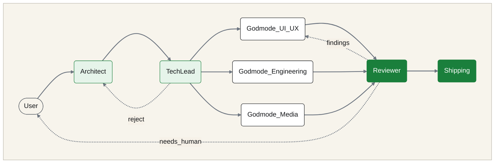
```mermaid
%%{init: {"theme": "base", "themeVariables": {"lineColor": "#6e7681", "edgeLabelBackground": "#f6f1e8", "textColor": "#15171A", "clusterBkg": "#F7F4EC", "clusterBorder": "#B9B5AA", "titleColor": "#15171A", "primaryColor": "#FFFFFF", "primaryBorderColor": "#15171A", "primaryTextColor": "#15171A"}}}%%
flowchart LR
    subgraph SG[" "]
    direction LR
    U(["User"]) --> A("Architect") --> T("TechLead")
    T --> UX("Godmode_UI_UX") & EN("Godmode_Engineering") & ME("Godmode_Media")
    UX & EN & ME --> R("Reviewer") --> S("Shipping")
    T -.->|reject| A
    R -.->|findings| UX
    R -.->|needs_human| U
    end

    classDef plan fill:#E6F4EA,stroke:#1A7F3C,color:#15171A
    classDef build fill:#FFFFFF,stroke:#15171A,color:#15171A
    classDef gate fill:#1A7F3C,stroke:#1A7F3C,color:#FFFFFF
    classDef human fill:#F7F4EC,stroke:#5B6168,color:#15171A
    classDef store fill:#F7F4EC,stroke:#B9B5AA,color:#15171A
    linkStyle default stroke:#6e7681,stroke-width:2px

    style SG fill:#F7F4EC,stroke:#B9B5AA,color:#15171A

    class A,T plan
    class UX,EN,ME build
    class R,S gate
    class U human
```

<p align="center"><sub><b>Roster de nós.</b> Os sete nós do graph e as arestas que devolvem trabalho: reject, findings e needs_human.</sub></p>

| Comando | Mecânica | Quando usar |
|---|---|---|
| `/startcycle` | Cadeia linear, hand-offs por ficheiro em `production_artifacts/`. Sem máquina de estados, sem repair loop. `/startcycle --skill=<name> <goal>` força uma skill em cada nó. | Um build direto com o roster de agentes mas sem a cerimónia. |
| `/startcycle-graph` | O graph completo: `state.json` durável, repair loop do Reviewer, quality gate automatizado, escalada humana. | Trabalho de features onde a correção importa mais que a velocidade e quer um trilho de auditoria. |
| `/startcycle-graph-user` | Fan-out descartável de 2-4 nós. Nada persistente. Tiers de modelo por papel; usa Antigravity, OpenCode ou Codex se instalados, subagents do Claude Code caso contrário. | Um "cria alguns workers" pontual em qualquer projeto. |

### As três variantes lado a lado

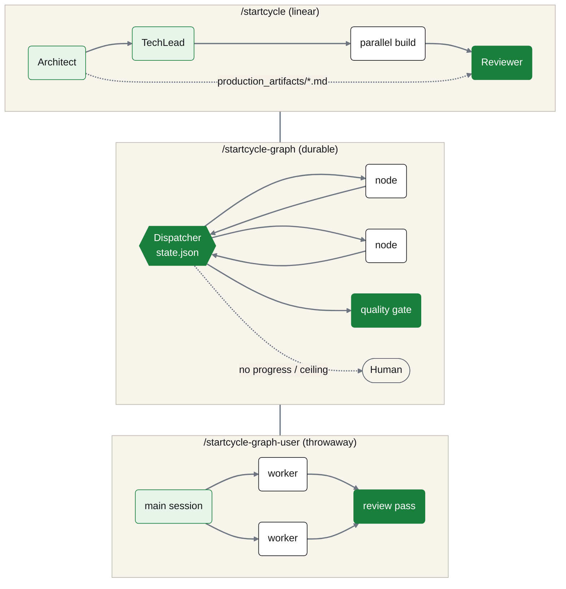
```mermaid
%%{init: {"theme": "base", "themeVariables": {"lineColor": "#6e7681", "edgeLabelBackground": "#f6f1e8", "textColor": "#15171A", "clusterBkg": "#F7F4EC", "clusterBorder": "#B9B5AA", "titleColor": "#15171A", "primaryColor": "#FFFFFF", "primaryBorderColor": "#15171A", "primaryTextColor": "#15171A"}}}%%
flowchart TB
    subgraph L["/startcycle (linear)"]
        direction LR
        L1("Architect") --> L2("TechLead") --> L3("parallel build") --> L4("Reviewer")
        L1 -. "production_artifacts/*.md" .-> L4
    end
    subgraph G["/startcycle-graph (durable)"]
        direction LR
        D{{"Dispatcher<br/>state.json"}}
        D --> N1("node") --> D
        D --> N2("node") --> D
        D --> Q("quality gate")
        D -. "no progress / ceiling" .-> H(["Human"])
    end
    subgraph F["/startcycle-graph-user (throwaway)"]
        direction LR
        F0("main session") --> W1("worker") & W2("worker") --> F3("review pass")
    end
    L ~~~ G ~~~ F

    classDef plan fill:#E6F4EA,stroke:#1A7F3C,color:#15171A
    classDef build fill:#FFFFFF,stroke:#15171A,color:#15171A
    classDef gate fill:#1A7F3C,stroke:#1A7F3C,color:#FFFFFF
    classDef human fill:#F7F4EC,stroke:#5B6168,color:#15171A
    classDef store fill:#F7F4EC,stroke:#B9B5AA,color:#15171A
    linkStyle default stroke:#6e7681,stroke-width:2px

    class L1,L2,F0 plan
    class L3,N1,N2,W1,W2 build
    class L4,Q,F3,D gate
    class H human
    style L fill:#F7F4EC,stroke:#B9B5AA,color:#15171A
    style G fill:#F7F4EC,stroke:#B9B5AA,color:#15171A
    style F fill:#F7F4EC,stroke:#B9B5AA,color:#15171A
```

<p align="center"><sub><b>Três variantes.</b> A cadeia linear, o dispatcher graph durável e o fan-out descartável, lado a lado.</sub></p>

**O que mantém o graph completo honesto.**

| Mecanismo | O que previne |
|---|---|
| Isolamento do Reviewer | O Reviewer lê os artefactos e o contrato do plano, nunca o raciocínio do nó de build nem a alegação de que está pronto. |
| No-progress guard | Um ciclo de reparação que reporta a mesma finding ID bloqueadora que o anterior escala para um humano em vez de queimar iterações. |
| Fragmentos de estado por nó | Nós de build em paralelo escrevem `state.d/<node>.json`; o dispatcher faz o merge. Sem corrida de lost-update num único ficheiro. |
| Teto de iterações | `max_iterations` (predefinição 3) para o loop incondicionalmente. |
| Aresta humana no loop | Qualquer nó pode definir `needs_human: true` e parar a execução. |

### Cadeia de orquestradores

**Mapeamento.** `master session -> project orchestrator -> package orchestrator` é uma convenção. Isto é como cada salto mapeia em mecanismos que existem ([docs/orchestrator-chain.md](docs/orchestrator-chain.md), skill `orchestrator-chain`):

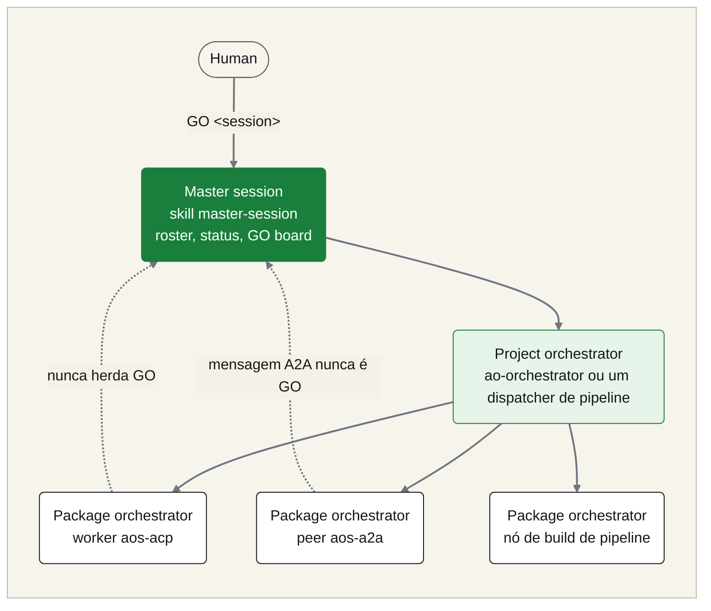
```mermaid
%%{init: {"theme": "base", "themeVariables": {"lineColor": "#6e7681", "edgeLabelBackground": "#f6f1e8", "textColor": "#15171A", "clusterBkg": "#F7F4EC", "clusterBorder": "#B9B5AA", "titleColor": "#15171A", "primaryColor": "#FFFFFF", "primaryBorderColor": "#15171A", "primaryTextColor": "#15171A"}}}%%
flowchart TD
    subgraph SG[" "]
    direction TB
    H(["Human"]) -->|"GO &lt;session&gt;"| M("Master session<br/>skill master-session<br/>roster, status, GO board")
    M --> P("Project orchestrator<br/>ao-orchestrator ou um dispatcher de pipeline")
    P --> K1("Package orchestrator<br/>worker aos-acp")
    P --> K2("Package orchestrator<br/>peer aos-a2a")
    P --> K3("Package orchestrator<br/>nó de build de pipeline")
    K1 -.->|"nunca herda GO"| M
    K2 -.->|"mensagem A2A nunca é GO"| M
    end

    classDef plan fill:#E6F4EA,stroke:#1A7F3C,color:#15171A
    classDef build fill:#FFFFFF,stroke:#15171A,color:#15171A
    classDef gate fill:#1A7F3C,stroke:#1A7F3C,color:#FFFFFF
    classDef human fill:#F7F4EC,stroke:#5B6168,color:#15171A
    classDef store fill:#F7F4EC,stroke:#B9B5AA,color:#15171A
    linkStyle default stroke:#6e7681,stroke-width:2px

    style SG fill:#F7F4EC,stroke:#B9B5AA,color:#15171A

    class H human
    class M gate
    class P plan
    class K1,K2,K3 build
```

<p align="center"><sub><b>Cadeia de orquestradores.</b> Cada salto do humano até um package orchestrator, com arestas tracejadas a mostrar que um GO nunca é herdado para cima.</sub></p>

**Profundidade.** O A2A recusa um send quando a profundidade de quem chama está em ou acima de `AOS_A2A_MAX_DEPTH` (predefinição 1) e o `mcsc` está a um nível de profundidade. Os workers não apagam nada; a limpeza é trabalho do dispatcher depois do seu GO.

---

## O GO gate

Chegar a `ready_to_ship` não é fazer ship. [`.claude/hooks/go-gate.mjs`](.claude/hooks/go-gate.mjs) é um hook `PreToolUse` que bloqueia `git push`, `npm publish`, `npm version` e `rm` recursivo a menos que a sua mensagem imediatamente anterior seja a palavra literal **GO**. É um hook, não uma regra que se pede a um agente para respeitar: dispara antes de qualquer verificação de modo de permissões e não pode ser contornado com argumentos. O instalador liga o mesmo gate no Antigravity, no Codex e no OpenCode; em harnesses sem suporte de hooks aplica-se a regra no [AGENTS.md](AGENTS.md) e o agente é a imposição. Um subagent nunca herda o GO do seu orquestrador, e um comando de release falhado precisa de um novo.

**O que o v5 acrescenta.**

- **Trabalho só de leitura continua rápido.** Comandos de leitura, teste e build sem efeito de escrita ou de rede passam sem GO, também após mensagens de peers.
- **Uma mensagem A2A nunca é um GO.** Cada mensagem injetada traz essa frase.
- **Modos e grants.** O modo do gate (`hard`, `soft`, `off`) e os grants de tempo limitado são mostrados por `aos-gogate status` e pela skill `gogate`. O `aos-gogate` é só de leitura e nunca registra um grant.
- **Os logs de deny mascaram credenciais** (bearer tokens, flags, URLs com credenciais).
- **Limite.** O hook vê as chamadas de ferramenta que o harness encaminha por ele. Um worker iniciado com permissões contornadas não pede nada, por isso o hook dentro do harness continua a ser a camada principal.

---

## Playbooks

Um playbook é uma skill com `kind: playbook` que transforma um trabalho recorrente numa execução guiada com um contrato fixo. Os 34 playbooks `pb-*` acompanham as skills; listá-los e iniciá-los com `/playbooks` (executa `list-playbooks.mjs` e imprime nome, tempo, dificuldade e requisitos de cada um).

**O que um playbook declara.** O seu frontmatter nomeia frases de gatilho, `inputs`, `requires` (skills, subagents, servidores MCP, itens da store), `go_points`, `outputs`, uma verificação `verify`, `difficulty` e `est_time`. O corpo é uma lista numerada de passos. Cada passo nomeia a skill ou agente que usa, a sua entrada, o artefacto que escreve e a verificação que diz que está pronto.

**Como corre uma execução.**

- **Uma sessão por predefinição.** A sessão principal percorre os passos e chama as skills necessárias. Cada passo acrescenta uma linha a um log de execução (`production_artifacts/pb-<name>-<date>.md`, nunca commitado).
- **Subagents onde importa.** Passos marcados com `(agent)` correm um subagent: `reviewer` em `pb-bug-fix`, `pb-ship` e `pb-release-aos`; `architect`, `techlead` e `reviewer` em `pb-harness-work`, `pb-idea-to-launch` e `pb-redesign-app`; `security-reviewer` e `silent-failure-hunter` em `pb-security-sweep`; `opensource-forker` e `opensource-sanitizer` em `pb-open-source`. Num harness sem subagents, a sessão principal lê o ficheiro do agente e corre o mesmo contrato inline. O `pb-master` vai mais longe e corre uma sessão de controlo sobre várias sessões de Claude Code, Codex ou OpenCode.
- **Os GO points fazem parte do contrato.** Um passo `[GO]` para com `WAITING FOR GO: <step>` até que você escreva **GO**; um GO cobre um passo, uma vez. O hook do go-gate é apenas o último recurso. Uma verificação falhada para a execução e é escrita no log; nada é repetido em silêncio.

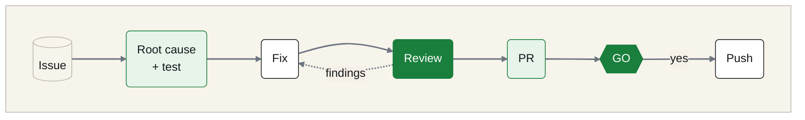
```mermaid
%%{init: {"theme": "base", "themeVariables": {"lineColor": "#6e7681", "edgeLabelBackground": "#f6f1e8", "textColor": "#15171A", "clusterBkg": "#F7F4EC", "clusterBorder": "#B9B5AA", "titleColor": "#15171A", "primaryColor": "#FFFFFF", "primaryBorderColor": "#15171A", "primaryTextColor": "#15171A"}}}%%
flowchart LR
    subgraph SG[" "]
    direction LR
    I[("Issue")] --> C1("Root cause<br/>+ test")
    C1 --> C2("Fix")
    C2 --> R("Review")
    R -.->|findings| C2
    R --> C3("PR")
    C3 --> G{{"GO"}}
    G -->|yes| C4("Push")
    end

    classDef plan fill:#E6F4EA,stroke:#1A7F3C,color:#15171A
    classDef build fill:#FFFFFF,stroke:#15171A,color:#15171A
    classDef gate fill:#1A7F3C,stroke:#1A7F3C,color:#FFFFFF
    classDef store fill:#F7F4EC,stroke:#B9B5AA,color:#15171A
    linkStyle default stroke:#6e7681,stroke-width:2px

    style SG fill:#F7F4EC,stroke:#B9B5AA,color:#15171A

    class I store
    class C1,C3 plan
    class C2,C4 build
    class R,G gate
```

<p align="center"><sub><b>pb-bug-fix.</b> O issue é o contrato, o teste vem antes do fix, o Reviewer vê apenas o diff e o issue, e o push espera pelo seu GO.</sub></p>

<details>
<summary><b>Playbooks por domínio (34)</b></summary>

| Playbook | Objetivo | Subagents | Tempo · nível |
|---|---|---|---|
| **Build e código** | | | |
| `pb-bug-fix` | Transformar um issue do GitHub num fix testado num branch com PR aberta. | reviewer | 30-90 min · intermédio |
| `pb-project-new` | Começar um novo projeto privado no GitHub à maneira do AOS. | — | 20-40 min · intermédio |
| `pb-idea-to-launch` | Transformar uma ideia num protótipo implantado. | architect, techlead, reviewer | 2-6 h · avançado |
| `pb-harness-work` | Mudar o próprio harness de agente (hooks, gates, memória, permissões, plugins) da forma segura. | architect, techlead, reviewer | 1-3 h · avançado |
| `pb-security-sweep` | Passe de segurança sobre um repositório: secrets, dependências, diff, um relatório de findings classificado. | security-reviewer, silent-failure-hunter | 1-2 h · avançado |
| `pb-open-source` | Preparar um projeto para open source: fork higienizado, veredicto do sanitizer, README e LICENSE, novo repositório privado. | opensource-forker, opensource-sanitizer | 1-3 h · avançado |
| `pb-worktrees-land` | Limpar git worktrees nos seus repositórios; remove apenas os já integrados. | — | 10-30 min · intermédio |
| **Release, CI e operações** | | | |
| `pb-ship` | Entregar o trabalho do dia num repositório: triagem, rever cada PR aberta, merge. | reviewer | 20-60 min · intermédio |
| `pb-release-aos` | Lançar uma nova versão do AOS no npm através da PR do release-please, integrada só depois de GO. | reviewer | 30-60 min · avançado |
| `pb-ci-fix` | Corrigir CI vermelha ou configurar GitHub Actions de ponta a ponta; push só depois de GO. | — | 15-45 min · intermédio |
| `pb-deploy-saas` | Implantar uma app SaaS na fleet BDB: preflight, plano de guardrails, CI verde, deploy depois de GO, verificação de saúde. | — | 30-90 min · avançado |
| `pb-health-weekly` | Relatório de saúde semanal dos repositórios BDB: deriva de versões e estado de CI. | — | 15-30 min · intermédio |
| **Design e web** | | | |
| `pb-landing-page` | Construir e lançar uma landing page: copy confirmada, tokens de marca, revisão de UI e SEO, deploy depois de GO. | — | 1-3 h · intermédio |
| `pb-redesign-app` | Reformar a UI de uma app com base numa auditoria. | architect, techlead, reviewer | 2-4 h · avançado |
| `pb-docs-site` | Publicar a documentação de um projeto como manual HTML estático nas GitHub Pages. | — | 30-90 min · intermédio |
| `pb-newsletter` | Transformar um recap ou um intervalo de changelog num rascunho de newsletter onde cada afirmação cita uma linha de fonte. | — | 20-40 min · intermédio |
| **Media e event tech** | | | |
| `pb-show-build` | Construir um show entre luzes (grandMA3), media (Resolume) e visuais (TouchDesigner) a partir de uma cue list, offline primeiro. | — | 2-6 h · avançado |
| `pb-crew-call-sheet` | Construir um crew call sheet e um plano de load-in / load-out para um dia de show; enviar à equipa só depois de GO. | — | 10-20 min · iniciante |
| `pb-event-tracker` | Uma folha de cálculo para um evento: convidados, fornecedores, cronograma, orçamento, com mensagens aos fornecedores redigidas. | — | 20-40 min · intermédio |
| `pb-clip-from-moodboard` | Transformar um brief de look e imagens de referência num clip social finalizado. | — | 1-3 h · avançado |
| `pb-image-to-3d` | Transformar uma imagem de referência num asset 3D limpo e escalado. | — | 30-90 min · avançado |
| `pb-launch-video` | Transformar uma app em execução ou landing page num vídeo de lançamento curto. | — | 30-90 min · intermédio |
| `pb-social-pack` | Transformar um recap de release num social pack onde cada afirmação remonta a um ficheiro de factos. | — | 30-60 min · intermédio |
| **Hardware** | | | |
| `pb-pcb-to-case` | De uma board KiCad a uma caixa OpenSCAD paramétrica que lhe serve. | — | 1-3 h · avançado |
| **Gestão e escritório** | | | |
| `pb-offer` | Redigir uma proposta de cliente com itens precificados apenas pela sua lista de preços; enviar só depois de GO. | — | 10-20 min · iniciante |
| `pb-invoice-check` | Verificar faturas e recibos linha a linha contra as suas propostas. Nada é pago ou enviado. | — | 10-20 min · iniciante |
| `pb-inbox-zero` | Ordenar uma pilha de emails em responder, delegar, arquivar e ignorar, e redigir as respostas. | — | 10-20 min · iniciante |
| `pb-meeting-actions` | Transformar uma transcrição de reunião em notas, decisões e responsáveis; enviar o follow-up só depois de GO. | — | 10-20 min · iniciante |
| `pb-handover` | Escrever uma nota de entrega para um colega a partir do estado de uma pasta de projeto. | — | 10-20 min · iniciante |
| `pb-week-plan` | Transformar listas de tarefas e notas espalhadas num plano semanal priorizado. | — | 10-20 min · iniciante |
| `pb-focus-chunks` | Dividir uma grande tarefa em blocos de no máximo 25 minutos, cada um com verificação de feito. | — | 5-10 min · iniciante |
| `pb-todo` | Transformar uma frase numa linha de tarefa na lista de tarefas certa. | — | 2-5 min · iniciante |
| **Máquina e sessões** | | | |
| `pb-machine-setup` | Levar uma máquina nova a uma instalação AOS verificada. | — | 30-60 min · intermédio |
| `pb-master` | Uma sessão de controlo sobre várias sessões de Claude Code, Codex ou OpenCode: roster, quadro de estado, quadro de GO. | — | 15 min de setup, depois durante a sessão · avançado |

</details>

---

## Factory

**O que é.** Quatro skills experimentais que transformam feedback, telemetria, erros, issues e pull requests num ciclo de revisão repetível: recolher e triar, olhar para trás atrás de causas sistémicas, rever PRs, e entregar-lhe um digest do que ainda precisa de uma decisão humana. No AOS eles reportam e redigem; cada escrita externa espera pelo seu GO. O `plan-arbiter` acompanha-os para comparar planos concorrentes.

### O ciclo

| Skill | Lê | Escreve | Precisa de GO? |
| --- | --- | --- | --- |
| `factory-collect` | as fontes em `workflows.collect.sources` | relatório de triagem, rascunhos de respostas, propostas de texto de fecho; correção local opcional | Responder, fechar, push, merge, publicar |
| `factory-lookback` | fontes configuradas sobre um período limitado, correções anteriores | relatório de padrões; correção sistémica local opcional | Responder, fechar, publicar, merge |
| `factory-review-prs` | PRs que correspondem aos filtros configurados | findings por PR, rascunhos de comentários, prontidão de aprovação e merge | Responder, aprovar, merge |
| `factory-human-digest` | repositórios e fontes configurados (predefinição: últimos 7 dias) | fila de decisões, nada mais | Só de leitura |

### Como correr

- **Invocar pelo nome.** Pedir ao agente para correr a skill, por exemplo `factory-collect`; cada `SKILL.md` traz um gatilho "Use when". Começar à mão e ler o relatório antes de agendar qualquer coisa.
- **Configurar.** `.agent-factory/config.yaml`, lido pelas quatro skills. Chaves nomeadas nas skills: `workflows.collect.sources`, `workflows.collect.implement`, `workflows.lookback`, `workflows.lookback.implement`, `workflows.human-digest`, e um `skill_prompts.<skill-name>` opcional por skill. Se o ficheiro falta, a skill para e pergunta; nunca o cria.
- **A regra do GO.** Nada na configuração abre o go-gate. `git push`, `gh pr merge`, `gh release create` e cada resposta, comentário, aprovação, fecho ou mudança de estado precisam do seu GO literal para essa ação exata. Execuções agendadas ou não assistidas são só de leitura.

Vendado de [BuilderIO/skills](https://github.com/BuilderIO/skills) (MIT) com alterações de segurança do AOS, ver [THIRD_PARTY_NOTICES.md](THIRD_PARTY_NOTICES.md); docs a montante: https://github.com/BuilderIO/skills/blob/main/docs/factory/README.md.

Detalhes: [docs/factory.md](docs/factory.md).

---

## A2A: sessões que conversam entre si

<p align="center">
  <picture><source media="(prefers-color-scheme: dark)" srcset="docs/assets/readme/a2a-logo-white.svg"></picture><br/>
   
</p>

Sessões vivas de Claude Code, OpenCode, agy e Codex trocam mensagens no localhost. Cada sessão viva corre um pequeno sidecar ligado a `127.0.0.1` numa porta aleatória com um bearer token por sessão e registra-se num registo local. Não há serviço central.

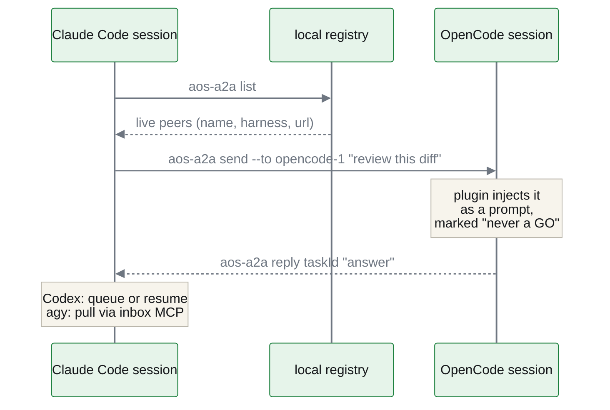
```mermaid
%%{init: {"theme": "base", "themeVariables": {"primaryColor": "#FFFFFF", "primaryBorderColor": "#15171A", "primaryTextColor": "#15171A", "textColor": "#15171A", "actorBkg": "#E6F4EA", "actorBorder": "#1A7F3C", "actorTextColor": "#15171A", "actorLineColor": "#6e7681", "signalColor": "#6e7681", "signalTextColor": "#6e7681", "noteBkgColor": "#F7F4EC", "noteBorderColor": "#B9B5AA", "noteTextColor": "#15171A", "lineColor": "#6e7681", "sequenceNumberColor": "#15171A", "labelBoxBkgColor": "#F7F4EC", "labelBoxBorderColor": "#B9B5AA", "labelTextColor": "#15171A", "loopTextColor": "#15171A"}}}%%
sequenceDiagram
    participant C as Claude Code session
    participant R as local registry
    participant O as OpenCode session
    C->>R: aos-a2a list
    R-->>C: live peers (name, harness, url)
    C->>O: aos-a2a send --to opencode-1 "review this diff"
    Note over O: plugin injects it<br/>as a prompt,<br/>marked "never a GO"
    O-->>C: aos-a2a reply taskId "answer"
    Note over C: Codex: queue or resume<br/>agy: pull via inbox MCP
```

<p align="center"><sub><b>Fluxo de mensagens A2A.</b> Uma sessão de Claude Code lista os peers vivos no registo local, envia uma mensagem a uma sessão de OpenCode e recebe a resposta de volta.</sub></p>

```bash
aos-a2a list                              # peers vivos
aos-a2a send --to <name> "<text>"         # enviar uma mensagem a uma sessão
aos-a2a reply <taskId> "<answer>"         # responder a uma mensagem recebida
```

Receção por harness: o Claude Code esvazia a inbox num hook, o OpenCode recebe uma injeção de plugin, o Codex recebe `codex queue` ou `codex exec resume`, o agy puxa através de um inbox MCP (uma sessão interativa de agy em execução não pode ser empurrada). Para outros canais use `mcsc` (tarefa de uma vez) ou `aos-acp` (worker que pode precisar de um GO): [docs/delegation-routing.md](docs/delegation-routing.md). Detalhes: [docs/a2a.md](docs/a2a.md). **Em curso:** intercom e a2abook por cima do A2A.

---

## Ferramentas

<p align="center">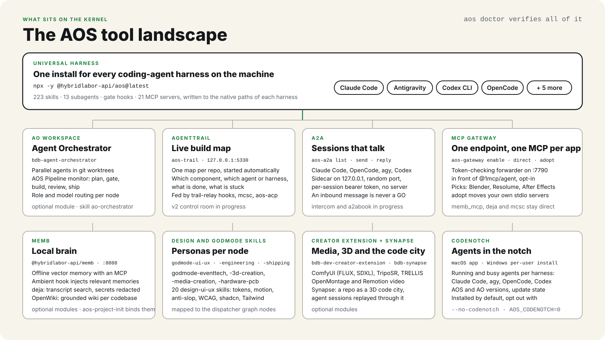<br/><sub><b>Paisagem de ferramentas.</b> O harness universal no topo, com as ferramentas do AOS e os módulos opcionais abaixo.</sub></p>

<details>
<summary><b>Esboço de visão geral v3.4.0 original</b></summary>

<p align="center"><br/><sub><b>Visão geral v3.4.0.</b> Esboço conceptual do v3.4.0; os componentes cresceram desde então, a tabela abaixo está atualizada.</sub></p>

</details>

| Ferramenta | Comando | O que faz |
|---|---|---|
| Plan Canvas | `aos-plan-canvas open <file>` (skill `plan-canvas`) | Abre um plano ou artefacto HTML numa canvas local no navegador onde anota elementos, conversa e aprova ou pede alterações. Os planos das pipelines abrem aqui por predefinição. |
| agenttrail | `aos-trail` (skill `agenttrail`, porta 5330) | Quadro em vivo de um build multi-agente: que componente, que agente ou harness, o que está feito, o que está preso. Alimentado pelos hooks trail-relay, pelo `mcsc` e pelo `aos-acp`. |
| archify | `aos-archify` (skill `archify`) | Diagrams de arquitetura, sequência, fluxo de dados e estado validados como HTML standalone com exportação SVG; aceita Mermaid. |
| AOS Store | `aos store list \| search <q> \| install <name> [--project]`, `aos store ui` (também `aos-store`, comando `/aos-store`) | Procurar e instalar skills e agents do AOS Core, ECC e Scenario (scenario-labs/skills, MIT); as skills necessárias são instaladas em conjunto e cada ficheiro é verificado por SHA-256. A web UI em `http://127.0.0.1:4322` mostra o que está instalado, pré-visualiza os caminhos exatos de destino e instala apenas depois da sua confirmação. `list` e `search` leem um índice offline fixado. |
| Launchpad | `aos-dashboard [--port 7900] [--no-open]` | Uma página com todos os serviços BDB locais (memB, Synapse, OpenWiki, AO, Remote, AOS Store): estado, start/stop, logs. Registado como entrada de autostart. |
| Doctor | `aos doctor [--json] [--net]` (também `aos-doctor`) | Verifica dependências, colocação de skills por harness, daemons, hooks, módulos e o MCP gateway; sai com código 1 quando algo precisa de atenção. O primeiro a correr quando algo se porta mal. |
| Fleet band | mod do Claude Code `plugins/bdb-aos-fleet` | Banda de duas linhas: modo do gate (clique para abrir o painel do gate), token-weather, sessões a trabalhar ou à espera com contadores de GO, e os projetos ativos. Precisa de Claude Code >= 2.1.287; recusar com `AOS_NO_FLEET=1`. |
| Auxiliar GO | `aos-gogate status [--session <id>] \| preset <name> \| presets` | Estado do gate em só de leitura e textos de presets. Nunca registra um grant. |
| A2A | `aos-a2a list \| send \| reply \| status \| cancel` | Mensagens entre sessões vivas de harnesses. |
| MCP gateway | `aos-gateway status \| enable \| direct \| adopt` | Um endpoint local para servidores MCP partilhados. Opt-in. |
| Config | `aos-config show \| propose \| set <key> <value>` | `~/.agents/aos-config.json` ao nível da máquina: raiz do workspace, domínios, id do utilizador. |
| mcsc | Ferramentas MCP `delegate_agy`, `delegate_opencode`, `delegate_codex`, `delegate_smart` (skill `mcsc`) | Delega uma tarefa a outro harness de CLI instalado e transmite as suas chamadas de ferramenta ao agenttrail. Preferido a invocar a CLI diretamente. |

### Fleet band e token-weather

**Token-weather.** O fleet mod transforma a percentagem de contexto de uma sessão numa palavra de tempo com um conselho e uma sparkline: por exemplo `ok` com pouco uso, `compact soon` por volta dos 80 por cento, `compact or start a new session` acima dos 90. A mesma banda lista as suas sessões Claude, quais trabalham, quais esperam por si, e quantos pedidos de GO cada uma tem pendentes. Fonte: `plugins/bdb-aos-fleet`.

---

## Servidores MCP

O [`mcp_config.json`](mcp_config.json) define <!-- count:mcps -->21<!-- /count --> servidores stdio locais, construídos ou aquecidos pelo instalador a partir de `mcps/`. Chegam aos seus harnesses de uma de duas formas:

- **Direto (predefinição).** Cada servidor é escrito na configuração MCP de cada harness, para que todos vejam o mesmo conjunto de ferramentas.
- **Através do MCP gateway (opt-in).** Cada harness recebe uma única entrada `aos` apontando a `127.0.0.1:7790`; atrás dela, o [1mcp](https://github.com/1mcp-app/agent) corre os servidores na allow list do gateway uma vez para todos os harnesses. O `aos-gateway adopt` põe os seus servidores locais atrás dele também, e o `aos-gateway direct` reverte. deja, memB, mcsc e os servidores de controlo do SO permanecem sempre diretos.

A coluna "Routing" diz que caminho um servidor toma quando o gateway está ligado; "Chega à app via" diz como fala com a sua aplicação. Chaves de API e tokens vivem em `~/.aos/secrets.env` (modo 0600), nunca inline numa configuração de harness: [docs/mcp-secrets.md](docs/mcp-secrets.md).

| Servidor | App | Chega à app via | Routing | Skill |
|---|---|---|---|---|
| **3D / CAD** | | | | |
| `bdb_blender_mcp` | Blender | integração por socket; o MCP oficial do Blender é escolhido quando se encontra Blender >= 5.1 | gateway (escolha oficial: direto) | `bdb-blender-mcp` |
| `bdb_rhino_mcp` | Rhino 3D, Grasshopper | router Yak da McNeel, precisa de Rhino no host | direto | `bdb-rhino-mcp` |
| `bdb_rhino_mcp_fallback` | Rhino 3D | GOLEM 3D (105 ferramentas) | direto | `bdb-rhino-mcp` |
| `bdb_unreal_mcp` | Unreal Engine 5 | Web Remote Control API, porta 30010 | gateway | `bdb-unreal-mcp` |
| **Vídeo / pós-produção** | | | | |
| `bdb_davinci_mcp` | DaVinci Resolve | API de scripting do Resolve (162 ferramentas) | gateway | `bdb-davinci-mcp` |
| `bdb_after_effects_mcp` | After Effects | `@kumoproductions/mcp-aftereffects` fixado, Node >= 24; servidor legado apenas com `AOS_AE_MCP=legacy` | gateway | `bdb-after-effects-mcp` |
| `bdb_after_effects_mcp_fallback` | After Effects | servidor Go, ExtendScript | direto | `bdb-after-effects-mcp` |
| `adobe_uxp_mcp` | Photoshop, Illustrator, Premiere Pro, After Effects | ponte UXP por WebSocket | gateway | `bdb-adobe-suite-mcp` |
| **Show control / ao vivo** | | | | |
| `bdb_grandma3_mcp` | grandMA3 | ferramentas tipadas `ma3_*`, OSC/UDP porta 8000 | gateway | `bdb-grandma3-mcp` |
| `bdb_resolume_mcp` | Resolume Arena | API REST, porta 8080; o servidor Arena oficial é escolhido quando o seu binário é encontrado | gateway (escolha oficial: direto) | `bdb-resolume-mcp` |
| `bdb_td_minddesigner` | TouchDesigner | ponte MindDesigner, porta 9980 | direto | `bdb-touchdesigner-mcp` |
| `bdb_td_backup` | TouchDesigner | ponte stdio, fallback | direto | `bdb-touchdesigner-mcp` |
| **Design / navegador** | | | | |
| `open_design_mcp` | Open Design | daemon local em 127.0.0.1:3000 | gateway | — |
| `chrome-devtools` | Chrome | Puppeteer | direto | — |
| **Controlo do SO** | | | | |
| `zavora_computer_use` | desktop macOS, Linux | `npx -y @zavora-ai/computer-use-mcp@7.4.0`, módulo Rust nativo embalado no pacote npm | direto | `bdb-computer-use-mcp` |
| `bdb_windows_computer_use` | desktop Windows | Win32, COM, UIAutomation, OCR Tesseract local | direto | `bdb-computer-use-mcp` |
| **Memória / infra** | | | | |
| `memb_mcp` | memB | SQLite local + ONNX, WebUI na porta 8088 | direto | `memb-skill`, `bdb-memb-mcp` |
| `deja` | transcrições de agentes | índice local, secrets redigidos | direto | `deja-memory` |
| `mcsc` | outros harnesses | cria agy, OpenCode ou Codex e transmite ao agenttrail | direto | `mcsc` |
| `github` | GitHub | `@modelcontextprotocol/server-github` | gateway | `github` |
| `bdb_remoteos_mcp` | RemoteOS | gateway multi-nuvem com aprovação de quatro olhos | direto | — |

**Routing.** A allow list em `lib/gateway/config.js` decide: os nove servidores marcados como `gateway` são partilhados pela única entrada `aos` assim que a ativa; todo o resto permanece direto em cada harness.

### Gateway MCP e um MCP por app

**Um MCP por app.** Para Blender, Resolume e After Effects o instalador mantém um único candidato (`mcp_picks.json`): o Blender oficial quando se encontra Blender >= 5.1, o Resolume oficial quando o binário do Arena é encontrado, o servidor embalado caso contrário. O servidor de After Effects é um pacote `npx` fixado e precisa de Node >= 24 (o servidor legado apenas com `AOS_AE_MCP=legacy`).

**Gateway (opt-in).** O `aos-gateway` corre um forwarder com verificação de token em `127.0.0.1:7790` à frente do `@1mcp/agent` e partilha uma allow list de servidores incluídos atrás de uma entrada `aos` por harness. O `aos-gateway adopt` põe os seus servidores stdio locais atrás dele (ignorando entradas remotas e entradas com secrets inline). O `aos-gateway direct` reverte tudo. O token para navegadores, não outros processos locais. `deja`, `memb_mcp` e `mcsc` permanecem diretos.

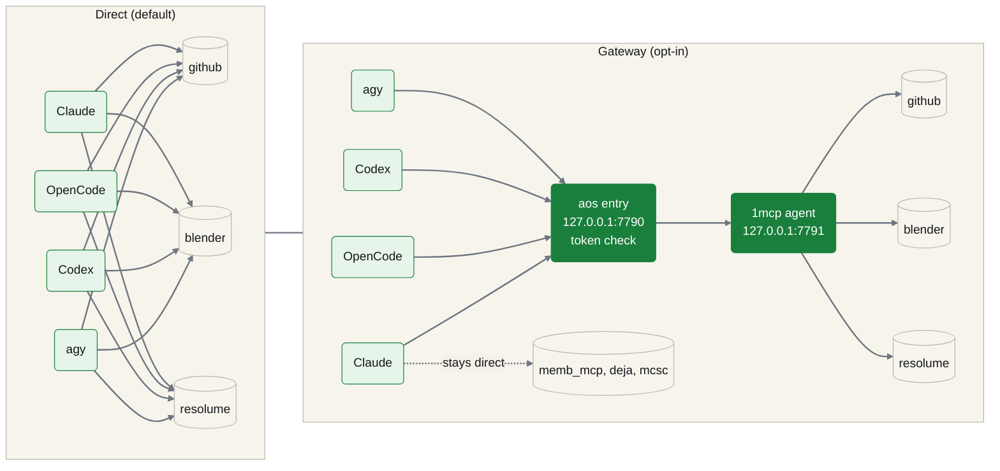
```mermaid
%%{init: {"theme": "base", "themeVariables": {"lineColor": "#6e7681", "edgeLabelBackground": "#f6f1e8", "textColor": "#15171A", "clusterBkg": "#F7F4EC", "clusterBorder": "#B9B5AA", "titleColor": "#15171A", "primaryColor": "#FFFFFF", "primaryBorderColor": "#15171A", "primaryTextColor": "#15171A"}}}%%
flowchart LR
    subgraph D["Direct (default)"]
        direction LR
        H1("Claude") --> S1[("github")] & S2[("blender")] & S3[("resolume")]
        H2("OpenCode") --> S1 & S2 & S3
        H3("Codex") --> S1 & S2 & S3
        H4("agy") --> S1 & S2 & S3
    end
    subgraph G["Gateway (opt-in)"]
        direction LR
        G1("Claude") & G2("OpenCode") & G3("Codex") & G4("agy") --> F("aos entry<br/>127.0.0.1:7790<br/>token check")
        F --> M("1mcp agent<br/>127.0.0.1:7791") --> U1[("github")] & U2[("blender")] & U3[("resolume")]
        G1 -.->|"stays direct"| X[("memb_mcp, deja, mcsc")]
    end
    D ~~~ G

    classDef plan fill:#E6F4EA,stroke:#1A7F3C,color:#15171A
    classDef build fill:#FFFFFF,stroke:#15171A,color:#15171A
    classDef gate fill:#1A7F3C,stroke:#1A7F3C,color:#FFFFFF
    classDef human fill:#F7F4EC,stroke:#5B6168,color:#15171A
    classDef store fill:#F7F4EC,stroke:#B9B5AA,color:#15171A
    linkStyle default stroke:#6e7681,stroke-width:2px

    class H1,H2,H3,H4,G1,G2,G3,G4 plan
    class S1,S2,S3,U1,U2,U3,X store
    class F,M gate
    style D fill:#F7F4EC,stroke:#B9B5AA,color:#15171A
    style G fill:#F7F4EC,stroke:#B9B5AA,color:#15171A
```

<p align="center"><sub><b>Roteamento direto e por gateway.</b> Por predefinição cada harness fala diretamente com cada servidor; com o gateway ativado partilham uma única entrada aos à frente do agente 1mcp.</sub></p>

**Referência.** [docs/mcp-gateway.md](docs/mcp-gateway.md).

---

## Plugins e marketplace

**Manifest de plugin.** `.claude-plugin/plugin.json` + `marketplace.json` (gerado por `npm run plugin:build`). Dentro do Claude Code pode adicionar o marketplace com `/plugin marketplace add hybridlabor-api/aos` e instalar `bdb-aos@bdb-marketplace` (skills e subagents) ou `bdb-aos-fleet@bdb-marketplace` (a fleet band para o Claude Code). O caminho do marketplace transporta apenas skills e subagents; o instalador npm acima é o caminho recomendado porque também configura os gate hooks e os servidores MCP.

**Descoberta de skills.** Cada harness encontra skills no seu diretório nativo (`~/.claude/skills`, `~/.agents/skills`, `~/.codex/skills`, `~/.roo/skills`, etc.). Para procurar e instalar skills adicionais após a instalação:

```bash
npx skills add hybridlabor-api/aos
```

Isto descobre todas as <!-- count:skills -->264<!-- /count --> skills curadas e instala-as no diretório universal `~/.agents/skills` (usado por todos os harnesses e pela AOS CLI).

---

## AOS CLI

Um harness de CLI leve construído sobre o [pi](https://github.com/earendil-works/pi), um agente de código que corre no terminal. A AOS CLI lê `~/.agents/skills` (escrito pelo instalador) e `~/.agents/AGENTS.md` (o dispatcher graph como instruções de sistema), não corre servidores MCP próprios e precisa de **Node >= 22.19** (o piso do pi, mais alto que o instalador principal do AOS).

```bash
aos-cli "what is the fastest way to fix this bug"
aos-cli --continue                    # retomar a sessão anterior
```

O lançador da CLI (`packages/aos-cli/bin/aos-cli.mjs`) acompanha um modo escuro com tema AOS (`aos.json`), as dez skills centrais de `core-skills.json` (ask-tim, aos-setup, systematic-debugging, archify, etc.), e dois comandos de sessão em só de leitura (`/aos` mostra o menu de instalação; `/aos-status` corre a verificação de saúde).

Instale-a pelo instalador AOS com o destino AOS CLI: `npx -y @hybridlabor-api/aos@latest -y --platforms=10`. O pacote é privado e não está publicado no npm, por isso `npm i -g @hybridlabor-api/aos-cli` não funciona.

---

## Memória e conhecimento

Instalados como módulos opcionais pelo instalador; o `aos doctor` verifica-os e o Launchpad mostra-os.

- **memB** (`@hybridlabor-api/memb`): memória vetorial local e offline com um servidor MCP (`add_memory`, `search_memory`, `list_memories`, `delete_memory`), uma WebUI na porta 8088 e um hook ambiente que injeta memórias relevantes em sessões de Claude Code. Skills: `memb-skill`, `memb-ingest`, `bdb-memb-mcp`.
- **deja** (`@vshulcz/deja-vu`, instalado com o memB): indexa as suas transcrições de agentes localmente com secrets redigidos; `deja fix` perante um erro, `deja wip` ao retomar, `deja search` para sessões passadas. Skill: `deja-memory`.
- **OpenWiki** (CLI `openwiki`): gera e refresca um wiki fundamentado de uma codebase, com um visualizador na porta 4321 e um daemon em segundo plano. Skill: `openwiki-skill`; o wiki próprio deste repositório está em [`.openwiki/`](.openwiki/quickstart.md).
- **Synapse** (`@hybridlabor-api/bdb-synapse`): renderiza um repositório como uma cidade de código 3D e reproduz sessões de agentes através dela. Skill: `synapse-integration-skill`.

O `aos-setup` leva uma máquina a um estado verificado para os quatro; o `aos-project-init` liga um projeto a eles (slug, wiki, memória, `AGENTS.md`).

---

## O que está incluído

### Os subagents (21)

**Roster.** O dispatcher graph compila estes agentes, disponíveis como subagents de Claude Code e carregáveis no Antigravity, Cursor, Codex, OpenCode e outros:

| Agente | Objetivo |
|---|---|
| **Architect** | Transforma o objetivo do utilizador num plano de sistema. Lê a arquitetura existente antes de propor mudanças. |
| **TechLead** | Revê o plano quanto a um mapa de capacidades (limites de módulos, direção de dependências, ordem de build) antes de qualquer nó de build começar. Aprova ou rejeita de volta ao Architect. |
| **UI_UX** | Designer Frontend líder. Impõe princípios anti-slop, design tokens DTCG, gosto frontend de alta iniciativa e dinâmica de motion fluida. |
| **Engineering** | Engenheiro Fullstack & Backend sénior. Impõe Domain-Driven Design, Clean Architecture, ciclos TDD e boas práticas de base de dados. |
| **Media_EventTech** | Especialista em Creative-Tech & Show-Control. Governa modelação 3D, redes TouchDesigner, DaVinci Resolve, iluminação e Resolume. |
| **Reviewer** | Revisão adversarial do output do nó de build contra o contrato do plano. Modelada na disciplina doubt-driven-development. |
| **Shipping** | Gatekeeper de release & auditor de QA. Corre o quality gate automatizado (lint, typecheck, testes, a11y, seo) e impõe o GO gate. |
| **Database Reviewer** | Especialista PostgreSQL para otimização de consultas, design de schema, segurança e performance. |
| **Security Reviewer** | Deteção e correção de vulnerabilidades de segurança. Sinaliza secrets, SSRF, injeção, criptografia insegura e OWASP Top 10. |
| **Silent-Failure Hunter** | Revê código à procura de falhas silenciosas, erros engolidos, fallbacks maus e propagação de erros em falta. |
| **Go-Build Resolver** | Resolve erros de build, vet e compilação de Go com mudanças mínimas. |
| **Opensource Forker** | Cria um fork de um projeto para open source: remove secrets, substitui referências internas, gera `.env.example`. |
| **Opensource Sanitizer** | Verifica que um fork open source está totalmente higienizado. Procura secrets vazados, PII, referências internas. |

### Skills por categoria

**Categorias.** <!-- count:skills -->264<!-- /count --> skills curadas, descobertas por cada harness (o catálogo completo gerado está na secção seguinte):

- **bdb-core**: infraestrutura central do AOS, pipelines, ferramentas e utilitários: `startcycle`, `startcycle-graph`, `startcycle-graph-user`, `agenttrail`, `plan-canvas`, `aos-a2a`, `aos-gateway`, `aos-store`, `master-session` e mais.
- **design-ui-ux**: frontend, design de UI, acessibilidade, tokens, motion, anti-slop: `senior-frontend`, `ui-component`, `ui-review`, `tailwind-patterns`, `shadcn`, `wcag-audit-patterns` e mais.
- **engineering-method**: arquitetura, testes, debugging, CI/CD, qualidade de código: `software-architecture`, `test-driven-development`, `systematic-debugging`, `ci-pipeline`, `github-actions-generator`, `dockerfile-validator` e mais.
- **library**: especificidades de linguagens e frameworks: TypeScript, Node.js, Python, React, Postgres, Prisma, Next.js, Drizzle ORM, Go e mais.
- **media-eventtech**: 3D, vídeo, show control, design espacial: `godmode-eventtech`, `threejs-skills`, as skills MCP de software criativo e mais.
- **engineering-hardware**: design de PCB e eletricidade: `godmode-hardware-pcb`.

### Ver tudo

**Catálogo gerado.** Construído a partir dos ficheiros do repositório (frontmatter de cada `SKILL.md`, `agents/`, `commands/`). Abra uma secção para ver nomes e descrições de uma linha.
<!-- BEGIN GENERATED CATALOG: regenerate from the repo, do not hand-edit -->

<details>
<summary><b>Harnesses (9)</b></summary>

| Harness | Skills | Subagents | Hooks and gates | MCP | Extras |
|---|:---:|:---:|:---:|:---:|---|
| Claude Code / Desktop | yes | yes | yes (GO gate, graph gate, env-file protection, Conventional Commits, memB inject, trail relay, A2A inbox) | yes | slash commands, fleet band, plugin manifest |
| Google Antigravity (agy) | yes | yes | gate-only hooks | yes | `/bdb-aos:<cmd>` commands, inbox MCP for A2A |
| Codex CLI | yes | yes | GO gate, graph gate | yes | `$bdb-aos:<cmd>` commands, A2A queue/resume |
| OpenCode | yes | yes | via `bdb-aos.js` plugin | yes | `/bdb-aos-<cmd>` commands, A2A inject |
| Cursor | yes | no | no | yes | `.cursor/rules` |
| Windsurf | yes | no | no | yes | `mcp.json` |
| Roo Code / Cline | yes | no | no | yes | `.roomodes` |
| Aider | yes | no | no | no | none |
| AOS CLI (pi) | yes | system prompt | no | no | 10 core skills, dark theme |

</details>

<details>
<summary><b>Tools and CLIs (12)</b></summary>

| Command | What it does |
|---|---|
| `aos` | Installer menu: update, doctor, reconfigure, uninstall. |
| `aos doctor` | Verify dependencies, skill placement, daemons, hooks, modules, gateway. |
| `aos store` | Browse and install skills and agents (CLI and web UI on port 4322). |
| `aos-plan-canvas` | Open plans and HTML artifacts in the annotation canvas (port 4519). |
| `aos-trail` | agenttrail live map (port 5330). |
| `aos-archify` | Architecture and sequence diagrams as standalone HTML. |
| `aos-dashboard` | Launchpad for local services (port 7900). |
| `aos-a2a` | List, send to and reply to live harness peers. |
| `aos-acp` | Start workers whose guarded commands need a GO token. |
| `aos-gateway` | Local MCP gateway: serve, enable, direct, adopt, status. |
| `aos-gogate` | Read-only gate status and presets. |
| `aos-config` | Machine-level AOS configuration. |

</details>

<details>
<summary><b>MCP servers (21)</b></summary>

| Server | Domain |
|---|---|
| `github`, `chrome-devtools` | Issues, PRs, workflows; browser automation and debugging |
| `bdb_unreal_mcp` | Unreal Engine (Web Remote Control, port 30010) |
| `bdb_rhino_mcp`, `bdb_rhino_mcp_fallback` | Rhino 3D and Grasshopper |
| `bdb_davinci_mcp` | DaVinci Resolve |
| `bdb_grandma3_mcp` | grandMA3 (typed `ma3_*` tools) |
| `bdb_resolume_mcp` | Resolume Arena (REST, port 8080) |
| `adobe_uxp_mcp` | Adobe UXP bridge |
| `bdb_blender_mcp` | Blender |
| `bdb_after_effects_mcp`, `bdb_after_effects_mcp_fallback` | After Effects |
| `bdb_td_minddesigner`, `bdb_td_backup` | TouchDesigner (port 9980) |
| `zavora_computer_use`, `bdb_windows_computer_use` | Desktop control on macOS and Linux, and on Windows |
| `memb_mcp`, `deja` | Local memory and transcript search |
| `mcsc` | Delegation to other harnesses |
| `open_design_mcp` | Open Design |
| `bdb_remoteos_mcp` | RemoteOS multi-cloud gateway with 4-eyes approval |

</details>

<details>
<summary><b>Skills (229)</b></summary>

<details>
<summary><b>library (98)</b></summary>

| Skill | What it does |
|---|---|
| `ai-agent-development` | AI agent development workflow for building autonomous agents, multi-agent systems, and agent orchestration with CrewAI, LangGraph, and custom agents. |
| `ai-product` | Every product will be AI-powered. |
| `api-design-principles` | Master REST and GraphQL API design principles to build intuitive, scalable, and maintainable APIs that delight developers and stand the test of time. |
| `api-patterns` | API design principles and decision-making. |
| `apify-lead-generation` | Scrape leads from multiple platforms using Apify Actors. |
| `apify-ultimate-scraper` | AI-driven data extraction from 55+ Actors across all major platforms. |
| `bash-linux` | Bash/Linux terminal patterns. |
| `brainstorming` | Use before creative or constructive work (features, architecture, behavior). |
| `browser-automation` | Browser automation powers web testing, scraping, and AI agent interactions. |
| `cloudflare-workers-expert` | Expert in Cloudflare Workers and the Edge Computing ecosystem. |
| `copywriting` | Write rigorous, conversion-focused marketing copy for landing pages and emails. |
| `crewai` | Expert in CrewAI, the leading role-based multi-agent framework. |
| `database-design` | Database design principles and decision-making. |
| `debugger` | Debugging specialist for errors, test failures, and unexpected behavior. |
| `deep-research` | Run autonomous research tasks that plan, search, read, and synthesize information into comprehensive reports. |
| `docker-expert` | Advanced Docker containerization: optimization, security hardening, multi-stage builds, orchestration. |
| `documentation` | Documentation generation workflow covering API docs, architecture docs, README files, code comments, and technical writing. |
| `drizzle-orm-expert` | Expert in Drizzle ORM for TypeScript: schema design, relational queries, migrations, and serverless database integration. |
| `firecrawl` | Search, scrape, and interact with the web via the Firecrawl CLI. |
| `firecrawl-agent` | AI-powered autonomous data extraction that navigates complex sites and returns structured JSON. |
| `firecrawl-build` | Integrate Firecrawl into product code for web scraping, crawling, searching, and interaction. |
| `firecrawl-build-interact` | Integrate Firecrawl `/interact` into product code for dynamic pages and browser actions after scraping. |
| `firecrawl-build-onboarding` | Get Firecrawl credentials and SDK setup into a project. |
| `firecrawl-build-scrape` | Integrate Firecrawl `/scrape` into product code for single-page extraction. |
| `firecrawl-build-search` | Integrate Firecrawl `/search` into product code and agent workflows. |
| `firecrawl-crawl` | Bulk extract content from an entire website or site section. |
| `firecrawl-download` | Download an entire website as local files: markdown, screenshots, or multiple formats per page. |
| `firecrawl-interact` | Control and interact with a live browser session on any scraped page. |
| `firecrawl-map` | Discover and list all URLs on a website, with optional search filtering. |
| `firecrawl-scrape` | Extract clean markdown from any URL, including JavaScript-rendered SPAs. |
| `firecrawl-search` | Web search with full page content extraction. |
| `gemini-api-dev` | The Gemini API provides access to Google's most advanced AI models. |
| `gemini-api-integration` | Use when integrating Google Gemini API into projects. |
| `geo-fundamentals` | Generative Engine Optimization for AI search engines (ChatGPT, Claude, Perplexity). |
| `git-advanced-workflows` | Master advanced Git techniques to maintain clean history, collaborate effectively, and recover from any situation. |
| `git-pr-review` | Generate a concise and structured PR description from commit history with minimal token usage. |
| `github` | Use the `gh` CLI for issues, pull requests, Actions runs, and GitHub API queries. |
| `github-actions-templates` | Production-ready GitHub Actions workflow patterns for testing, building, and deploying applications. |
| `github-workflow-automation` | Patterns for automating GitHub workflows with AI assistance. |
| `go-concurrency-patterns` | Master Go concurrency with goroutines, channels, sync primitives, and context. |
| `go-playwright` | Robust browser automation using Playwright Go. |
| `golang-pro` | Master Go 1.21+ with modern patterns, advanced concurrency, performance optimization, and production-ready microservices. |
| `landing-page-generator` | Generates high-converting Next.js/React landing pages with Tailwind CSS. |
| `linear-claude-skill` | Manage Linear issues, projects, and teams. |
| `llm-app-patterns` | Production-ready patterns for building LLM applications. |
| `llm-application-dev-ai-assistant` | Creating intelligent conversational interfaces, chatbots, and AI-powered applications. |
| `llm-prompt-optimizer` | Use when improving prompts for any LLM. |
| `llm-structured-output` | Get reliable JSON, enums, and typed objects from LLMs using response_format, tool_use, and schema-constrained decoding. |
| `local-llm-expert` | Master local LLM inference, model selection, VRAM optimization, and local deployment using Ollama, llama.cpp, vLLM, and LM Studio. |
| `microservices-patterns` | Microservices architecture patterns: service boundaries, inter-service communication, data management, resilience. |
| `modern-javascript-patterns` | Modern JavaScript (ES6+) features, functional programming patterns, and best practices. |
| `monorepo-management` | Build efficient, scalable monorepos that enable code sharing, consistent tooling, and atomic changes. |
| `n8n-code-javascript` | Write JavaScript code in n8n Code nodes. |
| `n8n-code-python` | Write Python code in n8n Code nodes. |
| `n8n-expression-syntax` | Validate n8n expression syntax and fix common errors. |
| `n8n-mcp-tools-expert` | Expert guide for using n8n-mcp MCP tools effectively. |
| `n8n-workflow-patterns` | Proven architectural patterns for building n8n workflows. |
| `neon-postgres` | Expert patterns for Neon serverless Postgres, branching, connection pooling, and Prisma/Drizzle integration. |
| `nextjs-app-router-patterns` | Next.js 14+ App Router architecture, Server Components, and modern full-stack React development. |
| `nextjs-best-practices` | Next.js App Router principles. |
| `notion-automation` | Automate Notion tasks via Rube MCP (Composio): pages, databases, blocks, comments, users. |
| `obsidian-markdown` | Create and edit Obsidian Flavored Markdown with wikilinks, embeds, callouts, and properties. |
| `openapi-spec-generation` | Generate and maintain OpenAPI 3.1 specifications from code, design-first specs, and validation patterns. |
| `os-scripting` | Operating system and shell scripting troubleshooting workflow for Linux, macOS, and Windows. |
| `playwright-skill` | General-purpose browser automation skill. |
| `posix-shell-pro` | Expert in strict POSIX sh scripting for maximum portability across Unix-like systems. |
| `postgres-best-practices` | Postgres performance optimization and best practices from Supabase. |
| `postgresql` | Design a PostgreSQL-specific schema. |
| `prisma-expert` | Prisma ORM: schema design, migrations, query optimization, relations modeling, and database operations. |
| `product-manager-toolkit` | Essential tools and frameworks for modern product management, from discovery to delivery. |
| `programmatic-seo` | Design and evaluate programmatic SEO strategies for creating SEO-driven pages at scale. |
| `python-patterns` | Python development principles and decision-making. |
| `python-performance-optimization` | Profile and optimize Python code using cProfile, memory profilers, and performance best practices. |
| `python-pro` | Master Python 3.12+ with modern features, async programming, performance optimization, and production-ready practices. |
| `rag-engineer` | Expert in building Retrieval-Augmented Generation systems. |
| `rag-implementation` | RAG implementation workflow: embedding selection, vector database setup, chunking strategies, retrieval optimization. |
| `react-best-practices` | Performance optimization guide for React and Next.js applications, maintained by Vercel. |
| `react-component-performance` | Diagnose slow React components and suggest targeted performance fixes. |
| `react-patterns` | Modern React patterns and principles. |
| `readme` | Technical writer for comprehensive project documentation. |
| `remotion` | Generate walkthrough videos from Stitch projects using Remotion with transitions, zooming, and text overlays. |
| `schema-markup` | Design, validate, and optimize schema.org structured data for eligibility, correctness, and measurable SEO impact. |
| `seo` | Run a broad SEO audit across technical SEO, on-page SEO, schema, sitemaps, content quality, AI search readiness, and GEO. |
| `seo-audit` | Diagnose and audit SEO issues affecting crawlability, indexation, rankings, and organic performance. |
| `seo-technical` | Audit technical SEO across crawlability, indexability, security, URLs, mobile, Core Web Vitals, and structured data. |
| `slack-automation` | Automate Slack workspace operations including messaging, search, channel management, and reactions via Composio. |
| `tanstack-query-expert` | Expert in TanStack Query (React Query), asynchronous state management. |
| `tmux` | Expert tmux session, window, and pane management for terminal multiplexing and persistent remote workflows. |
| `turborepo-caching` | Configure Turborepo for efficient monorepo builds with local and remote caching. |
| `typescript-pro` | Master TypeScript with advanced types, generics, and strict type safety. |
| `using-neon` | Neon serverless Postgres: autoscaling, branching, instant restore, scale-to-zero. |
| `vector-database-engineer` | Expert in vector databases, embedding strategies, and semantic search implementation. |
| `vercel-ai-sdk-expert` | Expert in the Vercel AI SDK. |
| `vercel-deployment` | Expert knowledge for deploying to Vercel with Next.js. |
| `web-artifacts-builder` | Build powerful frontend claude.ai artifacts. |
| `web-performance-optimization` | Optimize loading speed, Core Web Vitals, bundle size, caching strategies, and runtime performance. |
| `web-scraper` | Multi-strategy intelligent web scraping. |
| `zustand-store-ts` | Create Zustand stores following established patterns with proper TypeScript types and middleware. |

</details>

<details>
<summary><b>engineering-method (51)</b></summary>

| Skill | What it does |
|---|---|
| `agent-tool-builder` | Tools are how AI agents interact with the world: schema to error handling. |
| `agentic-harness-patterns` | Harness patterns for coding agents: memory, permissions, context engineering, delegation, skills, hooks, bootstrap. |
| `archify` | Validated architecture, workflow, sequence, data-flow, and state diagrams as explorable standalone HTML with inline SVG. |
| `architect-review` | Master software architect specializing in modern architecture. |
| `bash-script-generator` | Create, generate, write, or scaffold bash/shell scripts (.sh), automation, or CLI tools. |
| `bash-script-validator` | Validate, lint, audit, or fix bash/shell/.sh scripts via ShellCheck. |
| `bdb-computer-use-mcp` | Native Rust/Node and Python computer-use servers to control macOS, Windows, and Linux desktops. |
| `bdb-security-audit` | Security auditing, diff analysis, defensive checklists, and vulnerability testing. |
| `bdb-shipping-skill` | Problem-framing pre-flight, one-way/two-way door classification, ADR-lite decision logging, post-ship outcome loop. |
| `ci-pipeline` | Set up a complete CI/CD pipeline for a project. |
| `clean-code` | The principles of "Clean Code". |
| `concise-planning` | Generate a clear, actionable, atomic checklist for a coding task. |
| `dispatching-parallel-agents` | Use when facing 2+ independent tasks that can be worked on without shared state. |
| `dockerfile-generator` | Create, generate, or write Dockerfiles and multi-stage Docker images. |
| `dockerfile-validator` | Validate, lint, audit, or scan a Dockerfile for security and best practices. |
| `domain-modeling` | Build and sharpen a project's domain model. |
| `executing-plans` | Execute a written implementation plan in a separate session with review checkpoints. |
| `factory-collect` | Experimental workflow for collecting and triaging product feedback, telemetry, runtime errors, and issue reports. |
| `factory-lookback` | Experimental workflow for auditing recurring feedback, telemetry, and errors to find systemic fixes. |
| `factory-review-prs` | Experimental workflow for reviewing configured repositories' pull requests. |
| `finishing-a-development-branch` | Decide how to integrate finished work once implementation is complete and tests pass. |
| `github-actions-generator` | Create, generate, or scaffold GitHub Actions workflows and CI/CD pipelines. |
| `github-actions-validator` | Validate, lint, audit, fix GitHub Actions workflows. |
| `github-repo` | Standards and workflows for writing, sanitizing, and publishing high-quality GitHub repositories. |
| `godmode-engineering` | Strict Domain-Driven Design, TypeScript strictness, and Clean Architecture. |
| `godmode-shipping` | The final gatekeeper for production releases. |
| `grill-me` | A relentless interview to sharpen a plan or design. |
| `grill-with-docs` | Like grill-me, and builds the project's domain model (glossary and ADRs) as it goes. |
| `grilling` | Grill the user relentlessly about a plan, decision, or idea. |
| `makefile-generator` | Create, generate, or scaffold Makefiles with .PHONY targets and build automation. |
| `makefile-validator` | Validate, lint, audit, or check Makefiles and .mk files for errors. |
| `planning-with-files` | Use persistent markdown files as working memory on disk. |
| `pr-recap` | Visual recap page for a PR or git range: changed-files tree, per-file notes, Verified vs Not verified table, risks. |
| `prompt-engineer` | Transforms prompts into optimized prompts using frameworks (RTF, RISEN, Chain of Thought, and more). |
| `prompt-engineering-patterns` | Advanced prompt engineering techniques to maximize LLM performance, reliability, and controllability. |
| `prototype` | Build a throwaway prototype to answer a design question. |
| `read-the-damn-docs` | Read the docs before implementing, integrating, upgrading, or debugging anything third-party. |
| `requesting-code-review` | Verify work meets requirements after completing tasks or before merging. |
| `simplify-code` | Review a diff for clarity and safe simplifications, then optionally apply low-risk fixes. |
| `software-architecture` | Guide for quality-focused software architecture. |
| `subagent-driven-development` | Execute implementation plans with independent tasks in the current session. |
| `systematic-debugging` | Use on any bug, test failure, or unexpected behavior, before proposing fixes. |
| `tdd-workflow` | Test-Driven Development workflow principles. |
| `test-driven-development` | Use when implementing any feature or bugfix, before writing implementation code. |
| `triage` | Move issues and external PRs through a state machine of triage roles and write agent-ready briefs. |
| `using-git-worktrees` | Ensure an isolated workspace for feature work and plan execution. |
| `verification-before-completion` | Run verification commands and confirm output before claiming work is complete or passing. |
| `wcag-audit-patterns` | Audit web content against WCAG 2.2 with actionable remediation strategies. |
| `webapp-testing` | Test local web applications with native Python Playwright scripts. |
| `writing-plans` | Write a plan for a multi-step task from a spec, before touching code. |
| `writing-plans-legacy` | Superseded AOS-era version of writing-plans, kept for its terse plan template. |

</details>

<details>
<summary><b>bdb-core (40)</b></summary>

| Skill | What it does |
|---|---|
| `agent-manager-skill` | Manage multiple local CLI agents via tmux sessions with cron-friendly scheduling. |
| `agent-memory-mcp` | Hybrid memory system: persistent, searchable knowledge management for AI agents. |
| `agent-pipeline` | Reference for the seven-node dispatcher graph that /startcycle-graph runs. |
| `agenttrail` | Live map of a multi-agent build in the browser: which plan component, which agent or harness, what is done, what is stuck. |
| `ao-orchestrator` | Multi-project orchestrator across repositories using the Agent Orchestrator (AO) daemon. |
| `aos-a2a` | List, send to and reply to live harness peers (Claude Code, OpenCode, Codex, agy) over A2A on localhost. |
| `aos-gateway` | Use the local MCP gateway and the per-app MCP picks. |
| `aos-project-init` | Interview a project folder into AOS: slug and domain, OpenWiki, memB, Synapse map, AGENTS.md. |
| `aos-setup` | Bring a machine to a complete, verified AOS installation. |
| `aos-store` | Browse, preview, and install AOS Core, ECC and Scenario skills and agents from a local web UI. |
| `ask-tim` | Ask which skill or flow fits your situation. |
| `bdb-aos` | Entry point for the BDB Agent OS suite installed as a Claude Code plugin. |
| `bdb-deploy` | Build and deploy a project to a real server via rsync over SSH. |
| `bdb-memb-mcp` | Model Context Protocol interface to the memB persistent agent memory layer. |
| `bdb-updater` | Proactively check for and install updates to the AOS package via npm. |
| `bdbhtmlmanueldocs` | Design system, standalone HTML template and GitHub Pages hosting workflow for neutral developer documentation. |
| `bdbrainstorm` | Multi-agent brainstorming, /grill-me and the Core Godmodes, ending in a hand-off to /startcycle-graph. |
| `bdbresilience` | CI/CD error recovery, file-based locking, diagnostic triage, and two-phase GO gate resilience for multi-agent pipelines. |
| `deja-memory` | Use `deja fix` on an error, `deja wip` when resuming, `deja search` for past sessions. |
| `design-control-loop` | Interview the user to design an agentic control loop tailored to their codebase, then build it. |
| `factory-human-digest` | Experimental workflow for summarizing work that still needs human judgment. |
| `gogate` | Show or explain the AOS go-gate mode (hard, soft, off) and the time-limited grants of this session. |
| `loop-templates` | Repeat a task on a schedule or until a condition holds (CI until green, follow a PR to merge). |
| `master-session` | One Claude Code session supervises several others: roster, status requests, GO board, idle notices, GO-token protocol. |
| `mcsc` | Delegate a task to another installed CLI harness (agy, OpenCode, Codex) from inside an AOS repo. |
| `memb-ingest` | Deep scan and ingest project files and past conversation logs into the local memB vector memory engine. |
| `memb-skill` | BDB local-first long-term memory engine (memB). |
| `openwiki-skill` | Initialize, update, and visualize codebase or personal knowledge wikis using OpenWiki. |
| `orchestrator-chain` | Hand work down the chain master session, project orchestrator, package orchestrator. |
| `plan-arbiter` | Compare, cross-review, merge, or arbitrate competing plans from multiple agents. |
| `plan-canvas` | Open plans and HTML artifacts in a local browser canvas where the human annotates, chats, and approves. |
| `quick-recap` | End each agent response with a red/yellow/green status line. |
| `startcycle` | Linear multi-agent build pipeline with file hand-offs in production_artifacts/. |
| `startcycle-graph` | The autonomous multi-agent build pipeline with durable state, repair loop and escalation. |
| `startcycle-graph-user` | A small, throwaway multi-agent fan-out in any project. |
| `stay-within-limits` | Respect 5-hour and weekly usage limits by checking usage between waves and pausing near the cap. |
| `subagent-setup` | Configure and synchronize multi-harness subagents with optional per-harness model overrides. |
| `synapse-integration-skill` | BDB Synapse (3D Codebase Visualizer) integration. |
| `teamwork-preview` | Interactive 9-step prompt crafting and delegation protocol for autonomous multi-agent teams. |
| `token-saver-config` | Context window output compression engine for CLI commands. |

</details>

<details>
<summary><b>design-ui-ux (20)</b></summary>

| Skill | What it does |
|---|---|
| `bdb-visual-edit` | Edit source from an element the human points at in a running local dev app (plan-canvas route "visual-edit"). |
| `bdbdesignpro` | Animation engine choice, motion tokens, scroll effects, micro-interactions, motion accessibility. |
| `design-spells` | Curated micro-interactions, delightful animations, and subtle design details. |
| `editable-design` | Fixed-canvas editable visual designs: posters, marketing graphics, covers, menus, banners, social cards. |
| `frontend-dev-guidelines` | Senior frontend engineering under strict architectural and performance standards. |
| `godmode-ui-ux` | Design lead for all frontend work: brand discovery, Anti-Slop rules, DTCG design tokens, fluid motion. |
| `live-preview-canvas` | Local HTML mock with a built-in feedback layer for visual comments. |
| `senior-frontend` | React components, Next.js performance, accessibility, frontend code quality. |
| `shadcn` | Add, customize, and troubleshoot shadcn/ui components. |
| `tailwind-patterns` | Tailwind CSS v4, CSS-first configuration, container queries, design token architecture. |
| `ui-component` | Generate a UI component following StyleSeed Toss conventions. |
| `ui-page` | Scaffold a mobile-first page using StyleSeed Toss layout patterns. |
| `ui-pattern` | Reusable UI patterns: card sections, grids, lists, forms, chart wrappers. |
| `ui-review` | Review UI code for design-system compliance, accessibility, mobile ergonomics. |
| `ui-tokens` | List, add, and update design tokens, keeping JSON, CSS variables, and dark-mode values in sync. |
| `ui-ux-pro-max` | Comprehensive design guide for web and mobile applications. |
| `ux-audit` | Audit screens against Nielsen's heuristics and mobile UX best practices. |
| `ux-feedback` | Loading, empty, error, and success feedback states. |
| `ux-flow` | User flows, progressive disclosure, hub-and-spoke navigation. |
| `ux-persuasion-engineer` | Behavioral UX: choice architecture, friction audits, commitment design, without coercion. |

</details>

<details>
<summary><b>media-eventtech (19)</b></summary>

| Skill | What it does |
|---|---|
| `bdb-adobe-suite-mcp` | Automate Photoshop, Illustrator, Premiere Pro, and After Effects via ExtendScript and UXP bridges. |
| `bdb-after-effects-mcp` | Compositions, layers, masks, keyframe animations, and ExtendScript in After Effects. |
| `bdb-blender-mcp` | Build 3D assets, apply materials, inspect scenes, and script bpy in Blender. |
| `bdb-davinci-mcp` | DaVinci Resolve timeline editing, media analysis, color grading, Fusion and Fairlight scripting. |
| `bdb-eventagency-skill` | Event agency operations: client intake, scoping, vendors, crew, production planning, pre-show logistics, wrap. |
| `bdb-grandma3-mcp` | Patch fixtures, execute console commands, and trigger macros on grandMA3. |
| `bdb-resolume-mcp` | Trigger clips, clear layers, adjust speeds, and query composition status in Resolume Arena. |
| `bdb-rhino-mcp` | Create and manipulate 3D models and run Grasshopper graphs in Rhino. |
| `bdb-touchdesigner-mcp` | TOP/CHOP chains, operator scripting, parameter inspection, and node-network debugging in TouchDesigner. |
| `bdb-unreal-mcp` | Control UE5 through a native C++ Automation Bridge plugin. |
| `bdb-vectorworks-mcp` | Search and retrieve Vectorworks Python and VectorScript API documentation. |
| `bdbmediastorm` | Brainstorm live event technology, show control, and real-time media systems. |
| `brag` | Turn the current project website into a short, shareable launch video. |
| `godmode-3d-creation` | 3D meshes, text-to-CAD, and scene reconstruction via TRELLIS, TripoSR, or Text-to-CAD engines. |
| `godmode-eventtech` | Real-time performance and multimedia operator work: signal flows, OSC/DMX, MCP orchestration, hardware limits. |
| `godmode-media-creation` | Assemble video timelines, sync beats, and create media via OpenMontage, Palmier Pro, or TouchDesigner. |
| `mcp-manage` | Check capabilities and guide use of specialized MCP servers like Unreal, Rhino, DaVinci, or TouchDesigner. |
| `spline-3d-integration` | Interactive 3D scenes from Spline.design in web projects. |
| `threejs-skills` | Create 3D scenes, interactive experiences, and visual effects using Three.js. |

</details>

<details>
<summary><b>engineering-hardware (1)</b></summary>

| Skill | What it does |
|---|---|
| `godmode-hardware-pcb` | Electrical schematics, PCB layouts, KiCad projects, OpenSCAD enclosures: DFM/DRC/ERC sign-off and co-design. |

</details>

</details>

<details>
<summary><b>Playbooks (34)</b></summary>

| Playbook | What it does |
|---|---|
| `pb-bug-fix` | Turn a GitHub issue into a tested fix on a branch with an open PR. |
| `pb-ci-fix` | Fix red CI or set up GitHub Actions end to end; push only after GO. |
| `pb-clip-from-moodboard` | Turn a look brief and reference images into a finished social clip. |
| `pb-crew-call-sheet` | Build a crew call sheet and a load-in / load-out plan for one show day. |
| `pb-deploy-saas` | Deploy a SaaS app to the BDB fleet: preflight, guardrail plan, green CI, deploy after GO, health check. |
| `pb-docs-site` | Publish a project's docs as a static HTML manual on GitHub Pages. |
| `pb-event-tracker` | One spreadsheet for an event: guests, vendors, timeline, budget. |
| `pb-focus-chunks` | Split one big task into chunks of at most 25 minutes, each with a done-check. |
| `pb-handover` | Write a handover note for a colleague from the state of a project folder. |
| `pb-harness-work` | Change the agent harness itself (hooks, gates, memory, permissions, plugins) the safe way. |
| `pb-health-weekly` | Weekly health report over the BDB repos: version drift and CI status. |
| `pb-idea-to-launch` | Turn an idea into a deployed prototype. |
| `pb-image-to-3d` | Turn one reference image into a cleaned, scaled 3D asset. |
| `pb-inbox-zero` | Sort an email backlog into reply, delegate, archive and ignore, and draft the replies. |
| `pb-invoice-check` | Check invoices and receipts line by line against your offers. |
| `pb-landing-page` | Build and launch a landing page: confirmed copy, brand tokens, UI and SEO review, deploy after GO. |
| `pb-launch-video` | Turn a live app or landing page into a short launch video. |
| `pb-machine-setup` | Bring a new machine to a verified AOS installation. |
| `pb-master` | One control session over several Claude Code, Codex or OpenCode sessions: roster, status board, GO board. |
| `pb-meeting-actions` | Turn a meeting transcript into notes, decisions and owners; send the follow-up only after GO. |
| `pb-newsletter` | Turn a recap or changelog range into a newsletter draft where every claim cites a source line. |
| `pb-offer` | Draft a client offer with line items priced only from your price list. |
| `pb-open-source` | Prepare a project for open sourcing: sanitized fork, sanitizer verdict, README and LICENSE, new private repo. |
| `pb-pcb-to-case` | From a KiCad board to a parametric enclosure that fits it. |
| `pb-project-new` | Start a new private GitHub project the AOS way. |
| `pb-redesign-app` | Overhaul one app's UI against an audit. |
| `pb-release-aos` | Release a new AOS version to npm through the release-please PR, merged only after GO. |
| `pb-security-sweep` | Security sweep over one repo: secrets, dependencies, diff, one ranked findings report. |
| `pb-ship` | Ship the day's work in one repo: triage, review every open PR, merge. |
| `pb-show-build` | Build a show across lights (grandMA3), media (Resolume) and visuals (TouchDesigner) from one cue list. |
| `pb-social-pack` | Turn a release recap into a social pack where every claim traces to a facts file. |
| `pb-todo` | Turn one sentence into a task line in the right to-do list. |
| `pb-week-plan` | Turn scattered to-do lists and notes into one prioritised plan for the week. |
| `pb-worktrees-land` | Clean up git worktrees across your repos; removes only merged ones. |

</details>

<details>
<summary><b>Subagents (21)</b></summary>

| Agent | What it does |
|---|---|
| `architect` | Turns the user's goal into a system plan. |
| `techlead` | Reviews the plan for a capability map before any build node starts. |
| `godmode-ui-ux` | Lead Frontend Designer and UI Engineer. |
| `godmode-engineering` | Senior Fullstack and Backend Engineer. |
| `godmode-media-eventtech` | Creative-Tech and Show-Control Specialist. |
| `reviewer` | Adversarial review of build-node output against the plan's contract. |
| `godmode-shipping` | Release Gatekeeper, QA and Verification Auditor. |
| `database-reviewer` | PostgreSQL specialist for query optimization, schema design, security, and performance. |
| `security-reviewer` | Security vulnerability detection and remediation. |
| `silent-failure-hunter` | Reviews code for silent failures, swallowed errors, bad fallbacks. |
| `go-build-resolver` | Resolves Go build, vet, and compilation errors with minimal changes. |
| `opensource-forker` | Forks a project for open-sourcing: strips secrets and internal references. |
| `opensource-sanitizer` | Verifies an open-source fork is fully sanitized before release. |

</details>

<details>
<summary><b>Slash commands (14)</b></summary>

| Command | What it does |
|---|---|
| `/brainstorm` | Brainstorm a topic with the matching skill: bdbrainstorm, bdbmediastorm, grill-me. |
| `/doctor` | Check the machine and project, and print suggested permissions.allow entries without writing settings. |
| `/graph` | Run the startcycle-graph pipeline. |
| `/init` | Set up the current project folder for AOS. |
| `/loop` | Run a prompt repeatedly on an interval. |
| `/mastersession` | Supervise other Claude Code sessions: roster, status, GO board, idle notices. |
| `/memb` | Query or store long-term memory with memB. |
| `/orchestrator` | Coordinate parallel coding agents across repositories through the AO daemon. |
| `/plan` | Plan end to end: draft, render in plan-canvas, annotate, await approval, hand off. |
| `/playbooks` | List all pb-* playbooks and start one. |
| `/setup` | Bring this machine to a complete, verified AOS installation. |
| `/shipping` | Pre-ship framing and the technical release gate, with approvals under the go-gate rules. |
| `/startproject` | Start a new composition: project init, brainstorm, then graph or startcycle. |
| `/store` | Browse and preview AOS skills, agents and playbooks in the local store UI. |

</details>

<!-- END GENERATED CATALOG -->

---

## Skills

<!-- count:skills -->264<!-- /count --> skills, curadas de coleções open source e proprietárias, cobrindo toda a pipeline de desenvolvimento de software e criativa. Cada skill é um diretório com um `SKILL.md` cujo frontmatter declara `name`, `description` e uma `category`: `bdb-core`, `design-ui-ux`, `engineering-method`, `engineering-hardware`, `media-eventtech`, `library`.

**Camada de personae.** As skills **Godmode** são personae especializadas que mapeiam diretamente nos nós de build e ship do dispatcher graph:

| Godmode | Governa | Mapeia em |
|---|---|---|
| `godmode-engineering` | Domain-Driven Design, Clean Architecture, TypeScript/Python estrito, debugging sistemático, boas práticas de base de dados. | Nó **Engineering** |
| `godmode-ui-ux` | Princípios frontend anti-slop, design tokens DTCG, dinâmica de motion, acessibilidade (WCAG), gosto de alta iniciativa. | Nó **UI_UX** |
| `godmode-shipping` | Verificações pré-lançamento, quality gates automatizados, procedimentos de rollback seguros, imposição do go-gate. | Nó **Shipping** |
| `godmode-eventtech` | Show control, fluxo de sinal, iluminação DMX, redes TouchDesigner, servidores de media Resolume, hardware de eventos ao vivo. | Nó **Media_EventTech** |
| `godmode-3d-creation` | Geração 3D MCP-first, reconstrução de meshes, CAD paramétrico, modelação espacial. | Especialista opcional |
| `godmode-media-creation` | Produção de vídeo, montagem de timelines, pipelines de motion design, OpenMontage, Remotion. | Especialista opcional |
| `godmode-hardware-pcb` | Esquemas elétricos, layout e roteamento de PCB, gate KiCad ERC/DRC/DFM, co-design de caixas, OpenSCAD. | Especialista opcional |

**Pontos de entrada e navegação.**

- **`ask-tim`**: recomendação de skill por descrição
- **`bdbrainstorm`** e **`bdbmediastorm`**: sessões de ideias multi-agente que terminam num plano executável
- **`teamwork-preview`**: elaboração de prompts, delegação de papéis, configuração de colaboração
- **Família grilling**: `grill-me` (auditoria geral), `grill-with-docs` (ancorado em documentação), `triage` (priorização)
- **CI/CD e geradores**: `ci-pipeline`, `github-actions-generator`, `dockerfile-generator`, `makefile-generator`
- **Qualidade de código**: `bdb-security-audit`, `systematic-debugging`, `silent-failure-hunter`, `bdbresilience`
- **Especialistas de frameworks**: cobertura completa de TypeScript, React, Next.js, Drizzle ORM, Prisma, Python, Go e mais

**Skills CLI.** A biblioteca também é legível pela skills CLI:

```bash
npx skills add hybridlabor-api/aos
```

### Playbooks

34 playbooks `pb-*` transformam trabalhos recorrentes em execuções guiadas com GO points declarados. Como corre uma execução e a tabela completa por domínio: ver [Playbooks](#playbooks).

---

## Módulos opcionais

**Opcionais por design.** O seletor de módulos do instalador oferece-os e o Quick Update os mantém atuais. O AOS funciona sem nenhum deles.

### memB: memória vetorial local

`@hybridlabor-api/memb`: memória vetorial offline e local com um servidor MCP, WebUI na porta 8088 e um hook ambiente que injeta memórias relevantes em sessões de Claude Code. Skills: `memb-skill`, `memb-ingest`, `bdb-memb-mcp`.

### deja: indexação de transcrições

`@vshulcz/deja-vu`: indexa as suas transcrições de agentes localmente (secrets redigidos), com `deja fix` perante um erro, `deja wip` para retomar, `deja search` para sessões passadas. Instalado com o memB. Skill: `deja-memory`.

### OpenWiki: documentação viva

CLI `openwiki`: gera e refresca um wiki fundamentado de uma codebase, com um visualizador na porta 4321 e um daemon em segundo plano. Skill: `openwiki-skill`. O wiki deste repositório: [.openwiki/](.openwiki/quickstart.md).

**Synapse:** `@hybridlabor-api/bdb-synapse` renderiza um repositório como uma cidade de código 3D e reproduz sessões de agentes como rastos de luz. Skill: `synapse-integration-skill`.

**AO (Agent Orchestrator):** `@hybridlabor-api/bdb-agent-orchestrator` orquestra agentes em paralelo em Git worktrees com controlo de terminal ao vivo e feedback de CI/CD. Skill: `ao-orchestrator`.

**Creator Extension:** `@hybridlabor-api/bdb-dev-creator-extension` fornece MCP ComfyUI (FLUX, SDXL), image-to-3D (TripoSR, TRELLIS) e produção de vídeo automatizada (OpenMontage, Remotion). Skill: `bdb-dev-creator-extension`.

**Hardware e PCB:** `@hybridlabor-api/bdb-hardware-pcb` conduz design em KiCad e OpenSCAD com gate ERC/DRC e design de caixas paramétricas. Skills: `godmode-hardware-pcb`, `bdb-hardware-pcb`.

<details>
<summary><b>Como os módulos funcionam (diagrams)</b></summary>

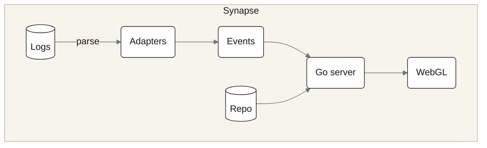
```mermaid
%%{init: {"theme": "base", "themeVariables": {"lineColor": "#6e7681", "edgeLabelBackground": "#f6f1e8", "textColor": "#15171A", "clusterBkg": "#F7F4EC", "clusterBorder": "#B9B5AA", "titleColor": "#15171A", "primaryColor": "#FFFFFF", "primaryBorderColor": "#15171A", "primaryTextColor": "#15171A"}}}%%
flowchart LR
    subgraph S["Synapse"]
    direction LR
    A[("Logs")] -->|parse| B("Adapters")
    B --> C("Events")
    C & D[("Repo")] --> E("Go server")
    E --> F("WebGL")
    end
    style S fill:#F7F4EC,stroke:#B9B5AA,color:#15171A
```

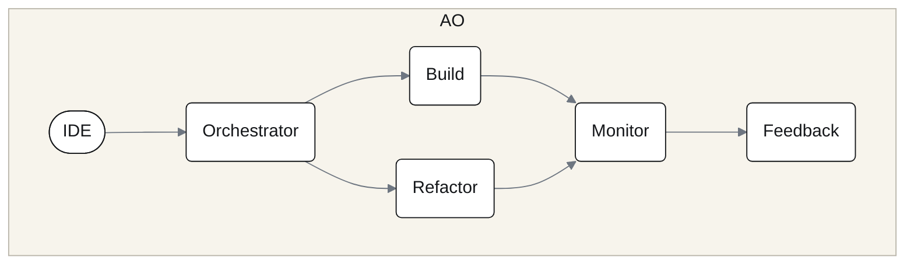
```mermaid
%%{init: {"theme": "base", "themeVariables": {"lineColor": "#6e7681", "edgeLabelBackground": "#f6f1e8", "textColor": "#15171A", "clusterBkg": "#F7F4EC", "clusterBorder": "#B9B5AA", "titleColor": "#15171A", "primaryColor": "#FFFFFF", "primaryBorderColor": "#15171A", "primaryTextColor": "#15171A"}}}%%
flowchart LR
    subgraph A["AO"]
    direction LR
    H(["IDE"]) --> O("Orchestrator")
    O --> S1("Build") & S2("Refactor")
    S1 & S2 --> C("Monitor")
    C --> F("Feedback")
    end
    style A fill:#F7F4EC,stroke:#B9B5AA,color:#15171A
```

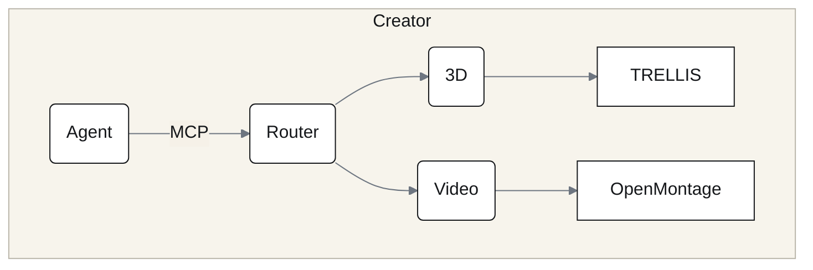
```mermaid
%%{init: {"theme": "base", "themeVariables": {"lineColor": "#6e7681", "edgeLabelBackground": "#f6f1e8", "textColor": "#15171A", "clusterBkg": "#F7F4EC", "clusterBorder": "#B9B5AA", "titleColor": "#15171A", "primaryColor": "#FFFFFF", "primaryBorderColor": "#15171A", "primaryTextColor": "#15171A"}}}%%
flowchart LR
    subgraph C["Creator"]
    direction LR
    A("Agent") -->|MCP| R("Router")
    R --> D("3D") & V("Video")
    D --> T["TRELLIS"]
    V --> O["OpenMontage"]
    end
    style C fill:#F7F4EC,stroke:#B9B5AA,color:#15171A
```

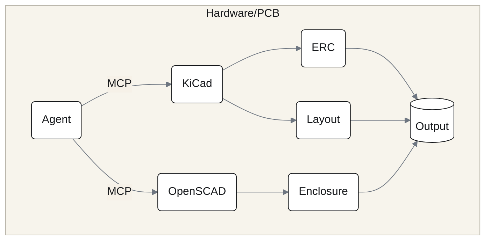
```mermaid
%%{init: {"theme": "base", "themeVariables": {"lineColor": "#6e7681", "edgeLabelBackground": "#f6f1e8", "textColor": "#15171A", "clusterBkg": "#F7F4EC", "clusterBorder": "#B9B5AA", "titleColor": "#15171A", "primaryColor": "#FFFFFF", "primaryBorderColor": "#15171A", "primaryTextColor": "#15171A"}}}%%
flowchart LR
    subgraph P["Hardware/PCB"]
    direction LR
    A("Agent") -->|MCP| K("KiCad") & O("OpenSCAD")
    K --> E("ERC") & L("Layout")
    O --> EN("Enclosure")
    E & L & EN --> F[("Output")]
    end
    style P fill:#F7F4EC,stroke:#B9B5AA,color:#15171A
```

</details>

### Heimdall Token Saver: compressão de output de CLI

`@hybridlabor-api/heimdall-token-saver`: comprime output repetido de CLI através de hooks ambiente em cada harness. Reduz o overhead de tokens em projetos grandes. Skill: `token-saver-config`.

### Otimização de tokens de um relance

| Alavanca | Como |
|---|---|
| Perfil mínimo | `--profile=minimal` salta hooks de injeção de contexto e módulos opcionais. |
| Sem hooks de contexto | `--no-hooks` mantém os gates e deixa de fora a injeção de memB, regras e trail. |
| Heimdall Token Saver | Comprime output repetido de CLI via hooks. |
| Sem modelo fixado | Os agentes herdam o modelo da sessão; overrides por papel vivem em `~/.aos/pipeline.json` ([docs/agent-models.md](docs/agent-models.md)). |
| Token-weather | A fleet band mostra quão cheio está o contexto e quando compactar. |

---

## Atualizar

**Update.** Correr o mesmo comando outra vez. O instalador vê a versão instalada, oferece **Quick Update** e refresca skills, hooks, templates e módulos:

```bash
npx -y @hybridlabor-api/aos@latest
```

**Sem subcomando `aos update`.** Se alguma vez correu `npm i -g @hybridlabor-api/aos`, um `aos` simples no PATH corre essa cópia congelada e a sua versão, não a mais recente; ou a atualiza (`npm i -g @hybridlabor-api/aos@latest`) ou remova-a e fique com `npx`. O instalador imprime o próprio comando de update sempre que existe uma versão mais recente; a skill `bdb-updater` embrulha a mesma verificação para uso dentro de uma sessão.

---

## Desinstalar

```bash
aos-uninstall              # remove o que o AOS instalou; memória, wikis e credenciais ficam
aos-uninstall --purge      # também remove ~/.MemBDB, ~/.openwiki, ~/.synapse, ~/.memb
aos-uninstall --dry-run    # listar tudo, apagar nada
```

**Como funciona.** O desinstalador trabalha a partir do manifest de instalação: um ficheiro que ainda corresponde ao hash que o AOS escreveu é removido, um ficheiro que você editou é guardado em backup, um ficheiro que o AOS nunca escreveu não é tocado. A mesma ação está no menu do instalador. `aos-uninstall --restore-plugin-backup` restaura as cópias soltas de skills que o instalador removeu ao registrar o plugin; ver [docs/plugin-migration.md](docs/plugin-migration.md). A desinstalação move as opções de instalação guardadas para `~/.aos/v5-settings.json.removed-<timestamp>` em vez de as apagar.

---

## FAQ

**Preciso dos nove harnesses?** Não. O instalador só escreve nos harnesses que deteta.

**Sobrescreve a minha configuração MCP?** Não. As entradas existentes são mantidas e o AOS faz merge das suas. `AOS_DISABLED_MCPS` mantém os servidores escolhidos fora.

**Posso instalar com contexto mínimo?** Sim: `--profile=minimal`, ou `--no-hooks`. O gate e os hooks de segurança ficam de qualquer forma.

**O GO gate funciona em todos os harnesses?** É um hook real no Claude Code, Antigravity, Codex e no plugin OpenCode. No Cursor, Windsurf, Roo / Cline e Aider aplica-se apenas a regra no `AGENTS.md`.

**Um agente pode aprovar o seu próprio push?** Não através do gate: apenas o seu GO digitado conta, não uma mensagem de agente, o retransmissor de um subagent ou uma mensagem A2A.

**O AOS funciona sem AO, memB ou OpenWiki?** Sim. Todos são módulos opcionais.

**Algo está avariado.** Correr `aos doctor`. Ele nomeia o que falta e sai com 1.

---

## Contribuir

- [AGENTS.md](AGENTS.md) é a fonte única de regras para todos os harnesses: o contrato de skills, o roteamento por categoria, o gate de release, Conventional Commits.
- Uma skill é um diretório com `SKILL.md`; o frontmatter precisa de `name` (igual ao diretório), `description` e `category`. O `npm run validate` impõe o contrato, como o CI faz em cada push.
- `npm test` corre o self-test do validador, a verificação do manifest de plugin e os testes do instalador, store, doctor e hooks entre harnesses.
- `.claude-plugin/plugin.json` e `marketplace.json` são gerados por `npm run plugin:build` e verificados por `npm run plugin:check`. Existem hoje; o caminho de instalação pelo marketplace do Claude Code ainda está a ser finalizado, por isso o instalador acima continua a ser o caminho suportado.
- Releases são cortados pelo release-please a partir de Conventional Commits; não bump o `package.json` à mão. `feat:` significa um bump minor.
- Skills derivadas de outros projetos registam `source:` no frontmatter e uma entrada em [THIRD_PARTY_NOTICES.md](THIRD_PARTY_NOTICES.md).

Encontrou um bug ou quer que se acrescente uma skill? [Abrir um issue](https://github.com/hybridlabor-api/aos/issues).

---

## Links

- Pacote: [npmjs.com/package/@hybridlabor-api/aos](https://www.npmjs.com/package/@hybridlabor-api/aos)
- Fonte e issues: [github.com/hybridlabor-api/aos](https://github.com/hybridlabor-api/aos) · [issues](https://github.com/hybridlabor-api/aos/issues)
- [CHANGELOG.md](CHANGELOG.md) · [docs/skills_table.md](docs/skills_table.md)
- Repositórios irmãos: [bdb-agent-orchestrator](https://github.com/hybridlabor-api/bdb-agent-orchestrator) · [bdb-synapse](https://github.com/hybridlabor-api/bdb-synapse) · [bdb-dev-creator-extension](https://github.com/hybridlabor-api/bdb-dev-creator-extension) · [bdb-hardware-pcb](https://github.com/hybridlabor-api/bdb-hardware-pcb) · [bdb-os-remote](https://github.com/hybridlabor-api/bdb-os-remote)

Licença: [Apache-2.0](LICENSE).
