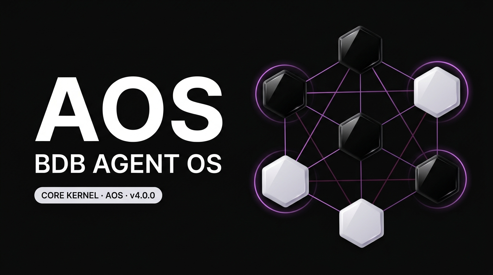
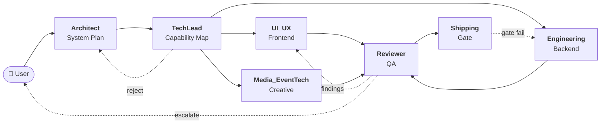
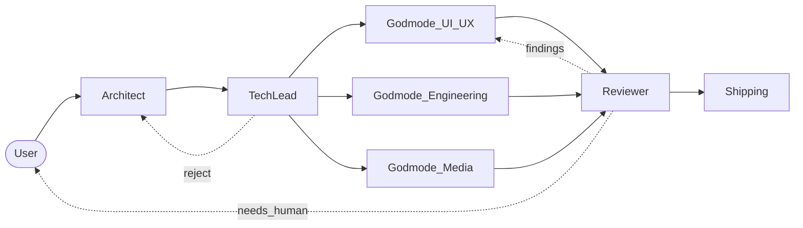
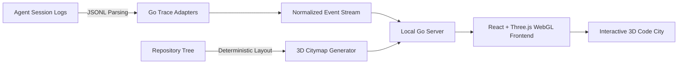
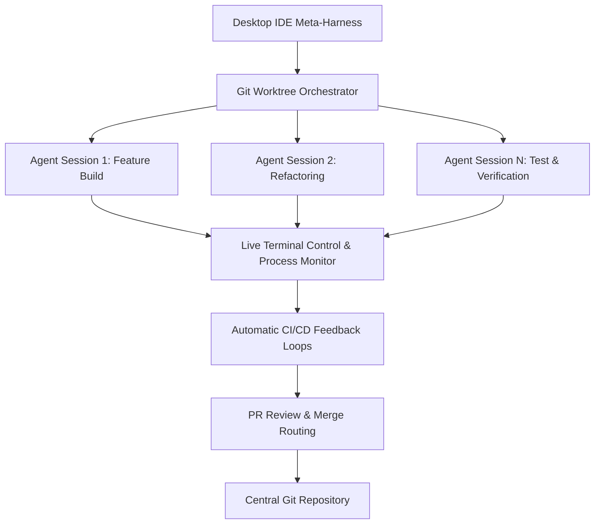
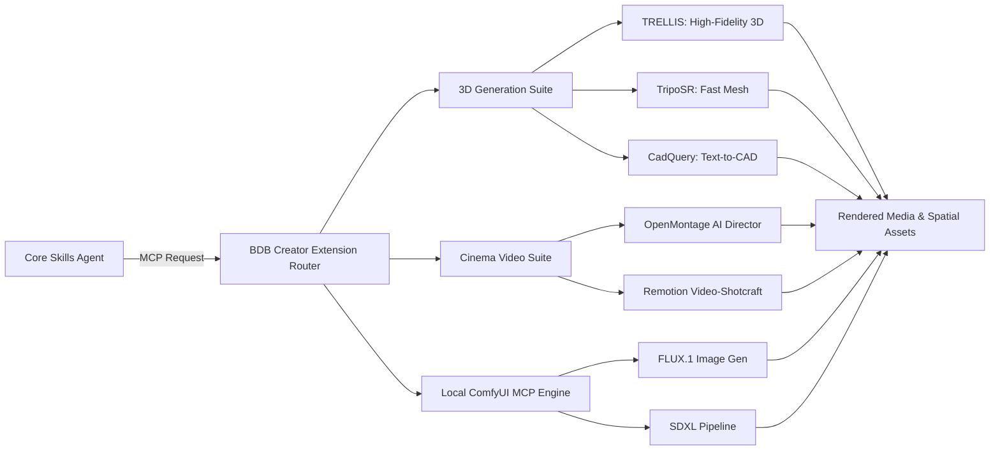
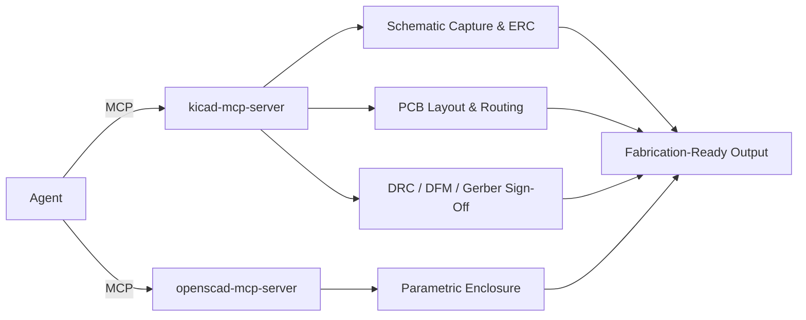
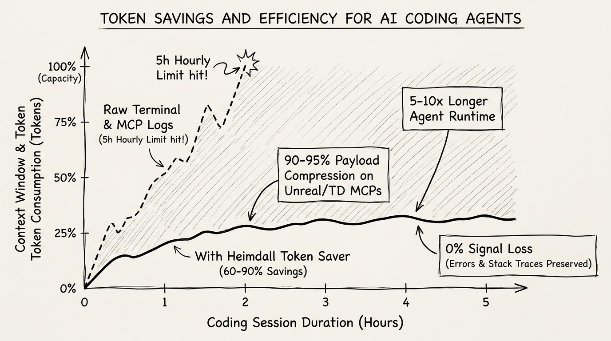

🌐 **Language / Sprache / Idioma**: [ 🇬🇧 English ](README.md) | [ 🇩🇪 Deutsch ](README.de.md) | **Português**

# AOS — BDB Agent OS

[](https://www.npmjs.com/package/@hybridlabor-api/aos)
[](https://www.npmjs.com/package/@hybridlabor-api/aos)
[](https://github.com/hybridlabor-api/aos/stargazers)
[](https://github.com/hybridlabor-api/aos/commits/main)
[](https://github.com/hybridlabor-api/aos/actions)
[](LICENSE)
[](package.json)
[](#skills)
[](#servidores-mcp)
[](#harnesses-suportados)
[](https://github.com/NVIDIA/SkillSpector)

AOS instala uma biblioteca de skills curada, um roster de subagentes, hooks de portão e um pipeline multi-agente executável em todos os harnesses de agentes de código da sua máquina.

```bash
npx -y @hybridlabor-api/aos@latest
```

Construído para pessoas que já executam **Claude Code, Google Antigravity, Codex CLI, OpenCode, Cursor, Windsurf, Roo Code / Cline ou Aider** e querem que todos eles se comportem da mesma forma.

Após a instalação, você tem:

- **<!-- count:skills -->214<!-- /count --> skills** em seis categorias, descobríveis por cada harness como `<name>/SKILL.md`.
- **<!-- count:agents -->13<!-- /count --> subagentes** (Architect, TechLead, Reviewer, os Godmodes, revisores de segurança e falhas silenciosas) compilados em cada formato nativo de agente do harness.
- **<!-- count:mcps -->21<!-- /count --> servidores MCP** para software criativo, controle de SO, memória e delegação entre harnesses.
- **Três pipelines** — `/startcycle`, `/startcycle-graph`, `/startcycle-graph-user` — e um **portão GO** que bloqueia mecanicamente `git push`, `npm publish`, `npm version` e `rm` recursivo.
- **Ferramentas:** Plan Canvas, agenttrail, archify, AOS Store, dashboard Launchpad e `aos doctor`.

---

## O Grafo do Dispatcher

O grafo é agnóstico quanto ao harness e roda no Dynamic Workflows do Claude Code, na execução paralela do Antigravity e em qualquer harness de agente compatível.


```mermaid
flowchart LR
    U(["👤 User"])
    A["<b>Architect</b><br/><span>System Plan</span>"]
    T["<b>TechLead</b><br/><span>Capability Map</span>"]
    UX["<b>UI_UX</b><br/><span>Frontend</span>"]
    EN["<b>Engineering</b><br/><span>Backend</span>"]
    ME["<b>Media_EventTech</b><br/><span>Creative</span>"]
    R["<b>Reviewer</b><br/><span>QA</span>"]
    S["<b>Shipping</b><br/><span>Gate</span>"]

    U --> A --> T
    T --> UX & EN & ME
    UX & EN & ME --> R
    R --> S

    T -.->|reject| A
    R -.->|findings| UX
    S -.->|gate fail| EN
    R -.->|escalate| U
```

---

## Instalar

Requisitos: Node.js >= 20. macOS, Linux e Windows (PowerShell).

```bash
npx -y @hybridlabor-api/aos@latest
```

**Primeira execução.** O instalador detecta quais harnesses estão presentes, pergunta quais são os alvos e qual camada (Pro MEDIA ou Basic), copia as skills em cada diretório de skills do harness, compila os subagentes, conecta os hooks, mescla a configuração MCP em cada arquivo de configuração próprio do harness (entradas existentes são mantidas) e oferece os módulos opcionais listados abaixo.

**Toda execução posterior** abre um menu:

| Item do menu | O que faz |
|---|---|
| Quick Update | Atualiza skills, templates, hooks e módulos instalados para a versão que você acabou de executar |
| Run System Checkup / Doctor | Executa `aos doctor`: dependências, posicionamento de arquivos, daemons, hooks |
| Drop Local Project Harness | Copia o contrato do dispatcher para o diretório atual (veja abaixo) |
| Reconfigure System | Muda alvos, camada ou opções |
| Uninstall AOS | Remove o que o instalador colocou; seus dados permanecem |

### Não-interativo

```bash
npx -y @hybridlabor-api/aos@latest -y --platforms=2          # Claude only, all defaults
npx -y @hybridlabor-api/aos@latest -y --platforms=1,5 --mcps=none
npx -y @hybridlabor-api/aos@latest --dry-run                 # print what would change
```

`--platforms=` valores: `0` universal (todos detectados), `1` Antigravity, `2` Claude Desktop / Claude Code, `3` Cursor, `5` Codex CLI, `6` Windsurf, `7` Roo Code / Cline, `8` Aider, `10` AOS CLI. `4` (caminhos personalizados) precisa do menu interativo. `--mcps=<name,name>|all|none` escolhe o subconjunto de MCP. `--verbose` e `--no-intro` fazem o que dizem.

### Harness local do projeto

Em vez de instalar em `$HOME`, solte apenas o contrato do dispatcher (`.agents/`, os hooks do portão, as definições de agentes, o workflow `/startcycle-graph`, o plugin OpenCode) em um repositório:

```bash
cd your-project && npx -y @hybridlabor-api/aos@latest --project-harness -y
```

---

## Harnesses suportados

O que o instalador escreve para cada alvo. Os caminhos são os padrões; o instalador apenas escreve em harnesses que realmente detecta.

| Harness | Skills | Subagentes | Hooks | Plugin / regras |
|---|---|---|---|---|
| Claude Code / Claude Desktop | `~/.claude/skills` | `~/.claude/agents` | `~/.claude/hooks` + `settings.json` (portão GO, portão de grafo, proteção de arquivo de env, Conventional Commits, injeção memB, retransmissão de trail) | manifesto `.claude-plugin/` enviado no repo (veja Contributing) |
| Google Antigravity | `~/.gemini/config/skills` | `~/.gemini/config/agents` | `~/.gemini/config/hooks.json` e `~/.gemini/antigravity-cli/hooks.json` | — |
| Codex CLI | `~/.codex/skills` | `~/.codex/agents` | `~/.codex/hooks` + `config.toml` | `.codex-plugin/` |
| OpenCode | `~/.config/opencode/skills` | `~/.opencode/agents` | via plugin | plugin `bdb-aos.js` + comando `/startcycle-graph`, registrado em `opencode.jsonc`; mantém uma execução `/startcycle-graph` em movimento em `session.idle` |
| Cursor | `~/.cursor/skills` | — | — | `.cursor/rules` (projeto) |
| Windsurf | `~/.windsurf/bdb-skills` | — | — | `mcp.json` |
| Roo Code / Cline | `~/.roo/skills` | — | — | `.roomodes` (projeto) |
| Aider | `~/.aider/bdb-skills` | — | — | — |
| AOS CLI (`pi`) | lê `~/.agents/skills` | `~/.agents/AGENTS.md` como prompt do sistema | — | sem MCP; instalação separada, Node >= 22.19 — veja [packages/aos-cli](packages/aos-cli/README.md) |

Toda instalação também escreve a cópia universal em `~/.agents/skills`, que é o que a CLI AOS e a CLI `skills` leem.

---

## Os pipelines

O contrato vive em [`.agents/graph.md`](.agents/graph.md), o roster de nós em [`.agents/nodes.json`](.agents/nodes.json), o dispatcher executável em [`.claude/workflows/startcycle-dispatch.mjs`](.claude/workflows/startcycle-dispatch.mjs).

**Uma regra: os nós nunca se invocam.** Um dispatcher lê `production_artifacts/state.json` após cada nó retornar e decide o que executa a seguir. Não há cadeia de repasse e nenhum agente dizendo a outro agente para prosseguir. Este design garante fidelidade de contexto, auditabilidade em um único local da lógica de roteamento e portabilidade entre harnesses.

Cada nó lê o plano e seu estado anterior, executa seu trabalho, escreve seu artefato e fragmentos de estado, e retorna. O dispatcher mescla fragmentos de estado por nó (`state.d/<node>.json`), avalia predicados de borda e roteia para o próximo nó — ou escala para o usuário se uma guarda de falta de progresso dispara (mesmo achado bloqueador no segundo ciclo de reparo) ou o teto de iteração é atingido.


```mermaid
flowchart LR
    U(["User"]) --> A["Architect"] --> T["TechLead"]
    T --> UX["Godmode_UI_UX"] & EN["Godmode_Engineering"] & ME["Godmode_Media"]
    UX & EN & ME --> R["Reviewer"] --> S["Shipping"]
    T -.->|reject| A
    R -.->|findings| UX
    R -.->|needs_human| U
```

| Comando | Mecanismo | Use quando |
|---|---|---|
| `/startcycle` | Cadeia linear, repasses de arquivo em `production_artifacts/`. Nenhuma máquina de estado, nenhum loop de reparo. `/startcycle --skill=<name> <goal>` força uma skill em cada nó. | Uma compilação direta com o roster de agentes mas sem a cerimônia. |
| `/startcycle-graph` | O grafo completo: `state.json` durável, loop de reparo do Reviewer, portão de qualidade automatizado, escalonamento para humanos. | Trabalho de feature onde a correção importa mais que velocidade e você quer um rastro de auditoria. |
| `/startcycle-graph-user` | Fan-out de 2–4 nós descartáveis. Nada persistente. Modelo em camadas por função; usa Antigravity, OpenCode ou Codex se instalado, subagentes Claude Code caso contrário. | Um "spawn de alguns workers" único em qualquer projeto. |

O que mantém o grafo completo honesto:

| Mecanismo | O que previne |
|---|---|
| Isolamento do Reviewer | O Reviewer lê artefatos e o contrato do plano, nunca o raciocínio do nó de compilação ou sua alegação de que está pronto. |
| Guarda de falta de progresso | Um ciclo de reparo que relata o mesmo ID de achado bloqueador da anterior escala para um humano em vez de queimar iterações. |
| Fragmentos de estado por nó | Nós de compilação paralelos escrevem `state.d/<node>.json`; o dispatcher mescla. Sem corrida de atualização perdida em um arquivo. |
| Teto de iteração | `max_iterations` (padrão 3) para o loop incondicionalmente. |
| Borda humana no-loop | Qualquer nó pode definir `needs_human: true` e parar a execução. |

## O portão GO

Alcançar `ready_to_ship` não é enviar. [`.claude/hooks/go-gate.mjs`](.claude/hooks/go-gate.mjs) é um hook `PreToolUse` que bloqueia `git push`, `npm publish`, `npm version` e `rm` recursivo a menos que sua mensagem imediatamente anterior seja a palavra literal **GO**. É um hook, não uma regra que um agente é convidado a respeitar: dispara antes de qualquer verificação de modo de permissão e não pode ser contornado. O instalador conecta o mesmo portão em Antigravity, Codex e OpenCode; em harnesses sem suporte a hook, a regra em [AGENTS.md](AGENTS.md) se aplica e o agente é a execução. Um subagente nunca herda o GO de seu orquestrador, e um comando de lançamento que falha precisa de um novo GO.

---

## Ferramentas


*Visão conceitual da v3.4.0. Os componentes cresceram desde então; as seções abaixo estão atualizadas.*

| Ferramenta | Comando | O que faz |
|---|---|---|
| Plan Canvas | `aos-plan-canvas open <file>` (skill `plan-canvas`) | Abre um plano ou artefato HTML em um canvas de navegador local onde você anota elementos, conversa e aprova ou solicita mudanças. Planos dos pipelines abrem aqui por padrão. |
| agenttrail | `aos-trail` (skill `agenttrail`, porta 5330) | Quadro ao vivo de uma compilação multi-agente: qual componente, qual agente ou harness, o que está pronto, o que está preso. Alimentado pelos hooks trail-relay e por `mcsc`. |
| archify | `aos-archify` (skill `archify`) | Arquitetura validada, sequência, fluxo de dados e diagramas de estado como HTML autossuficiente com exportação SVG; aceita Mermaid. |
| AOS Store | `aos store list \| search <q> \| install <name> [--project]`, `aos store ui` (também `aos-store`, comando slash `/aos-store`) | Procure e instale skills e agentes do AOS Core, do ECC e do Scenario (scenario-labs/skills, MIT); as skills necessárias são instaladas juntas e cada arquivo é verificado por SHA-256. A interface web em `http://127.0.0.1:4322` mostra o que está instalado, visualiza o exato caminho de alvo e instala apenas após você confirmar. Skills multi-arquivo são instaladas completamente. `list` e `search` leem um índice fixo offline. |
| Launchpad | `aos-dashboard [--port 7900] [--no-open]` | Uma página com todos os serviços BDB locais (memB, Synapse, OpenWiki, AO, Remote, AOS Store): status, iniciar/parar, logs. Registrado como entrada de inicialização automática. |
| Doctor | `aos doctor [--json] [--net]` (também `aos-doctor`) | Verifica dependências, posicionamento de skills por harness, daemons, hooks e módulos; sai com 1 quando algo precisa de atenção. A primeira coisa a executar quando algo se comporta mal. |
| Config | `aos-config show \| propose \| set <key> <value>` | Nível de máquina `~/.agents/aos-config.json`: raiz do workspace, domínios, id do usuário. |
| mcsc | Ferramentas MCP `delegate_agy`, `delegate_opencode`, `delegate_codex`, `delegate_smart` (skill `mcsc`) | Delega uma tarefa a outro harness CLI instalado e transmite suas chamadas de ferramenta para agenttrail. Preferido sobre shell out para a CLI. |

---

## AOS CLI

Um harness CLI leve construído em [pi](https://github.com/earendil-works/pi), um agente de codificação que roda no terminal. AOS CLI lê `~/.agents/skills` (escrito pelo instalador) e `~/.agents/AGENTS.md` (o grafo do dispatcher como instruções do sistema), não roda servidores MCP próprios e precisa de **Node >= 22.19** (piso do pi, mais alto do que o instalador AOS principal).

```bash
aos-cli "what is the fastest way to fix this bug"
aos-cli --continue                    # resume the previous session
```

O launcher da CLI (`packages/aos-cli/bin/aos-cli.mjs`) vem com um tema escuro AOS (`aos.json`), as dez skills principais de `core-skills.json` (ask-tim, aos-setup, systematic-debugging, archify, etc.) e dois comandos apenas leitura em sessão (`/aos` mostra o menu de instalação; `/aos-status` roda a verificação de saúde).

Instale através do instalador AOS com o alvo AOS CLI: `npx -y @hybridlabor-api/aos@latest -y --platforms=10`. O pacote é privado e não é publicado no npm, então `npm i -g @hybridlabor-api/aos-cli` não funciona.


---

## Plugins e Marketplace

**Manifesto do plugin:** `.claude-plugin/plugin.json` + `marketplace.json` (gerado por `npm run plugin:build`). O caminho de instalação do marketplace Claude está sendo finalizado; por enquanto, o instalador npm acima é a rota de instalação suportada.

**Descoberta de skills:** Todo harness encontra skills em seu diretório nativo (`~/.claude/skills`, `~/.agents/skills`, `~/.codex/skills`, `~/.roo/skills`, etc.). Para procurar e instalar skills adicionais após a instalação:

```bash
npx skills add hybridlabor-api/aos
```

Isto descobre todas as <!-- count:skills -->214<!-- /count --> skills curadas e as instala no diretório universal `~/.agents/skills` (usado por todos os harnesses e o AOS CLI).

---

## Memória e conhecimento

Instalado como módulos opcionais pelo instalador; `aos doctor` os verifica e o Launchpad os mostra.

- **memB** (`@hybridlabor-api/memb`) — memória vetorial local, offline com servidor MCP (`add_memory`, `search_memory`, `list_memories`, `delete_memory`), WebUI na porta 8088 e hook ambiente que injeta memórias relevantes em sessões Claude Code. Skills: `memb-skill`, `memb-ingest`, `bdb-memb-mcp`.
- **deja** (`@vshulcz/deja-vu`, instalado com memB) — indexa seus transcritos de agentes localmente com segredos redatados; `deja fix` em um erro, `deja wip` ao retomar, `deja search` para sessões passadas. Skill: `deja-memory`.
- **OpenWiki** (CLI `openwiki`) — gera e atualiza uma wiki fundamentada de uma base de código, com um visualizador na porta 4321 e um daemon de fundo. Skill: `openwiki-skill`; a própria wiki deste repo está sob [`.openwiki/`](.openwiki/quickstart.md).
- **Synapse** (`@hybridlabor-api/bdb-synapse`) — renderiza um repositório como uma cidade de código 3D e repassa sessões de agentes através dela. Skill: `synapse-integration-skill`.

`aos-setup` leva uma máquina a um estado verificado para os quatro; `aos-project-init` vincula um projeto a eles (slug, wiki, memória, `AGENTS.md`).

---

## O que está incluído

### Os <!-- count:agents -->13<!-- /count --> Subagentes

O grafo do dispatcher compila estes agentes, disponíveis como subagentes Claude Code e carregáveis em Antigravity, Cursor, Codex, OpenCode e outros:

| Agente | Propósito |
|---|---|
| **Architect** | Transforma o objetivo do usuário em um plano de sistema. Lê a arquitetura existente antes de propor mudanças. |
| **TechLead** | Revisa o plano para um mapa de capacidade (limites de módulo, direção de dependência, ordem de compilação) antes de qualquer nó de compilação iniciar. Aprova ou rejeita de volta para Architect. |
| **UI_UX** | Designer de Frontend Líder. Impõe princípios Anti-Slop, tokens DTCG, gosto frontend de alta agência e dinâmica de movimento fluido. |
| **Engineering** | Engenheiro Senior Fullstack & Backend. Impõe Domain-Driven Design, Clean Architecture, ciclos TDD e melhores práticas de banco de dados. |
| **Media_EventTech** | Especialista em Creative-Tech & Show-Control. Governa modelagem 3D, redes TouchDesigner, DaVinci Resolve, iluminação e Resolume. |
| **Reviewer** | Revisão adversária da saída do nó de compilação contra o contrato do plano. Modelado na disciplina doubt-driven-development. |
| **Shipping** | Gatekeeper de Liberação & Auditor de QA. Roda o portão de qualidade automatizado (lint, typecheck, testes, a11y, seo) e impõe o portão GO. |
| **Database Reviewer** | Especialista PostgreSQL para otimização de consulta, design de schema, segurança e performance. |
| **Security Reviewer** | Detecção e remediação de vulnerabilidades de segurança. Marca segredos, SSRF, injeção, criptografia insegura e OWASP Top 10. |
| **Silent-Failure Hunter** | Revisa código para falhas silenciosas, erros engolidos, fallbacks ruins e propagação de erro ausente. |
| **Go-Build Resolver** | Resolve erro de build de Go, vet e compilação com mudanças mínimas. |
| **Opensource Forker** | Faz fork de um projeto para open-sourcing — remove segredos, substitui referências internas, gera `.env.example`. |
| **Opensource Sanitizer** | Verifica se um fork de open-source está totalmente sanitizado. Escaneia segredos vazados, PII, referências internas. |

### Skills por Categoria

<!-- count:skills -->214<!-- /count --> skills curadas, descobríveis por todo harness:

- **bdb-core** (31 skills): Infraestrutura AOS principal, pipelines, ferramentas e utilidades — `startcycle`, `startcycle-graph`, `startcycle-graph-user`, `agent-orchestrator`, `agenttrail`, `plan-canvas`, `aos-doctor`, `aos-store`, `bdb-dev-os-skill` e mais.
- **design-ui-ux** (19 skills): Frontend, design UI, acessibilidade, tokens, movimento, anti-slop — `senior-frontend`, `ui-component`, `ui-review`, `tailwind-patterns`, `shadcn`, `wcag-audit-patterns` e mais.
- **engineering-method** (46 skills): Arquitetura, testes, debugging, CI/CD, qualidade de código — `software-architecture`, `test-driven-development`, `systematic-debugging`, `ci-pipeline`, `github-actions-generator`, `dockerfile-validator` e mais.
- **library** (98 skills): Especificidades de linguagem/framework — TypeScript, Node.js, Python, React, Postgres, Prisma, Next.js, Drizzle ORM, Go e mais.
- **media-eventtech** (19 skills): 3D, vídeo, controle de shows, design espacial — `godmode-eventtech`, `synapse-integration-skill`, `threejs-skills`, `blender-expert` e mais.
- **engineering-hardware** (1 skill): Design de PCB e elétrico — `godmode-hardware-pcb`.

O catálogo completo com descrições detalhadas: [docs/skills_table.md](docs/skills_table.md) — nota: este arquivo está desatualizado e lista 164 de 214 skills.

---

## Skills

<!-- count:skills -->214<!-- /count --> skills, curadas de coleções de código aberto e proprietárias, cobrindo o pipeline completo de desenvolvimento de software e criativo. Cada skill é um diretório com um `SKILL.md` frontmatter declarando `name`, `description` e uma `category`: `bdb-core`, `design-ui-ux`, `engineering-method`, `engineering-hardware`, `media-eventtech`, `library`.

**Camada de Persona:** As skills **Godmode** são personas especializadas que mapeiam diretamente para os nós de compilação e envio do grafo do dispatcher:

| Godmode | Possui | Mapeia para |
|---|---|---|
| `godmode-engineering` | Domain-Driven Design, Clean Architecture, TypeScript/Python rigoroso, debugging sistemático, melhores práticas de banco de dados. | Nó **Engineering** |
| `godmode-ui-ux` | Princípios frontend anti-slop, tokens DTCG, dinâmica de movimento, acessibilidade (WCAG), gosto de alta agência. | Nó **UI_UX** |
| `godmode-shipping` | Verificações pré-lançamento, portões de qualidade automatizados, procedimentos de rollback seguro, execução do portão Go. | Nó **Shipping** |
| `godmode-eventtech` | Controle de shows, fluxo de sinal, iluminação DMX, redes TouchDesigner, servidores de mídia Resolume, hardware de evento ao vivo. | Nó **Media_EventTech** |
| `godmode-3d-creation` | Geração 3D first-MCP, reconstrução de malha, CAD paramétrico, modelagem espacial. | Especialista opcional |
| `godmode-media-creation` | Produção de vídeo, montagem de timeline, pipelines de design de movimento, OpenMontage, Remotion. | Especialista opcional |
| `godmode-hardware-pcb` | Esquemáticos elétricos, layout e roteamento de PCB, portão KiCad ERC/DRC/DFM, co-design de invólucro, OpenSCAD. | Especialista opcional |

**Pontos de Entrada & Navegação:**
- **`ask-tim`** — Recomendação de skill por descrição
- **`bdbrainstorm`** e **`bdbmediastorm`** — Sessões de ideação multi-agente terminando em um plano executável
- **`teamwork-preview`** — Elaboração de prompt, delegação de função, setup de colaboração
- **Família Grilling** — `grill-me` (auditoria geral), `grill-with-docs` (fundamentada em documentação), `triage` (priorização)
- **CI/CD & Geradores** — `ci-pipeline`, `github-actions-generator`, `dockerfile-generator`, `makefile-generator`
- **Qualidade de Código** — `bdb-security-audit`, `systematic-debugging`, `silent-failure-hunter`, `bdbresilience`
- **Especialistas de Framework** — Cobertura completa de TypeScript, React, Next.js, Drizzle ORM, Prisma, Python, Go e mais

O catálogo completo com descrições e detalhes: [docs/skills_table.md](docs/skills_table.md) (nota: atualmente lista 164 de 214).

A biblioteca também é legível pela CLI `skills`:

```bash
npx skills add hybridlabor-api/aos
```

---

## Servidores MCP

[`mcp_config.json`](mcp_config.json) define <!-- count:mcps -->21<!-- /count --> servidores, construídos ou aquecidos pelo instalador de `mcps/` e mesclados em cada configuração MCP do harness. Cada servidor expõe ferramentas para um domínio específico; todo harness vê o mesmo conjunto, evitando incompatibilidades por ferramenta.

**Integrações de software criativo** (pares primário e fallback para redundância):
- **Unreal Engine** — `bdb_unreal_mcp` (Web Remote Control API na porta 30010), skill: `bdb-unreal-mcp`
- **Rhino 3D & Grasshopper** — `bdb_rhino_mcp` (roteador Yak de McNeel) + `bdb_rhino_mcp_fallback` (GOLEM 3D, 105 ferramentas), skill: `bdb-rhino-mcp`
- **DaVinci Resolve** — `bdb_davinci_mcp` (scripts de workspace, 162 ferramentas) + `bdb_davinci_mcp_studio` (Node.js para Studio) + `bdb_davinci_mcp_fallback`, skill: `bdb-davinci-mcp`
- **Blender** — `bdb_blender_mcp` (integração de socket) + `bdb_blender_mcp_fallback`, skill: `bdb-blender-mcp`
- **After Effects** — `bdb_after_effects_mcp` + `bdb_after_effects_mcp_fallback`, skill: `bdb-after-effects-mcp`
- **TouchDesigner** — `bdb_touchdesigner_mcp` (ponte MindDesigner na porta 9980) + `bdb_touchdesigner_mcp_fallback`, skill: `bdb-touchdesigner-mcp`
- **Adicional:** grandMA3 (OSC/UDP na porta 8000), Resolume (REST API na porta 8080), Vectorworks (RAG semântico na porta 8765), ponte Adobe UXP, Open Design

**Controle de SO & automação de sistema:**
- **macOS/Linux** — `zavora_computer_use` (binário NAPI Rust nativo, sem compilação em tempo de execução), skill: `bdb-computer-use-mcp`
- **Windows** — `bdb_windows_computer_use` (Win32 / COM / UIAutomation, OCR local com Tesseract)

**Memória, delegação & infraestrutura:**
- **memB** — `memb_mcp` (memória vetorial offline local, SQLite + modelo ONNX)
- **deja** — indexação local de transcrito (segredos redatados)
- **mcsc** — delegação de tarefa multi-harness
- **GitHub** — ferramentas MCP nativas para issues, PRs, workflows
- **Chrome DevTools** — automação de navegador & debugging
- **RemoteOS** — gateway de execução multi-nuvem com mecanismo de aprovação 4-olhos

---

## Módulos opcionais

O instalador oferece esses módulos na seleção, e o Quick Update os mantém atualizados. Todos são opcionais; AOS funciona autossuficiente sem nenhum deles.

### memB — Memória Vetorial Local

`@hybridlabor-api/memb`: memória vetorial offline, local com servidor MCP, WebUI na porta 8088 e hook ambiente que injeta memórias relevantes em sessões Claude Code. Skill: `memb-skill`, `memb-ingest`, `bdb-memb-mcp`.

### deja — Indexação de Transcrito

`@vshulcz/deja-vu`: indexa seus transcritos de agentes localmente (segredos redatados), com `deja fix` em um erro, `deja wip` para retomar, `deja search` para sessões passadas. Instalado com memB. Skill: `deja-memory`.

### OpenWiki — Documentação Viva

CLI `openwiki`: gera e atualiza uma wiki fundamentada de uma base de código, com um visualizador na porta 4321 e um daemon de fundo. Skill: `openwiki-skill`. Wiki deste repo: [.openwiki/](.openwiki/quickstart.md).

### Synapse — Cidade de Código 3D

`@hybridlabor-api/bdb-synapse`: renderiza um repositório como uma cidade de código 3D e repassa sessões de agentes como rastros de luz. Skill: `synapse-integration-skill`.


```mermaid
flowchart LR
    A[Agent Session Logs] -->|JSONL Parsing| B[Go Trace Adapters]
    B --> C[Normalized Event Stream]
    D[Repository Tree] -->|Deterministic Layout| E[3D Citymap Generator]
    C & E --> F[Local Go Server]
    F --> G[React + Three.js WebGL Frontend]
    G --> H[Interactive 3D Code City]
```

### AO — Orquestrador de Agente

`@hybridlabor-api/bdb-agent-orchestrator`: agentes paralelos em Git worktrees com controle de terminal ao vivo e loops de feedback CI/CD automatizados. Skill: `agent-orchestrator`.


```mermaid
flowchart TD
    A[Desktop IDE Meta-Harness] --> B[Git Worktree Orchestrator]
    B --> C[Agent Session 1: Feature Build]
    B --> D[Agent Session 2: Refactoring]
    B --> E[Agent Session N: Test & Verification]
    C --> F[Live Terminal Control & Process Monitor]
    D --> F
    E --> F
    F --> G[Automatic CI/CD Feedback Loops]
    G --> H[PR Review & Merge Routing]
    H --> I[Central Git Repository]
```

### Creator Extension — Mídia & 3D

`@hybridlabor-api/bdb-dev-creator-extension`: capacidades ComfyUI MCP (FLUX, SDXL), image-to-3D (TripoSR, TRELLIS) e produção de vídeo automatizada (OpenMontage, Remotion). Skill: `bdb-dev-creator-extension`.


```mermaid
flowchart LR
    A[Core Skills Agent] -->|MCP Request| B[BDB Creator Extension Router]
    B --> C[3D Generation Suite]
    B --> D[Cinema Video Suite]
    B --> E[Local ComfyUI MCP Engine]
    C --> C1[TRELLIS: High-Fidelity 3D]
    C --> C2[TripoSR: Fast Mesh]
    C --> C3[CadQuery: Text-to-CAD]
    D --> D1[OpenMontage AI Director]
    D --> D2[Remotion Video-Shotcraft]
    E --> E1[FLUX.1 Image Gen]
    E --> E2[SDXL Pipeline]
    C1 & C2 & C3 & D1 & D2 & E1 & E2 --> F[Rendered Media & Spatial Assets]
```

### Hardware & PCB — Design Elétrico

`@hybridlabor-api/bdb-hardware-pcb`: módulo de design KiCad e OpenSCAD, orientado por skill `godmode-hardware-pcb`. Expõe portão ERC/DRC, assinatura de gerber e design paramétrico de invólucro. Skills: `godmode-hardware-pcb`, `bdb-hardware-pcb`.


```mermaid
flowchart LR
    A[Agent] -->|MCP| B[kicad-mcp-server]
    A -->|MCP| C[openscad-mcp-server]
    B --> D[Schematic Capture & ERC]
    B --> E[PCB Layout & Routing]
    B --> F[DRC / DFM / Gerber Sign-Off]
    C --> G[Parametric Enclosure]
    D & E & F & G --> H[Fabrication-Ready Output]
```

### Heimdall Token Saver — Compressão de Saída CLI

`@hybridlabor-api/heimdall-token-saver`: comprime saída CLI repetida via hooks ambiente em todo harness. Reduz sobrecarga de token em projetos grandes. Skill: `token-saver-config`.



*Esboço ilustrativo da v3.x. Os percentuais são estimativas do próprio projeto, não medições feitas para este README.*

---

## Atualizando

Execute o mesmo comando novamente. O instalador vê a versão instalada, oferece **Quick Update** e atualiza skills, hooks, templates e módulos:

```bash
npx -y @hybridlabor-api/aos@latest
```

Não há um subcomando `aos update`. Se você já executou `npm i -g @hybridlabor-api/aos` alguma vez, um simples `aos` no seu PATH executa essa cópia congelada e sua versão, não a mais recente; ou atualize (`npm i -g @hybridlabor-api/aos@latest`) ou remova e fique com `npx`. O instalador imprime o comando de atualização em si sempre que uma versão mais recente existe; a skill `bdb-updater` envolve a mesma verificação para uso dentro de uma sessão.

## Desinstalar

```bash
aos-uninstall              # removes what AOS installed; memory, wikis and credentials stay
aos-uninstall --purge      # also removes ~/.MemBDB, ~/.openwiki, ~/.synapse, ~/.memb
aos-uninstall --dry-run    # list everything, delete nothing
```

O desinstalador funciona a partir do manifesto de instalação: um arquivo que ainda corresponde ao hash que AOS escreveu é removido, um arquivo que você editou é salvo como backup, um arquivo que AOS nunca escreveu não é tocado. A mesma ação está no menu do instalador.

---

## Contribuindo

- [AGENTS.md](AGENTS.md) é a única fonte de regras para cada harness: o contrato de skill, roteamento de categoria, o portão de lançamento, Conventional Commits.
- Uma skill é um diretório com `SKILL.md`; o frontmatter precisa de `name` (igual ao diretório), `description` e uma `category`: `bdb-core`, `design-ui-ux`, `engineering-method`, `engineering-hardware`, `media-eventtech`, `library`. `npm run validate` executa o contrato, assim como CI em cada push.
- `npm test` executa o self-test do validador, verificação do manifesto plugin e testes do instalador, store, doctor e hooks entre harnesses.
- `.claude-plugin/plugin.json` e `marketplace.json` são gerados por `npm run plugin:build` e verificados por `npm run plugin:check`. Existem hoje; o caminho de instalação do marketplace Claude Code ainda está sendo finalizado, então o instalador acima permanece a rota suportada.
- Releases são cortadas pelo release-please de Conventional Commits; não bump `package.json` manualmente. `feat:` significa um bump menor.
- Skills derivadas de outros projetos registram `source:` no frontmatter e uma entrada em [THIRD_PARTY_NOTICES.md](THIRD_PARTY_NOTICES.md).

## Links

- Pacote: [npmjs.com/package/@hybridlabor-api/aos](https://www.npmjs.com/package/@hybridlabor-api/aos)
- Fonte e issues: [github.com/hybridlabor-api/aos](https://github.com/hybridlabor-api/aos) · [issues](https://github.com/hybridlabor-api/aos/issues)
- [CHANGELOG.md](CHANGELOG.md) · [docs/skills_table.md](docs/skills_table.md)
- Repos irmãos: [bdb-agent-orchestrator](https://github.com/hybridlabor-api/bdb-agent-orchestrator) · [bdb-synapse](https://github.com/hybridlabor-api/bdb-synapse) · [bdb-dev-creator-extension](https://github.com/hybridlabor-api/bdb-dev-creator-extension) · [bdb-hardware-pcb](https://github.com/hybridlabor-api/bdb-hardware-pcb) · [bdb-os-remote](https://github.com/hybridlabor-api/bdb-os-remote)

Licença: [Apache-2.0](LICENSE).
