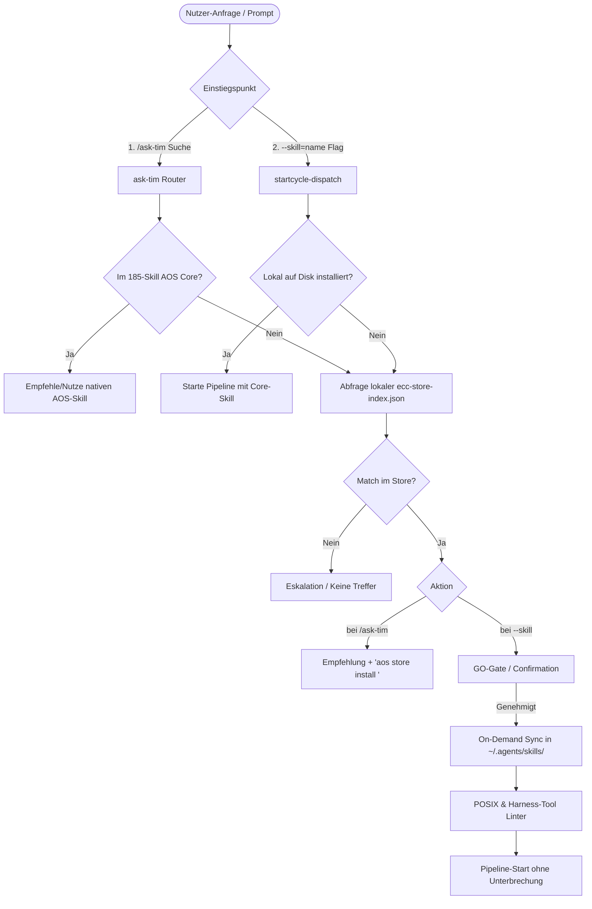

# Audit Brief: AOS Skill, Subagent & Extras Store (ECC Fork Integration)

**Datum:** 2026-09-24  
**Projekt:** `@hybridlabor-api/aos` (AOS — Curated AI Agent OS)  
**Dokumenttyp:** Architektur- & Sicherheits-Audit-Briefing für externe Reviewer- / Auditor-Agenten  
**Status:** Vor Implementierung (Architektur-Review)

---

## 1. Executive Summary & Zielsetzung

AOS (`@hybridlabor-api/aos`) ist ein multi-harness Agenten-Betriebssystem für autonome Coding-Pipelines (unterstützt Claude Code, Google Antigravity, Codex, Cursor, Roo Code und OpenCode). Aktuell liefert AOS ca. 185 kuratierte Kern-Skills und eine 7-Node-Graph-Architektur mit deterministischen Übergängen (Architect → TechLead → Build → Reviewer → Shipping).

### Geplante Erweiterung
Aufbau eines dezentralen **Skill-, Subagent- und Extras-Stores** als Fallback-Ebene auf Basis eines gepflegten Forks von **[affaan-m/ECC](https://github.com/affaan-m/ECC)** (Everything Claude Code, MIT-Lizenz):
1. **Fallback in `/ask-tim`:** Wenn ein Nutzer nach einer Domäne oder einem Framework sucht (z. B. Spring Boot, Godot, Django), das nicht im 185-Skill-Kern von AOS liegt, soll `/ask-tim` automatisch passende Erweiterungen aus dem Store vorschlagen.
2. **Fallback in `--skill=<name>`:** Bei Pipeline-Aufrufen wie `/startcycle-graph --skill=django-pro "Ziel"` soll ein lokal fehlender Skill nicht sofort hart mit einer Eskalation abbrechen, sondern im Store gesucht, validiert und on-demand geladen werden.
3. **Subagent & Extras Katalog:** Bereitstellung von spezialisierten Auxiliary Agents, Templates, Rules und Hooks aus dem ECC-Ökosystem als modulare AOS-Erweiterungen.

---

## 2. Aktueller Systembestand in AOS (Ist-Zustand)

### 2.1 Relevante Code- & Konfigurations-Pfade
- **Multi-Harness Installer:** [`installer.js`](file:///Users/timrennings/dev/bdb-dev/bdb-dev-optimized-agent-skills/installer.js) — Synchronisiert Skills, MCP-Configs und Agents nach `~/.claude/`, `~/.agents/`, `~/.codex/`, `~/.cursor/` etc.
- **Pipeline Dispatcher:** [`.claude/workflows/startcycle-dispatch.mjs`](file:///Users/timrennings/dev/bdb-dev/bdb-dev-optimized-agent-skills/.claude/workflows/startcycle-dispatch.mjs) — Verwaltet den Startcycle-Graph, GO-Gates, mandatory skills (`--skill=<name>`) und Agenten-Orchestrierung.
- **Skill Router:** [`skills/global_config/ask-tim/SKILL.md`](file:///Users/timrennings/dev/bdb-dev/bdb-dev-optimized-agent-skills/skills/global_config/ask-tim/SKILL.md) — Zentraler Einstiegspunkt für Intent-Erkennung und Skill-Auswahl.
- **Vendor Tracking:** [`~/.agents/vendor-manifest.json`](file:///Users/timrennings/.agents/vendor-manifest.json) — Pinned Git SHAs für Upstream-Repositories (z. B. `anti-slop`, `skylos`, `claude-red`).
- **Bereits portierte ECC-Komponenten:** [`THIRD_PARTY_NOTICES.md`](file:///Users/timrennings/dev/bdb-dev/bdb-dev-optimized-agent-skills/THIRD_PARTY_NOTICES.md) — 6 Auxiliary Agents (`silent-failure-hunter`, `security-reviewer`, `go-build-resolver`, `database-reviewer`, `opensource-forker`, `opensource-sanitizer`) und `plan-canvas`.

### 2.2 Bestehende `--skill` Validierungslogik (`startcycle-dispatch.mjs:701-741`)
```javascript
// Aktuelles Verhalten:
if (mandatorySkillNames.length > 0) {
  const skillCheckResult = await agent(`Check whether each of these skill names resolves to an installed skill...`);
  const missing = skillCheckResult?.missing ?? [];
  if (missing.length > 0) {
    // HARTES ESKALIEREN:
    return await escalate(`--skill named skill(s) that could not be found: ${missing.join(', ')}...`);
  }
}
```

---

## 3. Geplante Soll-Architektur



---

## 4. Kernfragen & Prüffelder für das Audit

Der Auditor-Agent wird gebeten, folgende kritische Fragestellungen strukturiert zu beleuchten:

### 1. GO-Gate & Sicherheit (Supply-Chain-Risiko)
* **Problem:** Dürfen externe Skills oder Agents während eines autonomen Pipeline-Laufs dynamisch aus einem Remote-Repository nachgeladen werden?
* **Audit-Frage:** Wie muss die Bestätigung strukturiert sein, damit die strikte AOS-Regel (*"read-only until literal GO"*) nicht kompromittiert wird? Genügt ein lokales, kryptografisch verifiziertes Manifest mit SHA-256 Checksummen?

### 2. Multi-Harness Tool-Inkompatibilitäten
* **Problem:** `affaan-m/ECC` ist primär für Claude Code konzipiert und verwendet teils hardcodierte Tool-Namen wie `Bash`, `View`, `Edit`, `GlobTool`.
* **Audit-Frage:** Welche automatisierten Transformations- oder Linter-Regeln müssen beim Ingest/Installationsschritt greifen, damit importierte Skills fehlerfrei in Google Antigravity (`run_command`, `view_file`), OpenAI Codex (`exec`, `read_file`) und Cursor funktionieren?

### 3. Context Window & Token-Budget
* **Problem:** Ein ungefilterter Import von 400+ Skills würde die Context-Limits und System-Prompts überlasten.
* **Audit-Frage:** Ist die gewählte Architektur mit einem leichtgewichtigen, lokalen Vektor- oder Metadaten-Index (`ecc-store-index.json` < 100 KB) optimal, und wie sollte das semantische Ranking bei ungenauen Begriffen erfolgen?

### 4. Namenskonflikte & Rangfolge (Precedence)
* **Problem:** Was passiert, wenn ein ECC-Skill denselben Namen trägt wie ein existierender oder zukünftiger AOS-Kern-Skill (z. B. `tailwind-patterns` oder `tdd-workflow`)?
* **Audit-Frage:** Sollte ein striktes Namespacing (`ecc/<skill-name>` oder Tagging `origin: ecc`) erzwungen werden, um Overwrites und Seiteneffekte auszuschließen?

### 5. Wartungs- und Sync-Strategie des Forks
* **Problem:** ECC wird kontinuierlich weiterentwickelt.
* **Audit-Frage:** Wie sieht eine nachhaltige GitHub-Action-Sync-Pipeline für den Fork `hybridlabor-api/ECC` aus, die neue Upstream-Releases verarbeitet, ohne manuell angepasste Harness-Kompatibilitäts-Fixes zu überschreiben?

---

## 5. Referenzierte Komponenten & Schnittstellen

| Komponente | Datei / Pfad | Relevante Zeilen / Kontext |
|---|---|---|
| **Pipeline-Dispatcher** | [`.claude/workflows/startcycle-dispatch.mjs`](file:///Users/timrennings/dev/bdb-dev/bdb-dev-optimized-agent-skills/.claude/workflows/startcycle-dispatch.mjs) | Z. 701–741 (Mandatory Skill Check & Eskalation) |
| **Skill Router** | [`skills/global_config/ask-tim/SKILL.md`](file:///Users/timrennings/dev/bdb-dev/bdb-dev-optimized-agent-skills/skills/global_config/ask-tim/SKILL.md) | Z. 1–70 (Main Flow & Intent Index) |
| **Vendor Registry** | [`~/.agents/vendor-manifest.json`](file:///Users/timrennings/.agents/vendor-manifest.json) | Vorhandene Pinned-Upstream-Repositories |
| **Lizenz- & Provenance** | [`THIRD_PARTY_NOTICES.md`](file:///Users/timrennings/dev/bdb-dev/bdb-dev-optimized-agent-skills/THIRD_PARTY_NOTICES.md) | Z. 12–50 (Bisheriger Port von ECC-Agents) |
| **AOS Installer & Sync** | [`installer.js`](file:///Users/timrennings/dev/bdb-dev/bdb-dev-optimized-agent-skills/installer.js) | Z. 110–135 (Multi-Platform Fan-out) |

---

## 6. Erwartetes Audit-Ergebnis

Der externe Auditor-Agent sollte am Ende einen Bericht mit folgendem Schema abliefern:
1. **Architektur-Bewertung:** Bestätigung oder Korrektur der vorgeschlagenen Store- und Fallback-Architektur.
2. **Identifizierte Risiken:** Kategorisiert nach *Blocker*, *Warnung*, *Empfehlung*.
3. **Konkrete Lösungsvorschläge:** Für Tool-Mapping, Token-Schonung und GO-Gate-Integration.
4. **Sign-Off / Freigabe-Empfehlung:** Für den Start der Implementierung von Phase 1.
