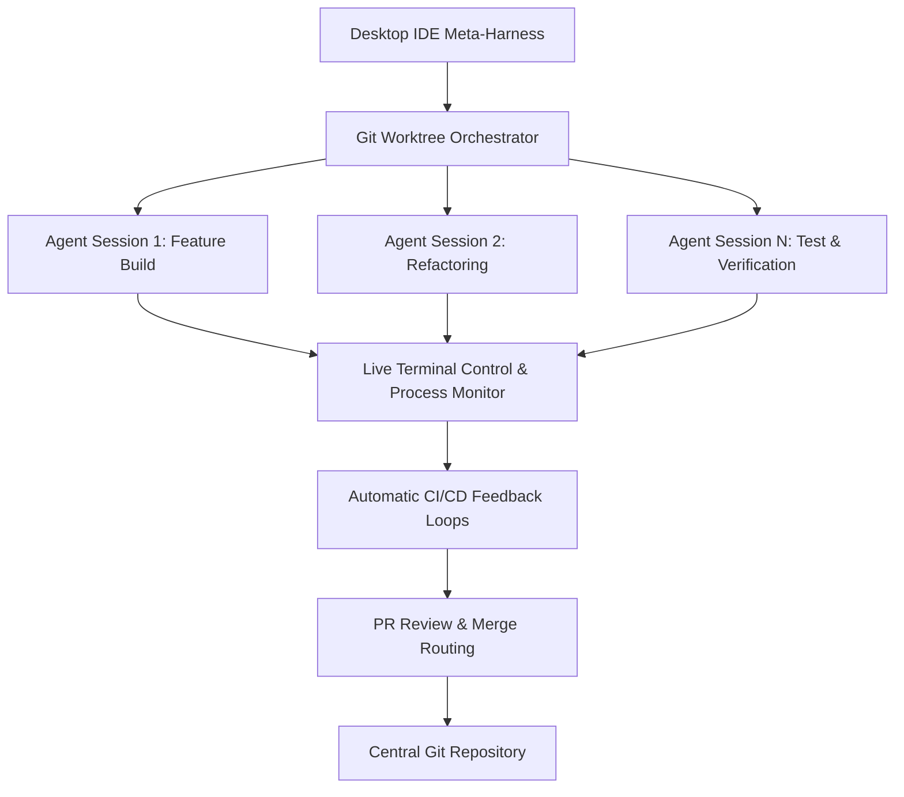
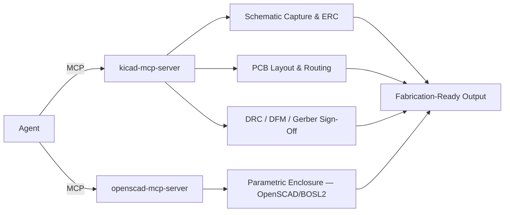

# README.md Update Plan

Prepared by the planning agent. Targeted section replacements against the
current 928-line `README.md` — not a ground-up rewrite. Every fact below was
verified against the repo, `installer.js`, `package.json`, and the standalone
`bdb-hardware-pcb` module repo (`~/dev/bdb-dev/bdb-hardware-pcb`) before being
written — nothing here is invented.

An execution agent should apply each numbered change to `README.md` by
locating the exact **Find** block and replacing it with the **Replace** block.
Apply in order; line numbers cited are from the README as read on 2026-09-15
and will drift after change 1, so match on text, not line number.

---

## What changed and why

1. **Version signal.** The README had zero version mentions (confirmed via
   grep) while carrying a hardcoded `AOS v4.0.0` in the intro sentence —
   stale against the shipped `4.4.2-beta.5` (`package.json`). Fixed by
   removing the hardcoded version from the *current-state* sentence (that
   number was never meant to be "current," it was the AOS-rename milestone)
   and adding one explicit, low-churn status line instead of hardcoding a
   beta patch number that will be stale again within hours.
2. **Hardware & PCB module — new.** Added as a 7th Godmode table row, a new
   Ecosystem Integrations bullet, and a full new section mirroring the
   existing Creator Extension / Synapse sections. Facts pulled directly from
   `~/dev/bdb-dev/bdb-hardware-pcb/{README.md,package.json,skills/*/SKILL.md}`:
   package `@hybridlabor-api/bdb-hardware-pcb`, 5 skills (all `category:
   engineering-hardware`), 2 MCP servers (`kicad-mcp-server`,
   `openscad-mcp-server`) exposing **55 tools** (47 KiCad + 8 OpenSCAD),
   supports KiCad 9 & 10, works on macOS/Linux/Windows, installs via the AOS
   optional-module picker (`installer.js`, module id `hardware`) or standalone
   via `npx @hybridlabor-api/bdb-hardware-pcb`. The `godmode-hardware-pcb`
   persona ships in **AOS core** (`skills/basic/godmode-hardware-pcb/`) —
   verified it is *not* duplicated in the module repo — while the 5 execution
   skills and both MCP servers live only in the optional module. This
   core/optional split is the same pattern AOS already uses for
   `godmode-3d-creation`/`godmode-media-creation` (core) vs. Creator Extension
   (optional heavy compute), so the new copy follows that precedent rather
   than inventing a new one.
3. **Factual bug found and fixed: the "BDB OS Agent Workspace" section
   points at an archived, broken repo.** `installer.js` (line ~3269) states
   in its own comment that the predecessor package
   `@hybridlabor-api/bdb-os-agent-workspace` "must never come back... hands
   out the build with the CDC loop defect," and the live installer only ever
   offers its successor, `@hybridlabor-api/bdb-agent-orchestrator` (CLI: `ao`,
   module id `ao`, macOS Apple-Silicon prebuilt binary only today — see
   `aoSupportedHere()`). The README's "🖥️ BDB OS Agent Workspace" section
   (and its Ecosystem Integrations bullet) still names and links the archived
   repo. This is not a style nit — it is currently telling readers to `git
   clone` a repo BDB's own installer refuses to touch. Rewrote the section as
   "BDB AO — Agent Orchestrator" with the correct package, repo, CLI name,
   and platform caveat, and added an explicit note about the archived
   predecessor so nobody re-discovers it and wonders why it's not offered.
4. **Not touched, flagged instead:** the `skills-169-curated` and
   `MCPs-21` badges. A raw `find` against `skills/**/SKILL.md` in this repo
   returns 183 matches and the MCP list in `installer.js` is built by a
   runtime directory scan with platform/allowlist filtering I can't fully
   replicate by inspection — I won't overwrite a public badge number with a
   guess. Recommend a dedicated recount pass (`npm run validate` plus the
   installer's own MCP discovery) as separate follow-up work. Not part of
   this deliverable's scope (hardware-pcb + stale-content pass), and neither
   count is affected by the hardware-pcb module, which ships its own 2 MCP
   servers and 5 skills entirely outside this repo's counted totals.

---

## Glossary — proper nouns / product names (do NOT translate)

Keep these identical, byte-for-byte, in German and Portuguese output:

- `AOS`, **BDB Agent OS**
- `@hybridlabor-api/aos` (npm package)
- `godmode-engineering`, `godmode-ui-ux`, `godmode-shipping`,
  `godmode-eventtech`, `godmode-3d-creation`, `godmode-media-creation`,
  `godmode-hardware-pcb` (all 7 Godmode skill names)
- `BDB Hardware & PCB`, `@hybridlabor-api/bdb-hardware-pcb`
- `KiCad`, `OpenSCAD`, `BOSL2`, `SKiDL` (third-party tool names)
- `kicad-mcp-server`, `openscad-mcp-server`
- `BDB AO`, `AO — Agent Orchestrator`, `@hybridlabor-api/bdb-agent-orchestrator`
  (CLI command `ao`)
- `bdb-os-agent-workspace` (archived — keep the name verbatim where it
  appears as a warning, do not rename or soften it in translation)
- `BDB Synapse`, `@hybridlabor-api/bdb-synapse`
- `BDB Creator Extension`, `@hybridlabor-api/bdb-dev-creator-extension`
- `BDB OS Remote Gateway`, `@hybridlabor-api/bdb-os-remote`
- `memB`, `memb-mcp`, `@hybridlabor-api/memb`
- `OpenWiki`
- `Heimdall Token Saver`
- `BDBrainstorm`
- `/startcycle`, `/startcycle-graph`, `/startcycle-graph-user` (slash command
  / pipeline names — keep the leading slash and hyphenation exactly)
- `Dynamic Workflows` (Claude Code feature name)
- `NVIDIA SkillSpector`
- `TripoSR`, `TRELLIS`, `FLUX`, `SDXL`, `Wan2.1`, `OpenMontage`, `Remotion`,
  `Palmier Pro`, `ComfyUI` (media-pipeline engine names)
- `Tailscale`
- Standards/acronyms used as-is in all three languages: `IPC-2152`,
  `IPC-2141`, `ERC`, `DRC`, `DFM`, `DFA`, `SI/PI`

---

## Section-by-section replacements

### 1. Intro version line

**Find** (current lines ~21):
```
Welcome to **BDB Agent OS — AOS v4.0.0**: 169 curated skills, 21 local MCP wrappers, and a dispatcher graph that turns them into a real multi-agent build pipeline, not just a prompt library. Point it at a goal and it plans, builds, reviews, and ships through seven coordinated agent nodes — with a mechanically enforced gate before anything actually goes live.
```

**Replace with:**
```
Welcome to **BDB Agent OS — AOS**: 169 curated skills, 21 local MCP wrappers, an optional Hardware & PCB design module, and a dispatcher graph that turns all of it into a real multi-agent build pipeline, not just a prompt library. Point it at a goal and it plans, builds, reviews, and ships through seven coordinated agent nodes — with a mechanically enforced gate before anything actually goes live.

**Current release:** `v4.4.2` (beta channel) — see the NPM badge above for the exact published version.
```

*(This removes the stale hardcoded "v4.0.0" from the current-state sentence — that number describes a past rename milestone, not what's running today — and replaces it with a version line that stays roughly accurate across patch bumps instead of a `-beta.N` suffix that goes stale within hours.)*

---

### 2. Godmodes table — add the 7th Godmode

**Find:**
```
### 🛡️ The 6 Godmodes (Apex Layer)

Instead of letting agents wander through generic instructions, the top-tier of this repository enforces six **Hyper-Curated Godmodes**. Three of them are not just skills — they are the literal build/ship nodes the [dispatcher graph](#-aos-the-dispatcher-graph) invokes (`UI_UX`, `Engineering`, `Shipping`); the other three cover 3D, media and event-tech work the same way.

| Godmode | Purpose |
|---------|---------|
| **`godmode-engineering`** | Forces Domain-Driven Design, strict TypeScript checks, Clean Architecture, and systematic 5-step debugging triage. Dispatcher's `Engineering` node. |
| **`godmode-ui-ux`** | The frontend Gold-Standard. Enforces Brand Discovery, Anti-Slop principles, DTCG design tokens, fluid motion physics, and enterprise accessibility. Dispatcher's `UI_UX` node. |
| **`godmode-shipping`** | The final gatekeeper for production releases. Enforces Spec-Driven Development, pre-launch checks, feature flags, and safe rollbacks. Dispatcher's `Shipping` node. |
| **`godmode-eventtech`** | Architectural authority for real-time performance, signal flow, protocol routing, and hardware constraints in live show and event technology environments. |
| **`godmode-3d-creation`** | MCP-First master orchestration for 3D generation, mesh reconstruction, and parametric CAD engineering. Interfaces with local 3D engines and MCP tools. |
| **`godmode-media-creation`** | MCP-First master orchestration for all media creation pipelines (Video, Timeline Assembly, Beat Sync, Motion Design). Directly interfaces with local media engines and MCP tools. |
```

**Replace with:**
```
### 🛡️ The 7 Godmodes (Apex Layer)

Instead of letting agents wander through generic instructions, the top-tier of this repository enforces seven **Hyper-Curated Godmodes**. Three of them are not just skills — they are the literal build/ship nodes the [dispatcher graph](#-aos-the-dispatcher-graph) invokes (`UI_UX`, `Engineering`, `Shipping`); the other four cover 3D, media, event-tech, and hardware/PCB work the same way.

| Godmode | Purpose |
|---------|---------|
| **`godmode-engineering`** | Forces Domain-Driven Design, strict TypeScript checks, Clean Architecture, and systematic 5-step debugging triage. Dispatcher's `Engineering` node. |
| **`godmode-ui-ux`** | The frontend Gold-Standard. Enforces Brand Discovery, Anti-Slop principles, DTCG design tokens, fluid motion physics, and enterprise accessibility. Dispatcher's `UI_UX` node. |
| **`godmode-shipping`** | The final gatekeeper for production releases. Enforces Spec-Driven Development, pre-launch checks, feature flags, and safe rollbacks. Dispatcher's `Shipping` node. |
| **`godmode-eventtech`** | Architectural authority for real-time performance, signal flow, protocol routing, and hardware constraints in live show and event technology environments. |
| **`godmode-3d-creation`** | MCP-First master orchestration for 3D generation, mesh reconstruction, and parametric CAD engineering. Interfaces with local 3D engines and MCP tools. |
| **`godmode-media-creation`** | MCP-First master orchestration for all media creation pipelines (Video, Timeline Assembly, Beat Sync, Motion Design). Directly interfaces with local media engines and MCP tools. |
| **`godmode-hardware-pcb`** | Architectural authority for electrical schematics, PCB layout, and OpenSCAD enclosure co-design. Enforces IPC-standard trace/impedance math and a headless KiCad ERC/DRC/DFM gate before anything ships to fabrication. Ships in core; the KiCad/OpenSCAD skills and MCP servers it drives live in the optional [**BDB Hardware & PCB**](#-bdb-hardware--pcb-electrical--enclosure-design-module) module. |
```

---

### 3. Ecosystem Integrations bullets

**Find:**
```
### 🧩 Ecosystem Integrations
This package acts as the bridge to three major upstream capabilities:
- **BDB OS Agent Workspace:** The Orchestration Layer for parallel AI agents. Start multiple isolated agent sessions via Git-Worktrees with live terminal control, automatic CI/CD feedback loops, and PR review routing.
- **BDB Creator Extension:** The heavy-lifting Agentic Media Pipeline. Gives agents local ComfyUI MCP capabilities (FLUX, SDXL), Image-to-3D generation (TripoSR, TRELLIS), and automated video production through OpenMontage and Remotion.
- **BDB Synapse:** 3D Codebase Visualization & Agent Session Replay. Renders your repository as an interactive code city and replays agent sessions as light trails, showing which files were read, edited, and where friction occurred.
```

**Replace with:**
```
### 🧩 Ecosystem Integrations
This package acts as the bridge to four major upstream capabilities:
- **BDB AO — Agent Orchestrator:** The orchestration layer for parallel AI agents. Start multiple isolated agent sessions via Git worktrees with live terminal control, automatic CI/CD feedback loops, and PR review routing. Ships one prebuilt binary today (macOS, Apple Silicon); other platforms build from source. Supersedes the now-archived `bdb-os-agent-workspace` repository — do not install that one.
- **BDB Creator Extension:** The heavy-lifting Agentic Media Pipeline. Gives agents local ComfyUI MCP capabilities (FLUX, SDXL), Image-to-3D generation (TripoSR, TRELLIS), and automated video production through OpenMontage and Remotion.
- **BDB Synapse:** 3D Codebase Visualization & Agent Session Replay. Renders your repository as an interactive code city and replays agent sessions as light trails, showing which files were read, edited, and where friction occurred.
- **BDB Hardware & PCB:** Optional electrical/PCB design module. Two local MCP servers (KiCad, OpenSCAD) exposing 55 tools, plus 5 skills covering schematic capture, layout/routing, and DFM sign-off. Install standalone or via this installer's optional-module picker; paired with the core `godmode-hardware-pcb` persona.
```

---

### 4. Fix the archived-repo section (AO)

**Find** — the entire section from the `## 🖥️ BDB OS Agent Workspace` heading
through its closing ` ``` ` clone block, i.e.:
```
## 🖥️ BDB OS Agent Workspace: Parallel Multi-Agent Orchestration

[](https://github.com/hybridlabor-api/bdb-os-agent-workspace)
[](https://github.com/hybridlabor-api/bdb-os-agent-workspace)
[](https://github.com/hybridlabor-api/bdb-os-agent-workspace)
[](LICENSE)

**BDB OS Agent Workspace** is the Desktop Meta-Harness and Orchestration Layer designed for parallel AI agents. It enables developers to spawn, manage, and coordinate multiple isolated agent sessions concurrently across independent Git Worktrees with real-time terminal feedback loops and automated PR review routing.



<details>
<summary><strong>⚙️ Architecture & Worktree Orchestration</strong></summary>

- **Git Worktree Isolation:** Instantiates dedicated, clean working trees for each subagent session, preventing file state corruption or lock file collisions during concurrent edits.
- **Desktop Meta-Harness:** Coordinates multi-workspace setups, environment variables, and local server ports across concurrent developer environments.
- **Parallel Agent Execution:** Spawns autonomous agents working simultaneously on separate modules, features, or bug fixes without interfering with the primary workspace branch.
</details>

<details>
<summary><strong>🔬 Technical Specifications & Automated Routing</strong></summary>

- **Live Terminal Control:** Captures stdout/stderr streams from subagents with active process monitoring, session lifecycle control, and real-time status reporting.
- **Automatic CI/CD Feedback Loops:** Monitors test outputs and build tasks, routing error traces directly back into the executing subagent's context for instant repair.
- **PR Review Routing:** Packages completed features, runs automated security and code health checks, and routes generated Pull Requests for user review or automated merging.
</details>

<details>
<summary><strong>🔌 Supported Harnesses & Direct Repository Link</strong></summary>

- **Supported Agent Harnesses:**
  - **Google Antigravity / AGY CLI**
  - **Claude Desktop & Claude Code**
  - **Cursor & Windsurf**
  - **Roo Code & Cline**
  - **ChatGPT Codex / Codex CLI**
  - **Aider & VS Code**
- **Direct Repository:** Access the workspace orchestrator at [github.com/hybridlabor-api/bdb-os-agent-workspace](https://github.com/hybridlabor-api/bdb-os-agent-workspace).

```bash
git clone https://github.com/hybridlabor-api/bdb-os-agent-workspace.git
```
</details>
```

**Replace with:**
```
## 🖥️ BDB AO — Agent Orchestrator: Parallel Multi-Agent Orchestration

[](https://github.com/hybridlabor-api/bdb-agent-orchestrator)
[](https://github.com/hybridlabor-api/bdb-agent-orchestrator)
[](https://github.com/hybridlabor-api/bdb-agent-orchestrator)
[](LICENSE)

**BDB AO** (`@hybridlabor-api/bdb-agent-orchestrator`, CLI: `ao`) is the Desktop Meta-Harness and Orchestration Layer designed for parallel AI agents. It enables developers to spawn, manage, and coordinate multiple isolated agent sessions concurrently across independent Git Worktrees with real-time terminal feedback loops and automated PR review routing.

> [!NOTE]
> AO replaces the earlier **BDB OS Agent Workspace** (`bdb-os-agent-workspace`). That repository is archived and its final release predates the archiving — it ships with a known defect in its CI/CD feedback loop. The AOS installer only ever offers AO; do not clone the old repo.


<details>
<summary><strong>⚙️ Architecture & Worktree Orchestration</strong></summary>

- **Git Worktree Isolation:** Instantiates dedicated, clean working trees for each subagent session, preventing file state corruption or lock file collisions during concurrent edits.
- **Desktop Meta-Harness:** Coordinates multi-workspace setups, environment variables, and local server ports across concurrent developer environments.
- **Parallel Agent Execution:** Spawns autonomous agents working simultaneously on separate modules, features, or bug fixes without interfering with the primary workspace branch.
</details>

<details>
<summary><strong>🔬 Technical Specifications & Automated Routing</strong></summary>

- **Live Terminal Control:** Captures stdout/stderr streams from subagents with active process monitoring, session lifecycle control, and real-time status reporting.
- **Automatic CI/CD Feedback Loops:** Monitors test outputs and build tasks, routing error traces directly back into the executing subagent's context for instant repair.
- **PR Review Routing:** Packages completed features, runs automated security and code health checks, and routes generated Pull Requests for user review or automated merging.
</details>

<details>
<summary><strong>🔌 Platform Support, Supported Harnesses & Direct Repository Link</strong></summary>

- **Platform Support:** Ships one prebuilt binary today — macOS, Apple Silicon (arm64). Windows and Linux sources are in the package but not prebuilt; build from source (`go build`) on those platforms.
- **Supported Agent Harnesses:**
  - **Google Antigravity / AGY CLI**
  - **Claude Desktop & Claude Code**
  - **Cursor & Windsurf**
  - **Roo Code & Cline**
  - **ChatGPT Codex / Codex CLI**
  - **Aider & VS Code**
- **Direct Repository:** Access the orchestrator at [github.com/hybridlabor-api/bdb-agent-orchestrator](https://github.com/hybridlabor-api/bdb-agent-orchestrator).

```bash
git clone https://github.com/hybridlabor-api/bdb-agent-orchestrator.git
```
</details>
```

---

### 5. New section — BDB Hardware & PCB module

Insert this as a new top-level section immediately **after** the closing
`</details>` of the existing "🎨 BDB Creator Extension" section and its
trailing `---`, i.e. right before the `## 🧠 memB: Custom Semantic Brain`
heading. Anchor text used above (`#-bdb-hardware--pcb-electrical--enclosure-design-module`)
matches this heading's auto-generated GitHub anchor.

**Insert:**
```
## ⚡ BDB Hardware & PCB: Electrical & Enclosure Design Module

[](https://github.com/hybridlabor-api/bdb-hardware-pcb)
[](https://github.com/hybridlabor-api/bdb-hardware-pcb)
[](https://www.kicad.org/)
[](LICENSE)

**BDB Hardware & PCB** (`@hybridlabor-api/bdb-hardware-pcb`) brings electrical
schematic capture, PCB layout/routing, DFM sign-off, and parametric 3D
enclosure design into the agent loop — governed by the core
[`godmode-hardware-pcb`](#-the-7-godmodes-apex-layer) persona, which owns the
IPC-standard trace/impedance math and the headless KiCad ERC/DRC/DFM gate no
board is allowed to skip on its way to fabrication.



### Two MCP Servers, 55 Tools
- **`kicad-mcp-server`** — 47 tools over stdio JSON-RPC for schematic capture, ERC, PCB layout, routing, DRC, and Gerber/BOM/CPL export. Targets **KiCad 9 & 10** via `kicad-cli`.
- **`openscad-mcp-server`** — 8 tools for parametric 3D enclosure and mechanical co-design (OpenSCAD + BOSL2).

### 5 Skills (`category: engineering-hardware`)

| Skill | Description |
|-------|-------------|
| `schematic-datasheet-analysis` | Electrical rule auditing, datasheet grounding, pinout validation, power tree tracing, and negative-evidence analysis for KiCad schematics. |
| `pcb-constraint-definition` | Translates high-level hardware requirements into formal engineering constraints, layer stackup, netclasses, and custom DRC rules for KiCad. |
| `pcb-layout-routing-automation` | Floorplanning, placement rules, high-speed differential pair routing, return-path continuity, thermal via arrays, and keepout enforcement. |
| `pcb-validation-dfm-signoff` | Automated DRC/ERC verification, SI/PI screening, fab-house DFM/DFA compliance, and production release sign-off. |
| `code-first-hardware-design` | Programmatic schematic capture and circuit synthesis (SKiDL, text netlists, S-expressions) plus parametric 3D enclosure co-design. |

### Install

Same optional-module mechanism as `bdb-synapse` and
`bdb-dev-creator-extension` — the main AOS installer downloads and runs it for
you, or install it standalone on macOS, Linux, or Windows:

```bash
npx @hybridlabor-api/bdb-hardware-pcb
```

Supported harnesses: **Claude Code**, **OpenAI Codex**, and **Google
Antigravity (Gemini)**. Verify a local install with:

```bash
./scripts/test_mcp_connection.sh --all
```

---
```

---

## Notes for the execution agent

- Every code fence above is intentionally shown with backtick fences nested
  inside this plan's own fences — when copying a block into `README.md`,
  copy only the inner content (the mermaid/bash blocks), not this plan
  document's own wrapping.
- Do not touch `README.de.md` or `README.pt.md` — a separate translation pass
  handles those from this English source using the glossary above.
- The `#-bdb-hardware--pcb-electrical--enclosure-design-module` anchor
  reference added to the Godmodes table row and the AO note assumes GitHub's
  standard heading-to-anchor slugification (lowercase, spaces → hyphens,
  `&` and `:` stripped) — verify it resolves once the new section is in place.
