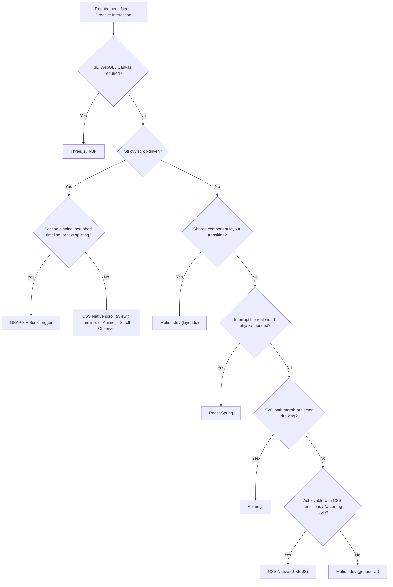

# Motion Engine Routing

Which engine to reach for, and — critically — **who owns the implementation detail once you've chosen.** This file routes; it does not teach any library's API. API knowledge belongs to the vendor or an installed upstream skill, not here — see [Why no API docs live here](#why-no-api-docs-live-here).

---

## 🧭 Routing Table

| Requirement / Pattern | Engine | API detail owned by |
|---|---|---|
| Hover states, disclosure menus, dialog entry/exit, simple scroll reveals, View Transitions | **CSS Native** (0 KB JS) | [css-native-patterns.md](./css-native-patterns.md) — the only engine this skill documents directly |
| Scroll-driven storytelling, section pinning, scrubbed timelines, text splitting | **GSAP 3 + ScrollTrigger** | [greensock/gsap-skills](https://github.com/greensock/gsap-skills) (official, vendor-maintained) — install as a Claude Code skill/plugin if not already present; otherwise consult [gsap.com/docs](https://gsap.com/docs) directly |
| Component transitions, shared layout (`layoutId`), modal AnimatePresence, gestures | **Motion.dev** (Framer Motion) | [motion.dev/docs](https://motion.dev/docs) |
| Interruptible physics springs, momentum drag | **React-Spring** | [pmndrs.github.io/react-spring](https://www.react-spring.dev/) |
| 3D WebGL, GLTF, particles, shaders | **Three.js / R3F** | [threejs.org/docs](https://threejs.org/docs), [docs.pmnd.rs/react-three-fiber](https://docs.pmnd.rs/react-three-fiber) |
| Lightweight SVG path morph / stroke draw, tiny stagger grids | **Anime.js** | [animejs.com/documentation](https://animejs.com/documentation) — verify the major version in `package.json` before writing any code; v3 and v4 are not API-compatible |

---

## 🌳 Decision Flow

---

## ⚠️ Anti-Patterns & Disqualifiers

1. **Do NOT use GSAP for standard modal open/close in React.** `AnimatePresence` handles declarative exit-unmount natively; GSAP requires manual DOM lifecycle delays.
2. **Do NOT use Motion.dev for complex pinned multi-scene scroll storytelling.** ScrollTrigger's sub-pixel pinning and cross-device scrub normalization outperform `useScroll` here.
3. **Do NOT bundle Three.js (150KB+) for a slight 3D card tilt.** Use CSS 3D transforms (`perspective`, `rotateX/Y`) or a Motion.dev spring.
4. **Do NOT animate layout dimensions** (`width`, `height`, `margin`, `top`, `left`) in any engine. See [antislop-gate.md](./antislop-gate.md).
5. **Do NOT assume an animejs code sample from memory or a screenshot is current.** v3 and v4 have incompatible APIs (different import shape, different scroll API, different easing key names). Check `package.json`, then check the vendor docs for that exact version. This skill was previously broken by exactly this mistake — do not repeat it.

---

## Why no API docs live here

Earlier revisions of this skill hand-authored full pattern libraries for GSAP, Motion.dev, Anime.js, React-Spring, and Three.js. The Anime.js file mixed v3 and v4 API and invented a method (`anime.scroll()`) that does not exist in any released version — it was written from a screenshot of a browser tab, not from the library. The other four were plausible but unverified and would rot silently at the next major release.

**Policy going forward:** a vendor-maintained or officially-endorsed skill (like `greensock/gsap-skills`) is always preferred over an in-house copy. Where no such skill is installed, this file names the authoritative doc URL and stops — it does not paraphrase the API. The only exception is CSS Native, because no single vendor owns "CSS"; that reference is written and verified in-repo (see `css-native-patterns.md`).
