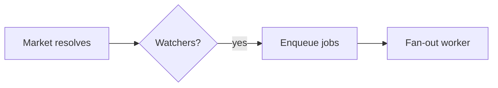

<!-- Source: affaan-m/ECC skills/plan-canvas/SKILL.md — MIT, see THIRD_PARTY_NOTICES.md -->

# Plan Canvas

Review loop for plans and visual artifacts: you write the artifact, the human
reviews it in the browser — annotating the exact element they mean, chatting,
and delivering an **Approve plan / Request changes** verdict — while you block
on a single CLI call that returns their feedback as JSON.

Inspired by [lavish-axi](https://github.com/kunchenguid/lavish-axi); built
around a plan confirmation gate, with zero runtime dependencies. Vendored into
AOS from [affaan-m/ECC](https://github.com/affaan-m/ECC).

## When to Use

- You just wrote the `/startcycle` plan artifact,
  `production_artifacts/00_execution_plan.md`, and need the CONFIRM/approve
  decision — the canvas verdict replaces a typed "yes/proceed".
- **Mandatory, not optional**, at the end of `bdbrainstorm` (before writing
  `state.goal` / handing off to `/startcycle-graph`) and `bdbmediastorm`
  (before the show-control architecture is considered final) — both produce
  a plan/spec artifact a human must approve before anything downstream
  proceeds. See each skill's own "Plan Canvas Review" section.
- The user should *point at* what to change: reviewing designs, comparisons,
  reports, or any local `.md` / `.html` artifact.
- The user asks for a visual review, or "open it in the browser".

This tool is a plain Node CLI speaking JSON over a loopback HTTP server —
it has no dependency on which agent harness invokes it (Claude Code, Codex,
Gemini/Antigravity, OpenCode, Cursor). The trigger lives in each consuming
skill's own instructions (synced to every harness by AOS's installer), not
in a harness-specific hook.

Do NOT use for: code review of diffs (`/code-review`), running web apps, or
remote URLs. The canvas serves local artifact files only.

## How It Works

Invoke the CLI as `aos-plan-canvas` — the bin shipped by the
`@hybridlabor-api/aos` package (on PATH after an AOS install). From a repo
checkout, `node skills/global_config/plan-canvas/scripts/plan-canvas.js` also
works. Run it from the project you are reviewing in; it works from any working
directory. It manages a detached loopback server (`127.0.0.1:4519`) shared by
all sessions, keyed by artifact path — no session ids to track.

The workflow is a plain CLI-plus-JSON loop, so it is model- and harness-agnostic:
any agent that can run a shell command and read stdout drives it the same way
(Claude Code, Codex, Cursor, Gemini, OpenCode, Copilot). Trigger it however your
harness surfaces skills — e.g. `/plan-canvas` in Claude Code, `$plan-canvas` in
Codex — or just run the `aos-plan-canvas` commands directly.

```bash
# 1. Open the artifact in the user's browser (returns immediately)
aos-plan-canvas open production_artifacts/00_execution_plan.md

# 2. Block until the human responds. Leave running; re-run if interrupted:
#    queued feedback is never lost.
aos-plan-canvas await production_artifacts/00_execution_plan.md
```

### Stay listening, or the human talks to an empty chair

Feedback only reaches you while an `await` is actually parked on the session.
If your turn ends with nothing listening, the message sits in the queue and,
from the human's side of the glass, sending appears to do nothing at all.

So **run `await` as a background task** when your harness supports one (in
Claude Code, a Bash call with `run_in_background: true`). It exits the moment
feedback arrives and the harness hands you the JSON, which keeps the loop alive
across turns instead of dying with the foreground call. A foreground `await`
works too, but only until the harness time-limits it.

One backstop exists, and it is not an excuse to skip the above:

- `aos-plan-canvas pending` lists feedback queued with no listener. Check it
  whenever you are unsure whether you missed something.

> Upstream ECC also ships a `stop:plan-canvas-pending` hook that blocks a turn
> from ending while canvas feedback is undelivered. **That hook is not vendored
> into AOS** — `pending` is the only backstop here, so the "keep `await`
> running" rule above carries the full weight.

`await` prints JSON when the human acts:

```json
{
  "status": "feedback",
  "items": [
    { "kind": "annotation", "text": "Split this into two phases",
      "anchor": { "selector": "h2:nth-of-type(3)", "tag": "h2", "snippet": "Phase 2: Migration" } },
    { "kind": "verdict", "verdict": "request-changes" }
  ]
}
```

- `kind: "chat"` — freeform message; answer in the canvas, not the terminal.
- `kind: "annotation"` — feedback anchored to an element (`anchor.selector`,
  `anchor.snippet` show what they pointed at; `anchor.textRange.text` when
  they highlighted a passage).
- `kind: "verdict"` — `approve` means the plan is CONFIRMED: stop polling,
  end the session, and start implementing. `request-changes` means revise the
  artifact (the canvas live-reloads it) and keep the loop going.

**3. Always respond in the canvas**, then keep listening. One command does both:

```bash
aos-plan-canvas await <file> --reply "Split Phase 2 as requested. Take a look."
```

Every human message gets a reply in the canvas, even a one-liner like
"On it, rewriting the risk table now." Silence in the chat panel is
indistinguishable from a broken canvas, which is exactly the failure this loop
exists to prevent. Answer there, not only in the terminal.

While you work, keep the chat honest with the activity indicator:

```bash
# animated "agent is thinking..." bubble; refresh it during long work
aos-plan-canvas typing <file> --state thinking
# switch to "agent is typing..." just before a reply lands
aos-plan-canvas typing <file> --state typing
```

`await` sets `thinking` for you the moment it hands you a batch, and `--reply`
clears it. Both states self-expire, so a crashed agent decays to an honest
"queued" instead of leaving the human watching dots forever. Refresh `thinking`
if a revision takes more than a minute.

**4. End** when review concludes: `aos-plan-canvas end <file>`.

## Relationship to `/startcycle`

An `approve` verdict on `production_artifacts/00_execution_plan.md` satisfies
the **Architect → TechLead gate (step 1 → 2)** of `/startcycle`: it is a human
confirmation that the plan is ready for the capability-map review. This is
optional — the pipeline runs unchanged without it.

## Diagrams (Mermaid)

When part of the plan is a flow, architecture, sequence, state machine, ER
model, or dependency graph, author it as a fenced ` ```mermaid ` block instead
of ASCII art or a wall of prose — the canvas renders it as a themed diagram the
human can point at. Reach for it when a picture reads faster than a paragraph;
skip it for simple lists or tables.

````markdown

````

Diagrams render in the canvas dark theme with the accent palette. Mermaid loads
in the browser from a pinned CDN; if that is unavailable (offline), the block
degrades to showing its source, so the review is never blocked. Point a local
mirror at `AOS_PLAN_CANVAS_MERMAID_URL` for air-gapped use.

## Rules

- Markdown artifacts render in the built-in plan template (including Mermaid
  blocks); `.html` artifacts render as-is with the annotation layer injected.
  For HTML authoring guidance use the `godmode-ui-ux` and `ui-component` skills.
- Edit the artifact file to revise — the canvas live-reloads on save. Never
  re-run `open` to refresh.
- `{"status": "ended", "endedBy": "user"}` (or `sessionEnded: true` on a
  feedback batch) means the user closed the review: stop polling, deliver
  remaining updates in chat, and do not reopen. A plain `open` on that
  session is refused; pass `--reopen` only when the user asks to resume.
- Sibling assets (images, CSS) must sit next to the artifact and be
  referenced by relative path.
- The server is loopback-only and exits after 30 idle minutes
  (`AOS_PLAN_CANVAS_IDLE_MS`); `stop` shuts it down explicitly. State lives
  in `~/.claude/aos-plan-canvas/` (`AOS_PLAN_CANVAS_STATE_DIR`).

## Examples

**Plan approval flow** — Architect writes
`production_artifacts/00_execution_plan.md` and must WAIT for confirmation:

```bash
aos-plan-canvas open production_artifacts/00_execution_plan.md
aos-plan-canvas await production_artifacts/00_execution_plan.md
# → {"status":"feedback","items":[{"kind":"verdict","verdict":"approve"}]}
aos-plan-canvas end production_artifacts/00_execution_plan.md
# plan is confirmed — hand off to TechLead
```

**Revision loop** — feedback arrives, you edit the file, reply, keep listening:

```bash
# await returned annotations → edit the plan artifact (canvas live-reloads)
aos-plan-canvas await <file> --reply "Reworked the risk table."
# → blocks again until the next response
```

## Anti-Patterns

- Polling with `--timeout-ms` in a loop. It exists for tests. Leave the plain
  `await` running instead.
- Ending your turn with no `await` listening while the review is still open.
  That is the one failure the human experiences as "I sent a message and
  nothing happened".
- Reading the feedback but answering only in the terminal. The human is looking
  at the canvas.
- Reopening after a user-initiated end "just to show" something.
- Pasting the whole plan into chat *and* opening a canvas — pick the canvas
  and keep the terminal summary to one line.
- Parsing the canvas chat from state files — everything you need arrives via
  `await`.

## Environment

| Variable | Purpose | Default |
|---|---|---|
| `AOS_PLAN_CANVAS_PORT` | Loopback server port | `4519` |
| `AOS_PLAN_CANVAS_STATE_DIR` | Session state directory | `~/.claude/aos-plan-canvas` |
| `AOS_PLAN_CANVAS_IDLE_MS` | Idle shutdown timeout | 30 minutes |
| `AOS_PLAN_CANVAS_MERMAID_URL` | Mermaid ESM mirror | pinned jsDelivr CDN |

`metadata.version` above and the `VERSION` literal in
`scripts/plan-canvas.js` are one value in two places — bump them together when
the vendored JS changes, so a stale detached server restarts.
