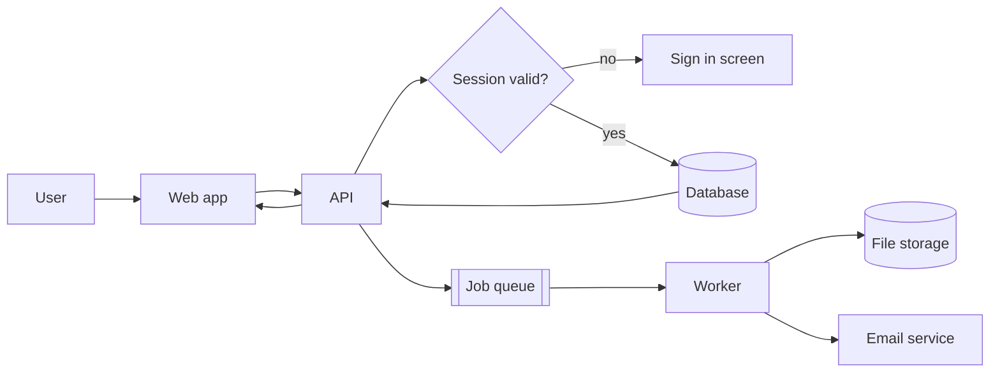
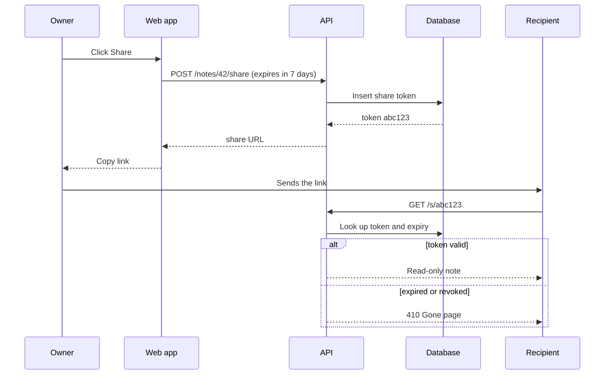

# Harbor Notes: Team Notes MVP

> Invented example project. Every name, number and date is made up.

**Status:** draft for review  **Owner:** product team  **Target:** first private beta in six weeks

## 1. Goal

Harbor Notes is a team notes app. A small team signs up, creates a workspace, writes notes together and shares a read-only link with someone outside the team.

**Success looks like**

- A new user reaches a working workspace in under two minutes.
- Two teammates can edit the same note without losing text.
- A shared link works without an account and can be revoked at any time.
- Notes list loads in under one second for 2,000 notes.

**Out of scope for the beta:** comments, version history, native mobile apps, offline editing.

## 2. Decisions

| # | Question | Options | Recommendation | Why |
|---|----------|---------|----------------|-----|
| D1 | How do users verify their email? | Six digit code / magic link | **Six digit code** | Survives a device switch, the common failure for links |
| D2 | How are notes stored? | Markdown text / block JSON | **Markdown text** | Simple export, easy diffs, no migration lock-in |
| D3 | How do edits merge? | Last write wins / CRDT | **Last write wins per note, field locks on title** | Cheapest option that avoids lost text for small teams |
| D4 | How are files stored? | Database blobs / object storage | **Object storage** | Keeps the database small and backups fast |
| D5 | How do jobs run? | In request / queue and worker | **Queue and worker** | Exports and emails must not block the editor |

## 3. Scope and build order

### 3.1 Foundations

- [x] Repository, CI and a deploy preview per branch
- [x] Design tokens and the base component set
- [ ] Database schema for users, workspaces, notes and share links
- [ ] Auth service with sessions and invite tokens

### 3.2 Notes core

- [ ] Notes API: create, read, update, archive, search
- [ ] Editor with autosave every two seconds
- [ ] Notes list with tag filter and sort by last edit
- [ ] Attachment upload with a 10 MB limit

### 3.3 Sharing and settings

- [ ] Read-only share links with an expiry date
- [ ] Member invites by email with roles: owner, editor, viewer
- [ ] Workspace settings: name, members, danger zone
- [ ] Export a workspace as a ZIP of Markdown files

### 3.4 Launch

- [ ] Load test with 2,000 notes and 20 concurrent editors
- [ ] Accessibility pass: keyboard navigation and contrast
- [ ] Private beta with five invited teams

## 4. Request flow

## 5. Sharing a note

## 6. Acceptance criteria

- [ ] Signup to empty dashboard takes six screens or fewer
- [ ] Back from any signup step keeps the typed values
- [ ] An expired code shows a resend action
- [ ] Autosave survives a reload during typing
- [ ] A revoked share link returns the Gone page within one minute
- [ ] A viewer cannot edit, invite or delete

## 7. Risks

| Risk | Likelihood | Impact | Mitigation |
|------|------------|--------|------------|
| Concurrent edits overwrite text | Medium | High | Field lock on title, revision check on save, conflict banner |
| Share links leak in forwarded mail | Medium | Medium | Expiry by default, one click revoke, view counter |
| Email deliverability is poor | Medium | High | Dedicated sending domain, plain text fallback, resend limit |
| Export jobs pile up | Low | Medium | Queue depth alert, per workspace rate limit |
| Scope grows before beta | High | Medium | Freeze the list in section 3 after week two |

## 8. Open questions

1. Should viewers be able to download attachments from a shared note?
2. Is a 7 day default expiry right, or should links never expire unless set?
3. Do we need an audit log of share link opens for the beta?
4. Which region hosts the first workspaces?

## 9. Timeline

| Week | Milestone |
|------|-----------|
| 1 | Schema, auth, signup screens |
| 2 | Notes API and editor |
| 3 | Notes list, search, attachments |
| 4 | Sharing and settings |
| 5 | Export, load test, accessibility |
| 6 | Private beta |
