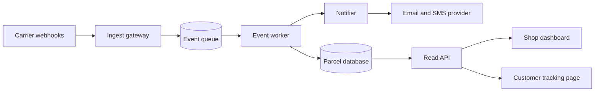

# Parcelly: Delivery Tracking Service

> **How to use this template:** replace the Parcelly example with your system. Rewrite goals, diagram, data model, endpoints and the trade-off decision. All names here are invented.

**Status:** draft

## 1. Goal and constraints

Parcelly is a fictional service that tracks parcels for small online shops. Carriers push scan events, shops and customers read the current status.

- Show the latest status within 10 seconds of a carrier scan.
- Handle 300 events per second at peak, 20 million parcels stored.
- Keep a full event history for 12 months.

| Constraint | Value |
|------------|-------|
| Team | Three engineers, no dedicated ops |
| Budget | Managed services only, under 1,500 per month |
| Availability | 99.9 percent for reads, writes may queue |
| Compliance | Customer addresses deleted 90 days after delivery |

## 2. System overview

## 3. Data model

| Entity | Field | Type | Note |
|--------|-------|------|------|
| parcel | id | uuid | Primary key |
| parcel | shop_id | uuid | Owner shop |
| parcel | carrier_ref | text | Unique per carrier |
| parcel | status | enum | created, in_transit, out_for_delivery, delivered, failed |
| parcel | updated_at | timestamptz | |
| parcel_event | id | uuid | |
| parcel_event | parcel_id | uuid | References parcel |
| parcel_event | kind | text | Carrier scan code |
| parcel_event | occurred_at | timestamptz | Carrier time, not receive time |
| parcel_event | payload | jsonb | Raw event, kept 12 months |

## 4. Endpoints

| Method | Path | Purpose |
|--------|------|---------|
| POST | `/v1/carriers/{carrier}/events` | Accept a batch of scan events, verify HMAC in `X-Signature`, enqueue, answer 202 |
| GET | `/v1/parcels/{id}` | Current status and event history, newest first |

## 5. Decision

| Question | Options | Recommendation | Why |
|----------|---------|----------------|-----|
| How do events reach the database? | Managed queue and worker / direct write / streaming platform | **Managed queue and worker** | Carriers retry when we answer slowly; the queue lets the gateway answer in milliseconds and the worker deduplicate |

**Trade-offs accepted**

| Choice | Gain | Cost |
|--------|------|------|
| Queue between gateway and database | Burst tolerance, retries | Status can lag by a few seconds |
| Relational store with jsonb payload | Simple queries, one system | Payload grows, needs the 12 month purge |
| Managed notification provider | No deliverability work | Per-message cost |

## 6. Build order

- [x] Staging and production environments
- [ ] CI with migration check
- [ ] Tables parcel and parcel_event with indexes
- [ ] Nightly purge: payload after 12 months, addresses after 90 days
- [ ] Gateway with signature check, worker with dedupe
- [ ] Read API with 5 second cache
- [ ] Notifications on out_for_delivery and delivered
- [ ] Load test at 600 events per second, onboard three pilot shops

## 7. Risks

| Risk | Likelihood | Mitigation |
|------|------------|------------|
| Carrier sends events out of order | High | Order by occurred_at, never by receive time |
| Queue outage stops status updates | Low | Gateway buffers to disk for 10 minutes, alert on queue age |
| Provider rate limits notifications | Medium | Batch and back off, drop to email only |

## 8. Open questions

- Public tracking page without login? Recommended: yes, with an unguessable id.
- Retention for event payloads? Recommended: 12 months.
