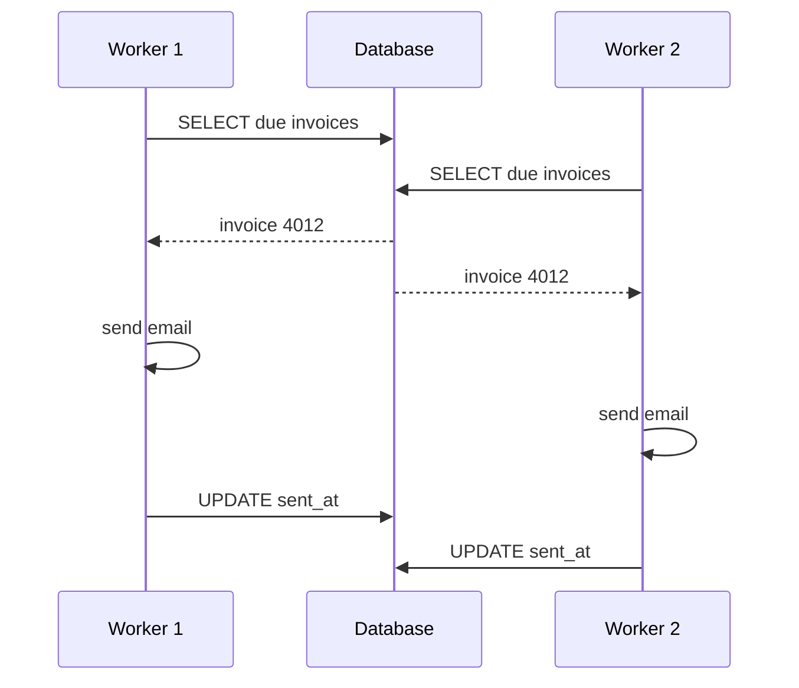

# Fix: duplicate invoice emails

> **How to use this template:** replace the Ledgerly example with your bug. Rewrite the symptom, reproduction, root cause, fix and regression test. All names here are invented.

**Status:** draft  **Severity:** medium, no data loss

## 1. Symptom

Ledgerly is a fictional invoicing service. Since release 2.14 some customers receive the same invoice email two or three times. Support counted 38 reports in nine days, all for invoices sent by the scheduled run at 06:00 UTC.

## 2. Reproduction

| Step | Action | Expected | Actual |
|------|--------|----------|--------|
| 1 | Create an invoice scheduled for 06:00 UTC | Status scheduled | Status scheduled |
| 2 | Start two scheduler workers | Both idle | Both idle |
| 3 | Let the 06:00 tick fire | One email | Two emails |
| 4 | Check the invoice row | sent_at set once | sent_at set twice, 40 ms apart |

Reproduces about one run in three with two workers and a 50 ms delay in the mail client.

## 3. Root cause

The scheduler selects due invoices and sends them in two separate steps. Two workers can select the same row before either marks it as sent. Release 2.14 raised the worker count from one to three, which exposed the race.

## 4. Fix plan

| Option | Verdict |
|--------|---------|
| **Atomic claim with UPDATE ... WHERE status = 'scheduled'** | Recommended: one statement, no new infrastructure |
| Advisory lock per invoice | Lock must be released on every error path |
| Back to one worker | Hides the bug, loses throughput |

Change in `server/scheduler/send-due.ts`: call `db.invoices.claim(id, workerId, now)` before sending and skip the invoice when the claim fails. Add `claimed_by` and `claimed_at` columns in migration 031.

## 5. Regression test

- [ ] Test fails on the current main branch
- [ ] Test passes with the fix, 200 runs in a row
- [ ] Crashed worker: claim expires after 5 minutes and the invoice is retried
- [ ] Manual send path is unchanged

Test: seed one scheduled invoice, run two workers at once, expect exactly one email and status sent.

## 6. Rollout

- [ ] Run migration 031 before deploying the code
- [ ] Deploy and watch the duplicate-send alert for one day
- [ ] Reply to the 38 affected tickets

## 7. Risks

| Risk | Mitigation |
|------|------------|
| A crashed worker leaves invoices stuck in sending | Claim expires after 5 minutes, a sweep resets it |
| Migration locks the invoices table | Nullable columns only, no backfill |

## 8. Open questions

- Apology email for affected customers? Recommended: no, a support reply is enough.
- Add an idempotency key to the mail provider call? Recommended: yes, as a follow-up.
