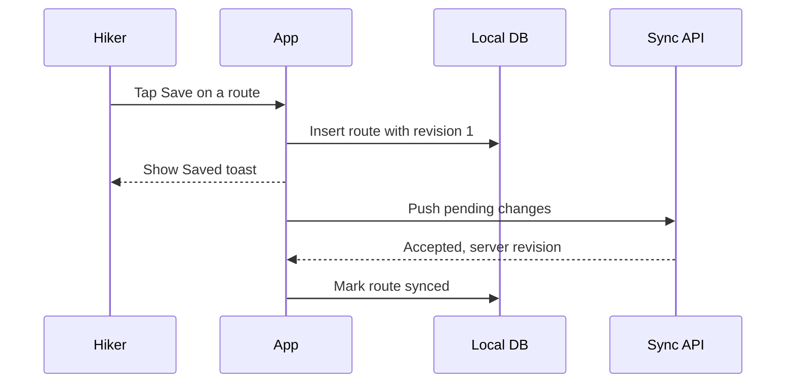

# Trailmark: Saved Routes

> **How to use this template:** replace the Trailmark example with your feature. Rewrite the goal, the decision, the screens, the build order and the open questions. All names here are invented.

**Status:** draft  **Target:** beta group in four weeks

## 1. Goal

Trailmark is a fictional hiking app. Saved Routes lets a hiker bookmark a route from the map, find it again offline and sync it across devices.

- A hiker saves a route in two taps from the map.
- Saved routes open without a network connection.
- A route saved on the phone shows up on the tablet within a minute.

## 2. Screens

| # | Screen | Purpose | Next |
|---|--------|---------|------|
| 1 | Map | Route selected, Save button | Save sheet |
| 2 | Save sheet | Name, offline and sync toggles | Saved list |
| 3 | Saved list | Sort chips, sync state per row | Route detail |
| 4 | Route detail | Stats and Remove action | Saved list |

## 3. Decision

| Question | Options | Recommendation | Why |
|----------|---------|----------------|-----|
| Where do saved routes live? | Local database with sync / server only / GPX files | **Local database with background sync** | Hikers lose signal on the trails they want to follow; last edit wins is enough for one person on two devices |

## 4. Flow

## 5. Build order

- [x] Feature flag saved_routes, off by default
- [ ] Local table saved_routes with revision and deleted_at
- [ ] Push and pull endpoints with revision check
- [ ] Tombstones kept for 30 days, nightly purge
- [ ] Save sheet, saved list and route detail screens
- [ ] Background sync with last edit wins
- [ ] Enable for the beta group and watch the sync error rate

## 6. Acceptance

- [ ] Save from the map takes two taps or fewer
- [ ] Saved list opens in airplane mode
- [ ] Removing a route on one device removes it on the other
- [ ] A list of 500 routes scrolls without dropped frames
- [ ] Screen reader announces Saved and Removed

## 7. Risks

| Risk | Likelihood | Impact | Mitigation |
|------|------------|--------|------------|
| Two devices edit the same route offline | Medium | Low | Last edit wins, keep the older copy in a recently-deleted list |
| Large saved lists slow the map | Low | Medium | Load the list lazily, never on map start |
| Tombstones grow without bound | Low | Low | Nightly purge after 30 days |

## 8. Open questions

- Can routes be grouped in folders? Recommended: not in the beta.
- Default sort of the saved list? Recommended: recently saved.
- Extras for the beta: share a route link, export as GPX, notes on a saved route.
