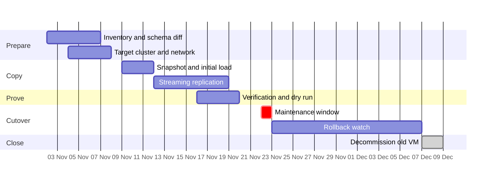

# Lantern Ledger: Move from legacy Postgres 12 to managed Postgres 16

> Template guidance: replace the invented system names, sizes, dates and owners. Keep the phases, rollback trigger and cutover checklist. All names and numbers are invented.

**Status:** draft

## Goal

Move the Lantern Ledger billing database (410 GB, 38 tables) from a self-hosted Postgres 12 VM to a managed Postgres 16 cluster with at most 10 minutes of write downtime and no lost invoices.

- Cutover happens in one maintenance window on a Sunday, 02:00 to 04:00 UTC.
- The old database stays readable and in sync for 14 days as the rollback path.
- Every row count and a checksum of the money columns match before traffic moves.

## Decision

| Question | Options | Recommendation | Why |
|---|---|---|---|
| How do we move the data? | Logical replication / dump and restore / vendor service | **Logical replication, then switch** | Freeze is minutes; the target can be verified for days. Sequences and large objects need a manual step at cutover. |

## Timeline

## Phases

| Phase | Outcome | Exit criterion | Owner |
|---|---|---|---|
| 1 Prepare | Inventory, schema diff, target cluster | Schema applies cleanly on PG 16 | Mara (platform) |
| 2 Copy | Snapshot loaded, replication streaming | Lag under 5 seconds for 24 hours | Mara (platform) |
| 3 Prove | Verification and one full dry run | Counts and checksums match, dry run under 10 minutes | Joss (backend) |
| 4 Cutover | Writes frozen, final sync, traffic switched | Smoke tests green, error rate at baseline | Mara and Joss |
| 5 Watch | Old database kept as warm fallback | 14 quiet days, no rollback trigger hit | Joss (backend) |
| 6 Close | Old VM snapshotted and removed | Sign-off from finance on the final report | Ines (finance ops) |

## Prepare tasks

- [x] Inventory tables, extensions and large objects
- [x] Diff schema between PG 12 and PG 16, fix incompatibilities
- [ ] Provision the managed cluster and private network peering
- [ ] Lower DNS TTL for the database alias to 60 seconds

## Copy and verify tasks

- [ ] Create the publication on the source for all 38 tables
- [ ] Run the initial copy with four parallel workers
- [ ] Subscribe, let changes stream, alert when lag exceeds 30 seconds
- [ ] Row counts and money-column checksums equal on all tables
- [ ] Replay one week of read queries against the target
- [ ] Full dry run on a clone, stopwatch under 10 minutes

## Cutover checklist

- [ ] T-60 min: status page notice posted and on-call confirmed
- [ ] T-30 min: last backup of the source verified restorable
- [ ] T-10 min: pause the invoice scheduler and background workers
- [ ] T-0: set source to read-only, confirm zero active writers
- [ ] T+2 min: replication lag is zero, final counts match
- [ ] T+4 min: resync sequences, enable constraints, run ANALYZE
- [ ] T+6 min: switch the DNS alias and app config to the target
- [ ] T+8 min: start workers, run the smoke test suite
- [ ] T+10 min: go or rollback decision, announce on the status page

## Rollback

**Trigger (first 24 hours):** smoke tests fail twice, p95 write latency above 400 ms for 10 minutes, or any checksum differs.
**Path:** freeze writes on the target, point the alias back to the old VM (kept in sync by reverse replication), unpause workers, post a status update. Target time: 8 minutes. After 24 hours a rollback needs a fresh GO from the owner.

## Risks

| Risk | Likelihood | Impact | Mitigation |
|---|---|---|---|
| Replication lag grows during the Friday batch | Medium | High | Schedule the window after the batch, alert at 30 s |
| Sequences not resynced, duplicate key errors | Medium | High | Scripted resync on the checklist, tested in the dry run |
| Extension missing on managed Postgres | Low | High | Found in the inventory phase, replace before the copy |
| DNS caches keep old address | Medium | Medium | TTL 60 s a week ahead, app uses the alias only |
| Cutover runs longer than the window | Low | Medium | Dry run timing, hard stop at T+20 min triggers rollback |

## Open questions

- How long do we keep the old VM? 14 days (recommended) / 30 days / delete right after cutover
- Who can call the rollback? The on-call engineer (recommended) / only the migration owner
- Which extras join the window? Connection pooler upgrade / query insights / password rotation
