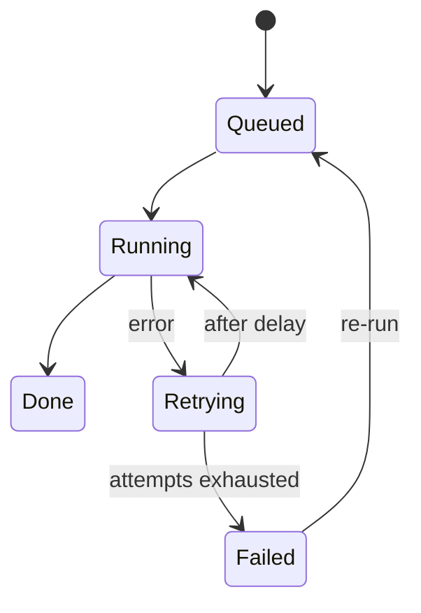

# Recap: Retry failed exports automatically

> Invented example. Replace every fact with your own change.

**PR:** #142  **Branch:** feat/export-retry into main  **Commit:** 4c8a1f0  **Date:** 2026-03-09  **Size:** 5 files, +318 / -24

## What changed

Failed exports used to disappear: the job died, the customer saw a spinner and support had to re-run it by hand. Exports now retry up to three times with growing delays (1, 5 and 25 minutes), and the export list shows each job as Queued, Running, Retrying or Failed. A job that exhausts its retries stays visible with the last error and can be re-run with one click.

| File | Change | Note |
|------|--------|------|
| worker/export-runner.ts | modified | Wrap the run in retry with backoff |
| worker/retry-policy.ts | added | Delay table and attempt counter |
| api/exports/list.ts | modified | Return state and last error |
| app/exports/export-row.tsx | modified | State badge and re-run button |
| tests/export-retry.test.ts | added | Backoff, exhaustion and re-run cases |

## Why

| Problem | Evidence | Fixed by |
|---------|----------|----------|
| About 4 percent of exports failed once | Support ticket sample | Automatic retry |
| Customers could not tell failed from slow | Five tickets asking if an export was stuck | Visible job state |
| Support re-ran jobs by hand | About 6 manual re-runs per week | Re-run button |

## How verified

- [x] Unit tests for backoff delays and attempt limit
- [x] Integration test: a job that fails twice then succeeds ends as Done
- [x] Manual run on staging with a forced failure
- [ ] Load test with 300 queued jobs (not run yet)

## Follow-ups

- [ ] Email the customer after the final failure
- [ ] Make the delay table configurable per plan
- [ ] Run the 300 job load test on staging
