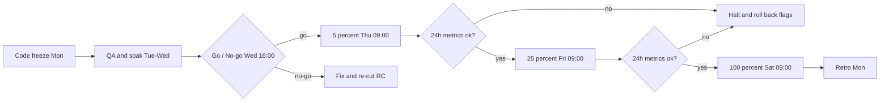

# Beacon Mobile 4.2 Release

> Template guidance: replace the invented product, version, scope, thresholds and owners. Keep the go/no-go gate and rollback section. All names and numbers are invented.

**Status:** draft

## Goal

Ship Beacon Mobile 4.2 (offline maps and a new onboarding) to all users within five days of code freeze, with crash-free sessions at or above 99.5 percent at every stage.

- Release candidate frozen on Monday 9 Nov, full rollout by Friday 13 Nov.
- No stage widens while a blocking metric is red.
- Support and marketing know the final scope 48 hours before the first stage.

## Scope

| Item | Type | Owner | Status | Flag |
|---|---|---|---|---|
| Offline maps for saved regions | Feature | Priya | Done | offline_maps |
| New onboarding with three steps | Feature | Tomas | In QA | onboarding_v2 |
| Fix: location drift in background mode | Fix | Lena | Done | none |
| Dark theme for the settings screen | Polish | Tomas | Done | none |
| Route sharing by link | Feature | Priya | Cut to 4.3 | route_share |

## Decision

| Question | Options | Recommendation | Why |
|---|---|---|---|
| How do we roll out? | Staged 5/25/100 / full at once / two week open beta | **Staged: 5, 25, 100 percent** | Early signal, small blast radius, flags switch features off without a new build |

## Rollout

## Go / no-go gate (Wednesday 16:00)

- [x] All scope items Done or explicitly cut
- [ ] Release candidate passed the regression suite on 12 devices
- [ ] No open blocker or critical bug
- [ ] Crash-free sessions on the internal soak build at 99.7 percent or higher
- [ ] Feature flags verified on and off in staging
- [ ] Store listing, screenshots and release notes approved
- [ ] Support macros and the known-issues list published
- [ ] Rollback rehearsed: flags off and store halt tested

## Work items

- [x] Cut route sharing to 4.3
- [ ] Tag release candidate and bump version to 4.2.0
- [ ] Assemble changelog from merged pull requests
- [ ] Run regression on 12 devices, two day internal soak, upgrade tests from 4.0 and 4.1
- [ ] Release to 5 percent, check metrics, raise to 25 percent, then 100 percent
- [ ] Send the announcement and update the help center
- [ ] Retro: compare stage metrics with the forecast

## Communications

| When | Audience | Channel | Owner | Message |
|---|---|---|---|---|
| Mon 9 Nov | Internal | Team chat | Priya | Freeze done, scope final |
| Wed 11 Nov | Support | Briefing and macros | Lena | What changed, known issues, escalation path |
| Thu 12 Nov | Early users | In-app note at 5 percent | Tomas | New onboarding is rolling out |
| Sat 14 Nov | All users | Blog post and store notes | Marta (marketing) | Offline maps are here |
| On rollback | Everyone affected | Status page and in-app banner | On-call lead | What happened, what we did, next update time |

## Rollback

Halt the rollout if crash-free sessions drop below 99.5 percent, ANR rate exceeds 0.5 percent, or support volume doubles against baseline for two hours. First action: switch the affected flag off (under 5 minutes, no build). If the bug lives outside a flag: halt the store rollout and ship 4.2.1 as a hotfix within 24 hours. Users who already updated cannot be downgraded.

## Risks

| Risk | Likelihood | Impact | Mitigation |
|---|---|---|---|
| Offline maps exhaust device storage | Medium | High | Storage warning, 500 MB cap, flag off switch |
| Store review delays the first stage | Medium | Medium | Submit on Tuesday, keep two days of slack |
| Onboarding change lowers signup completion | Low | High | A/B at 5 percent, compare funnel before widening |
| Support overwhelmed on launch day | Medium | Medium | Macros ready, extra shift on Saturday |

## Open questions

- Announce before or after the 100 percent step? After, once metrics are stable (recommended) / at 25 percent
- Who holds the go/no-go vote? Release manager with QA and support (recommended) / product lead alone
- Extra gate checks? Accessibility pass / battery benchmark / privacy review of new permissions
