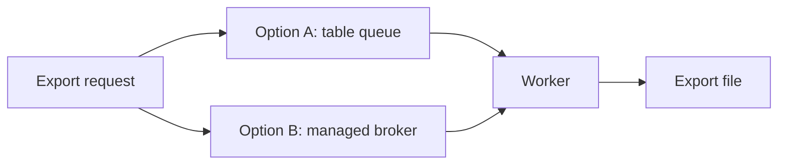

# Queue choice for Lanternfish exports

> Invented example. Replace the question, options, evidence and recommendation with your own.

**Status:** draft

## Question

Lanternfish is a fictional reporting service. Exports of large reports run inside the web request and time out for about 4 percent of customers. Which mechanism should run exports in the background?

**Constraints**

- Ship within one quarter with a team of three.
- No new managed service that needs an on-call rotation.
- Failed exports must be retried and visible to the customer.

## Options

| Option | Summary | Upside | Downside |
|--------|---------|--------|----------|
| A: database-backed queue | Jobs in a Postgres table, workers poll with row locks | No new infrastructure, retries are plain SQL | Tops out around a few hundred jobs per minute |
| B: managed message broker | Jobs published to a hosted broker | Scales far beyond current need | New service, credentials and monthly bill |

## Evidence

| Claim | Source | Confidence | Effect on the decision |
|-------|--------|------------|------------------------|
| Peak load is 40 exports per minute | Request log sample, last 30 days | High | Both options are fast enough |
| A table queue handled 300 jobs per minute in a spike test | Local benchmark, 10 minute run | Medium | Option A has 7x headroom |
| Broker setup needs about 6 engineer days | Team estimate | Low | Option B costs a sprint of the quarter |
| Managed broker costs about 90 EUR per month | Vendor price page, invented | Medium | Small, but adds a vendor to review |
| Customers care about progress, not speed | Five support tickets | Low | A status page matters more than the queue |

## Recommendation

**Option A, the database-backed queue.** It fits current load with 7x headroom and needs no new service. Put it behind a small interface (`enqueue`, `claim`, `complete`, `fail`) and swap in a broker if sustained load passes 150 jobs per minute.

**Risks:** polling workers can hold row locks too long if a job hangs (use a 10 minute claim timeout); the benchmark ran on a laptop and must be repeated on staging.

## Open questions

- [ ] Should failed exports email the customer or only show in the app? (recommended: app only)
- [ ] How long are finished export files kept? (recommended: 7 days)
- [ ] Repeat the benchmark on staging
- [ ] Confirm the 40 per minute peak with last month's logs
