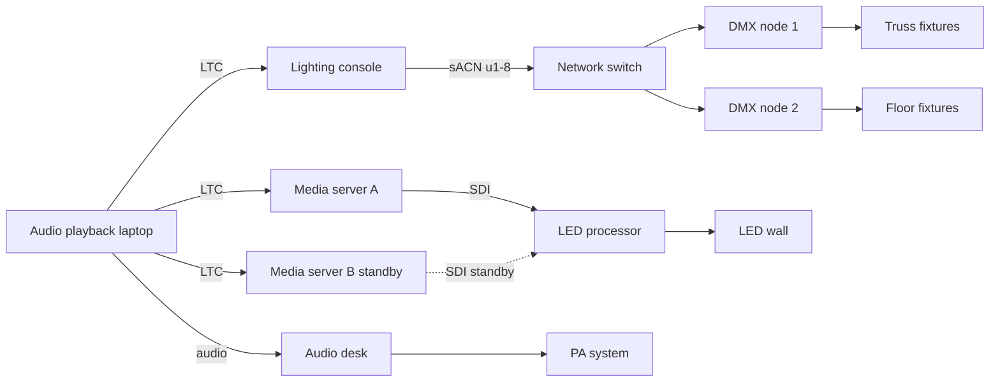

# Tidewater Night: Technical Plan for the Live Show

> Template guidance: replace the invented show, venue, fixture counts, universes and cues. Keep the signal flow, patch table, cue list and failure plan. All names and numbers are invented.

**Status:** draft

## Goal

Run a 75 minute festival headline set with synchronised lighting, LED wall video and a two-person audio team, driven by one timecode source and with a defined fallback for every critical link.

- Show opens on timecode 01:00:00:00 and every cue is repeatable from any song start.
- A single failure in network, media or console never causes a full blackout.
- Load-in is done by 14:00, line check by 16:00, doors at 19:00.

## Decision

| Question | Options | Recommendation | Why |
|---|---|---|---|
| Who is the timecode master? | Audio playback laptop (LTC) / console clock / manual GO | **Audio playback laptop, LTC out** | One clock for band tracks and cues; console and media server fall back to internal clocks if LTC drops |

## Signal flow

## Patch and universes

| Universe | Node / port | Fixtures | Channels used | Position |
|---|---|---|---|---|
| 1 | Node 1 / A | 12 moving spots | 384 of 512 | Truss 1 |
| 2 | Node 1 / B | 8 LED washes | 280 of 512 | Truss 1 |
| 3 | Node 1 / C | 6 strobes | 48 of 512 | Floor |
| 4 | Node 1 / D | Spare | 0 | Reserve |
| 5 | Node 2 / A | 16 LED battens | 256 of 512 | Back truss |
| 6 | Node 2 / B | 4 haze units, 2 fans | 24 of 512 | Floor |
| 7-8 | Node 2 / C-D | Pixel tape, 300 pixels | 900 of 1024 | Wall surround |

## Cue list (excerpt)

| Cue | Timecode | Song / moment | Lighting | Video | FX |
|---|---|---|---|---|---|
| 1 | 01:00:00:00 | Intro tape | Blackout then slow blue fade | Wall: opening loop | Haze on |
| 10 | 01:03:20:00 | Song 1 downbeat | Full wash, spot chase | Wall: live camera mix | None |
| 24 | 01:18:45:12 | Song 4 drop | Strobe burst 3 s | Wall: white flash, then pattern | CO2 jets |
| 38 | 01:41:10:00 | Ballad | Warm amber, two followspots | Wall: slow footage | None |
| 52 | 02:02:00:00 | Encore break | House half, wash low | Wall: countdown | Haze off |
| 60 | 02:15:00:00 | Closing | Slow fade to black | Wall: logo, then black | None |

## Stage and rack layout

- **FOH:** lighting console, audio desk, show laptop (timecode master) on UPS.
- **Rack A, stage left:** switch (VLAN 10 control, VLAN 20 video), DMX nodes 1 and 2, spare node, UPS.
- **Video booth:** media server A live, media server B hot standby.
- **Stage:** Truss 1 with 12 spots and 8 washes, LED wall 6 x 3.5 m, floor strobes and haze.
- Keep DMX runs under 100 m per line; use the spare node if a line fails.

## Load-in checklist

- [ ] Truss hung, motors tested, safety signed off
- [ ] Power distribution tested, earth and RCD checked
- [ ] Rack A powered, UPS holding for 10 minutes
- [ ] LED wall built, tiles counted and addressed
- [ ] FOH cabling labelled and strain relieved
- [ ] VLANs configured, static addresses labelled, sACN multicast limited to VLAN 10
- [ ] Fixtures patched to universes 1 to 8, focus and colour check done
- [ ] LED wall mapped, content at 50 fps, media server A mirrored to B
- [ ] LTC verified at console and both media servers
- [ ] Failure drills run: pull LTC, media server A, DMX node
- [ ] Final go from the production manager at 18:30

## Failure and blackout plan

| Failure | Detected by | Immediate response | Recovery |
|---|---|---|---|
| LTC lost | Console timecode lamp, media server clock | Both switch to internal clock, operators GO manually | Re-sync at the next song start |
| Media server A fails | Wall black or frozen | Video operator flips to server B on the processor | Reboot A, keep B live for the set |
| DMX node 1 fails | Truss fixtures freeze | Console outputs to spare node | Replace node during the next break |
| Network switch fails | All sACN lost, fixtures hold last look | Swap to the spare switch, config on USB | Verify addresses, resume |
| Power loss on stage | Lights and wall dark | Audio on UPS keeps playback, house lights on emergency circuit | Hold the show until power is confirmed |
| Emergency stop | Production manager call | Console blackout, haze and CO2 off, house lights up | No restart without a safety sign-off |

**Blackout rule:** a deliberate blackout is a console cue (cue 1 and cue 60), never a power switch. On "stop", effects go off first, then lights fade to house. Only the production manager restarts the show.

## Risks

| Risk | Likelihood | Impact | Mitigation |
|---|---|---|---|
| Wireless interference from the neighbouring stage | Medium | High | Frequency coordination, wired backups for key mics |
| Strobe bursts exceed the venue photosensitivity limit | Low | High | Cap at 3 Hz, warning signs, approval in the safety plan |
| Rain reaches the front of house | Medium | Medium | Covered FOH tent, cable ramps, tarp for the rack |
| Content delivered late | Medium | Medium | Delivery deadline two days before, placeholder loops loaded |

## Open questions

- Followspots from FOH or a side tower? Side tower (recommended) / FOH
- Second haze unit allowed by the venue? Yes with smoke detector isolation (recommended) / no
- Extras? Audience blinders / live camera on the wall / wireless DMX backup
